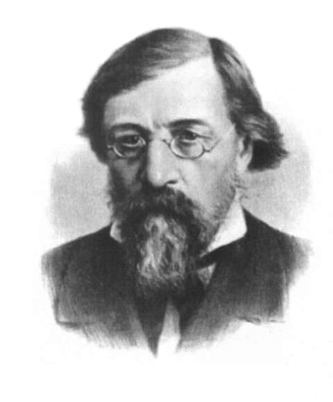

# Новый российский блог-фильм о Чернышевском

**2021-02-08** Dominik Jaroszkiewicz

*Рецензия на фильм Ивана[ Полякова: Н.Г. Чернышевский. «Что делать?». Биография. Реформа 1861 года. Разгром литературоведа с «Artifex».](https://www.youtube.com/watch?v=Hb5CDRO78SU&feature=emb_logo)*

Считаю себя вправе заявить: это умный, серьёзный и интересный фильм, достойный внимания и размышлений.

Биография, затронутая в названии фильма, относится, несомненно, к числу таких, исследование которых требует не только серьёзной теоретической подготовки, но и немалого интеллектуального мужества. Товарищем Иваном Поляковым за последние несколько месяцев был ***в одиночку*** создан, впервые за последние не менее чем 35 лет, российский фильм о Чернышевском с двухчасовой длительностью и необычной основательностью сценария. Не говоря уже о том, что само по себе создание столь длинного фильма является технически сложным, отметим, что при этом необходимо выдерживать логику монтажа и иметь разнообразный графический материал[^1] на такое время. Учитывая беспрецедентность фильма, его нужно пробовать оценить не абстрактно, относительно сформировавшихся за последние годы лучших технических и жанровых образцов, а в контексте всей российской общественной борьбы, выдающимся фактом которой является этот фильм.

Следуя гегелевскому и ленинскому указанию, нужно пробовать оценить значение фильма относительно того, что нового он даёт для своего времени. С такой стороны, в первую голову, в фильме *Н.Г. Чернышевский. «Что делать?». Биография. Реформа 1861 года. Разгром литературоведа с «Artifex»* нужно выделить логику подачи материала, органично поддержанную сценарными и монтажными средствами в наибольшей и наилучшей мере, насколько это доступно для произведения одного лица, выступающего сразу исследователем, диктором, монтажёром фильма, сценаристом, выпускающим редактором, осветителем, оператором видео и звука. Тем самым фильм является не только выдающимся фактом идейной борьбы, но и доказательством того, что она уже вынуждает в России ко всестороннему развитию.

Говоря о содержании фильма и пытаясь его с чем-либо сопоставить, неизбежно натыкаешься на *полное отсутствие* каких-либо местных аналогов, которые могли бы быть известны российскому читателю. Фильм выгодно отличает *высокая идейность*, понимаемая в гегелевском и ленинском смысле как всегдашнее сопоставление понятия и действительности. Получается, что биография Чернышевского меньше всего трактуется относительно особенностей его времени, она органически вплетается в факты современной жизни, причём, вопреки мнению автора, они совершенно не является специфическими для России. Подобным же образом в классических трудах выдающегося польского материалиста Марека Яна Семека, несмотря на то, что они посвящены Фихте и Шиллеру, мы всегда видим живое дыхание общественной борьбы 1960-х годов в её высшей классовой форме, которую Семек старается довести до уровня партийности, то есть сознательной классовости. Эта же черта может быть обнаружена и в фильме товарища Полякова, что относится, вместе с освоением обширнейшего материала, переработанного в сценарий, к его несомненным достоинствам.

Пожалуй, наиболее удачное из хронологически близких сравнений, которому можно подвергнуть фильм товарища Полякова, должно сопоставлять его со статьёй товарища Загорского «О наследии Чернышевского», перевод [завершающей части](/8887.md) которой был опубликован в середине 2014 года. Содержание названной серии из трёх статей по теоретическим и политическим причинам не могло появится изнутри России. В 2014 году она находилась на пике антикоммунизма, который оказал травмирующее воздействие не столько на европейских наблюдателей, сколько на российских товарищей. Немногие из наблюдателей знали, что российский антикоммунизм 2014 года - это лишь отблеск российского антикоммунизма 1990 года, когда тогдашнее руководство РСФСР первым разорвало связь с СССР. Ведь очень немногие свидетели общественной борьбы 1990 года оказались связаны с пробуждённым травмами 2014 года новейшим российским теоретическим и политическим самообразованием. Тем не менее, фильм товарища Полякова как российское популярное произведение, не страдающее академическим кретинизмом, вышел всего лишь через шесть лет после создания очерков о Чернышевском товарищем Загорским, относящихся к аналогичному в идейном отношении, но письменному жанру. Естественно попробовать сопоставить два названных близких по теме произведения об идеях Чернышевского.

При сопоставлении статей и фильма можно обратить внимание на похожую последовательность раскрытия материала. Вместе с тем, легко выявляются важнейшие признаки ограниченности авторского взгляда товарища Полякова, который создал наилучшее *внутрироссийское* произведение о Чернышевском за последние годы. Произведение товарища Загорского, как можно легко понять, отталкивается от исторического опыта Польши. Естественно что Миколай Загорский развивает понимание биографии Чернышевского на основании того идейного багажа, который формировали в отечественной (польской - Ред.) культуре Марек Семек, Людвик Варыньский, Ярослав Ладош, Михал Калецкий и Хилари Минц, не исключая отсюда явные внешние влияния популярной литературы по материалистической диалектике вроде произведений Иосифа Сталина или Эриха Фромма.

Общим недостатком произведений товарищей Полякова и Загорского является то, что они слабо касаются воззрений Чернышевского на планомерность хозяйственного развития. Понятно, что в условиях полной многолетней подавленности соответствующего жанра в России, товарищи вынуждены были охватывать как можно более широкий круг тем, не имея возможности рассмотреть детально важнейшие *экономические* проблемы, решение которых было *исключительно* высоко оценено Карлом Марксом в «Капитале». Однако Чернышевский как теоретик нетоварных отношений в полноте своих воззрений оказывается исключительно ценным в понимании саморазложения советской экономической науки. Поставленный в один сравнительный ряд с В. С. Немчиновым и Н. П. Федоренко[^2], Чернышевский на контрасте заставляет ужаснуться теоретической наивностью, теоретической мелочностью и теоретической нечистоплотностью названных учёных, имевших перед советской наукой не малые, поныне действительные заслуги, но бессильных сохранить значение этих заслуг для нашего и будущего времени.

Впрочем, вероятно, будет несколько преждевременным указание исследователям наследия Чернышевского на политическую экономию как на первую сферу, куда адекватное сознание должно проникать из изучения истории мышления соотносимого с историей общества. Возможно, что им просто объективно не хватает времени в контексте более насущных для текущего уровня сознания популярных работ. Ведь нельзя же упрекать Лессинга, несомненно приспособленного к теоретической работе лучшего мирового уровня, за отсутствие специфических теоретических трактатов в духе Канта, Гёте, Фихте, Шеллинга или Гегеля. Потребности развития научного знания непросто согласовывать с требованиями читателей, ибо вопросы науки слишком важны для перспектив полноценной жизни трудящегося большинства всякого народа, чтобы оставлять их исключительно на долю учёных, громадное большинство которых поражено сейчас профессиональным и общественным кретинизмом.

Вспоминая одну из полемик о гегелевском взгляде на Сталина, сложно не вспомнить резюме о том, что взгляд на его историческую роль из польского села неизбежно оказывается более мудрым, чем взгляд из столовых академических институтов в Варшаве[^3]. Ибо в собственной форме, то есть на пике своего расцвета, эти институты были, как и сам историко-политически понимаемый Сталин, инструментом крестьянско-рабочего союза, бывшего политической сутью как СССР, так и Народной Польши. Именно из трудового народа и для него в своих исторических условиях были выделены как тенденции, воплотившиеся в Сталине, так и потребности, двигавшие развитием институтов образованной при Болеславе Беруте Польской Академии Наук. Отсюда ясно, что приведённое к теоретической форме мнение трудового народа является высшей инстанцией исторической оценки всех порождённых народными силами фактов общественной жизни. В области политической экономии это положение совпадает со взглядами самого Чернышевского, который также требовал соотнесения всех фактов общественной жизни с очеловечиванием жизни трудящихся. Такой критерий не мог оказаться сколь-либо заметным в российской литературе о Чернышевском. Речь не только о всплеске российского антикоммунизма в 2014 году и не об общем упадке научной литературы в России. По крайней мере, в Польше тенденции умственной жизни не были более благоприятными. Просто применять критерий самого Чернышевского к его собственной деятельности возможно только на основании не просто классового, а партийного, то есть сознательно классового взгляда. В России наследие Чернышевского никогда не имело значительных языковых трудностей, оно не нуждалось в переводе. Напротив, в немецкой и польской литературе о Чернышевском неизбежно техническое отдаление, вызванное языковыми причинами, но, обеспечивающее, в полном соответствии с теорией межсубъектности Семека, тем самым смысловое сближение. Иными словами, представители несознательного взгляда в Германии, Польше и на Украине с гораздо меньшими шансами соприкасаются с наследием Чернышевского. Поэтому восточный читатель не должен удивляться, что наиболее значительное произведение 2014 года о Чернышевском было создано на польском языке. Ибо именно отечественная, а не российская литература о Чернышевском всегда характеризовалась ясной партийностью, когда появляются либо пасквили вроде диссертации 2012 года[^4], которую написал Marcin Zwiercan, либо очерки с ясной поддержкой теоретических достижений Чернышевского, как серия статей, которую написал Mikołaj Zagorski. Для российской литературы, где необходимость перевода не обеспечивает всегдашнее соотнесение переводимого произведения с практикой, смысловое и практическое рассмотрение наследия Чернышевского затрудняется идеалистическими предрассудками, происходящими для профессиональных исследователей из того, что оно дано им в идеальной форме текста. В этом смысле взгляд на Чернышевского со стороны иноязычного выходца из польской деревни не может не быть более практичным, чем взгляд любого академического работника, давно забывшего, что всякая идея возникает одновременно с соответствующими обстоятельствами в материальной жизни общества.

Но вот, наконец, мы имеем долгожданный практический взгляд на наследие Чернышевского с российской стороны, отличающийся не меньшей, а местами большей идейностью, чем статьи товарища Загорского. Вот, наконец, и в России товарищем Поляковым был освоен тот взгляд основателя украинского социализма, что за возможность обретения им практичных знаний заплачено, может, не прямо, но исторически несомненно и достоверно, трудом безвестных, не пробудившихся ещё к сознанию представителей трудящихся классов. Почему же Франко считал должным создавать для трудящегося читателя свои так тяжело дающиеся труды?

"До цього примушує мене почуття собачого обов'язку. Як син селянина-русина, вигодований чорним селянським хлібом, працею твердих селянських рук, почуваю обов'язок панщиною всього життя відробити ті шеляги, які видала селянська рука на те, щоб я міг видряпатись на висоту, де видно світло, де пахне воля, де ясніють вселюдські ідеали"[^5].

Независимо от того, известны товарищу Полякову эти слова или нет, результат его побуждений уж никак не ниже того, что получалось в начальный период деятельности у Ивана Франко, который познакомил украинского читателя не только с двадцать четвёртой главой «Капитала», но и с романом «Что делать?»[^6], который стал очень популярен на Галичине.

Каковы недостатки, которые имеет фильм товарища Полякова? Отставим в стороне монтажную оценку, ибо не имея никакой посторонней помощи, едва ли какой-либо критик сможет исполнить монтажные функции лучше, наряду с исследовательскими, источниковедческими, операторскими и прочими. Попробуем оценить идейную составляющую фильма.

С точки зрения партийного взгляда на наследие Чернышевского совершенно удивительно выглядит единственное указание на патриотизм. Факт наличия у Чернышевского патриотических воззрений совершенно никак не оценен товарищем Поляковым. Его фильм является, несомненно, лучшим за последние десятилетия произведением о Чернышевском, если добавить ограничивающий фактор принципиального основания *только на российских материалах*. В отношении, например, Маркса, такой подход, когда доступны только немецкие материалы, хотя и допустим, но, очевидно, значительно исказит тему для читателя за пределами Германии, а внутри страны тоже многое заставит видеть в искажённых пропорциях. Например, подход к наследию Ленина, ограничивающийся только российскими источниками или только переведёнными на его родной язык, оказывается неизбежно дефектным. Речь не только о том, что упускается развитие ленинизма в Германии, Польше и Венгрии, но и о том, что без осознания законов разложения венгерской школы материалистической диалектики судьба советской философии оказывается заражена *нездоровой единичностью[^7].* Дьёрдь Лукач, Милан Соботка и Марек Семек дают отличный материал для прослеживания близких закономерностей, очищенных (хотя бы для российского читателя) от чувственного многообразия и дающих поэтому важные начала теоретической достоверности краха именно советского мышления, отказавшегося от материалистической методологии.

Взгляд на Чернышевского через совокупность только российских и обратно-переводных источников оказывается ничуть не умнее, чем подобный взгляд на Ленина или Ильенкова. Так, скажем, модифицированное гегельянство, выступившее характерной формой идеологии финской буржуазии в романовской монархии, обуславливает совершенно не характерное для России восприятие наследия Ильенкова в Финляндии. В Польше только ожесточённая классовая борьба 1960-1980-х годов привела к тому, что у нас на уровне понятия стал известен Ленин, что у него обнаружили определённую практически важную и эффективную методологию разбора проблем соотношения мышления и основывающего его бытия, а также замысла действия в отношении к отражению его результата. В значительной степени на Украине оказалось сконцентрировано развитие ленинской теории политехнизма как способа образования всестороннее развитой личности. Может быть, не все эти вопросы интересны российскому читателю, берущемуся за изучение работ Ленина, но хоть какой-нибудь обязан оказаться актуальным, а значит, наносящим ущерб через незнание соседних европейских языков. Национальная приватизация Чернышевского выглядит не менее нелепой, чем национальная приватизация Ленина.

Сложно понять, чем обосновано полное отсутствие упоминаний Чернышевского как теоретика национального вопроса в фильме товарища Полякова. Может быть, ориентацией на зрителя, едва вышедшего из антикоммунистического смрада 2014 года. А несколько более вероятным кажется то, что дело в недоступности для автора фильма источников на других всемирных языках теоретического мышления - на немецком и испанском кастильском. Неясно, насколько уместно делать товарищу Полякову упрёк в игнорировании польской и украинской литературы о Чернышевском. Хотя фильм не представляет величайшего мыслителя доленинской России как исключительно российского, о его общерусском значении также не сделано никаких заявлений. В фильме показана книга о совместной деятельности Николая Чернышевского и Тараса Шевченко, однако проигнорирована ярко выраженная линия выдающегося революционера на полное признание национальной самостоятельности украинцев. Снова не совсем понятно, можно ли считать это связанным с тем, что товарищу Полякову нужно считаться с последствиями 2014 года. Если осмотреть вопрос с другой стороны, можно заметить, что Шевченко, хотя у него и были воззрения в области теории, не занимался специально их изложением. Понятно, что первому великому поэту украинцев были поставлены другие исторические задачи. Но продолжая прослеживание этой же исторической линии, в будущем развитии украинской литературы, можно обнаружить, что работы Чернышевского, особенно политэкономические и теоретические (наименее известные сейчас в России), были одной из оздоравливающих подпорок для таких классиков украинской литературы как Іван Франко и Леся Українка, а в литературном смысле старались не оказаться ниже заданного литературной критикой Чернышевского уровня такие классики украинской литературы, как Павло Тичина и Михайло Коцюбинський.

Уже российский революционный поэт Некрасов понимал, что значение творчества Тараса Шевченко не ограничивается Украиной, что оно имеет большой оздоравливающий потенциал и для великороссов и для белорусов[^8], отметив в некрологе («На смерть Шевченко»):

Не предавайтесь особой унылости:

Случай предвиденный, чуть не желательный.

Так погибает по божией милости

Русской земли человек замечательный.

Но ведь и сам Некрасов подсказал классикам белорусской и украинской отработанные поэтические формы для осмысления жизни и чаяний трудового крестьянства. Когда после Салтыкова-Щедрина до Горького прогрессивная фракция российской литературы оказалась лишена прежнего голоса, некрасовские традиции ожили в украинской поэзии у Ивана Франко и Ларисы Косач, не говоря о массе третьестепенных поэтов типа Бориса Гринченко. В новой обстановке накануне 1905 года некрасовские мотивы усваиваются и классиками белорусской поэзии: они прослеживаются в произведениях, которые создавали Цётка, Янка Купала и Якуб Колас. Без господства декадентства в украинской и белорусской литературе некрасовские мотивы проходят через великий Октябрь и вливаются в поток новой, советской поэзии. Наверное неслучайно поэтому то, что вслед за серией статей о Чернышевском, товарищ Загорский приступил к написанию биографической книги «Алаіза Пашкевіч: шлях да новай Беларусі», известной в российском переводе как «История одной курсистки». Но если в России уже состоялся «отклик» (ибо товарищ Поляков явно не читал статьи товарища Загорского) на статьи о Чернышевском, то Алаіза Пашкевічанка (Цётка), до сих пор не вызывает у белорусов никакого интереса, и в отношении последней попытки переворота местные «социалисты» поступали совсем не так, как могла бы поступить выдающаяся революционная поэтесса.

Но что верно в отношении значимости за пределами этнографической Великороссии для поэзии Некрасова, то в ещё большей степени верно для теории Чернышевского. Она вообще заметно уходит за земли восточных славян. Так, творчество Некрасова не могло быть усвоено в Латвии, Польше или Финляндии в силу более выраженной, чем в России, пролетариазации крестьянства и значительной разницы языка. Но теория Чернышевского находила тех, кто готов был её критически освоить в теле латышской, польской, болгарской, сербской, немецкой, наконец, культуры. У немцев в число таких людей входил заброшенный жизнью в Лондон Маркс.

Александр Герцен с некоторыми иллюзиями о значении крестьянской общины не был столь популярен, как Чернышевский, в Сербии и Болгарии, куда идеи автора «Пролога» попали до 1878 года, то есть до важнейшей для этих стран войны против османской монархии. К сожалению, товарищ Поляков полностью проигнорировал не только болгарское и сербское восприятие (recepcję) наследия Чернышевского, и латышские источники, но и в общем-то понятную для великороссов литературу на украинском языке и, должно быть, непонятную для него польскую литературу о Чернышевском, включая фундаментальную книгу «[Czernyszewski](https://ennpik.pl/czernyszewski/)» Яна Трохимяка из Люблина, не говоря о его вспомогательных трудах, вроде «Mikołaj Czernyszewski a Polska»[^9].

Игнорируя по каким-то причинам знакомство Чернышевского с польскими революционерами, товарищ Поляков заставляет совсем незаслуженно ассоциировать свой замечательный фильм с одной из псевдонаучных биографий Некрасова, изданных за последние десятилетия. В этой якобы биографической книге до минимальной хронологии сокращены упоминания Чернышевского, Добролюбова и Шевченко, крайне небрежно и поверхностно упомянуты их идейные позиции в соотношении со взглядами самого Некрасова. Проигнорированы контакты революционного поэта и с польскими революционерами, зато раздута знаменитая «обеденная ода», которую Некрасов читал Муравьёву-вешателю в надежде отсрочить запрещение «Современника». По следам тех событий Некрасов написал:

Не торговал я лирой, но, бывало,

Когда грозил неумолимый рок,

У лиры звук неверный исторгала

Моя рука...

Но если Некрасов остался образцом редактора, революционного поэта и публициста, если нам известна его поддержка семье Чернышевского, заживо похороненного в публицистическом и научном отношении в Вилюйске, то произведение некоего пана Скатова о Некрасове отличается тупой академической отстранённостью и служит плодом идейного заказа российских бальцеровичей, которые из Некрасова хотят сделать такого же странного непонятно где имеющего истоки творчества поэта, какую странною писательницу Валянціна Коўтун сделала в фильме «Крыж міласенасці» из Алаізы Пашкевіч[^10].

Как видим, если ограничение Некрасова российским контекстом выполняет у пана Скатова контрреволюционные задачи, то для замечательного фильма товарища Полякова оказывается, что ограничение российскими источниками приводит к неполному воспроизведению картины революционных воззрений Чернышевского. Ибо тут имеется как раз тот нечастый случай за пределами украинской классической литературы[^11], этики[^12] и кибернетики[^13], когда знание украинского языка позволяет приблизиться к важным для всего человечества выводам.

Специальное выделение того, что товарищ Поляков никак не оценил факт наличия у Чернышевского патриотических воззрений, вызвано отнюдь не тем, что это определённый по происхождению, то есть великорусский патриотизм. Скажем, польский патриотизм в современности имеет никак не менее грабительский настрой в отношении Литвы, Белоруссии и Украины, чем российский. И польские и российские патриоты в меру своих сил активно разжигают характерный для наших восточных соседей лингвоцентрический кретинизм. Самое интересное в патриотических воззрениях Чернышевского то, что они исключительно близки к превращению в противоположность. Так Георг Гегель и Йохан Фихте, как говорят немецкие справочники, были немецкими патриотами, а Фихте даже считают основателем немецкого теоретического национализма. Но и Гегель, и Фихте горячо симпатизировали чужеземным вторжениям французской революционной армии, которая расчищала свои границы от агрессивной феодальной реакции, логовом которой были раздробленные немецкие княжества. Но если уже в жизни Гегеля [конфликт патриотизма и гражданственности](/9573.md) решается однозначно в пользу гражданственности, то для Чернышевского это ещё более характерно. Великий материалист поддерживает январское восстание 1863 года, центрами которого стали литовские, белорусские и польские земли. В этом восстании впервые появляется белорусская политическая литература в лице серийной прокламации «Мужыцкая праўда». Тогда же Ярослав Домбровский, выпускник академии Генерального штаба, после эмиграции в Париж закладывает основу для восприятия марксизма в Польше. А уже через 18 лет организационные планы по созданию первой марксисткой партии в монархии Романовых начинает успешно осуществлять Людвик Варыньский. Руководитель международной социально-революционной партии «Пролетариат» умер в Шлиссльбургской крепости в один год с Чернышевским, вернувшимся в Саратов незадолго до смерти. В тот момент уже начинали формироваться первые марксистские организации с преобладанием украинского и российского культурного элемента, а Николай Федосеев уже разрабатывает основу политической тактики, которая потом получит название ленинизма.

Патриотизм Чернышевского, друга польских, литовских и белорусских революционеров, как нетрудно понять, близок к превращению в противоположность - в отказ от субъективного выделения и противопоставления людей по национальному признаку, столь характерный для Варыньского и Рехневского, которые пытались в начале 1880-х годах вербовать марксистов из литовцев, белорусов, украинцев и великороссов. В этом смысле Чернышевский как практик интернационализма вынужден из практических соображений характеризовать себя как патриота, ибо одновременно и нет никакого монолитного международного общественного субъекта от Вислы до Волги, и к выражению требований трудового крестьянства России взгляды Чернышевского приспособлены лучше всего. В общем величайший мыслитель доленинской России смог предугадать польский, украинский и латвийский интерес к своим воззрениям лишь в общих чертах. Теорию национального вопроса он не доводит до практического уровня, хотя и не допускает практических ошибок в этой сфере. Первое Международное товарищество рабочих основывается при участии Маркса уже тогда, когда Чернышевский оказался в Забайкалье. Интернационализм Чернышевского обоснован не столько экономически (ибо крестьянство не имеет инструментов широкой и организованной международной солидарности), сколько политически на задаче уничтожения абсолютистской монархии.

Есть ли в фильме товарища Полякова промахи помимо игнорирования национального вопроса и международных источников на европейских языках, не исключая новейшие статьи украинского [самообразовательного литературного сообщества](http://leport.com.ua/) с упоминанием Чернышевского? Да есть. Товарищу Полякову не было никакой необходимости сидеть со словарём над ключевыми фразами из [очерков Чернышевского о Лессинге](/bibl/Lessing.html) и читать остальной текст в машинных украинских и белорусских переводах. Но в отличие от товарища Загорского, товарищ Поляков не упомянул в своём фильме проблематику исследования наследия Лессинга Чернышевским. Получается, что российский мыслитель просто переводил Гервинуса и Шлоссера для заработка, не имея от этого важных идейных последствий. Впрочем, такой упрёк с практической точки зрения должен нивелироваться тем, что обнаруживается на уровне знакомства с наследием Чернышевского, который незначительно превышает уровень товарища Полякова, но на порядки превышает средний по России.

Осветив все трудные вопросы, на размышление о которых наталкивает фильм товарища Полякова, стоит попробовать оценить перспективы исследований наследия Чернышевского в России. Помимо изучения воззрения Чернышевского по вопросам хозяйственного планирования, стоит указать одну задачу международной важности, которую по объективным причинам должны исполнить именно великороссы. Эта задача - создание эталонных гипертекстов полного собрания сочинений Чернышевского с добавлением немногих улучшенных позднее текстологами произведений[^14]. Такую работу могут выполнить с должным качеством только сами носителя языка Пушкина и Чернышевского, но никаким иным способом невозможно формирование прочной основы для дальнейших переводов работ Чернышевского, которые следует ожидать в связи с первыми признаками надвигающейся всемирной революционной ситуации. Работа по созданию условий для таких переводов обещает быть исключительно благодарной. Вычитка [некачественных текстов автоматического распознания, созданных по российскому государственному заказу](http://ngchernyshevsky.ru/works/16/), может привести не только к триумфу российской текстологии, соизмеримому с выпуском некачественных гипертекстов почти всех листов полного собрания сочинений Ленина, но и к массе теоретических открытий, неизбежных при знакомстве с наследием мыслителя такого уровня как Чернышевский.

[^1]: Относительно графического материала, собранного мной в 2013 году для статей товарища Загорского, у товарища Полякова заметны новые источники, что не может не вызывать радость.

[^2]: Названные учёные разработали некоторые важные математические принципы промышленного планирования и сведения многокомпонентных планов.

[^3]: Некоторые столовые академических институтов в Варшаве находились в классицистическом здании Дворца культуры и науки в Варшаве. Построенное в польских архитектурных традициях по проекту Льва Руднева, здание Дворца культуры и науки имени Сталина было подарком советского народа польскому народу как союзнику в войне против войск гитлеровского блока. Один товарищ осмыслил стоящую за этим фактом «хитрость разума» так, что Сталин создал не только идейные (как историческая фигура с письменным наследием), но и материальные предпосылки критики своих результатов. Много ли могли добиться польские академические институты в межвоенной Польше, когда отсутствовала полноценная академия и широкие государственные исследовательские программы, когда польский язык в качестве языка науки был близок к маргинальному? Когда, наконец, многих институтов просто не существовало, почти, как сейчас, когда уже много лет как завершился погром академических организаций, учинённый теми классами польского общества, которые стояли за Бальцеровичем.

[^4]: Idea nowego człowieka w kulturze rosyjskiej, Kraków, Uniwersytet Jagieloński, 2012

[^5]: В оригинале:

Skłania mię do tego przedewszystkiem poczucie psiego obowiązku. Jako syn chłopa ruskiego, wykarmiony czarnym chłopskim chlebem, pracą twardych rąk chłopskich, poczuwam się do obowiązku pańszczyzną całego życia odrobić te szelągi, które wydała chłopska ręka na to, bym mógł się wydrapać na wyżynę, gdzie widać światło, gdzie pachnie swoboda, gdzie jaśnieją ideały wszechludzkie.

Российскому читателю предлагаются два перевода:

К этому заставляет меня чувство собачьего долга. Как сын крестьянина-русина, выкормленный чёрным крестьянским хлебом, трудом мозолистых крестьянских рук, чувствую долг отрабатывать барщиной всей жизни своей те копейки, которые выдала крестьянская рука на то, чтобы я мог выкарабкаться на высоту где виден свет, где запах воли, где существуют человеческие идеалы.

К тому толкает меня чувство собачьего долга. Как сын украинского крестьянина, вскормленный чёрным крестьянским хлебом, трудом жёстких крестьянских рук, чувствую долг страдой всей жизни отработать гроши, дарованные крестьянской рукой на то, чтобы я мог выбиться на вершину, где виден свет, где дышит свобода, где сияют человеческие идеалы.

[^6]: Первое научное издание романа «Что делать?» на языке оригинала состоялось в 1975 году. До этого переводы можно было основывать только на журнальном тексте «Современника» с той или иной обработкой.

[^7]: Подразумевается замечание Гегеля, что единичный факт в своей достоверности не обладает теоретической значимостью, пока не поставлен в исторический контекст, тождественный для Гегеля теоретическому контексту. То есть только закономерности близких по общественным условиям теоретических процессов в Социалистической Чехословакии, Народной Болгарии, Народной Польше и Демократической Германии могут подсказать, что в крахе советской философии случайно и было исправимо, а что объективно.

[^8]: См. поэму «Тарасова доля», которую в 1939 году опубликовал Янка Купала (Іван Дамінікавіч Лучэвіч).

[^9]: [http://dlibra.umcs.lublin.pl/dlibra/docmetadata?id=4796&from=publication](http://dlibra.umcs.lublin.pl/dlibra/docmetadata?id=4796&from=publication)

[^10]: Подробнее об этом фильме см. у Загорского в книге о белорусской революционерке.

[^11]: [www.l-ukrainka.name](http://www.l-ukrainka.name/) и [https://www.i-franko.name](https://www.i-franko.name/)

[^12]: См. Моральні принципи соціалістичного суспільства Л. Горбатова

[^13]: Енциклопедія кібернетики, 1973 р.

[^14]: Роман «Что делать?» в первой научной версии был создан улучшением известных текстов полной и перекрёстной сверкой по черновым рукописям и журнальным материалам. Она была закончена через несколько лет после издания полного собрания сочинений Чернышевского. Первое научное издание романа «Что делать?» имеет реквизиты: «Литературные памятники» Ленинград, издательство «Наука», 1975 г.