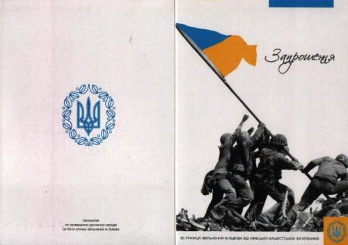

# Маразм крепчает

**2009-08-06** К. Дымов

27 июля исполнилось 65 лет со дня освобождения города Львова от немецко-фашистских захватчиков. Организацией празднования этой славной годовщины занялся Оргкомитет, куда, естественно, входит и Львовский городской Совет Организации ветеранов Украины - организация, вроде бы, *«наша»*, советская, прокоммунистическая. Но лучше бы они за это дело не брались! Ибо вместо прославления подвига Красной Армии и пропаганды героического советского прошлого (особенно - среди молодёжи, оболваниваемой «демократами»!) получилось нечто такое, что у меня - достаточно молодого ещё советского патриота - вызвало просто-таки бурю возмущения и негодования! Получилась самая худшая, самая подлая дискредитация наших советских ценностей - настолько отвратительная и гнусная, что ничего подобного, я думаю, не смогли бы никогда придумать даже самые мерзкие националистические выродки!

Судите сами. Привожу ниже отсканированное изображение приглашения (укр. - "запрошення") на праздничные мероприятия, которое организаторы после проведённого «оргсобрания» принялись раздавать ветеранам.

Прежде всего, конечно же, бросается в глаза и коробит взор «жовто-блакитный прапор», который, как, очевидно, считают члены Оргкомитета, изображённые здесь советские воины водружают над Львовом. Плюс к нему - два тризуба. По-моему, это - уже *кощунство*; и если б я был ветераном, и мне принесли такое вот «приглашение», я, не колеблясь, плюнул бы разносчику в лицо! Вроде бы, эти приглашения собирались распространять и среди тяжело больных, «неходячих» ветеранов - что, по-моему, вообще, может - простите уж меня, бога ради, - ускорить уход некоторых из них из жизни! Потому как у всякого нормального советского ветерана сия возмутительная картинка способна запросто вызвать скачок давления и инфаркт с инсультом!

Ну, ладно, предположим, что ветеранская организация не хочет вступать в конфронтацию с местной бандеровской властью, размахивая перед нею столь ненавистным ей кумачом. Я думаю, что в этом случае можно было бы просто пойти на компромисс со своей совестью и не помещать на приглашении Красное Знамя - а изобразить что-нибудь нейтральное, не несущее идейно-политической нагрузки. Но не изображать же «государственный флаг» - тем более что это, просто-напросто, противоречит исторической правде: в конце-то концов, не его подняли над Львовской ратушей в июле 44-го! Однако ветераны (наши, родные, *советские* ветераны, верой и правдой служившие Советской стране!), получается, пошли на поводу у гнусной антисоветской власти! Естественно, не все ветераны, а только их, скажем так, организационная верхушка, - но ведь она-то выступает от имени *всех* советских ветеранов, представляет их мнение и интересы, а это, как говорится, налагает!

А теперь приглядитесь к картинке. Кто эти солдаты, водружающие знамя? Человек, несведущий в военной истории, подумает, что это бойцы Красной Армии, - только флаг превратился в «Фотошопе» из красного в жёлто-голубой. Так подумают 99,9% людей, и не заметят они подвоха. А подвох этот таков, что на его фоне блекнет даже пресловутый «жовто-блакитный прапор»! И если вдруг найдётся какой-нибудь умник вроде меня, только антисоветски-злобно настроенный, смеяться и изгиляться он будет от души!

Дело всё в том, что это - известнейшая, обошедшая весь мир фотография: *американцы* весной 1945 года водружают свой "Stars and Stripes" («Звёздно-полосатый») над японским островом Иводзима! *Американцы*, чёрт побери! За этот прославленный снимок его автор - Джо Розенталь - даже получил Пулитцеровскую премию. По мотивам фотографии в Вашингтоне (вернее - в Арлингтоне) соорудили памятник - Iwo Jima Memorial, один из самых главных военных памятников Соединённых Штатов. Крайний слева на фотографии - Айра Хейз, морской пехотинец США, индеец по происхождению, ставший национальным героем Америки (так, к слову сказать, - закончил жизнь он трагически: спился и умер совсем ещё молодым). Ещё добавлю: про Иводзиму и конкретно Хейза американцы с полдюжины фильмов сняли...

Это ж до какого маразма мы, товарищи, докатились: на приглашении к мероприятиям по поводу годовщины освобождения *советского* города изобразить американцев, водружающих жовто-блакитный флаг! Какой-то сюрреализм получается, иначе тут и не скажешь!

Скорее всего, сию композицию сварганил какой-то малообразованный компьютерщик, который просто взял из Интернета приглянувшуюся ему военную фотографию. Но ведь заказчики работы - товарищи из ветеранской организации - обязаны были *проверить* её! А если б на приглашении шутки ради или со злым умыслом написали «Хайль Гитлер» или изобразили вместо американцев вообще эсэсовцев - и такое пропустили бы? И ведь в ветеранском совете сидят *кадровые военные*, до генерала включительно. Должны были они в училищах-академиях и военную историю изучать! Допустим, не было у них нужды и желания штудировать кампанию на Тихом Океане во время Второй мировой - хотя, как мне кажется, хороший военный обязан развивать свой кругозор и должен хорошо знать всю военную историю, начиная с Александра Македонского. Однако неужели кадровые офицеры не заметили, что *форма* на солдатах какая-то странная, явно не наша!?

Тут мне могут возразить, что ветераны - люди старые, многие из них больны и видят плохо и т.д. Но на это я замечу, что у ветеранов имеются более молодые товарищи, из той же КПУ, скажем. Почему они не проконтролировали процесс? Руки не дошли или у них тоже общего кругозора не хватает?

Однако, к сожалению, на этом маразм ещё не закончился. На том же самом организационном собрании, по моей информации, обсуждался также вопрос об организации для ветеранов праздничного обеда. Некий спонсор предложил оплатить ветеранам обед - как вы думаете где? В «Макдоналдсе»!!! С тем чтобы каждый старик смог съесть там бутерброд и порцию картофеля фри. А чтоб ветераны выпили причитающиеся им «фронтовые сто грамм», было предложено закупить на всех водки. Вы себе представляете эту картину: в «Макдоналдсе» (!) седовласые старики-ветераны, увешанные орденами и медалями, жуют гамбургеры и запивают их из-под полы водкой - и всё это на глазах у изумлённой молодёжной публики!? По-моему, худшего опошления образа советского ветерана придумать просто невозможно! Хочется надеяться, что хотя бы это «праздничное мероприятие» всё-таки не состоится...

Так что всё это: тупость и головотяпство; заигрывание с властью в надежде получить от неё какие-то подачки; или же сознательная дискредитация советских ценностей и всего советско-патриотического движения? И не потому ли коммунисты и патриоты терпят одно поражение за другим, теряют влияние в массах, и особенно - в молодёжных массах, что их вожди позволяют себе такие вот «плюхи», что они, скажем прямо и открыто, - люди малограмотные, политически неподкованные, не располагающие ни эрудицией, ни кругозором, ни фантазией. Эти серые люди берутся руководить «борьбой за Советскую власть», не обладая нужными для этого качествами, развивают совершенно пустую, а порою, как в данном случае, просто вредоносную активность, - но при этом они всячески оттесняют и вытесняют из руководства тех вправду умных, образованных и грамотных, ярких людей, которые *могли бы* возглавить борьбу! Вот это, по-моему, - один из главных корней наших бед.

Предвижу, что меня будут обвинять: как, мол, так, какой-то молокосос, жизни не видавший и пороху не нюхавший, нападает на заслуженных ветеранов, защищавших Родину и проливавших кровь за неё. Я отвечу: честь им за это и хвала! Однако былые подвиги отнюдь не снимают с ветеранов, а в особенности - с *высокопоставленных* ветеранов, ответственности за их *сегодняшние* дела и поступки. И когда какой-нибудь вправду заслуженный ветеран со Звездой Героя на груди ради бесплатной еды и выпивки и получения мелких подарков садится за один стол с обер-националистом Ющенко, или же братается с «вояками ОУН-УПА», - вы уж извините, но к такому ветерану нет у меня уважения, какие бы подвиги не совершил он когда-то! И не понимаю я, хоть убей, как можно рядом с советскими красно-звёздными, «серпасто-молоткастыми» орденами и медалями вешать бандеровские кресты и тризубы!

В конце-то концов, в чём вообще можно обвинять сегодняшнюю молодёжь, если наши старики - воспитанные советским строем, получившие правильное образование и прошедшие, казалось бы, такую суровую школу жизни, - умудряются вот так вот, как это описано в данной статье, дискредитировать советское движение и выставлять себя на посмешище?

Я надеюсь, что под воздействием моей критики ответственные товарищи будут, действительно, более ответственно подходить к своему делу и станут тщательно взвешивать и выверять каждое своё действие, каждое публичное мероприятие, каждый документ и каждое своё слово...