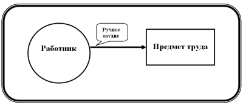
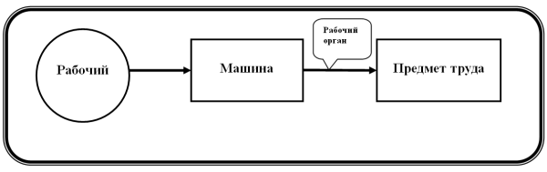
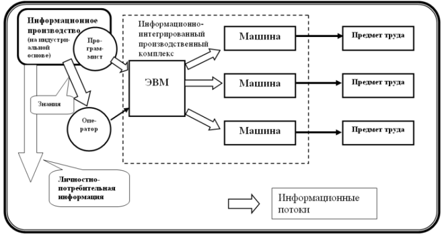

# Письма об «информационной экономике». Письмо седьмое

**2009-08-07** К.Дымов (К. Дымов)

**«Информационный технологический способ производства».**

Под **технологическим способом производства** я понимаю **исторически** **определённую качественную ступень развития техники, технологии и, вообще, производительных сил, основанную на некоторой совокупности базовых технологических принципов и технических решений, которые обусловливают характер труда и технико-технологический облик производства в ту или иную эпоху**. Иными словами, технологический способ производства есть конкретно-исторический способ производства жизненных благ, рассматриваемый в чисто технологическом и техническом аспекте, абстрагируясь от экономических производственных отношений людей. Возможно, то, что я именую «технологическими способами производства», и имел в виду Маркс, когда говорил, что *«**экономические** **эпохи** различаются не тем, чтó производится, а тем, **как** производится, **какими средствами труда**»* [К. Маркс. «Капитал», книга первая, глава 5; выделено мной - К. Д.].

С понятием «технологический способ производства» связано понятие *«технологическая революция»*, под которой надо понимать коренной переворот в технике, технологии и, вообще, производительных силах, вызывающий переход к новому, более высокому технологическому способу производству. Развитие производительных сил выходит на *качественно* более высокий уровень, и оттого происходят фундаментальные изменения во всех без исключения сферах жизни и деятельности людей. Определённый технологический способ производства, в свою очередь, являет собой необходимую материально-техническую базу для соответствующего ему *общественного* способа производства (или способов производства) как единства производительных сил и производственных отношений.

Как я считаю, до недавнего времени человечество прошло только лишь два технологических способа производства: *ручной* и *машинный* (их характеристика - ниже). В наши дни мы вступаем в новый, более высокий, третий по счёту технологический способ производства.

Важнейшей, магистральной тенденцией развития общественного производства в наше время является опережающий рост производства информации - как информации для производственного потребления, так и (добавим это ко всему сказанному в предыдущих «письмах») для личного потребления (лично-потребительная информация), - по сравнению с непосредственным производством вещественных продуктов (вещей). Стремительно растёт удельный вес отраслей, обеспечивающих создание, передачу и обработку информации, и, что особенно важно, эти отрасли, благодаря изобретению и массовому внедрения компьютеров и их систем, поставлены отныне на подлинно индустриальную основу. В этом и состоит **информационная революция** *в широком понимании данного термина*. Информационная революция второй половины XX века - квинтэссенция НТР, и можно даже говорить о том, что эти понятия - «информационная революция» и «научно-техническая революция» - до известной степени тождественны. Результатом информационной революции как раз и является переход от старого, машинного технологического способа производства к более высокой ступени - к информационно-машинному, или, выражаясь проще, информационному, технологическому способу производства. В чём же состоит его существенное отличие от предшествовавших технологических способов производства?

При **ручном способе** работник *непосредственно* воздействует на вещественный предмет труда, используя для этого ручные орудия и силу своих мышц. Среди трёх производственных потоков - вещественного, энергетического и информационного - превалирует первый, хотя и он слаб. Бóльшую часть энергии, затрачиваемой в процессе производства, составляет мускульная энергия человека и животных. Информационное производство как самостоятельное подразделение отсутствует. В структуре потребления людей при ручном технологическом способе производства полностью преобладают продукты питания; общественное производство большей своею частью служит удовлетворению найпервейшей потребности человека - потребности в пище.

Упрощённо-схематически ручной технологический способ производства можно отобразить следующим образом:

При **машинном способе** рабочий управляет *машиной*, а уже та непосредственно обрабатывает предмет труда, воздействуя на него своими рабочими органами, аналогичными ручным орудиям. Машина тем самым *опосредствует* воздействие рабочего на предмет труда, «становится между» работником и предметом его труда. Информационное производство начинает обособляться от непосредственно вещного, но не достигает ещё значительного развития: его доля в совокупном продукте общества по-прежнему невелика - намного меньше, нежели доля непосредственно вещного производства.

При машинном способе производства усиливаются вещественный и в особенности энергетический потоки. Человек в больших масштабах использует минеральное топливо и проч. как источники энергии для приведения машин в действие. Машинное производство, в противоположность «ручному», носит *общественный характер*: оно предполагает комбинирование труда его участников, тесную связь между ними и коллективное применение средств труда. Общественный характер машинного производства и проявляется, по сути, в интенсивном, и при этом подчинённом определённым пропорциям, обмене веществом и энергией между участниками производства - все они тесно связаны вещественно-энергетическими потоками в *единый общественный процесс производства*. А это обусловливает объективную необходимость «всеобщественного», централизованного управления процессом производства.

В структуре потребления при машинном технологическом способе производства возрастает доля непродовольственных промышленных изделий; потребности людей усложняются, становятся более разнообразными.

Наконец, при **информационном способе** **производства** работник уже непосредственно не управляет рабочей машиной, обрабатывающей вещественный предмет труда. Рабочими машинами первого рода - автоматами, имеющими специфическое «информационное содержание», - управляет особого рода информационная машина, «машина второго рода» - ЭВМ, - соединённая с первыми в информационно-интегрированную систему (комплекс), а уже ею управляет рабочий-оператор. Компьютер, таким образом, становится посредником между рабочими машинами, непосредственно воздействующими на вещественный предмет труда, и человеком. При этом ключевым средством труда делается машино-управляющая информация, создаваемая особым рабочим-программистом.

Информационное производство - производство информации различного назначения - достигает, наконец, высокого развития, и информация становится важнейшим, стержневым средством производства. Наличие высокоразвитого информационного производства, создающего бóльшую часть совокупного общественного продукта и обеспечивающего быстрый и всё более ускоряющийся научно-технический прогресс, а значит, и рост всего общественного производства, есть важнейшая черта информационного технологического способа производства.

К **основным отраслям информационного производства** следует отнести: *науку* (естественные, технические и отчасти социальные науки); проектную, конструкторско-изобретательскую и дизайнерскую деятельность; инженерно-консультационные услуги (engineering); патентно-справочное дело; производство компьютерных программ, а также услуги по их установке, наладке и технической поддержке; создание и содержание баз данных; содержание (администрирование) локальных сетей и серверов Интернета; информационный транспорт (связь); книгоиздательское и газетное дело (на стадии подготовки текста и иллюстраций); киноиндустрию, звукозапись, телевидение и радио; Web-дизайн и разного рода информационно-компьютерные услуги производительного характера. Также есть все основания включить в информационное производство и систему образования как отрасль, занятую производством личностно-производственной информации. В то же время, к информационному *производству*, безусловно, нельзя отнести те сферы деятельности, связанные с выработкой и переработкой информации, которые не служат удовлетворению действительно человеческих потребностей («потребностей тела и души»), являются всего лишь исторически-преходящими видами деятельности в рамках товарно-рыночной экономики и классового общества - и не выступают поэтому сферами приложения *производительного* труда. К таким отраслям труда, неправомерно относимым многими экономистами к сфере производственной деятельности, к информационному *производству*, относятся, в числе прочих: государственное управление; банковское и биржевое дело; реклама и всякого рода консалтинговые услуги (если только они напрямую не связаны с материальным производством).

При этом информационное производство зиждется теперь уже на *индустриальной*, *информационно-машинной* технической основе, на основе применения ЭВМ и их систем для переработки, хранения и транспортировки информации. Это - *существенное обстоятельство*, куда более важное, чем тот простой факт, что в информационных продуктах заключена бóльшая часть совокупного общественного продукта. Важно ведь, в самом деле, не то, сколько чего производится, а то, *как, чем* это производится. Суть старого машинного способа производства можно выразить следующими словами: это - *производство вещей машинами*, прежде всего - производство самих *машин машинами*. Информационно-машинное производство - это, в основе своей, производство информации *с помощью машин*, или **машинное производство информации**, и, прежде всего, это - **машинное производство информации, управляющей машинами**. Попробуем представить всё сказанное выше условной графической схемой:

Отрицание одного технологического способа производства другим, более высоким, сопровождается сохранением важнейших элементов старого способа, но уже в преобразованном виде. Так, машинное производство сохраняет орудие труда, но преобразует его в рабочий орган машины; информационный способ производства сохраняет машину первого рода, но превращает её в элемент информационно-интегрированного комплекса машин. Информационный способ производства, надо подчеркнуть, - это именно информационно-*машинный* способ производства; общественное производство по-прежнему основывается на применении *машин*, однако намного расширяется арена их применения: они теперь не только обрабатывают вещество и преобразуют энергию из одной формы в другую, но и перерабатывают информацию. Содержание самого понятия «машина» становится, таким образом, более широким - чтобы в этом убедиться, достаточно сопоставить современные определения «машины» с теми, что приводятся в литературе более чем полувековой давности.

Термин «постиндустриальный», выдуманный некоторыми «модными» ныне учёными, по сути своей - бессмысленный термин. Современное общество не является «*пост*индустриальным» (т.е. «*после*-индустриальным»). Оно по-прежнему «индустриальное», только теперь индустриальное производство вещей органически соединилось с *индустриальным* информационным производством, образовав некое единство более высокого порядка. Теперь мы имеем индустриальное вещное производство, опирающееся на высокоразвитое производство информации, и высокоразвитое информационное производство, поставленное на индустриальную, машинную основу. Машинное производство отнюдь не «отменено», напротив, оно теперь приобрело *всеобщий* характер.

Развитое информационное производство вовсе не является чем-то самодостаточным, каким его иногда представляют сторонники теории «информационного общества», которые фетишизируют информацию, отрывают информационное производство от непосредственно вещного, метафизически противопоставляют их. Растущее производство и потребление информации не отменяет необходимости производить вещи, удовлетворяющие наши телесные потребности. Более того, производство информации большей своей частью всего лишь *служит* производству вещей, производству материальных благ, обеспечивает быстрый рост их производства и повышение их качества.

При информационном способе производства информационный поток становится столь же мощным и экономически важным, как вещественный и энергетический потоки. «В наследство» от машинного способа производства информационный способ получает проблемы исчерпания наличных источников природных невозобновляемых ресурсов и энергии, а также проблему разрушения окружающей среды. Но именно теперь, благодаря мощному развитию науки и информационных технологий, создаётся реальная *технологическая* возможность разрешения этих проблем: путём использования новых источников ресурсов и создания принципиально новых промышленных технологий, способных обеспечивать обмен веществом и энергией между человеком и природой с минимальным ущербом для последней.

Вообще, наступающая «информационная эпоха» - это, воистину, время *«чудо-технологий»*. Если раньше человек осуществлял на вещественный предмет своего труда только лишь, или преимущественно, грубо-механическое и химическое воздействие, то ныне он овладевает всё более тонкими формами движения материи и преобразует вещество природы на всё более глубоких уровнях его организации. Прежде всего: развитие *биотехнологий* - технологий глубокого преобразования живой материи, «конструирования жизни». На очереди же стоит самое широкое внедрение *нанотехнологий* - технологий сборки вещей буквально из отдельных атомов! «Чудо-технологии», поражающие наше воображение и коренным образом меняющие наш мир, - это, пожалуй, самый яркий пример специфического продукта *«новое»*, создаваемого информационным производством и всё более характерного для наступающей эпохи, для информационного способа производства.

При новом технологическом способе производства в структуре личного потребления со временем станут преобладать информационные продукты, удовлетворяющие высшие, *культурные* запросы людей; а также возрастает объём *производительных* *услуг* - услуг, удовлетворяющих, наряду с вещными жизненными благами, те или иные *материальные* человеческие потребности, и связанных *с целенаправленным воздействием на вещество природы*. (К таковым следует отнести пассажирский транспорт и связь, коммунально-бытовые услуги, ремонт домашней техники и проч., гостиничное и курортное дело и некоторые другие). Доля вещных благ в структуре потребления снижается, хотя в абсолютном выражении их производство и потребление тоже намного увеличивается, благодаря гигантскому росту производительных сил.

Как мне представляется, развитие информационного способа производства неизбежно приведёт к тому, что на первое место выйдет именно *производство Человека*. Всестороннее развитие Человека, основанное на строго научном подходе и применении особого рода технологий *high-**hume*, - это станет альфой и омегой общественного производства, его целью и исходным пунктом. **От производства вещей к производству Человека, главной производительной силы общества, - такова магистральная тенденция развития общественного производства на такой наивысшей ступени его развития, когда Знание делается главным средством и продуктом труда.**

И всё же, всегда надо помнить, что истоком и *фундаментом* этого нового технологического способа производства выступает *информационная машина*. Она делает возможным быстрый рост производства всевозможной информации, овладение самыми тонкими нюансами устройства природы, создание изощрённых супертехнологий и переход к подлинному производству Человека. Поэтому история становления и развития информационного технологического способа производства - это, прежде всего, *история компьютера*.

Я считаю, что в настоящее время происходит всего лишь **переход** **к информационному способу производства**. Разумеется, он не может быть одномоментным, но представляет собою качественный скачок, растянутый во времени. Таким же, кстати, был и переход от ручного способа к машинному. Провозвестники машинного производства информации - первые механические счётные машины, начиная с «Суммирующих часов» Вильгельма Шиккарда (1617 или 1623 год) и вычислительной машины Блеза Паскаля (1642). В ряде отраслей человеческой деятельности механические счётные машины получили некоторое применение и даже немало повысили там производительность вычислительного труда, однако задача создания эффективных программируемых вычислительных устройств на механической основе оказалась невыполнимой. Механика машин первого рода смогла заменить *механику* мышц, связок и костей, но инертная механика не может заменить «электронику» мозга. Да, тут нужна именно *электроника*, использование электронных процессов, и быстродействующие машины для обработки информации пока что могут быть, по большому счёту, только машинами на электронной элементной базе - *электронными* вычислительными машинами.

Применение первых, механических вычислительных машин было ограничено ещё и тем обстоятельством, что информационное производство находилось тогда лишь в зачаточном состоянии. Объёмы перерабатываемой информации были относительно невелики, и переработка её поглощала весьма небольшую массу общественного труда. Только бурный рост информационного производства в XX столетии потребовал создания мощных средств машинной, автоматической переработки информации и, тем самым, *создал объективные предпосылки* к изобретению и распространению ЭВМ.

Постройку первой, как принято считать, «настоящей» ламповой ЭВМ - ENIAC Дж. Мочли и П. Эккерта (1945 год) - можно уже взять «точкой отсчёта», но, согласитесь, ЭВМ первых трёх поколений по отношению к современным компьютерам - это примерно то же, что первые паро-атмосферные машины по отношению к машине Дж. Уатта! Слишком громоздкими, медлительными, ненадёжными и неудобными в работе были они! Потребовалось длительное совершенствование элементной базы: изобретение транзистора, а затем интегральной микросхемы и микропроцессора, породившего вскоре персональные микро-ЭВМ. Для того чтобы компьютер стал «второй головой человека», для того чтобы он стал умелым помощником каждого работника, занятого производством и использованием информации, нужно сделать компьютер *соразмерным* голове человека, а для этого необходима соответствующая, «микроминиатюрная» элементная база - с элементами, соизмеримыми с нейронами головного мозга.

Более определённо про начало перехода к информационному способу производства можно, наверное, говорить лишь после изобретения в 1970-х годах *персонального* компьютера. Впрочем, действительно персональным, т.е. соответствующим индивидуальным запросам пользователя и при этом дешёвым и доступным, компьютер стал только после того, как в 1981 году фирма IBM предложила принцип «открытой архитектуры» - принцип сборки компьютера из набора стандартных совместимых устройств, выпускаемых различными производителями, - и выпустила эпохальный ПК IBM PC. Персональный компьютер быстро стал *массовой* машиной и начал победное шествие по миру, потеснив большие ЭВМ.

Персональный компьютер - подлинно *универсальный* компьютер. Так же как машинное производство вещей нуждалось в универсальной паровой машине, в универсальном двигателе, способном приводить в движение любую рабочую машину, машинное производство информации нуждалось в *универсальном* компьютере, способном обрабатывать и хранить любую информацию и выполнять любые задачи. Но в то же время универсальность ПК отнюдь не препятствует его специализации; напротив, «открытая архитектура» позволяет подобрать конфигурацию машины, наиболее подходящую для выполнения каких-то определённых функций и задач.

Поначалу ЭВМ служила средством труда только для весьма узкого круга ультрапрофессионалов, разбирающихся в прикладной математике и языках программирования. С поворотного момента появления массового, недорогого, универсального и при этом легко специализируемого персонального компьютера стало возможным оборудовать компьютером рабочее место *каждого* работника, имеющего дело с обработкой информации (придать каждому работнику автоматизированное рабочее место - АРМ - на базе ПК). Были созданы также мобильные ПК - ноутбуки и карманные компьютеры, - необычайно удобные и нужные для людей целого ряда профессий.

«Вторая голова» была предоставлена в распоряжение *каждого* работника. Сразу после своего появления ПК получили широкое распространение, оставив на долю больших - мощных, но сложных и дорогих, - ЭВМ (мини-ЭВМ, мейнфреймов и суперЭВМ) выполнение лишь наиболее сложных и трудоёмких вычислительных задач, в том числе в кооперации с ПК, выполняя их «запросы». Развернулась и начала развиваться невиданными в истории техники темпами компьютеризация производства, торговли, банковского дела и всех прочих областей человеческой деятельности.

Но этого не произошло бы, если бы к «персоналкам» не было разработано удобное, интуитивно понятное пользователю и, вместе с тем, функционально мощное программное обеспечение. Революционным моментом в области «программостроения» стало, конечно, изобретение графического интерфейса. Становление компьютера как универсальной машины для обработки информации во всех её формах завершилось к началу 90-х годов, когда были разработаны технологии преобразования любой информации в цифровую форму; ПК в полной мере освоил графику, звук и видео, стал мультимедийным.

Одновременно началось объединение информационных машин в системы (первые опыты по созданию локальных сетей проводились ещё в конце 60-х). Утверждение информационного способа производства надо связывать, наверное, с созданием, развитием и расширением глобальной компьютерной Сети. Была создана, наконец, надёжная, скоростная «информационная магистраль», без которой уже немыслима жизнь современного человека. Таким образом, к середине 1990-х годов уже имелись в наличии все базовые технические элементы нового технологического способа производства.

Развитие компьютерных сетей, в свою очередь, коренным образом преобразует всю информационно-вычислительную технику. Персональный компьютер всё больше становится именно «окном в мир», инструментом для получения информации из «коллективной памяти», для обмена данными с другими машинами, для работы с вычислительными и прочими ресурсами сети, находящимися в коллективном пользовании. Появилась концепция «сетевого компьютера» - относительно простого и недорогого устройства, способного работать лишь при подключении к Сети, оттуда загружающего операционную систему и прочее программное обеспечение и оттуда получающего данные для обработки. «Второе дыхание» обретают большие ЭВМ - но теперь уже не как самостоятельные машины, а как сетевые устройства для хранения огромных массивов информации и обслуживания пользователей ПК, для выполнения их «запросов». Таким образом, быстро развиваются локальные и глобальная системы информационных машин; и это бурное развитие ведёт к тому, что в общей массе компьютерной техники возрастает экономическое значение и стоимостная доля техники именно *коллективного*, сетевого пользования. Компьютерная техника «уходит в Сеть» - стало быть, происходит *всё большее обобществление компьютерных средств труда*.

Наряду и одновременно с этим, в 1960 - 80-е годы в развитых странах начинается перевооружение непосредственного вещного производства на новой технической основе. Внедряются ЭВМ, управляющие технологическими процессами в режиме реального времени (начиная, если я не ошибаюсь, с ЭВМ третьего поколения), появляются промышленные роботы, автоматизированные системы управления (АСУ) разного уровня, станки с ЧПУ, создаются заводы-автоматы. Внедрение на производстве ЭВМ, их интеграция с рабочими машинами первого рода, означает то, что теперь уже от нового элемента *«развитой совокупности машин»* (Маркс) - от управляющей машины - обычно исходит очередная техническая революция в той или иной отрасли промышленности. Во всяком случае, каждый раз, когда традиционное машинное производство превращается в производство более высокого типа, исходным пунктом служит *управляющая машина*.

Переход к информационному способу производства означает достижение *качественно нового*, невиданного, фантастически высокого уровня развития производительных сил, и это, как мы увидим, требует коренного изменения всей системы производственных отношений.

**(Продолжение следует)**

[Письмо первое](/1133.md)

[Письмо второе](/1173.md)

[Письмо третье](/1202.md)

[Письмо четвертое](/1224.md)

[Письмо пятое](/1248.md)

[Письмо шестое](/1253.md)

[Письмо седьмое](/1301.md)

[Письмо восьмое](/1315.md)

[Письмо девятое](/1345.md)

[Письмо десятое](/1362.md)