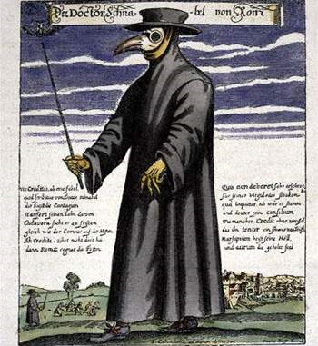

# Без паники или Как уберечься от гриппа

**2009-11-01** Надежда Жолобак

На улицах городов и сел Украины, как первые признаки введенного карантина из-за эпидемии гриппа, появились люди с повязками на лице. Другие - замотанные шарфами, просто прикрывающиеся воротниками пальто. Они предполагают, что такие меры могут защитить их от инфицирования, не понимая, что такая «защита» только увеличивает его вероятность. Во-первых, защитный эффект маски длится не более 2-х часов, после которых нужно одевать другую, а эту кипятить и гладить для повторного использования. Во-вторых, под маской на улице в холодное время года в результате повышенной влажности после выдыхания воздуха образуется область с пониженной температурой, что только увеличивает возможность подцепить инфекцию. Если это не маска, а шарф, свитер или воротник пальто, куртки, то ситуация только усугубляется: никто их кипятить и гладить не то, что каждые 2 часа, а вообще не будет. Таким образом, происходит не защита, а усугубление состояния: человек дышит переувлажненным, переохлажденным и грязным воздухом.

Вся раздутая паника вокруг эпидемии гриппа чем-то напоминает средневековье с его чумными эпидемиями. А люди в масках - чумных врачей, которые для «отпугивания болезни» носили специальную одежду.

Другое дело - надевать повязку в местах скопления людей. Заходите в общественный транспорт, в магазин - наденьте на период пребывания там, а когда покидаете - снимите и положите в пакет, чтобы потом обработать ее как следует. Еще один надежный и испытанный способ предохраниться от инфицирования респираторными вирусами, к которым относятся и вирусы гриппа - смазывать слизистую носа оксолиновой или другой жиросодержащей мазью. А скажите честно, у кого в кармане есть чистый носовой платок? Ведь такой простой способ, как прикрывание рта и носа во время кашля и чихания (очень полезных реакций организма, с помощью которых он освобождается от инфекционных агентов на своей слизистой) может защитить окружающих от опасности инфицирования и предохранить вашу одежду и одежду попутчиков или соседей от заражения.

После пребывания в общественных местах и по возвращении домой нужно придерживаться примитивно простых и очень действенных правил гигиены, помнить и строго выполнять которые должен каждый, кто заботится о своем здоровье. И не только в период повышенной вероятности заболеть, а вообще по жизни.

1. При входе в дом вытирать обувь о влажную тряпку.

2. Одежду с улицы содержать в отдельном от остальной одежды месте.

3. Сразу же по приходу домой мыть руки с мылом в теплой воде, а во время эпидемии и лицо, и нос.

4. Как минимум, один раз в сутки делать в квартире влажную уборку с дезинфицирующим раствором.

5. Регулярно (каждые 2-3 часа) проветривать помещение.

Простые меры, которые знают практически все. Но выполняют ли?

Современная паническая ситуация среди населения ведет к тому, что все, сломя голову, ринулись увеличивать товарооборот в аптечной сети, покупая бесполезные или даже вредные и опасные для жизни препараты по баснословной цене. Проще всего пойти в аптеку и накупить без разбору всяческих медикаментов, на коробочке которых написано, что они стимулируют иммунитет: надо ведь защищаться. Хотя в настоящей ситуации стимуляция иммунитета и не особенно нужна: инфекция и так вызывает чересчур сильный воспалительный ответ в организме. И чем сильнее, тем прогноз хуже...

Правительство сообщает, что в порядке гуманитарной помощи к нам завезут препараты для специфического лечения гриппа ингибирующие нейраминидазу - фермент вируса гриппа, обеспечивающий его заразность и распространение. Это занамивир (реленза) и тамифлю (озельтамивир). По поводу последнего в Европе и Японии велись дискуссии о возможности его применения в связи с [зарегистрированными в 2006-2007 гг.](http://www.health-ua.org/article/rpt/45.html) случаями суицида, развитием нейропсихиатрических заболеваний у детей, принимавших его. Побочные эффекты его применения [наблюдались у 50% детей](http://www.timesonline.co.uk/tol/news/uk/health/Swine_flu/article6734056.ece).

На этом препарате, который навязывает мировому сообществу ВОЗ, зарабатывает экс-министр обороны США Рамсфелд и его компаньоны-политики: [Рамсфелд тесно связан с фирмой "Гилеад"](http://www.supotnitskiy.ru/stat/stat63.htm), которая держит патент на это «чудо-средство» до 2016 года.

Для общей информации: в интернете показывают цену на тамифлю (10 таблеток) 300-500 грн. Многие купят? Да и нужно ли?

К сожалению, мы забываем о доступной профилактике и лечении, без модных названий и заоблачных цен.

Для профилактики и лечения грипа, в том числе и "свиного", можно принимать банальную аминокапроновую кислоту 5%, закапывая в нос по 3-5 капель 4-5 раз в день [^1] [^2]. Или же отечественные препараты, в специально для этого разработанных дозах, и по правильной схеме. Одним из таких является «Амиксин», которого взрослому для профилактики инфицирования достаточно принять четвертую часть таблетки в неделю, разделив ее на два приема. К примеру: в понедельник принимаем 1/8 таблетки и в среду - 1/8. А потом перерыв до следующего понедельника. Поскольку эффект от действия «Амиксина» сохраняется в течение 4-5 суток, то такая доза обеспечивает должный уровень противовирусной защиты. Стоимость такой защиты от возможной инфекции - менее 5 грн. в неделю.

Но ни амиксина, ни других отечественных антивирусных препаратов вы сейчас не найдете в аптеках, и никаких мер по срочному увеличению их производства и обеспечению им населения никто не предпринимает. В это же время очень сомнительные и очень дорогие зарубежные лекарства торжественно встречают в аэропорту лично руководители государства.

Кроме того, существует очень простой и эффективный способ предохранения от гриппа и ОРЗ. Когда-то его рекомендовал академик Бургасов Петр Николаевич, главный санитарный врач СССР. Он узнал о нем на фронте. С тех пор ни разу не болел даже ОРЗ, а не то, что гриппом! Хотя прожил более 90 лет и занимался особо опасными инфекциями. Придя вечером домой, после контактов с людьми, которые могли вас заразить на работе, в магазине, общественном транспорте, вымойте руки с мылом (чем оно проще, тем лучше). Высморкайтесь и намыленными пальцами тщательно протрите ноздри. Разумеется, изнутри. Это не самолечение, а профилактика. У метода есть серьезное научное обоснование. Капельки мокроты, содержащие вирус, имеют размер от 50 до 100 микрон, поэтому они застревают в носовых ходах. И пока вирус не вызвал инфекцию лучше его просто "вымыть" из носовых ходов. Кстати, именно мыла вирус «боится».

Но средства массовой информации не спешат информировать население о таких простых и эффективных методах борьбы с гриппом. Зато много говорят о дорогих не очень надежных. Например, о вакцинации. В частности, живой аттенуированной вакциной от гриппа H1N1 FluMist. Ее применение (используется интраназальный распылитель) сопровождается возможностью развития бронхоспазма со всеми вытекающими отсюда последствиями. Кроме того, сами производители - компания MedImmune - пишут, что эта вакцина не проходила контроля на канцерогенное и мутагенное действие, а также не исследовано ее влияние на фертильность (см. [Инструкция к применению FluMist (pdf)](http://www.medimmune.com/assets/pdfs/flumist_pi.pdf)). Если на такие «мелочи» вы не обращаете внимания, можете вакцинироваться, хотя гарантии 100% защиты от болезни никто вам не дает. Особенно, если у вас хронические заболевания (а у кого их сейчас нет), недосыпание, недоедание, хронический стресс (а ведь сама провоцируемая правительством и СМИ паника по поводу гриппа - это уже стресс)... Увы, ослабленная иммунная система просто не способна сформировать адекватный ответ на вакцину.

Человек, инфицированный сезонным гриппом и гриппом H1N1-2009, является переносчиком вируса и может быть заразен в период, начинающийся за 1 день до проявления симптомов и заканчивающийся через 5-7 дней после начала заболевания. Для некоторых, особенно для детей, людей с ослабленной иммунной системой и инфицированных новым для большинства населения вирусом H1N1, этот период может длиться дольше.

Согласно уточненному отчету ВОЗ, смертельные случаи гриппа A/H1N1 зафиксированы в 14 странах Европы, всего скончалось 156 человек: Бельгия, Франция, Греция, Венгрия, Ирландия, Израиль, Италия, Люксембург, Мальта, Нидерланды, Норвегия, Испания, Швеция и Великобритания. Сейчас к этому списку присоединилась и Украина.

Но следует принять во внимание, что этот вирус не нов и вовсе не так опасен, как представляется: около трети взрослых старше 60 лет имеют антитела к этому вирусу. И еще: если проанализировать статистику заболеваемости, то придется сделать совсем другие выводы, чем те, которые нам навязывают СМИ. Судите сами: По данным ВОЗ, за 5 месяцев свиным гриппом в мире заболели 285 138 человек. Умерли 3635 (около 1,3%).

Для сравнения, сезонным гриппом ежегодно в мире заболевает около миллиарда человек. Умирает 3 миллиона. Только в США за год с сезонным гриппом госпитализируют 226 тысяч человек. Из них умирает 36 тысяч (почти 16%).

Налицо факт того, что опасность «свиного гриппа» по сравнению со всеми другими явно преувеличивается. Но расследование причин этого факта - тема другой статьи.

[^1.]: [Современные средства терапии наиболее распространенных вирусных инфекций](http://www.consilium-medicum.com/magazines/cm/medicum/article/12590), *Ф.И.Ершов, Н.В.Касьянова,* НИИ эпидемиологии и микробиологии им. Н.Ф.Гамалеи РАМН, Москва.

[^2.]: [Ринит: в борьбе за свободное дыхание](http://www.pharmvestnik.ru/text/12060.html), Фармацевтический вестник.