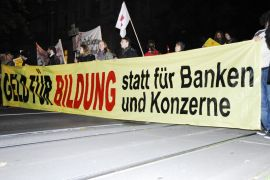
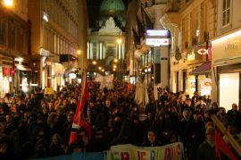
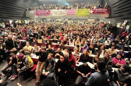

# «Университеты горят!» - массовая мобилизация студентов в Австрии

**2009-11-20** Гернот Траусмут

Кризис капитализма сотрясает каждый уголок мира. Сейчас в Австрии, которая в прошлом считалась страной социального спокойствия и «диалога», разразились массивные студенческие протесты, получившие широкую поддержку среди рабочих, которые тоже начали проявлять признаки радикализации.

После больших весенних забастовок учеников и профсоюзных протестов за повышение зарплаты, осень началась захватами университетов и массовыми студенческими демонстрациями. Австрия достигла поворотного момента.

 *Деньги образованию, а не банкам и концернам! - требование на студенческой демонстрации 28-го октября* 

В последние годы в Австрии произошла полная реструктуризация университетской системы в соответствии с принципами так называемой «неолиберальной» идеологии. В 2001 году правая коалиция правительства ввела плату за обучение, на некоторых факультетах были введены также ограничения на прием (включая отборочные тесты). Университетский бюджет был сокращен до такой степени, что стало невозможно обеспечить всем студентам доступ к необходимым лекциям и семинарам, лекционные аудитории переполнены, не хватает преподавателей для того, чтобы проводить консультации для всех студентов. И вдобавок ко всем этому правительство приняло решение о переходе австрийских университетов на Болонский процесс. Это привело к огромным трудностям для многих студентов, которым нужно как можно быстрее получить дипломы. Особенно серьезные проблемы это создало для тех студентов, которые вынуждены работать (а таких абсолютное большинство) и для студентов, имеющих детей.

Год назад во время последней избирательной кампании Социал-демократическая партия Австрии (СПДА) получила большинство в парламенте по вопросу отмены платы за учебу для большинства студентов. Вопрос платы за обучение имеет огромное символическое значение для рабочего движения. Бесплатная система образования была одним из самых больших достижений СДПА 70-х годов. Тот факт, что руководство партии отказалось от требования отменить оплату обучения, когда партия опять вошла в правительственную коалицию в 2007 с консервативной Австрийской народной партией (АНП), привел к серьезному кризису и первым попыткам организовать левое крыло внутри.

Ликвидация оплаты обучения рассматривалась как большой успех для всех, кто боролся за систему бесплатного обучения. Однако, в то же время правительство не повысило финансирование в соответствии с нуждами университетов. Это привело к ухудшению ситуации для студентов, потому что больше молодежи увидели шанс попасть в университет, но не было выделено дополнительных средств на возросшее количество студентов. Даже ОЭСР и ЕС пытались повлиять на Австрию, чтобы повысить финансирование образования из федерального бюджета с 1,2% до 2% ВВП. Это значило бы выделение как минимум дополнительного миллиарда евро, что составляет около 50% настоящего финансирования университетов.

Все это привело к чрезвычайно взрывной ситуации. Однако, все думали, что студенты будут продолжать терпеть эти контрреформы. В самом деле, после поражения в борьбе против введения платы за обучение в 2001 году студенческое движение шло на спад. Многие активисты были подавлены, опустили головы и пытались просто получить свои дипломы. Студенты университетов искали альтернатив в «автономных идеях», воскрешая модель «прямой демократии». Это была реакция на действия официальных студенческих представительских органов, которые игнорировали реальное движение и были ответственны за поражения прошлого. Подавляющее большинство студентов привыкло к тому, чтобы рассматривать годы в университете только как необходимый шаг к получению работы в будущем, и ничего более. Старый образ студентов как силы постоянного протеста против существующего порядка, читающих Маркса и носящих футболки с Че Геварой, казался ушедшим в прошлое. Все говорили о деполитизации университетов.

Однако, в конце октября все внезапно изменилось. Все началось с протеста студентов Академии изобразительных искусств 20-го октября. Это единственный университет, который до сих пор не перешел на Болонскую систему, и студенты решили захватить университет, чтобы не дать этому произойти. На следующий день студенты венского университета организовали демонстрацию в солидарность с ними, и из этого выросла идея захвата Auditorium Maximum (Большой аудитории). Это было совершенно спонтанное движение, и никто из присутствующих не представлял себе, во что выльется эта внезапная вспышка. С самого начала этот захват получил массовую поддержку, и было решено продолжать захват «пока все наши требования не будут удовлетворены».

Вначале университетские власти хотели остановить протест, прибегнув к помощи полиции. Но было вовлечено уже слишком много студентов, и им пришлось отказаться от этой идеи. С тех пор движение распространилось на все университеты Австрии. Везде студенты занимали главные лекционные аудитории и превращали их в центры движения. Студенты организовали рабочие группы, которые стали ответственными за мобилизацию, прессу, «народную кухню», солидарность и т.д. Результаты дискуссий в рабочих группах сообщались на ежедневных совместных заседаниях.

Первые дни это было похоже на большую вечеринку, привлекало множество студентов и людей извне. Когда прошло некоторое время, на студентов стали ссылаться все, кто искал политических альтернатив. Особенно большую поддержку борьбе студентов за свободное образование оказали профсоюзы. Профсоюзы рабочих металлургии и полиграфистов, которые сами ведут борьбу за зарплату, немедленно проявили солидарность и предложили помощь в организации протестов в университетах. В ответ студенты также заявили о своей солидарности с профсоюзами. Этот факт - огромный шаг вперед, если учесть, что в прошлом студенты не видели необходимости совместных действий с профсоюзами и даже если признавали эту идею, не было конкретных путей ее осуществления. Сейчас это изменилось, и это изменение может стать решающим.

 *Студенческая демонстрация 28 октября 2009 г.* 

В среду 28 октября мобилизация студентов вылилась в первую многотысячную демонстрацию в Вене. Полиция оценила количество участников в 15 тысяч, независимые источники - в 30-40 тысяч. Марш проходил под лозунгом «Деньги образованию, а не банкам и концернам», участие в нем приняли не только студенты, но также и много рабочих. Это была настоящая демонстрация силы и потенциала, который способен заставить правительство пойти на уступки.

И действительно, на следующий день консервативный министр науки, ответственный за университеты, предложил 34 миллиона евро на решение важнейших проблем и переговоры с официальными студенческими представительскими органами, которые реально не играли никакой роли в этом движении. Было очевидно, что это попытка разделить движение, чтобы ослабить захваты. Но студенты продолжают настаивать на своем требовании - как минимум, миллиард на систему образования.

Особенно интересна реакция на конфликт со стороны Социалистической партии Австрии. После массовой демонстрации канцлер Вернер Файман (представитель СДПА) и другие социал-демократические министры подчеркнули свою «симпатию» к студенческим протестам. Но потом они нашли «решение», предлагая ужесточение правил, ограничивающих доступ в университеты. Это идет вразрез с социал-демократическими идеями бесплатного образования, а также с политикой помощи детям из рабочих семей при поступлении в университет. Этот способ проявления «симпатии» вызвал очередную волну гнева, особенно среди представителей Социалистической молодежи.

У этого студенческого движения большой потенциал. Вся злость и разочарование, которые накапливались годами, сейчас превращаются в открытое сопротивление. Тысячи студентов принимают участие в пленарных встречах, сотни - в альтернативных лекциях. Например, на этой неделе организация «Der Funke» организовала кружок по изучению марксизма, и в него пришло около 30 студентов.

Также у нас чувствуется огромная солидарность неуниверситетских организаций - особенно профсоюзов. Пока писалась эта статья, Социалистическая молодежь Форальберга провела демонстрацию солидарности с университетскими протестами с участием нескольких сотен школьников.

Главные споры сейчас ведутся по вопросам того, как продолжать борьбу и как организовать движение. Самая популярная идея на этом этапе движения - идея «прямой демократии». Много лекционных залов (особенно AudiMax в Вене) были превращены в настоящие лаборатории анархизма и свободомыслия. Для многих активистов «метод» стал самоцелью. Больше всего их занимает идея создания «пространств свободы». Борьба за лучшее и бесплатное образование для этих активистов уже стала второстепенным вопросом.

*Студенты захватили главную лекционную аудиторию Венского университета*

С одной стороны, действительно впечатляет, как студенты смогли самоорганизоваться. Появилась так называемая «народная кухня», где готовятся три горячих блюда каждый день для каждого, кто принимает участие в работе. Другая рабочая группа организовала прямую видеотрансляцию с пленарных собраний; другие ответственны за работу по солидарности, агитации и пропаганде и т.п. В последние выходные студенты провели уборку всего университета. Этот маленький мир студентов демонстрирует огромный потенциал и способность к творчеству, лишь только его избавили от принуждения работать в чуждых творчеству условиях капитализма. Наверное, именно поэтому так много людей были глубоко взволнованы этим движением и проявляют свою поддержку.

С другой же стороны, сосредоточение на «прямой демократии» не дает движению выработать четкую тактику и стратегию. Бесконечные дискуссии и отсутствие прозрачной структуры тормозят движение. То, что в университетах нет полной забастовки, мешает многим студентам принимать участие в дискуссиях. Большинство студентов вынуждены ходить на занятия и зарабатывать себе на жизнь. В рабочих группах и пленарных дискуссиях тон задает небольшое количество активистов, которые находятся там все время. Иногда одно заседание приняло решение, а на следующий день приходят новые люди, и дискуссию приходится начинать снова. Много скептицизма наблюдается и в вопросе об избрании политического руководства. Многие студенты боятся, что руководство ограничит движение, и они уже не смогут влиять на процесс принятия решений. Тем не менее, несмотря на все эти эксперименты по «прямой демократии», можно видеть, что внутри этого движения все же проявляют признаки развития неформальные структуры. И в самом деле, недостаточная демократичность ослабляет движение.

Марксисты из «Der Funke» работали в студенческом движении с самого начала, выступая за то, чтобы приступить к выборам делегатов во всех университетах и институтах и за «забастовочный совет», который может быть отозван в любое время. Такой забастовочный совет должен иметь право говорить от имени движения и быть обязанным вырабатывать идеи того, как будет развиваться это движение, искать пути развития, и все это должно обсуждаться и выноситься на голосование на пленарных встречах.

Существует большая опасность того, что движение прекратится из-за неспособности выработать ясную стратегию, четкие лозунги и формы протеста, в которых смогут реально участвовать студенческие массы. Уже всеобщая акция 5 ноября показала первые признаки усталости участников.

Превращение захватов в полную и всеобщую забастовку в университетах - единственный способ выиграть борьбу за бесплатное образование, которая началась три недели назад. И это могло бы быть вполне возможным, если учесть, что сейчас университетские преподаватели объявили об их солидарности со студенческими протестами. Так что было бы несложно парализовать работу университетов и поднять движение на качественно новый уровень.

К тому же, борьба профсоюзов против урезания зарплат также интенсифицируется. В четверг (позапрошлый - ред.) в Иннсбруке прошла демонстрация, организованная местной конфедерацией профсоюзов. Металлурги в тот же день провели митинг в Вене. На протяжении нескольких последующих дней будет проходить национальная конференция активистов профсоюзного движения по обсуждению дальнейших шагов борьбы.

И здесь марксисты в первых рядах защищают идею совместного действия студентов и профсоюзов. Декларация солидарности должна проявиться в конкретных действиях. И все же решающим вопросом остается то, сможет ли студенческое движение выработать ясную стратегию, методы и совместные с рабочими формы борьбы.

Переведена с сайта: www.marxist.com