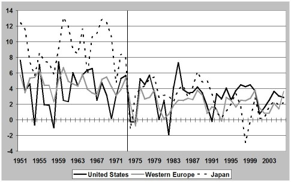
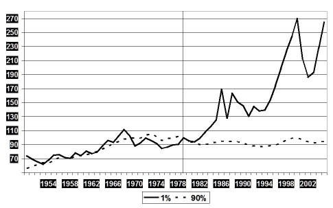
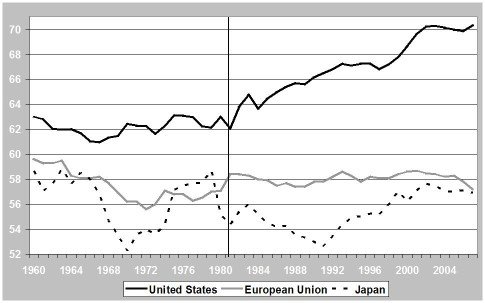
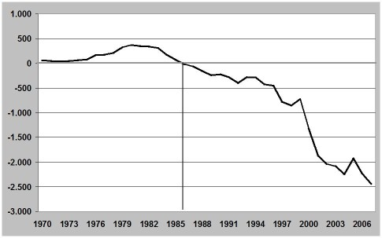
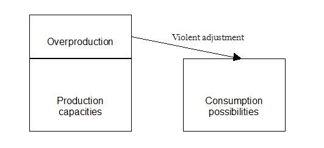
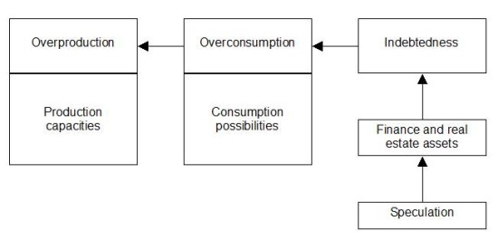

# Размышления по поводу текущего экономического кризиса

**2009-12-22** Генри Хобен

Призрак преследует западноевропейскую буржуазию, призрак кризиса 1929 года. Даже если те события никогда не повторятся в точности, но по масштабу рецессии и по размерам социальных, политических и военных последствий кризис 2007 года имеет все шансы превзойти кризис 30-х годов.

Правительства различных стран пытаются успокоить людей, объясняя, что они уже имеют опыт, что уж сегодня-то они не позволят ситуации выйти из-под контроля. Они проводят крупномасштабные интервенции, выбрасывают на рынок ликвидные ценные бумаги, понижают ставки, чтобы поощрить кредитование и инвестиции в рисковые предприятия, находящиеся в трудном положении... Но понимают ли они на самом деле, что происходит? Правильно ли они оценивают масштабы упадка, охватившего весь мир?

Главная теория, выдвинутая на лондонской встрече «Большой двадцатки» 2 апреля нынешнего года состоит в том, что проблемы произошли из-за крайностей на финансовом рынке. Текст их заключения предельно ясен: «Большие просчёты в финансовом секторе, в финансовом регулировании и контроле были основными причинами кризиса. Доверие не будет восстановлено до тех пор, пока мы не восстановим веру в нашу финансовую систему» (1). А президент Франции Н. Саркози добавил: «Сейчас так случилось, что недостатки управления вызвали финансовый кризис, очень похожий на кризис, который вызвал тот экономический кризис» (2).

Но каким именно образом ограниченный сектор экономики, такой как субстандартные кредиты, сумма которых оценивается в 1,3 млрд. долл., ведет всю планету в столь глубокий кризис? Почему, если виной всему нарушения в этих специфических финансовых институтах, мы не отсекли эту гнилую ветвь прежде, чем она заразила всё дерево? Французский аналитик и защитник свободного рынка, Марк Тоэти, заметил по поводу этой рецессии, вызванной неплатежами на рынке кредитных обязательств: «Это типичный пример кризиса, который мы не в состоянии объяснить. Мы поражаемся, как побочное явление - пусть даже достаточно важное для некоторых домашних хозяйств, но ограниченное лишь американским континентом и рынком недвижимости - смогло затем распространиться как лесной пожар. Как мог из-за него вспыхнуть кризис, самый худший за последние 80 лет?»

Наша статья оспаривает эти утверждения. Мы считаем, что нынешняя рецессия - то, почему она началась на американском рынке недвижимости и то, каким образом она перешла на финансовые рынки - может быть понята, только если рассмотреть её в общем контексте развития капиталистической «продуктивной» экономики и экономической модели, принятой после решений 1979-81 годов в США. Это объясняет, почему так важно понимать историческую перспективу и учитывать процессы накопления, вызвавшие текущие проблемы. Марксистский анализ - ключ к пониманию.

**1. Краткосрочный кризис и системный кризис**

Традиционно технически наличие кризиса считается установленным, если имеется последовательное, в течение двух кварталов подряд, ухудшение роста показателя ВВП. В США, в Национальном бюро по экономическим исследованиям признается роль декларирования при вхождении страны в рецессию и выходе из неё. Таким образом, они признали, что США находятся в кризисе с декабря 2007 года.

Но это определяет кризис, так сказать, с «кратковременной» точки зрения. Нам, как марксистам, важнее определить неисправности и нарушения в работе экономической машины, причины ее резкой остановки и возможности для её повторного запуска. Показатель ВВП может быть хорошим индикатором, но необходимы более серьёзные фундаментальные исследования. На рис. 1 приведены графики, позволяющие нам увидеть проблемы и замедления роста, происходившие в экономике развитых стран за период после Второй мировой войны.

*Рисунок 1. ВВП ППС Рост показателя в США, Европе (12 ведущих стран) и Японии с 1950 - по 2006 годы (в %)*

Источник: Расчёты основаны на Angus Maddison, Статистика мировой популяции, ВВП и ВВП на душу населения, 1-2006 AD, Октябрь 2008 : [http://www.ggdc.net/maddison/Historical_Statistics/horizontal-file_09-2008.xls](http://www.ggdc.net/maddison/Historical_Statistics/horizontal-file_09-2008.xls).

*Примечание: 12 ведущих стран Западной Европы, это: Австрия, Бельгия, Дания, Финляндия, Франция, Германия, Италия, Нидерланды, Норвегия, Швеция, Швейцария и Великобритания.*

Вообще говоря, можно отметить два отличающихся периода: «до» и «после» 1973-1974 годов. Различия значительны для Японии, менее значительны для Европы и ещё менее - для США.

В самом деле, период после 1974 года отличается четырьмя элементами, которых не было ранее:

а) рост ВВП (пересчитанный по паритету покупательной способности) падал ниже отметки 0% несколько раз, тогда как до 1974г. такое произошло лишь раз или два и только в США (в 1954г. и в 1958г.);

б) произошло замедление глобального роста (экономического развития); в Японии он понизился с годового уровня 9,3% (за период с 1950 по 1973 годы) до 2,6% (за период с 1974 по 2003 годы); в Европе - с 4,7% до 2,1% (за те же периоды); даже в США он понизился с 3,9% до 3%; в мировом масштабе падение произошло с 4,9% до 3,3% (за те же периоды времени);

в) годовые изменения скачкообразны и регулярно опускаются ниже отметки 0% по сравнению с более живым, более устойчивым прогрессом особенно в 1960-е годы; таким образом, наиболее значительные изменения произошли в 1974 году, когда в США показатель роста упал с 5,7% (в предшествовавшем году) сразу до 0,3%, в Европе падение произошло с 5,4% до 1,9%, в Японии производство упало с 8% до 1,2%, а глобальное падение составило более 3 % - с 6,6% до 2,3%; согласно другим источникам (Мировой банк (4)) мы можем определить, что глобальный показатель ВВП рос от 4,1% до 6,7% в промежутке между 1960 и 1973 годами; в 1974 году он упал до 1,5%, затем он упал даже ниже 1% в 1975 году; с тех пор годовой рост никогда не превышал отметки 5% и показал значительное снижение в 1982 году с прогрессом в каких-то 0,2%; всё это ознаменовало переход в новую «эру».

г) другие индикаторы показывают наличие таких проблем, которые мы не в состоянии преодолеть; безработица остаётся очень высокой в большинстве развитых капиталистических стран; государственный дефицит остаётся значительным, так же как и уровень государственного долга; вообще говоря, долг - частный, корпоративный или институциональный - имеет тенденцию к более быстрому росту, чем ВВП, остановки и задержки в развитии экономики более часты; учитывая вышеприведённые рассуждения, французский журнал, специализирующийся на экономических обзорах - «Alternatives économiques» - насчитал 24 больших финансовых кризиса за период после 1975 года.

Вышеприведённые рассуждения позволяют нам сделать вывод о том, что, начиная, по крайней мере, с 1974 года в мировой экономике создалась новая ситуация. Экономический рост более не гарантирован. Мы входим в период стагнации или медленного роста, а резкие изменения годовых показателей вблизи отметки 0% очень красноречиво демонстрируют нам экономику, которую власти отчаянно пытаются поднять без особой надежды на успех. То есть, мы уверенно интерпретируем этот период как структурный кризис. Капитализм не может выйти из рецессии.

**2. Почему возникают структурные кризисы?**

Когда Маркс анализирует экономические кризисы, он видит их цикличность. А это и есть та форма, которую они принимали на протяжении 19-го столетия.

Уже в то время они выявляли противоречивые стороны капитализма. С одной стороны, они вскрывали его сбои. Груз бед общества, причиной которых является капиталистическая система, открывает ее неэффективное и в то же время несправедливое и часто бесчеловечное лицо. С другой стороны, по наблюдению Маркса, кризисы - необходимый этап нормального функционирования капитализма. В самом деле, именно кризис уничтожает, правда, жестоким и насильственным способом, разрывы, которые существуют между производством и потреблением, между различными отраслями промышленности, между сферой производства и сферой обращения. Евгений Варга, официальный экономист Третьего Интернационала, подчеркнул противоречивую природу кризиса: «циклические кризисы перепроизводства вызывают интенсивную вспышку всех противоречий капитализма, но в то же время, они суть его временный итог».

Капиталистический кризис выступает в форме перепроизводства, т. е. кратковременного избытка продукции или используемой производственной мощности по отношению к возможности продажи. В этом смысле он отличается от докапиталистических кризисов, которые были преимущественно следствием явлений, создававших недопроизводство. И это перепроизводство в мире, большинство населения которого недоедает, недополучает питьевую воду, жилища, одежду и т. д., просто ужасает.

Важно понимать, что перепроизводство фактически состоит из двух механизмов, действующих одновременно: относительного перенакопления и относительного недопотребления. С одной стороны, в поисках наивысшей возможной прибыли капиталисты вкладывают много средств и выходят за пределы возможностей покупателей. Таким образом они увеличивают производственную мощность, движимые как желанием лидировать, так и конкуренцией. Они способны производить все больше и больше и надеются получать большую прибыль. С другой стороны, они ограничивают выплаты наемным работникам благодаря средствам поднятия производительности и другим средствам увеличения эксплуатации рабочего. Что касается их самих, то они настолько увеличивают долю своего дохода, расходуемую на инвестиции, что это наносит ущерб расходам на потребление. Возможность поглощения избытка товаров и услуг, таким образом, сокращается, не из-за снижения зарплаты или другого подобного ограничения дохода, а из-за того, что фонд потребления не растет так же быстро, как тó, чем капиталисты снабжают (или могут снабжать) своих клиентов.

Говоря словами Карла Маркса, «Конечной причиной всех действительных кризисов остается всегда бедность и ограниченность потребления масс, противодействующая стремлению капиталистического производства развивать производительные силы таким образом, как если бы границей их развития была лишь абсолютная потребительная способность общества». Поскольку эту цитату иногда понимают неправильно, уточним, что Маркс не сосредоточивает внимание на недостаточном потреблении или обнищании рабочих, так как оно зависит от того, что капиталисты выбрасывают на рынок.

И это также позволяет нам отбросить решение, которое часто предлагается в прогрессивных кругах и профсоюзах для преодоления кризиса - увеличение зарплат, в особенности потому, что рабочие потребляют большую часть своего дохода. Но Маркс, после того, как он настаивает на том, что до начала кризиса зарплаты увеличивались, причем это не смогло остановить приход кризиса, объясняет, что случилось, если бы правительство развитой капиталистической страны решило использовать этот метод: компании увидят в этом новый спрос, с которым они должны считаться (вместо своих конкурентов) и увеличат производственную мощность как если бы они больше не были ограничены доходом или возможностями потребления. Высокая зарплата, конечно, желательна для рабочего, так как она обеспечивает его благосостояние, особенно в странах, где доля зарплаты в ВВП в общем резко снижена. Но это не решение экономического кризиса.

В 19-м веке компании принимали решения, необходимые для того, чтобы удостовериться, что процесс урегулирования будет успешным. Вот как их можно подытожить:

* Снижение цен продаваемых товаров для того, чтобы привлечь покупателей;

* Уменьшение масштабов производства и подавление ненужных отделений для того, чтобы уменьшить издержки компании;

* Сокращения персонала и снижение номинальных зарплат (а если это снижение превышает снижение цен товаров, что возможно благодаря существованию все более высокой безработицы, снижается также зарплата, вычисляемая без учета налогов);

* Избавление от конкурентов, не имеющих средств на вышеприведенную линию поведения, что также позволяет переложить бремя кризисных эффектов на плечи других.

Обычно этих мер достаточно. Уничтожение менее здоровых компаний освобождает долю рынка и позволяет другим быть прибыльными и снова процветать. «Творческое разрушение», по известному выражению Йозефа Шумпетера!

Однако с 20-х годов 20-го века эти меры не приводят к выходу из кризисов. Наоборот, капиталистические страны погружаются в депрессию, которая заканчивается только крупным и радикальным разрушением (войнами, революциями...). Почему? Что случилось? Какие элементы изменились и позволили нам понять затруднения капиталистической системы?

Айзек Джошуа, который изучал кризис в 30-х годах, настаивает на приходе истинного общества зарплаты. Раньше рабочий жил на продукт, создаваемый им или его семьей. Показатель самопотребления для сельскохозяйственной продукции составлял 75% в 1820 и 50% в 1870 году. Но это расшаталось в 1920-х. В 1880 году, более половины активного населения работало в сельском хозяйстве. В 1930-м - немногим более одной пятой. (9) Снабжение рабочих жизненно важным продовольствием зависело почти исключительно от рынка. Они приобрели большее значение в мировом потреблении. В 1929 году зарплата рабочих исчислялась в 65% ВНП. Выход из кризиса за счет рабочих, - что естественно делают компании, - угрожает системе, нанося ущерб одному из источников восстановления национального спроса. Поэтому восстановление осложнено. Айзек Джошуа обратил внимание на то, что 1929 год стал началом эры кризисов зарплаты, а также крупных кризисов (10).

Однако, два других элемента, которые привлекли наше внимание, по-видимому, тоже играют роль: тот факт, что конкуренции больше не существует между меньшими компаниями, а сохраняется она только между компаниями-гигантами, монополиями; во-вторых, господство финансового капитала, т. е. к этому времени главным образом контроль банков над промышленностью, что можно заметить в частности по беспрецедентному развитию кредита (11).

Переход от эры свободной конкуренции к эре монополий - чрезвычайно важная ступень в анализе современного капитализма. Очень большая, вдобавок международная компания, способна сопротивляться «естественным» силам рынка конкурировать со своими соперниками во всех аспектах и не только в сфере экономики и получать поддержку каждого своего шага от «своего» правительства.

Встретившись с кризисом, она учредила финансовую «подушку безопасности», что дает ей возможность сопротивляться самым существенным эффектам падения продаж и первой уничтожать меньших, более слабых конкурентов, пока не останутся только гигантские компании. Вот как AOL-Time Warner может позволить себе декларировать убыток в 99 миллиардов в 2002 году и не быть вынужденной исчезнуть (12). Сравнив с этой величиной ВВП африканских стран, находим, что эквивалентен ей только ВВП Южной Африки.

И, если этого недостаточно, могут вмешиваться государственные учреждения, именно потому, что они «слишком велики, чтобы потерпеть неудачу» или «слишком взаимосвязаны, чтобы потерпеть неудачу». Несмотря на принцип невмешательства в конкуренцию, о котором снова и снова заявляют ведущие капиталистические страны, правительственная помощь играет все большую роль в надеждах на предотвращение банкротств.

Как результат, традиционные средства выхода из кризиса отвергаются. Цены поддерживаются из-за олигополий, которые не втянуты в конкурентную борьбу или предпочитают полагаться на другие подходы, а не на это соперничество (качество, образ торговой марки, исследования и т. д.). Меньшие компании исчезают, и все же этого недостаточно для того, чтобы стабилизировать рынок. Так, с 1980-х гг., автомобильная промышленность прошла путь от примерно сорока крупных производителей, более или менее независимых, до примерно дюжины (13). А уровень излишка производственной мощности в 2007 году, перед кризисом, составлял 20% всего установленного оборудования. Мы должны были бы пресечь деятельность нескольких международных производителей автомобилей для того, чтобы снизить уровень производства до такой степени, чтобы он соответствовал платежеспособному спросу. Но может ли правительство позволить этому случиться? Может ли итальянское правительство оставить «Фиат», закрыв глаза на то, что одно из самых могущественных семейств полуострова, Аньелли, руководит этой компанией и доля группы «Фиат» в ВВП Италии достигает 3%? То же самое относится к Франции и Германии. А разве Барак Обама, новый американский президент, не заявил, что автомобильная промышленность - символ США и что он не даст ей просто исчезнуть?

Как результат, вместо нормально функционирующего механизма с жестокой наладкой, которая могла бы оживить машину, мы имеем дело с агонизирующей системой, которая не может найти осязаемый путь из этого кризиса. Спад превращается в депрессию. Необходимо большее уничтожение производительных сил, но оно занимает длительное время, поскольку вовлекаются далеко не только семейные предприятия или даже компании.

После общества зарплаты и появления монополий развитие кредита, несомненно, есть тот третий фактор, который может объяснить переход к структурным кризисам. Кредит есть денежный продукт, то есть вклад денежной суммы в данное время, которая должна быть возмещена из дохода, извлеченного из будущего продукта (или деятельности). Однако, как капитал он уже брошен в денежной форме в экономический кругооборот. В результате капитал позволяет людям покупать избыток продуктов, и позволяет продолжаться производству, которое иначе могло остановиться.

Когда возникают первые трудности, и компании получают проблемы с ликвидностью, банковский сектор может с легкостью им её предоставить и помочь преодолеть препятствие. В результате циклический кризис превращается в простое снижение роста, которое даже может быть незначительным. Это - время длительного процветания, приблизительно как между 1950 и 1973 годами.

Однако долги не возвращаются. Они становятся постоянным кредитом, который предоставляется тем более легко, что существуют специальные отношения между кредитором и клиентом (большой компанией, связанной компанией, богатым инвестором...). Лимиты увеличиваются и ссуды возобновляются. Так мы идем к обществу долга, поскольку долг опасно накапливается. Накапливается до того момента, когда гора становится настолько высокой, что ссудные учреждения убеждаются, что ссуды не будут возвращены никогда, и каждое стремится спасти все что можно до большого обвала.

Реальность, однако, немного сложнее. При наступлении кризиса банки представляют себе ущерб, который нанесет требование немедленной выплаты, особенно тот, который потерпят они сами. В самом деле, многие клиенты будут не в состоянии выполнить требование и обанкротятся, сделав невозможным возврат кредитными учреждениями своих средств. Это объясняет, почему банки предоставляют новые ссуды или передают риски другим институтам, часто государствам, которые становятся гарантами дефицита. Так экономика чувствует дуновение свежего ветра. Но это длится недолго. Вскоре механизмы, которые породили первый застой, начинают действовать снова, и требуется новое решение. Это позволяет нам понять последовательность относительно коротких перезапусков, за которыми следуют новые падения производства и именно этот отрывистый ритм типичен для структурного кризиса.

**3. Как капитализм развивается с 1973 г.?**

Сегодняшний мир является результатом выбора, сделанного американцами, которые находились при власти, главным образом, в период 1979-1981 годов.

Первым делом, американская элита попыталась вернуться на условия соглашений конца Второй Мировой Войны и после неё. Они строили общество, которое бы все больше и больше развивало неравенство, принося доход капиталу двумя способами: много покупая и снижая налоги для богатых.

Нижеследующий рисунок (Рис. 2) показывает реальное развитие доходов (в долларах 2005 года) большинства населения, составляющего 90% по сравнению с тем процентом, который представляет богатейшую часть народа. Мы приводим два графика пересекающиеся на отметке 100 в 1979 году, в переломном году американской политики. Доход включает в себя оценку прироста капитала.

*Рис. 2. Для одного процента развитие реальных доходов (включая прирост капитала) росло, а для 90% падало в США с 1950 по 2005 (в 1979 равна 100)*

Источник: Данные взяты с книги «Разница прибылей в США, 1913-2006» Эмануэль Саез, Томас Пикетти, таблицы и рисунки обновлены в 2006 г., размещены в июле 2008 г. на сайте: [http://elsa.berkeley.edu/~saez/](http://elsa.berkeley.edu/%7Esaez/)

В период перед 1979 годом эта линия начала выделяться, с этого периода ее отметка начала расти. До 1979 г. графики прибыли возрастали параллельно. В 1953, оба находились почти на одинаковом уровне (сравните с 1979 г.) После реверсивного цикла в течение 1970-х годов, прибыль перестала расти параллельно. Для большинства нации рост прибыли остановился. Её максимум пришёлся на 1973 г. По сравнению с этим уровнем в 2005 г. она снизилась на 10,6 %. Тем не менее, прибыль одного процента богатых росла с невероятной силой, лишь рынок акций резко отметил легкий спад в 1987, 1991 и 2001 годах. В 2005 г. прибыль поднялась на 164 % по сравнению с 1979 г. В 1979 этот процент превысил в 14 раз среднее значение прибыли 90 % населения, имеющего низкие доходы. В 2005 - в 38 раз больше.

Во-вторых, американская элита перешла на новый стиль жизни - стиль «чрезмерного потребления». В этой связи, очень интересно сравнить развитие затрат потребления в ВВП США и двух её капиталистических конкурентов: Европейским Союзом и Японией. Что иллюстрирует следующий рисунок (Рис. 3)

*Рис. 3 Развитие доли потребления в ВВП для США, ЕС и Японии с 1960 по 2007 гг. (в %)*

Источник: оценки основаны на данных Бюро экономического анализа, Национального дохода и Бюджетные таблицы продуктов, Таблица 1.1.5. ВВП:

[http://www.bea.gov/national/nipaweb/TableView.asp?SelectedTable=5&ViewSeries=NO&Java=no&Request3Place=N&3Place=N&FromView=YES&Freq=Year&FirstYear=1950&LastYear=2008&3Place=N&Update=Update&JavaBox=no#Mid](http://www.bea.gov/national/nipaweb/TableView.asp?SelectedTable=5&ViewSeries=NO&Java=no&Request3Place=N&3Place=N&FromView=YES&Freq=Year&FirstYear=1950&LastYear=2008&3Place=N&Update=Update&JavaBox=no#Mid).

Для Европейского Союза, европейской комиссии, европейского хозяйства, статистических дополнений, апрель 2008:

[http://ec.europa.eu/economy_finance/publications/publication12534_fr.pdf](http://ec.europa.eu/economy_finance/publications/publication12534_fr.pdf)

2000:

[http://www.aueb.gr/users/kalyvitis/European%20Economy%202000%2071%20en.pdf](http://www.aueb.gr/users/kalyvitis/European%20Economy%202000%2071%20en.pdf).

Для Японии, МВФ, Международная финансовая статистика и статистика Бюро и Генерального директора по вопросам планирования политики (статистические стандарты):

[http://www.stat.go.jp/english/index.htm](http://www.stat.go.jp/english/index.htm).

*Примечание: до 1993 Европейский Союз включает 15 стран. После - 27.*

До 1981 г. (вертикальная линия в середине таблицы) мы можем проследить следующие изменения: относительный застой потребления в США, небольшое падение для ЕС и относительная изменчивость для Японии. Тем не менее, после этого, хотя Европа осталась на том же уровне и у Японии ситуация до сих пор оставалась изменчивой, движение американской кривой постоянно росло и выросло на 70% от ВВП в 2002 г. В 2007 г. это суммарное соотношение у обоих соперников США составило около 57 %, что на 13 % меньше, чем у США. Разница уже существовала с 1960 г., но это была очень маленькая разница: всего два или три процента. Если бы у США не было такого роста потребления, ее ВВП к 2007 году сократился бы на 1143 млн. долларов, то есть примерно на 8,3%.

Это «сверхпотребление» существовало за счет двух явлений: уменьшения чистых прибылей и тревожащего увеличения долгов. Так чистая прибыль, определяющаяся за счет разницы между наличной прибылью и хозяйственным расходом, потихоньку сошла от 8% ВВП в 1980-х годах, до практически нулевой отметки в 2003-м. Что касается внутреннего долга, то он постоянно увеличивался с 1984 года, тогда он составлял 51% ВВП, а в 2006 году он превысил 100% 14.

В то же время, в США реже экономят, чаще привлекают иностранных инвесторов. Следующий рисунок (Рис. 4) показывает развитие сети снабжения (вывоза!) капитала, то есть американский капитал за границей минус иностранный капитал в США.

*Рис. 4 Чистая международная инвестиционная позиция США в Яренде, 1970-2007 (в млн. дол.)*

Источник: оценки основаны на исследовании Елены Нгуен: Международная инвестиционная позиции США в Яренде 2007, обозрение текущего бизнеса, Июль 2008, с. 18-19: [http://www.bea.gov/scb/pdf/2008/07%20July/0708_iip.pdf](http://www.bea.gov/scb/pdf/2008/07%20July/0708_iip.pdf).

До 1986 года американская сеть вкладов была в целом позитивным явлением. С того момента ее состояние ухудшалось с невероятной скоростью. В 2007 разница превысила 2500 млн. долларов. Парадоксальный феномен, когда иностранцы делают непосредственный вклад в «перекармливание» американских финансовых рынков, что дает возможность, при росте долгов и при снижении чистого сбережения американского хозяйства, поддерживать чрезмерное потребление.

**4. Продолжение современного кризиса**

Благодаря нескольким небольшим диаграммам, которые раскрывают механизмы избегания кризиса, мы можем предугадать последствия различных мер, которые предлагаются правящим классом Америки. «Нормальная» ситуация, которая имела место в XIX столетии, может быть изображена следующим образом (рис. 5). Здесь производство (точнее, его масштабы) становится избыточным в определенный момент, и это приводит к кризису. Цель насильственного управления - сократить перепроизводство до размеров, которые могут быть поглощены потреблением.

**Рис. 5. Традиционный путь избегания экономического кризиса.**

Тем не менее, американские капиталисты используют иной метод. Вместо того, чтобы сокращать объемы производства, что предполагает остановку фабрик или даже уничтожение больших компаний, в которых они есть акционерами, они искусственным путем повышают потребление путем предоставления кредитов (см. рис. 6).

**Рис. 6. Модель избегания кризиса в США с 1980 года.**

Вследствие постоянно растущего долга, - который необходим для поддержания перепотребления - финансовые рынки должны постоянно расти, для того чтобы увеличивающийся процент возврата долгов мог служить залогом для банков для дальнейшего предоставления кредитов. А для того, чтобы финансовые рынки росли - нужно стимулировать спекуляцию, впуская волка в овчарню. Когда объемы торгов в марте 2000 года упали, американские валютные организации продолжили создание нового спекулятивного пузыря, но в этот раз - на реальном рынке недвижимости. С того времени, как был создан этот огромный пузырь, который сейчас лопается, разрушая финансовые рынки, все созданное с 1980 года находится под угрозой. Из-за того, что у них небольшие гарантии, домашние хозяйства не могут запросить о дополнительном кредите. Более того, банки, пережившие кошмар с субстандартными кредитами, не хотят предоставлять крупные займы. Итак, имеется мало денег в долгу, что, несомненно, влияет на перепотребление. В результате, система приходит к стандартной модели, обозначенной перепроизводством и сверхобъемами, с которыми нужно разбираться как можно более жестоким способом, потому что они расцвели в период перепотребления и непомерного долга, используя их чтобы развиваться.

Пауль Кругман (Paul Krugman), последний Нобелевский лауреат по экономике, предполагает, что неизбежное падение потребления создаст двухмиллиардную дыру. Столкнувшись с ней, государственные деятели смогут ее скомпенсировать, но только за счет новых долгов. Более того, так как сетевые сбережения несуществующие, инвестиции не смогут прийти из США, их нужно будет привлекать из-за рубежа.

На самом деле, международная экономическая ситуация зависит от выбора решения, каждое из которых влечет за собой тучи неясного и бурного будущего:

1. Америка решает повысить проценты для сберегательных вкладов. Это можно сделать только за счет уменьшения прямого потребления. Вследствие этого, кризис будет углубляться в США, и больше всего будет поражать страны-экспортеры (восточная Азия, Мексика, Центральная Америка и Европа).

2. Америка поддерживает свои низкие проценты для сберегательных вкладов, и иностранцам приходится платить, финансируя американские схемы. В то же время норма прибыли равняется нулю. Иностранные институции решают поддерживать этот процент, чтобы избежать худшего. Тем не менее, с одной стороны, капитал, который мог бы послужить их собственному восстановлению, используется для того, чтобы спасти Соединенные Штаты. С другой стороны, большой вопрос, как долго сможет продержаться этот нулевой процент. Но то, что его нельзя удерживать долго - ясно всем.

3. Иностранные организации отказываются финансировать такие проценты. Американские финансовые институты вынуждены повышать процент. В результате, они добавляют к кредиту, и провоцируют другие страны идти за ними, иначе весь капитал исчезнет в США. Инвестирование задыхается, а вместе с ним и рост. Кризис значительно углубляется.

4. Финансовые институты отказываются повышать процент. Больше нет никакого внешнего финансирования. Торговая яма, которая составила более 800 миллионов в 2006 и 2007 больше не компенсируется притоком 800 миллионов капиталов (15). Доллары бегут из страны, уменьшаясь в стоимости, бегут заграницу, где каждый пытается от них избавиться. Обменный курс доллара резко падает. Международная финансовая система, которая вращается вокруг доллара, разваливается. Больше уже нет валюты, на которую можно положиться. И мы должны признать, что образуются новые финансовые блоки в разных местах, в Европе и в Азии, чтобы защитить себя от американских товаров, которые виртуально потеряют ценность. С тех пор как США правили миром, или, по крайней мере, доминировали, они ни за что не согласятся быть заточенными на своей территории, и практически отрезанными от Европейского континента. Они могут стать даже более агрессивными в политическом и военном плане, чем сейчас.

Таким образом, перед лицом снижения глобальных продаж, не обращая внимания на обозначенные выше замечания, некоторые страны все еще пытаются повысить свой уровень экспорта за счет манипуляции своими обменными курсами. А это может быть реализовано исключительно за счет других наций, что означает вступление во все более разрушительную коммерческую борьбу и падение в тихую и ужасную спираль снижения цен.

**5. Выводы**

Тень 1929 года висит над планетой, но не как угроза повторения. Скорее, крах 30-х дает нам представление о возможных последствиях современного кризиса. Так же как это было тогда, рецессия проходит через все отрасли, кроме того, сейчас мы уже исчерпали множество решений, которые 70 лет тому назад нельзя было представить, или было бы просто невозможно реализовать (например, государственное вмешательство).

Очень трудно предсказать, чем это закончится. Однако наш анализ приводит нас к выводу о том, что мир находится на пороге долгой депрессии. Всякие виды напряженности, расколы между блоками и нациями грозят разразиться смертоносным международным конфликтом. Застой США должен быть постоянным напоминанием для нас.

**Генри Хобен, Брюссель**

*Перевод английской версии с http://www.archivesolidaire.org/*

1 Г20, « Глобальный план восстановления и реформации», 2 апреля 2009, с.3, [http://www.g20.org/Documents/g20_communique_020409.pdf](http://www.g20.org/Documents/g20_communique_020409.pdf)

2 In L'Echo, 2 April 2009

3 Marc Touati, Krach, Boom... et demain ? Pour enfin comprendre la crise et l'économie mondiale, Dunod, Paris, 2009, p.17.

4 [http://ddp-ext.worldbank.org/ext/DDPQQ/member.do?method=getMembers](http://ddp-ext.worldbank.org/ext/DDPQQ/member.do?method=getMembers).

5 Alternatives économiques, n°267, March 2008, p.7.

6 Eugene Varga, La crise, éditions sociales, Paris, 1976, p.195.

7 Karl Marx, Capital, Volume III, Chapter 30

8 Isaac Joshua, La crise de 1929 et l'émergence américaine, éditions PUF, Paris, 1999, p.113.

9 Isaac Joshua, Une trajectoire du capital, éditions Syllepse, Paris, 2006, p.24.

10 Isaac Joshua, La grande crise du XXIème siècle. Une analyse marxiste, éditions La Découverte, Paris, 2009, p.16.

11 Заметьте, что эти два элемента формируют те оси, на которых по Ленину основывается империализм, например, движение от свободной конкуренции в царство монополий.

12 Компания AOL-Time Warner, результат слияния в 2000 году Time Warner и американского интернет-провайдера AOL, просто поменяла свое название обратно на Time Warner.

13 Не принимая во внимание появление индийских и китайских компаний.

14 Расчеты основаны на Federal Reserve, Flow of Funds Account of the United States during various years, release date: 12 March 2009: [http://www.federalreserve.gov/releases/z1/Current/data.htm](http://www.federalreserve.gov/releases/z1/Current/data.htm).

15 Это немного меньше чем в 2008 году (но все так же значительно)