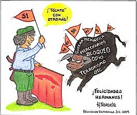

# Послания пяти кубинских героев из тюрем США

**2010-01-01** Автор неизвестен

Горячие поздравления Фиделю, Раулю и всему нашему народу в 51 годовщину триумфа революции!

Десятистишие от имени Пятерки:

**Со свободою, со славой

Мой героический народ поет

Наша великая победа поднимает

Гимн единства

История нашего избавления, 

история, в которой зарождается будущее, - 

это источник, из которого

льется крик сердца:

Да здравствует Революция!

Да здравствует независимая Куба!**

В 2010 году желаем вам успехов в решении славных и достойных задач нашего социалистического строительства.

Мы победим.

С пламенным революционным приветом,

Антонио Герреро Родригес.

27 декабря 2009

*Карикатура выполнена Герардо Эрнандесом Нордело*

Из своих тюремных камер в сердце империи, в которых никогда не родится малодушная жалоба, мы радуемся вместе с Родиной.

Дорогие дочери и сыновья нашей достойной уважения и восхищения Родины!

С радостью и гордостью мы встречаем Новый год, а вместе с ним и новую годовщину революции, которая отвоевала для нашего народа свободу, вовлекла его в настоящую политическую деятельность, создала новые формы человеческих отношений, солидарную культуру, общество, способное дать рациональные ответы на глобальные вызовы нашего времени.

Спустя полвека после революции можно было надеяться, что империя будет элементарно уважать суверенное решение нашего народа, но все указывает на то, что доктрина Монро, которая явилась краеугольным камнем ее возникновения, окажется и последним окопом ее обороны перед тем как ей предстоит исчезнуть. Они действуют старыми методами. Они продолжают разговаривать с народами в духе традиционной концепции «кнута и пряника». В законодательных органах этого самого мощного в истории правительства прислушиваются к голосам людей, равнодушных к понятиям честности и порядочности, перед примитивностью которых бледнеет бесстыдство Калигулы: все идет в ход, чтобы оправдывать преступную политику против Кубы.

В сегодняшней ситуации невозможно сказать однозначно, отступит ли молодой и перспективный президент, избранный полным надежд большинством, перед крикливым реакционным меньшинством, которое отказывается его признавать. Для нас открылись бы тогда под красивой оберткой все те же ужасные замыслы. Вся надежда на чистоту и бесхитростность кубинцев, которая не поддается страху или лжи, и которой чужды раздоры и жадность.

Пятьдесят один год для Революции – это достаточно большой срок. Самое время проанализировать результаты, построить новые планы и продолжать идти вперед. Из наших одиночных камер в самом сердце империи, которые никогда не принудят нас к беспомощным стенаниям, мы присоединяемся к радости нашей Родины; мы призываем наш народ к стойкости, твердости позиции, призываем быть бдительными; и желаем успеха в борьбе за защиту, улучшение и за дальнейшее строительство нашего социализма.

Рене Гонсалес Сехверерт

Пусть свобода скорее объединит нас!

Дорогой наш народ!

Этот год был отмечен продвижением вперед и многочисленными победами вопреки преступной американской блокаде и всемирному экономическому кризису. В очередной раз подтвердилось, что неразрывное единство – это ключ к победе во всякой борьбе. Желаем всем успехов!

Что касается нашего дела, то та маленькая победа была результатом великой силы солидарности всех кубинцев и множества братьев и сестер со всего мира. Сейчас же мы должны объединить свои усилия для борьбы за нашего дорогого Герардо, для будущих юридических и политических боев. Мы уверены, что с этой поддержкой мы еще раз победим! ¡Venceremos!

Передаем горячий привет от всей Пятерки нашему Команданте, вождю во всех наших битвах.

А также желаем каждому из вас, чтобы будущий год был процветающим и полным побед, и чтобы свобода скорее объединила нас. Для счастья Родины и всего человечества.

Да здравствует 51-я годовщина нашей Революции!

Счастливого 2010 года!

Рамон Лабаньино Саласар

18 декабря 2009, 7:56

F.D.C. Miami. piso 10 East.

Miami, Florida. E.U.

[ Статья из газеты «Granma Internacional» ](http://www.granma.cu/espanol/2009/diciembre/juev31/mensajes.html)

Перевод с испанского выполнен редакцией сайта [http://propaganda-journal.net/](/index.html)