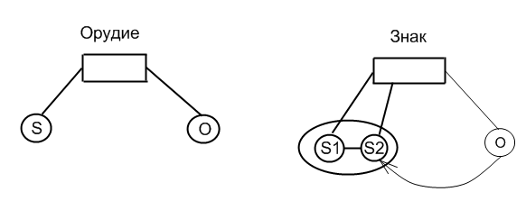

# Когнитивные стили?! Неужели всё так плохо... Часть 4: Сознание - не самосознание ли?

**2010-01-12** Анна Кошевая

*Окончание. Начало: [Ч.1](/1765.md), [Ч.2](/1773.md), [Ч.3](/1789.md)*

Э.В.Ильенков раскрывает механизм человеческого сознания при помощи анализа *художественного отражения* (которое отнюдь не есть аналогия, подобие, сходство различных сущностей, напротив - художественное отражение это *одна из форм* сознательного отражения, его вид): «Живописец, как известно, ставит перед собой и модель, и холст на подрамнике, а затем начинает целенаправленно приводить изображение на холсте - к сходству, к соответствию с моделью. Портрет или пейзаж, возникающий на хосте, есть отражение, образ модели. Но это отражение - как и сама модель - находится вне художника, как предмет и продукт его деятельности. Сам он - как субъект деятельности - сравнивает изображение с моделью со стороны, с *третьей позиции*. *И предмет изображения, и изображение предмета противостоят ему как два вне его находящиеся предмета, сравнимые между собой*» [15,глава 1.7].

*Тайна сознания* и состоит в акте выработки сознательного *представления* о вещи (уже само слово «пред-ставление» на многих языках означает «нечто поставленное перед собой, представленное» [15,глава 1.7]). «В *форме речи* человек точно так же *противополагает самому себе своё собственное сознание*, переводит на экран общественного сознания индивидуально воспринятые им впечатления. Выраженные в речи индивидуальные впечатления приобретают такую форму, в какой они становятся сравнимыми с предметом. На этой основе и становится возможной неведомая животному способность критического отношения к собственным впечатлениям. У животного этого нет - оно безотчётно *сливается с образом вещи*, явления, события, отпечатлевшимся в мозгу, в его отражательном аппарате, в системе условных рефлексов» [15,глава 1.7]. И это принципиальной важности факт, позволяющий направить наше исследование именно в сферу специфически человеческого, раскрыть суть вышецитированных слов Выготского о том, что человека принципиально невозможно отличить от животного по одному признаку - взяв за основание интеллект, волю, но лишь - по его отношению к действительности. Более остро данное положение выражает Энгельс: «Нам *общи* с животными *все виды рассудочной деятельности*: индукция, дедукция, следовательно также, *абстрагирование* (родовые понятия у Дидро: четвероногие и двуногие), *анализ* незнакомых предметов (уже разбивание ореха есть начало анализа), *синтез* (в случае хитрых проделок у животных) и, в качестве соединения обоих, *эксперимент* (в случае новых препятствий и при затруднительных положениях). По типу все это методы - стало быть, все признаваемые обычной логикой средства научного исследования - *совершенно одинаковы* у человека и у высших животных. *Только* по степени (по развитию соответствующего метода) они различны. Основные черты метода одинаковы у человека и у животного и приводят к *одинаковым результатам*, поскольку они оперируют или довольствуются только этими элементарными методами». Л.С.Выготский в «Конкретной психологии человека» приводит следующие идеи Басова и Политцера [25] по этому поводу: «Басов: психология *человека **внутри*** животных неверна. Политцер - нет общей формулы психологии животных и человека. Ecce homo!" [4,*1034*]. Э.В.Ильенков, указывая на наличие различных пониманий термина «способность», пишет следующее: «Если вы под «способностью» понимаете реально осуществляемое умение действовать с предметами определённого рода, то ответить на вопрос: «Что такое способность?» - значит обрисовать реальный способ действий человека *по его предметному составу*. Это значит исследовать «способность» именно в тех, и только в тех её инвариантных моментах, которые *никак не зависят от индивидуальных особенностей лиц*, её усваивающих и реализующих» [14]. Ещё более ярче данная идея проступает в теории П.Я.Гальперина[8;9] о поэтапном формировании умственных действий. Этой теорией была «схвачена» сама *суть* отличия (с точки зрения психологии) познавательной деятельности человека от аналогичной «деятельности» животного - это понятие **«ООД»** - ориентировочная основа действия. Сами же умственные действия, навыки и т.д. принципиально *формализуемы*, а следовательно могут «предаваться» в ведение ЭВМ, т.е. унифицированы донельзя. ООД невозможно «сформировать» в компьютере (который и «не нуждается» в ней, поскольку все его «умственные действия» изначально заданы программой - «ООД программиста-человека»). Именно ООД является тем *представлением* (имеющим разные формы: схема, понятие, слово и т.д.), являющим суть сознания человека. Однако более подробно данный момент теории П.Я.Гальперина будет рассмотрен несколько позже.

Речь, слово и является некой картиной (изображением предмета), созданной художником в лице обобществившегося человечества как субъекта общественно-исторической деятельности, практики и представленной им вовне как *«объективно существующее общественное сознание»*. Слово - это *«слепок» с предмета* (явления, действия и т.п.), выступающий как средство познания самого предмета, которое (познание индивидом действительности) всегда носит общественный характер. Слепоглухонемые дети через «слово-слепок» «видят» мир (как и нормальный ребёнок, однако в феномене слепоглухонемоты этот момент проступает явно и откровенно). Об этом же пишет и Л.С.Выготский: «Речь не просто сопровождает детское восприятие - она уже с самых ранних этапов начинает принимать в нём активное участие; ребёнок начинает *воспринимать мир не только через свои глаза, но и через свою речь*»[6,*1076*]. Познание действительности человеком везде и всегда носит *общественный характер*, процесс отражения, происходящий в голове человека, является *сознательным* отражением (чем и отличается от процесса отражения, свойственного животному): «... *уже сама способность сосредотачивать **внимание** на определённых сторонах действительности, способность активно рассматривать факты - то есть отражать их **по-человечески** - органически сращена с речью, со способностью выражать впечатления в слове. Без слова, без речи невозможно само сознание, как особого рода деятельность субъекта*. Слова (а следовательно и абстракция) поэтому и оказываются подлинным опосредствующим звеном между неосознанным и осознанным - той призмой, преломляясь сквозь которую чувственные впечатления (физиологически совершенно одни и то же у человека, что и у животного) превращаются в осознанные чувственные впечатления, в представления» [15,глава 1.7].

Однако в самом акте представления (тайне сознания) содержится крайне важный момент, о котором Э.В.Ильенков пишет: «Нетрудно понять, указывали и Фихте, и Шеллинг, что предмет может отпечатлеть свой образ в другом предмете, в частности - в человеческом мозгу. Трудно понять другое - как и почему человеческий мозг приобретает способность различить себя от этого образа, противопоставить его самому себе и *тем самым* обрести ***сразу** и сознание предмета и сознание себя самого*, образ своего собственного действия, - «самосознание»» [15,глава 1.7]. Т.е. противопоставление влечёт за собой моментальное, в одном акте осуществляющееся, сознание противопоставляемых «объектов» и (что самое потрясающее) самого акта противопоставления. Именно в этом, неимоверно сложном механизме сознания коренится искомое нами *отличие человека от животного*.

**Структура знаковой операции как деятельности в «идеальном плане»**

Выявив механизм человеческого сознания, мы вновь можем обратится к учению Выготского о ВПФ, а именно к структуре инструментальной операции (которая является специфически человеческим «завоеванием» - овладение им своей психикой).

*(рис. Л.С.Выготского)*

Основное отличие орудия от знака в том, что орудие направлено «вовне», на изменение самого объекта деятельности человека; знак же наоборот - направлен «внутрь», на овладение человеком своим поведением. «*Орудие* служит проводником воздействий человека на объект его деятельности, оно направлено вовне, оно должно вызвать те или иные изменения в объекте, оно есть средство внешней деятельности человека, направленной на покорение природы. *Знак* ничего не изменяет в объекте психологической операции, он есть средство психологического воздействия на поведение - чужое или своё, средство внутренней деятельности, направленной на овладение самим человеком; знак направлен внутрь. Обе деятельности столь различны, что и природа применяемых средств не может быть одной и той же в обоих случаях»[3,297]. То есть, по сути, знак есть орудие овладения психикой, в которой *субъект* воздействия и *объект*, испытывающий это воздействие, *слиты воедино*. Это значит, что объектом влияния есть сам субъект, оказывающий данное влияние, т.е. индивид как бы *раздваивается* и совмещает в себе две противоположные функции: субъект воздействия (S1) и объект воздействия (S2), то есть результат интериоризации общественных отношений (роли «шеф-подчинённый»), или - *социальной стимуляции*. Овладение индивидом своей психикой, осуществляющееся в знаково-опосредованной деятельности, является **автостимуляцией**, которую Выготский Л.С. рассматривал как «частный случай (чрезвычайно своеобразный) социальной стимуляции»[4,*1026*].

Сама структура автостимуляции не просто похожа на механизм сознания, но есть одно из его проявлений, «воплощений». Однако необходимо доказать именно то, что это не есть аналогия, чисто внешнее сходство двух совершенно различных, рядоположных сущностей, поскольку одно лишь постулирование их сходства в состоянии показать именно аналогию, но не суть проступившего сходства. С этой целью мы обратимся к рассмотрению ситуации завязывания человеком «узелка на память».

Суть происходящего в данной ситуации сводится к следующему. Человек имеет конкретную задачу - запомнить определённый объект (послание, набор слов и т.д.), характеристики которого (объём сообщения и т.п.) превышают возможности естественной («натуральной») памяти человека, создавая тем самым ситуацию затруднения, невозможности выполнения человеком стоящей перед ним задачи. С целью преодоления возникшего затруднения, человек «вынужден» прибегнуть к опосредованному разрешению задачи, которым является искусственное введение человеком стимула-средства в данную ситуацию, вдвигание знака между собой (своей памятью) и объектом запоминания. В данном случае знак («узелок») и на самом деле находится вне человека (как и объект запоминания), противостоя ему во всей своей вещественности. Однако интериоризируясь, входя во «внутренний» план, знак *не сливается* с субъектом запоминания, а по прежнему *противостоит ему* как нечто отдельное, сохраняя за субъектом его *«третью позицию»*. Но оба случая (знак «вовне» и знак «внутри») есть деятельность индивида в **«плане идеального»**, представляя лишь различные этапы генезиса этой деятельности. В чём заключается отличие «просто» узелка от узелка-знака?[^1]. Что происходит с «просто» узелком после «втягивания» его человеком в процесс деятельности по овладению своим поведением, когда узелок становится *средством*, а сам человек *раздваивается[^2]* на объект и субъект овладения? А происходит здесь то, что в этом переходе, осуществляемом в человеческой деятельности, возникает «идеальное».

«Просто» узелок существует *«реально»*, во всей своей вещественно-телесной специфике, свойственной иметь узелку и именно данному узелку в силу его «единичности». Наряду с ним существует такой же вещественно-телесный предмет («вещь»), никоим образом не схожий с вещественной спецификой узелка, представляя совершенно отличную от него «материальную сущность». Т.е. мы имеем две качественно отличные «вещи» во всей их вещественно-телесной специфике. Возникает вполне закономерный вопрос: каким же тогда образом возникает ситуация, когда *одна «вещь» (узелок) становится представителем другой «вещи», совершенно отличной от первой и никоим образом не сводящейся к ней*? Ещё более остро данное противоречие выступает, если мы учтём то существенное обстоятельство, что узелок, по прежнему оставаясь именно узелком во всей своей вещественности, «узелковости», выражает отнюдь не одну лишь эту «вещь» (данный конкретный объект запоминания), но принципиально могущий «значить» любые другие «вещи», тем самым отождествляя их в себе, уравнивая их собою. Откуда же произрастает подобное «всемогущество» довольно «скромного» узелка? Совершенно очевидно, что не из «природных качеств» (вещественности, «генетического кода «узелковости» » и т.п.). Также очевидно, что вне человека, втягивающего узелок в свою деятельность, это его «свойство» (быть символом, знаком *иного*, такого же материального тела как и он сам, но совершенно отличного от него) никогда бы и не возникло, не «проявилось», и именно потому, что «проявляться» здесь нечему, это «свойство» имеет *принципиально иную «природу»*. Однако можно впасть в иную крайность и приписать исключительно человеку, его психике, сознанию единичного индивида возможность *порождать* это «свойство» в окружающих его предметах. И мы вновь ошибёмся, поскольку в этом случае окажется что данное «свойство» является *сугубо субъективным феноменом*, возникающим и существующим лишь в сознании отдельного индивида (или многократно повторённой индивидуальной психике, что, по сути, одно и то же, поскольку не выходит за рамки изначально совершённой ошибки, а именно *отождествления* *«идеального»* (чем и является рассматриваемое «свойство») с *психикой,* даже если учесть что это специфически человеческая психика - проблема не решается, и с этих позиций принципиально неразрешима). Узелок как знак обладает свойством *идеальности*, и существует он как таковой уже не в «узелковости» своей (хотя и в ней также), но качественно иначе - в сфере знаково-опосредованной деятельности человека, где он становится символом, выражающим сущность иного предмета и представляющим собой эту сущность, совершенно чуждую его «узелковой» природе, никоим образом в нём не содержащуюся.

В чём заключается корень проблемы *«идеальности»*? Что означает *существовать «идеально»*? И как необходимо сформулировать саму проблему идеального, в какой форме необходимо представить данную проблему, чтобы уже в такой её постановке коренилась возможность ответа, её разрешения? Ильенков Э.В. в статье «Диалектика идеального» пишет следующее: «Пока же вопрос об отношении «идеального» к «реальному» понимается **узкопсихологически**, как вопрос об *отношении идеальной души с её состояниями «ко всему остальному»*, он попросту не может быть даже правильно и чётко поставлен, не то что решён. Дело в том, что в разряд этого «всего остального» - то бишь материального, реального, - автоматически попадает уже *другая «такая же отдельная «душа»*, тем более - вся совокупность таких «душ», организованная в некоторую единую духовную формацию, - *духовная культура* данного народа, государства или целой эпохи, ни в коем случае, даже в пределе, не могущая быть понятой в качестве многократно повторённой «отдельной души»... К тому же каждой отдельной душе уже другая такая же душа никогда и никоим образом непосредственно - как «идеальное» - и не дана, она противостоит ей лишь в виде совокупности своих осязаемо-телесных, непосредственно-материальных проявлений - хотя бы в виде жестов, мимики, слов или поступков, или - в наше время - ещё и рисунков осциллограмм, графически изображающих электрохимическую активность мозга. Но ведь это уже не «идеальное», а его внешнее телесное выражение, проявление, так сказать, «проекция» на материю, - нечто «материальное». А собственно идеальное, согласно этому представлению, наличествует, как таковое, лишь в *интроспекции*, лишь в самонаблюдении «отдельной души», лишь как *интимное психическое состояние одной-единственной - и именно «моей» - личности*. Потому-то для эмпиризма вообще роковой и принципиально неразрешимой оказывается уже пресловутая проблема *«другого Я»* - «а есть ли оно вообще?» [16]. Отсюда ясно, что проводя грань между *«идеальным»* и *«реальным»* по контуру физического тела единичного «Я», т.е. на узкой базе отношений «индивидуальной души» «ко всему остальному», мы тем самым обрекаем себя на тупики **солипсизма**. Для того чтобы понять саму суть «идеального», необходимо выйти за рамки узкопсихологической постановки вопроса, в которой «идеальное» неизбежно превращается в *лишь «субъективное»*, лишь иное наименование *психики* (человеческой или какой-либо другой - сути дела не меняет, так как сама постановка в корне ложна). В истории философии «проблема идеальности всегда была аспектом проблемы **объективности** («истинности») знания» [16]. Подобный выход впервые был осуществлён Платоном, у которого данная проблема предстала в виде отношения всеобщего **«мира идей»** - к **«миру вещей»**, т.е. *идеального вообще* к *материальному вообще*. Однако решение этой проблемы, и именно в такой её постановке, в её действительной постановке (уже намечаемой Гегелем), как пишет Э.В.Ильенков, было найдено Марксом. Именно у него проблема идеального предстала как *сугубо специфичная для общественно-исторической жизнедеятельности человека*, и «под «идеальным» он понимает вовсе *не психическое вообще*, а гораздо более конкретное образование - форму *общественно-человеческой* психики» [16].

Таким образом, мы подходим к существенно важному для нас моменту, а именно - ответу на поставленный нами в самом начале вопрос, который постоянно менял свою форму по ходу всей работы, представая в разных обличиях, чем проявляя различные стороны самой своей сути. Это вопрос о *специфически человеческом в человеке*, который был сформулирован Л.С.Выготским как утверждение - *«Психология гуманизируется»*, однако именно как утверждение оно было преждевременным (и вновь Л.С.Выготский «опередил своё время»), поскольку само это «специфически человеческое» не было выявлено столь явно и откровенно, чтобы стать очевидным фактом.

«Психология гуманизируется» лишь в том случае, когда она изучает **«идеальное»** *как специфически человеческое в человеке*, а не абстрагируется от него (что непременно является следствием «понимания» «идеального» именно узкопсихологически, как индивидуально-своеобразных психических состояний отдельного индивида).

«Ибо в грамотно понимаемую категорию *«идеального»* входят *именно те, и только те, формы отражения, которые специфически отличают человека* и совершенно несвойственны и неведомы никакому животному, даже и обладающему весьма высокоразвитой ВНД и психикой. Именно эти, и только эти, специфические формы отражения окружающего мира человеческой головой философия как наука всегда и рассматривала под названием *«идеальных» форм* психической деятельности, именно ради их отграничения от всех прочих она и сохраняла этот термин» [16].

*Отвлекаясь* в своём исследовании личности *от «идеального»*, мы тем самым оказываемся в ситуации *принципиальной невозможности* решить стоящие перед нами проблемы, поскольку уже изначально *«отсекаем»* в подобном исследовании *самого человека* (т.е. специфически человеческое в нём), и начинаем изучать *абстрактного индивида*, разложенного нами на отдельные составляющие (эмоц. сфера, когнитив. сфера, ментальный опыт и т.п.). И результат получаем той же природы - *«абстрактно-общее»* знание (схемы, теории, «вымышленные конструкты» и т.п.), которое и не в состоянии объяснить «поведение» совершенно конкретного, отдельно взятого индивида, его индивидуально-своеобразную психику (и уж тем более «индивидуальный ум», который индивидуальным не может быть в принципе, а лишь общественно-историческим, и существующим *только в «идеальном»* и *через «идеальное»*, которое отнюдь не есть достояние «индивидуальной души» во всей её субъективно-психической форме, но лишь как *объективно существующее **«субстанциальное содержание эпохи»***, как сказал бы Гегель).

«*Идеальное есть только там, где есть человеческая личность, индивидуальность*. Поэтому дальнейшая разработка проблемы идеального впадает, в частности, *в психологию*, в исследование процесса становления личности и процесса личностного действия в идеальном плане действительности. Философский же план проблемы идеального исчерпывается решением вопроса об общей, общественно-исторической природе идеального, о роли и функции идеального образа в процессе реального, материально-практического преобразования природы общественным человеком и об условиях, внутри которых вообще возможно и существует идеальное, как активная форма деятельности общественно-определённого индивида» [Ильенков:17].

В чём же состоит именно «философский план» проблемы идеального? Сама категория «идеального» имеет несколько существенных, открывающих в ней «коренные» моменты её существования, «проявлений». Одна из них состоит в следующем, сугубо диалектичном определении «идеального», по словам Э.В.Ильенкова: «Это то, чего нет и вместе с тем - есть. Это то, что не существует в виде внешней чувственно воспринимаемой вещи, и вместе с тем существует как деятельная способность человека. Это бытие, которое, однако, равно небытию, или наличное бытие внешней вещи в фазе её *становления* в деятельности субъекта, в виде его внутреннего образа, потребности, побуждения и цели. Именно в этом смысле идеальное бытие вещи и отличается от её реального бытия. Но столь же принципиально оно отличается от тех телесно-вещественных структур мозга и языка, посредством которых эта вещь существует внутри субъекта. От структур мозга и языка идеальный образ предмета принципиально отличается тем, что это - форма *внешнего предмета*, а не форма мозга или языка. От внешнего же предмета идеальный образ отличается тем, что он опредмечен непосредственно не во внешнем веществе природы, а в органическом теле человека и в теле языка, как субъективный образ. Непосредственно идеальное есть, таким образом, *субъективное бытие предмета*, или *«инобытие»* предмета, - *бытие одного предмета в другом и через другое*, как выражал эту ситуацию Гегель» [17].

Однако это лишь один момент идеального, а именно - его принципиальная «неуловимость», существование *только* в процессе *становления* и *никогда* как нечто *ставшее*. Идеальность, будучи представленной в вещи формой общественно-человеческой деятельности, т.е. окристализовавшись, овеществившись, застыв в совершенно определённой телесности своего предмета (напр., стол, ложка и т.п.), вызывает *иллюзию своей ставшести*, материальности (именно существование идеального *в одном и том же* пространстве с материальным является причиной принятия одного за другое - идеальное за материальное). Понимаемое так «идеальное» (как ставшее, *лишь* как опредмеченое, овеществлённое, объективированное) является *крайне односторонним* и порождающим грубые искажения в представлении самого процесса приобщения к этим формам (материальному телу культуры = неорганическое тело человека). Ведь если бы идеальное, как таковое, существовало *лишь в этой своей ставшести*, овеществлённости, то и само понятие «вхождение в культуру» стало бы излишним, поскольку индивид в одном акте «схватывания», лишь бросая свой взор на вещественно-телесный внешний «облик» предмета культуры, «проникался» бы идеей этого предмета, так сказать, не сходя с места, т.е. *не действуя активно* с данным предметом, а *лишь пассивно созерцая* его. Более того само понятие *«образование»* теряет свой смысл, исчезает потребность в нём, поскольку индивид в состоянии *сам* усвоить сущность культуры, поглотить её в акте одномоментного созерцания, т.е. само *общение* испаряется за ненадобностью. К подобной абсурдности приводят попытки поймать, остановить «идеальное» как нечто *ставшее*, что *совершенно чуждо* самой его «природе». А его «природа» есть общественно-человеческая деятельность, которая всегда процесс, прерывно-непрерывное *становление* человеческой сущности. Овеществляясь в предмете труда, становясь его (труда) *результатом* (в силу чего - *ставшим*), идеальное «как бы» покидает его, поскольку сама деятельность покидает свой предмет в его завершённости. Вместе с нею исчезает из этого предмета и само идеальное. В силу чего без *деятельности по «распредмечиванию»* (непременно осуществляющейся *в общении* и *через общение*) идеального оно остаётся недоступным и несуществующим как таковое (напр., для животного, или детей-Маугли, которые *вне* общества никоим образом не могут присвоить (сделать своим достоянием) форму культуры, сталкиваясь с её отдельными объектами и *«не видя»* в них ничего, кроме вещественно-телесной, природной определённости). Данная проблема была поставлена Гегелем и связана со знаменитой проблемой *«отчуждения»*, с вопросом об «опредмечивании» и «распредмечивании», об «обратном присвоении» человеком им же самим созданных предметов, превратившихся в силу каких-то таинственных процессов в мир не только внешних, но и враждебных человеку объективных образований» [16].

Несколько иной момент «идеального» состоит в том, что **«идеальное»** есть «то очень своеобразное и строго фиксируемое *соотношение* между двумя (по крайней мере) материальными объектами (вещами, процессами, событиями, состояниями), внутри которого один материальный объект, оставаясь самим собой, выступает в роли представителя другого объекта, а ещё точнее - *всеобщей природы этого другого объекта*, *всеобщей формы* и *закономерности этого другого объекта*, остающейся инвариантной во всех его изменениях, во всех его эмпирически-очевидных вариациях». Именно в таком понимании «идеального» заключена вся суть происхождения *всеобще-человеческого ума[^3]*, личности.

Какова же верная постановка вопроса? Она проступает именно во введенном Э.В.Ильенковым понимании категории «идеального»: «Несомненно, что «идеальное», понимаемое так - как *всеобщая форма* и *закон существования и изменения* многообразных, эмпирически-чувственно данных человеку явлений, в своём «чистом виде» выявляется и фиксируется только в *исторически сложившихся формах духовной культуры*, в социально значимых формах своего выражения (своего «существования»), а не в виде «мимолётных состояний психики отдельной личности»... Вот эта-то сфера явлений - *коллективно созидаемый людьми мир духовной культуры*, внутри себя организованный и расчленённый мир исторически складывающихся и социально зафиксированных («узаконенных») всеобщих представлений людей о реальном мире, - и *противостоит индивидуальной психике* как некоторый очень особый и своеобразный мир - как *«идеальный мир вообще»*, как *«идеализованный»* мир» [16].

Однако вернёмся к рассматриваемому нами случаю с узелком, который является «прототипом» (первичной, простой формой) автостимуляции (как деятельности по овладению индивидом своей психикой, и как результат - своим поведением). Исходя из вышеприведённого понимания «идеального» вполне резонно задаться вопросом: если «идеальное» есть представление (воплощение, выражение) в одном материальном объекте сущности «другого» (его всеобщей природы) материального объекта, то что же стоит за узелком-знаком*, всеобщую природу чего он в себе несёт*? Однако в самой постановке вопроса уже содержится скрытое утверждение, принятое как несомненное и не требующее доказательств, а именно - что узелок **уже** *несёт в себе выражаемую им сущность этого «другого»*. Ведь может нести, а может и нет. То, что данное сомнение возникает вполне естественно и закономерно, мы можем убедится, сформулировав его следующим образом. Во-первых, в данном случае мы имеем дело с индивидуально осуществляемой деятельностью индивида по овладению своим поведением, т.е. находимся в сфере рассмотрения протекания его *индивидуальной психической деятельности*, в ходе которой он придаёт узелку *совершенно специфическое значение* того конкретного объекта, который он хочет запомнить, и затем воспроизвести при помощи узелка в нужный для данного индивида момент. Отсюда мы можем заключить и «во-вторых»: другому, такому же единичному индивиду, как и первый, *это* значение данного узелка при его «столкновении» с ним будет *неизвестно*, и без разъяснений первого индивида таковым и остается. Из этого следует, что значение, присвоенное узелку первым индивидом, существует лишь как его (этого первого индивида) *субъективно-психический феномен*, и не существует как таковое (как представленность конкретного объекта в данном узелке) для другого индивида. Из чего, в свою очередь, следует что данный узелок-знак не является *объективно* значащим (т.е. обладающим всеобщим и необходимым значением), и приобретаемое им значение зависит лишь от *субъективного произвола* единичного индивида. Следовательно, узелок-знак *не выражает* всеобщей природы представленного в нём «другого» материального объекта и таким образом, не является «идеальным» в вышеизложенном понимании данного термина и есть *лишь «субъективно-психологический феномен»*.

Подобные «сомнения» в подлинной «идеальности» узелка-знака произрастают именно из критикуемого нами *рассудочного* «понимания» **человека** *как отдельно взятого индивида*, как формально-логическая абстракция, «берущая» индивида во всей его единичности и *вне* зависимости от реализующейся через эту единичность *его всеобщей сущности*, а тем самым и на выражающая его как конкретную личность, но лишь как *«абстрактно-общую»*. Однако повод для такого понимания человека был дан нами уже в самой схеме процесса запоминания при помощи узелка. Поэтому «развернув» данную схему более подробно, мы тем самым развеем возникшие сомнения и одновременно с этим ответим на поставленный выше вопрос: всеобщая природа чего ложится «печатью» на узелок, превращая его в знак, символ своего *«идеального бытия»* в бытии его «узелковой телесности»?

Произвольное запоминание, являясь деятельностью человека по овладению им извне своей психикой, как бы *раздваивает* индивида, и в этой своей «раздвоенности» он совмещает *одновременно* две функции - *субъекта*(S) и *объекта* (О) осуществляемого им процесса. *Индивид как субъект*, придавая узелку-знаку определённое значение (или, вернее, денотат, обозначаемый через узелок объект), тем самым, *опосредованно,* через этот узелок, воздействует *на себя как на «другого»*, как на *индивида-объекта*. А сама произвольность, намеренность подобного действия (овладение извне, через знак собой) является в то же самое время и его *осознанностью*.

Данный процесс, осуществляемый на уровне индивида, его индивидуальной психической деятельности, и являющийся актом *автостимуляции*, создаёт *иллюзию изолированности, полной независимости в осуществлении данного акта данным конкретным индивидом*, а следовательно, изначально вынуждает принять возникающую в этом акте «раздвоенность» индивида за его *врождённое свойство* - отделять себя от самого себя, противополагая себя самому себе, и в этом противополагании осознавать противопалагаемые сущности - «Я»-субъект и «Я»-объект. Поддаваться подобной иллюзии - значит становится на *антигенетическую*, сугубо феноменалистскую, отвергающую с порога принцип развития, точку зрения, которая вынуждена признать все специфически человеческие свойства изначально заложенными в индивиде и лишь проявляющимися при вступлении его в определённую деятельность[^4].

Однако уже сама раздвоенность индивида, осуществляющего подобную деятельность, приоткрывает нам тот факт, что изначально она являлась вполне реально существующим социальным отношением между двумя индивидами, выполняющими «закреплённую» за ними роль: один - роль «шефа», а другой - «подчинённого». В этом суть выше цитированных слов Выготского, о том, что *автостимуляция есть частный случай* (причём, чрезвычайно своеобразный, «свёрнутый» в одном индивиде) *социальной стимуляции*; то есть необходимо *за единичностью индивида,* чувственно представшей перед нами во всей своей индивидуально-своеобразной единичности, *«видеть» его общечеловеческую сущность*, приобретаемую им в ходе приобщения к миру духовной культуры, *активно воспроизводя* *её всеобщечеловеческие формы в своей индивидуальной деятельности*, осуществляющейся через взаимоотношение, общение представителей данной культуры между собой? Именно эти отношения **«незримо присутствуют»** в каждом отдельном индивиде, затянутые «пеленой» его единичности, что и было выявлено Л.С.Выготским и легло в основу его культурно-исторической теории в виде закона о появлении ВПФ «на сцене» дважды - сначала в интерпсихическом плане (как реально осуществляемое взаимодействие ребёнка и окружающих его людей), а затем - интериоризируясь - в интрапсихическом плане (как «свёрнутые» «внутренние» социальные отношения). Так Л.С.Выготский пишет, рассматривая сущность знаковой операции: «Таким образом, инструментальная операция есть *всегда социальное* воздействие на себя, при помощи *средств социальной* связи и раскрывается в полной форме социального отношения двух людей ... Стимул не действует на объект операции. Замыкающий и исполнительный механизм - воля - *результат социальных отношений*: приказ, условие («один кричит, другой сражается» - Жане) ... Итак, основа инструментальной операции - *соединение Петра и Павла в одном лице*» [4,*1026*].

Таким образом, мы подошли к выявлению принципиально важного момента в знаково-опосредованной деятельности индивида, который и является искомым ответом на поставленный вопрос. «Развернув» предложенную ранее схему (упрощённую вначале в целях выделения именно момента опосредования и соотнесения его с механизмом сознания) путём *выхода за рамки наличной единичности индивида* и введения, тем самым *генетической* точки зрения на место феноменологической (лишь констатирующей факт опосредования процесса запоминания через введённый самим индивидом знак, однако заходящей в тупик мистификации этого процесса, являющейся результатом изначально принятой *субъективно-психологической* точки зрения на психику индивида), мы выявили ту *«незримо присутствующую»* в каждом проявлении отдельной личности её специфически человеческую сущность.

А именно: будучи некогда реальными, действительными отношениями между людьми, осуществляемые ими непосредственно в процессе их совместной деятельности, данные отношения (ансамбль отношений) вошли (интериоризировались) в качестве *некоего «другого»* в сознание отдельного индивида, представ в нём во всем своём *«идеальном» бытии*, составляя саму его суть, специфически человеческое его бытие.

Т.е. суть ответа состоит в следующем: **узелок являет человеку его сущность**. Именно общественные отношения между людьми есть та *всеобщая природа*, предстающая как *нечто «другое»* в вещественно-телесном бытии узелка, воплощённое в нём как *идеальное бытие этого «другого»*, никоим образом из его «узелковости» не выводимое, а накладывающееся на него *извне* в процессе общественно-исторической деятельности обобществившегося человечества.

Таким образом, мы выявили, что механизм знаковой операции (деятельность в «идеальном плане») принципиально тот же, что и механизм сознания, и не являет собой лишь внешнее сходство.

***_______________***

***Первая часть [Что такое «когнитивный стиль»,](/1765.md) там же общий список литературы***

[^1]: сразу же необходимо оговорить смысл употреблённого нами эпитета «просто»: дело в том, что сам по себе узелок не есть порождение природы, и уже до перехода им в «ранг» знака является продуктом деятельности человека, в силу чего есть овеществлённой человеческой идеей, т.е. по сути это уже «идеальное». Однако нам необходимо отвлечься от этой «изначальной» идеальности узелка в целях раскрытия проводимой (через пример с узелком) идеи. Мы будем рассматривать «просто» узелок как то, чего никогда ещё не касалось рука человека, как *сугубо «природное явление»*

[^2]: троится и т.д. до бесконечности, ведь акт противопоставления человеком самого себя *как субъекта* самому себе *как объекту* является одновременно актом осознания самого акта противопоставления и противопоставляемых сторон («третья позиция»), что в свою очередь, также может стать предметом осознания, превращаясь в бесконечное дление

[^3]: однако для М.А.Холодной «ум» предстал в форме единичного, абстрактного индивида, во всей его индивидуально-своеобразной единичности, а поэтому в принципиально неразрешимой постановке и вынужденному обращению к феномену КС

[^4]: не столь важно кем (чем) заложенные - природой, богом или иными мистическими силами, что есть закономерным результатом подобной *узкопсихологической установки*, о чём говорил А.Н.Леонтьев: «Ошибка состояла в том, что: 1) предмет не был понят как промышленность, т.е. как предмет деятельности человека; 2) обыкновенная практическая деятельность продолжала казаться чем-то, что только внешним образом зависит от сознания, то, чем управляет сознание и только. *Процессы сознания продолжали казаться единственно психологическими. Поэтому сознание осталось мистифицированным*» [22,*39*]