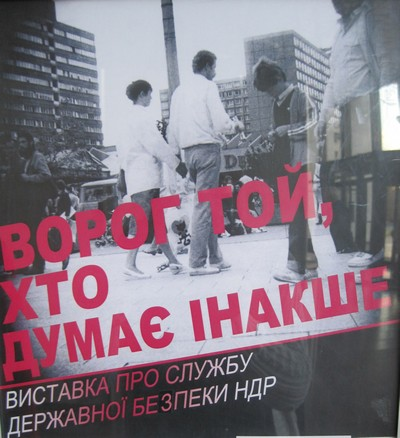

# Враг тот, кто думает по-другому

**2010-09-24** Зиновия Березка

Выставка под таким названием проходит в Киеве в Украинском доме. Посвящена выставка деятельности службы государственной безопасности ГДР и цель ее - показать, как ужасно государство, в котором не поощряется инакомыслие, как такое государство антидемократично и негуманно.

Основу выставки составили биографии 13 «инакомыслящих», пострадавших за свои «демократические» идеи от рук властей ГДР. Стоит заметить, что эта, в сущности, небольшая и ничем особо не примечательная по содержанию выставка, несомненно, обошлась немцам в очень солидную «копеечку» - для каждого «пострадавшего» оформлен особый стенд в виде столика с фотографиями и текстом, выбитым прямо на пластмассе столика и с выдвижной панелью, как для клавиатуры, на которой тоже прямо на пластмассе отпечатаны дополнительные сведения из жизни этого человека. К тому же, практически возле каждого стенда - новейшая аппаратура для озвучивания звуковых записей, прекрасная осветительная техника, а посредине вдоль всего зала - длинный столик с отпечатанными на нем фотографиями событий в ГДР и комментариями к ним. Сразу заметно, что выставка очень компактна и легко собирается. Очевидно, рассчитана на постоянные перевозки.

Во вступительном слове к выставке сказано, что она должна помочь жителям стран, в которых раньше господствовала коммунистическая диктатура, разобраться в «механизмах тирании», понять и оценить «историческое значение открытого демократического общества».

Экскурсовод, которым оказался немец почти классической арийской внешности, разговаривающий, как ни странно, на украинском языке, напоминающем язык канадской украинской диаспоры, полностью соответствовал духу самой выставки - такой же суперсовременный, стильно «оформленный» и деликатный. Он искренне пытался поделиться с посетителями своим неприятием любых «надругательств» над демократическими свободами человека. Это надо было видеть, когда этот двухметровый крепкий амбал подвел нас к стенду, где стояла баночка с желтой тряпочкой и с ужасом и негодованием рассказывал, что вот такие тряпочки, хранящие запахи заключенных, служили для запугивания: заключенному говорилось, что если он и убежит, то собаки все равно найдут его по запаху. «Це ж просто негуманно!», - восклицал здоровенный немец с, видимо, ранимой и нежной душой. Удивительно, почему его не возмущают планы Министерства внутренних дел Германии ввести [обязательную сдачу биометрических данных](/2734.md) при въезде в страну для всех, не только для преступников, а и для тех, кто ничего «плохого» еще не сделал и даже ничем не выявил свое потенциальное «инакомыслие». Почему не возмущает этого решительного поборника демократии и свободы личности тот факт, что самые «развитые» государства мира активно пользуются данными мобильных операторов для определения места нахождения нужного (или ненужного) человека, [данными Интренет-мессенждеров](/210.md) - для отслеживания мыслей людей. Ведь это же грубейшее нарушение основных демократических прав человека, да еще и совершаемое в странах, декларирующих свои демократические принципы!

С таким же деликатным негодованием немец рассказал о том, что о «неугодных» людях распространялись слухи, будто они - сексуальные извращенцы, после чего все переставали с ними общаться; а одна «свободомыслящая» женщина никак не могла найти работу медсестры, потому что служба безопасности не позволяла госпиталям ее нанять. Видно было, что такое вмешательство в личные дела и судьбу людей возмущают и поражают нашего экскурсовода. Как он сказал, первое, что сделали после роспуска Stasi - открыли личные дела, чтобы люди могли узнать, в чем же была причина их неудач и реабилитироваться перед окружающими. Это было очень важно, даже важнее, чем раскрытие дел государственной важности. Забота экскурсовода о судьбе каждого просто поражала.

Но несколько минут позже наш немец высказал идею гораздо более зрелую: конечно, службы разведки и безопасности есть везде, у современной Германии их вон целых три, да и методы все используют одни и те же, но главное - идея, ради которой эти методы применяются. Одно дело - если это идея демократии, другое же - если это идея «тоталитаризма».

Конечно, под тоталитаризмом следует понимать коммунизм.

Итак, вывод из этой выставки сводится к двум утверждениям: коммунизм = тоталитаризм и диктатура, капитализм = демократия и свобода.

Спасибо, дорогие немцы, за просвещение! Правда, эта истина уже добрый десяток лет известна каждому смотрящему телевизор или слушающему радио жителю Украины, но услышать такое из уст иностранца всегда полезно. Как-то больше убеждает. А то у нас уже начинают ностальгировать по советским временам и ругать демократию, срочно нужна энергетическая подпитка! Нужно напомнить нашим гражданам это самое «историческое значение демократического, открытого общества», а то они уже начинают разуверяться в том, что живут почти в раю.

Когда-то, лет где-то 5-6 назад, я бы с полным сочувствием отнеслась к идее выставки и стала бы одной из тех, кому таким образом за 15 гривен (хотя на афише указано, что вход бесплатный) «прокомпостировали» мозги. Но это надо было быть уж очень твердокаменным фанатом, чтобы за последние годы не заметить в мировых событиях прямо-таки бросающихся в глаза фактов, свидетельствующих о том, что демократия - это лишь слово, прикрывающее диктатуру богатых и властных. А если тебе не повезло и ты не попал в их число, то не то, что «думать по-другому», а и просто выжить ты не всегда сможешь. А устроился ты на работу и выживаешь худо-бедно, так думай себе, пожалуйста, что хочешь, а говорить и делать будешь то, что скажет работодатель. А если ты все-таки не способен совладать со своими «другими мыслями» и вздумаешь высказывать мысли, направленные на уничтожение существующего порядка - ты будешь посажен в тюрьму. Но не по каким-то тоталитарным законам, нет, по самым что ни на есть демократическим. Ведь у нас демократия, каждый может думать, что хочет... И так далее.

За примерами действительного отношения «демократических» властей к инакомыслящим долго ходить не надо. Во всем мире нашумело дело так называемой [«Кубинской пятерки»](/2714.md) - пятерых граждан Кубы, раскрывавших на территории США действия террористов и в результате посаженных властями США в тюрьмы - только потому, что их деятельность - во всех смыслах гуманная, так как им удалось, не применив никакого насилия, предотвратить 170 терактов, - расходилась с интересами властей Соединенных Штатов - самой демократической в мире страны, настоящего «законодателя» демократии.

И пока [кубинские ребята уже 12 лет сидят в тюрьмах](/2691.md) самого «демократического» режима, куда к некоторым из них не пускают даже жен и детей, другие наши «демократические» друзья учат нас, что наше советское прошлое - эпоха диктатуры и тоталитаризма. Действительно, лучше жить всю жизнь у родителей на шее, потому что никогда не заработаешь на такую простую человеческую потребность как жилье, лучше питаться глутаминатной колбасой и нитратными овощами, лучше всю жизнь работать на возрастание капитала твоего работодателя, лучше смотреть на бомжей, попрошаек и алкоголиков, валяющихся на улицах (а ведь они когда-то были людьми), на тупую и развращенную молодежь, лучше поддерживать всю систему, порождающую эту физическую и моральную нищету, с одной стороны, и немыслимое богатство - с другой, лучше поддерживать всю эту бесчеловечную систему несправедливости, в которой нет никаких перспектив ни для тебя, ни для твоих детей, ни для одного нормального человека, чем уничтожить все это к чертовой бабушке и построить разумное общество, где каждый человек, независимо от счета в банке, будет действительной ценностью...

И так ли уж безобидны те «инакомыслящие», чьи мысли, будучи воплощенными в действительность, привели к вымиранию миллионов людей (за годы «независимости» население Украины, например, [сократилось с 51,94 до 45,85 млн](http://ru.wikipedia.org/wiki/%D0%9D%D0%B0%D1%81%D0%B5%D0%BB%D0%B5%D0%BD%D0%B8%D0%B5_%D0%A3%D0%BA%D1%80%D0%B0%D0%B8%D0%BD%D1%8B)., то есть на 6 миллионов!), к массовому заробитчанству, к превращению человека в товар, к узакониванию самых диких форм извращений всех человеческих отношений? Стоит ли с таким трепетом волноваться о том, чтобы такие мысли имели право на существование?