# Революция и песня: от Никарагуа до наших дней

**2011-01-07** Василий Пихорович

[«Никарагуа: революция и песня»](/library.php.html) — так называется книга руководителей легендарного ансамбля политической песни [«Гренада»](http://www.agrenada.ru/) Сергея и Татьяны Владимирских, которая была написана еще в конце 80-х годов, но издана только в 2009. Тогда, на пике перестройки, на всех углах ругали советскую цензуру, на всех перекрестках кричали о свободе и гласности. Но факт состоит в том, что тогда эту книгу так и не удалось издать. Видимо, потому, что в ней рассказывалось о борьбе за действительную, а не обманную свободу, за действительные, а не обманные права человека, за право не только выражать свои мысли и чаяния, но и добиваться их воплощения в действительность.

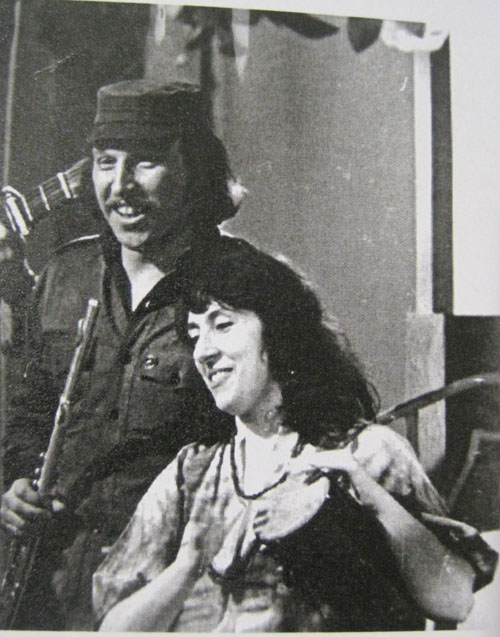

 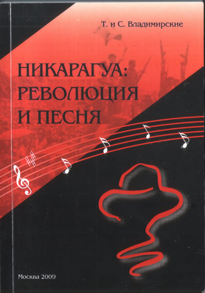

Но рано или поздно эта книга должна была увидеть свет. Точнее, она увидела его не рано и не поздно, а — в самый раз. К тому времени, когда книга была готова к печати, никарагуанская революция уже потерпела поражение. Не на поле боя — в бою — революционеры-сандинисты победили, не смотря на то, что против них боролись неизмеримо большие силы. Фактически, как до прихода к власти, так и после, сандинисты боролись с правительством Соединенных Штатов, которое вооружало, финансировало никарагуанскую контрреволюцию, организовывало ее действия. Фронт национального освобождения имени Сандино победил потому, что за ним стоял весь народ. Но когда сандинисты последовали совету Горбачева и пошли на «честные», «демократические» выборы — они проиграли. Они в принципе не могли победить на выборах, ибо там нужно было соревноваться в беззастенчивой лжи, давать заведомо неисполнимые обещания, возбуждать несбыточные мечты, сеять глупые иллюзии. У буржуазии сотни лет опыта такой работы, в ее распоряжении огромные деньги для рекламы, для подкупа, тысячи специалистов в области политического мошенничества, мастеров по превращению народа в быдло. Если за несколько лет самый читающий, самый образованный в мире народ был превращен в послушный, легко управляемый электорат, другими словами — в стадо баранов, то что уж говорить о Никарагуа, где сандинистское правительство даже не успело закончить кампанию по ликвидации неграмотности, хотя и за то, что было сделано в этой области в те годы, Никарагуа удостоилась специальной премии ЮНЕСКО.

За последние 20 лет очень многое поменялось в мире. Парадоксально, но именно в Латинской Америке отлаженная на протяжении веков электоральная машина обмана начала давать первые сбои, и к власти один за другим стали приходить антиимпериалистические режимы, в том числе победили на выборах и наследники сандинистов.

Снова, как и тогда, когда писалась эта книга, Латинская Америка оказалась в центре борьбы за лучшую жизнь. Поэтому книга эта снова актуальна, возможно, даже более актуальна, чем тогда, когда она была написана, ибо очень многое из того, что в ней написано, тогда было очевидным, а вот сегодня об этом подзабыли, в том числе и в самой Латинской Америке, почему было бы правильно перевести эту книгу и на испанский язык. Тогда было очевидным, что Латинская Америка это — «пылающий континент». Было очевидно, что революция для нее так же органична, как и песня — отсюда и такое красивое название «Никарагуа: революция и песня». В него можно подставлять и названия других стран, и получились бы замечательные книги: «Куба: революция и песня», «Сальвадор: революция и песня» (о движении революционной песни в Сальвадоре очень много написано в этой книге), «Чили: революция и песня» (о движении «Новой песни» в Чили Сергей и Татьяна Владимирские еще раньше написали замечательную [книгу «Новая песня Чили](http://narod.yandex.ru/100.xhtml?f19177191.narod.ru/Novaya_pesnya_Chili.rar)), а также «Мексика: революция и песня» (в книге упоминается и об этом явлении), «Гватемала: революция и песня», «Перу: революция и песня» и т.д. и т.п. Сегодня же многие, столкнувшись с фактом так называемого «левого поворота» в Латинской Америке, объясняют это явление самыми разными способами, забывая однако упомянуть самый главный фактор, обусловивший его: многолетнюю традицию упорной революционной борьбы за свободу и право народов распоряжаться собственной судьбой, которая вошла в кровь и плоть многих поколений латиноамериканцев.

Да, эта борьба редко была успешной. Если даже она и заканчивалась победой, а не очередным кровавым погромом, то победа тут же оказывалась украденной, как это было с победой кубинских мамбисес в их борьбе против испанских колонизаторов, которой воспользовались Соединенные Штаты Америки для того, чтобы на многие десятилетия установить свое господство на острове. А сколько было «кровавых горилл», поставленных у власти спецслужбами США, чтобы те стояли на страже интересов североамериканских корпораций в своих странах?! А вспомните проводившуюся в 70–80-х годах спецслужбами диктаторских режимов под эгидой ЦРУ США на территории многих стран Латинской Америки операцию «Кондор», в результате которой десятки тысяч оппозиционных деятелей, журналистов, дипломатов были похищены, убиты без суда и следствия, «исчезли без вести»!

Но зверства и чудовищная эксплуатация, как правило, достигали результатов, ровно противоположных задуманным: они просто вынуждали людей защищаться, бороться за свою жизнь. Борьба на континенте не прекращалась ни на минуту. Эдуардо Галеано в своей знаменитой книге «Вскрытые вены Латинской Америки» описывая еще один иезуитский способ уничтожения бедняков, который состоял в том, что многочисленные североамериканские миссионеры бесплатно раздавали в городах и селениях Латинской Америки контрацептивные средства, стерилизовали тысячи женщин, заметил, что «в Латинской Америке оказалось более гигиеничным и эффективным убивать партизан в материнской утробе, а не на улицах и в горах». И нужно сказать, что во многом эта кощунственная формула цивилизованных убийц обернулась пророчеством: многие латиноамериканцы становились революционерами еще, так сказать, «в утробе матери».

У некоторых просто не было выбора. Во многих частях Латинской Америки в 70-80-х годах бытовала горькая шутка насчет того, что партизанский отряд — это наиболее безопасное место в их стране. Во-первых, там кормят, в то время как подавляющее большинство бедняков в «нормальных условиях» не в состоянии прокормить ни себя, ни свои семьи, а во-вторых, там дают автомат, а умереть в бою гораздо меньше шансов, чем у себя в деревне или в беднейших кварталах городов пасть от руки бандитов, полицейских, солдат или поддерживаемых правительствами ультраправых.

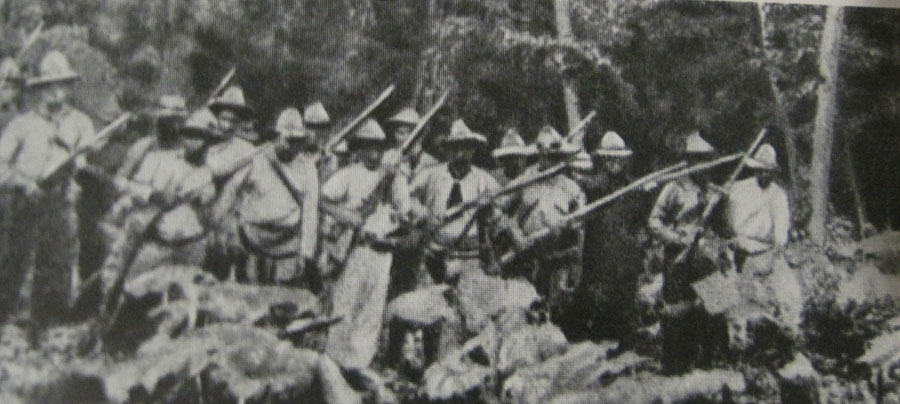

Помнится, после прихода к власти в Чили правительства Народного единства во главе с Сальвадором Альенде многие не слишком радикально настроенные левые начали использовать этот факт как «неопровержимое доказательство» несостоятельности известного марксистского тезиса о невозможности мирного перехода к социализму. Радоваться своему «перевороту в теории марксизма» им, правда, пришлось недолго: генерал Пиночет, вдохновляемый и поддерживаемый ЦРУ США, преподнес незадачливым критикам Маркса весьма наглядный урок того, что нельзя легкомысленно относиться к предупреждениям классиков. В последнее десятилетие примеров «мирного» перехода власти в руки сторонников социализма Латинская Америка дала очень много, но в действительности мирный характер этого «левого поворота» был оплачен десятилетиями самой жестокой борьбы, самых зверских репрессий против революционеров и самой дикой эксплуатации огромных масс населения.

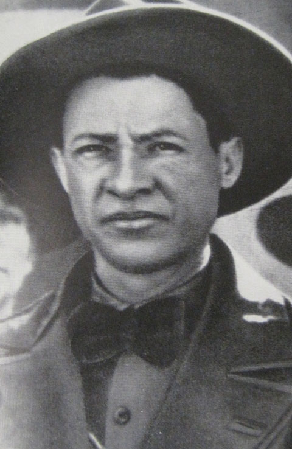

Книга «Никарагуа: революция и песня» охватывает период, когда эта борьба достигла самого высокого накала, и когда она охватила самые широкие массы людей. Маленькая, нищая Никарагуа в своей революции, как в капле воды, отразила всю трагедию континента и всю отчаянную решимость народа добиться лучшей жизни. Не случайно Никарагуанский Фронт национального освобождения (ФСНО) взял себе имя Аугусто Сесара Сандино — «генерала свободных людей», лидера национально-освободительной войны 1927–34 годов против кровавой диктатуры Сомосы и его североамериканских покровителей. Сандино — один из многочисленных латиноамериканских «крестьянских генералов» — служил олицетворением борьбы за достойную человека жизнь, которая не прекращалась на этом континенте более двух столетий, начиная с восстания мексиканских крестьян и индейцев под проводом сельского священника Идальго, знаменитых походов Симона Боливара и Хосе де Сан-Мартина. Но даже эти революции не были первыми. Во многом они явились продолжением непрекращающихся со времен Колумба восстаний индейцев и рабов против своих угнетателей. К примеру, знаменитое государство беглых рабов Палмарис в Бразилии просуществовало более 60 лет и было разгромлено только силами регулярной португальской армии. Восстание индейцев Перу под руководством Тупак Амару (1780–1783) практически непосредственно предшествовало по времени началу негритянской революции на Гаити 1791–1803 годов, в результате которой эта страна первой в Латинской Америке получила независимость.

Некоторые исследователи говорят, что все эти революции и восстания были «неправильными», что нередко их вожди звали назад к восстановлению патриархальных порядков и тем самым были препятствием на пути прогресса. Кто бы спорил! Откуда было знать неграмотным индейцам и неграм-рабам, как правильно делать революции. Но в отличие от современных «шибко грамотных» европейцев, покорно вымирающих в сытости и довольстве, латиноамериканцы нередко предпочитали смерть даже относительно сытому рабскому прозябанию. Впрочем, такой выбор был только у очень немногих: большинству приходилось выбирать между смертью в бою и смертью от голода или болезней, порождаемых нищетой и бесправием.

«Не по правилам» происходила и революция в Никарагуа в 70-е годы ХХ ст. Не было здесь, как положено для «нормальных» социалистических революций, ни развитой промышленности с организованным в профсоюзы пролетариатом, ни, тем более, политического авангарда этого самого пролетариата в виде крепкой коммунистической партии, вооруженной передовой теорией. Мало того, если здание правительства, телеграф, мосты, которые, как известно, революционерам нужно захватывать в первую очередь, были, то вокзал не функционировал по причине того, что после разрушительного землетрясения 1972 года железные дороги так и не восстановили (в 1992 году сменившее сандинистов либеральное правительство ликвидировало их окончательно). Да и с коммунистической партией сандинистам не очень повезло — исполняющая ее роль Никарагуанская социалистическая партия не поддерживала их движение, и даже после победы революции, когда произошел раскол НСП, только одна из трех получившихся в его результате частей стала на сторону революционного правительства.

Немалую роль в никарагуанской революции сыграли католические священники: сторонники «теологии освобождения». Вопреки официальной позиции Ватикана, неизменно выступавшего на стороне проамериканского кровавого режима клана Сомосы, сторонники теологии освобождения часто выступали против диктатуры, отстаивая права крестьян, за что подвергались зверским репрессиям со стороны правительства. Были случаи, когда солдаты расстреливали таких проповедников в храмах во время проповедей вместе с прихожанами. Но результатом преследований стало то, что «теология освобождения» находила все новых и новых сторонников в среде никарагуанского духовенства. Дело закончилось тем, что никарагуанский епископат опубликовал воззвание к верующим, в котором провозгласил их право отвечать насилием на насилие со стороны властей, то есть фактически поддержал вооруженную борьбу против диктатуры.

Поэтому, когда в 1962 году радикально настроенные студенты-эмигранты, образовавшие «Фронт национального освобождения», впервые проникли в страну и начали вооруженную борьбу против диктатуры, она встретила поддержку среди самых широких слоев населения. Удары партизан были, как правило, редкими, но меткими. Это были захваты иностранных банков с целью экспроприации денег на цели борьбы, захваты высокопоставленных правительственных чиновников для обмена на попавших в тюрьму товарищей. К примеру, в 1974 году был захвачен дом министра сельского хозяйства, когда там находилось очень много гостей из числа высших функционеров режима. Все они были захвачены и обменены на заключенных-сандинистов. А 22 августа 1978 отряд повстанцев и вовсе захватил здание президентского дворца с тремя сотнями депутатов и кузеном диктатора в придачу. За них тоже взяли большой денежный выкуп и обменяли на 87 арестованных сандинистов.

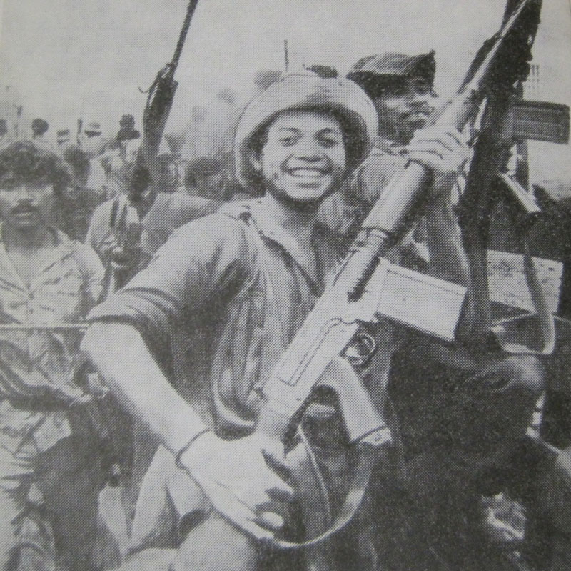

Уже в начале следующего года в стране началось вооруженное восстание, сигналом к которому послужило убийство гвардейцами диктатора главного редактора одной из оппозиционных газет Педро Хоакина Чаморро (по иронии истории, именно его жена Виолетта Чаморро выиграет выборы у сандинистов и возглавит проамериканское правительство).

Последний из клана никарагуанских диктаторов Анастасио Сомоса Дебайле слезно умолял своих североамериканских покровителей вмешаться и бросить на подавление восстания войска, но те так и не решились это сделать, видимо, помня, как в 1933 году им уже однажды пришлось выводить свои войска из Никарагуа, потерпев неудачу в борьбе с партизанской армией Сандино. Диктатор, нагрузив «Боинг» мешками с награбленными деньгами и драгоценностями, а также прихватив родственников, включая выкопанные по его приказу останки своих предшественников, улетел в США.

Как дорого далась эта победа сандинистам! Из 8 человек, основавших Сандинистский фронт национального освобождения (СФНО), в живых остался один — Томас Борхе Мартинес. Но диктатура Сомосы обходилась никарагуанскому народу куда дороже. Известный российский публицист Александр Тарасов в своей статье [«Между вулканами и партизанами»](http://scepsis.ru/library/id_971.html) приводит следующий расчет:

«С 1909 и по 1932 год (когда кончилась оккупация) правительственными войсками и янки было уничтожено 170 тысяч человек, с 1933 и по 1956 год (когда Ригоберто Лопес казнил Сомосу-старшего) жертвами правительственного террора стало еще 150 тысяч, с 1956 по 1967 (при Луисе) — 90 тысяч, с 1967 по 1979 (при Сомосе-младшем) — еще 180. Это только жертвы прямых репрессий, не считая умерших от голода, нищеты, болезней... Чтобы понять, какие это безумные цифры, надо вспомнить, что Никарагуа — страна крошечная, в 1940 году все население составляло 800 тысяч, в 1960-м — полтора миллиона, в 1975-м — 2 миллиона 400 тысяч. К концу владычества семьи Сомоса численность населения страны упала почти на 300 тысяч человек!

Если экстраполировать масштаб расправ на Россию, это выглядело бы так: с 1909 по 1932 год в России правительство должно было бы уничтожить почти 50 миллионов человек; с 1933 по 1956 — еще 25 миллионов; с 1956 по 1967 — 12 с лишним миллионов; с 1967 по 1979 — еще свыше 23 миллионов! Итого: 110 миллионов (а все население России сейчас — меньше 155 миллионов)».

Несмотря на то, что уже через год после бегства из страны заочный смертный приговор никарагуанского суда обосновавшемуся на территории Парагвая Сомосе был приведен в исполнение группой партизан, силы контрреволюции вовсе не собирались мириться с победой сандинистов. Ведь, в конце концов, Сомоса был только марионеткой в руках правительства США. Теперь, после бесславного конца марионетки, североамериканским кукловодам пришлось самим браться за грязную работу. Из числа бывших сомосовцев спеслужбы США начали вербовать отряды так называемых «контрас», попросту говоря, бандитов, которые устраивали бы диверсии, грабили, убивали мирных жителей, не давали революционному правительству налаживать новую жизнь. Способ финансирования этих банд тоже был избран бандитский. По распоряжению заместителя государственного секретаря США Элиота Абрамса никарагуанских контрас спецслужбы снабжали оружием вопреки прямому запрету конгресса США. Мало того, для финансирования этих операций использовались деньги от специально организованных для этой цели операций по поставкам оружия Ирану, на которые в это время существовало эмбарго, поскольку Иран считался врагом США.

Отряды «контрас» тренировались на территории соседнего Гондураса, оттуда забрасывались в Никарагуа, туда же они уходили от ударов сандинистов. Бандами были убиты тысячи людей, совершено сотни диверсий на дорогах, электростанциях, линиях электропередач. Крестьяне вынуждены были работать с автоматами за плечами.

Казалось, о каких песнях может идти речь в таких условиях? Но, тем не менее, песня сопровождала никарагуанскую революцию от начала до конца. Как до ее победы, так и после.

Сергей и Татьяна Владимирские наглядно доказывают в своей книге, что «Новая песня» Никарагуа — это одновременно и уникальное, и такое характерное для Латинской Америки музыкальное явление — родилась вместе с никарагуанской революцией и даже немножечко раньше — она имеет преемственную связь с другими латиноамериканскими революциями. Боевым гимном армии Аугусто Сандино стала популярная в отрядах бойцов мексиканской революции 1910–1917 годов «Аделита». Весьма характерно, что в своей «прежней жизни» это была весьма наивная солдатская песенка о девушке, которая, не желая расстаться со своим милым, последовала за ним на войну. Но в устах революционеров она стала грозным оружием. В то же время никарагуанская революция родила массу своих собственных песен. Пример некоторых из них приводят авторы книги в собственном переводе:

Две тысячи солдат и двести самолетов

Прислали против нас, чтоб Чинандегу сжечь,

Сгореть бы от стыда проклятым гринго этим,

А нет, так ждет их смерть там, на холме Чипоте.

... Взгляни — потух их взгляд, едва плетутся что-то,

И на коня не влезть проклятым гринго этим!

Огнем Сандино встретил — и катятся назад!

Мы знаем: ждет их смерть — там, на холме Чипоте!

Эта народная песня называется «Генералу Сандино». Указав на то, что в тесте нет ничего похожего на прославление вождя, как, например, в очень популярной песне «Бессмертный Сандино», авторы книги высказывают весьма интересное предположение, что это просто песня-доклад командующему о событиях в Чинандеге. И это предположение вовсе не лишено основания. Безымянные коплеро — авторы никарагуанских революционных песен — нередко умудрялись вместить в своих незамысловатых произведениях не просто рассказы об отдельных эпизодах революционной войны, но и показать целые периоды в развитии революции с изложением и критикой политических программ участвующих в ней партий и деятелей, как, к примеру, это сделано в песне «Наши бокалы сдвинем», где твердая и последовательная политика Сандино противопоставляется соглашательской линии лидера Либеральной партии Хуана Сакасы и предателя никараганской революции генерала Монкады. Не песня, а музыкальная политинформация. И это не ирония. В условиях, когда подавляющее большинство населения страны было неграмотным, нужны были именно такие песни.

Все это, так сказать, предыстория «Новой песни» Никарагуа. Ее история начинается в первой половине 70-х годов. И по своему боевому назначению, и по содержанию эти песни являются прямым продолжением песен армии Сандино. Отличаются они, в первую очередь, тем, что, если старые революционные песни слагались, как правило, на мелодии уже существующих популярных песен, то «Новая песня» Никарагуа получает собственную музыкальную основу. Новое музыкальное направление было разработано такими композиторами как Тино Лопес Герра, Виктор Мануэль Лейва, Карлос Рамон де Риос, Хусто Сантос, Фермин Клиар, Камило Сапата, Карлос Бермудес. Именно их считают своими вдохновителями авторы «Новой песни». Суть творчества этих композиторов состояла в том, что они, в противовес модной американской «попсе», «разрабатывали в музыке направление, тесно связанное с народными корнями».

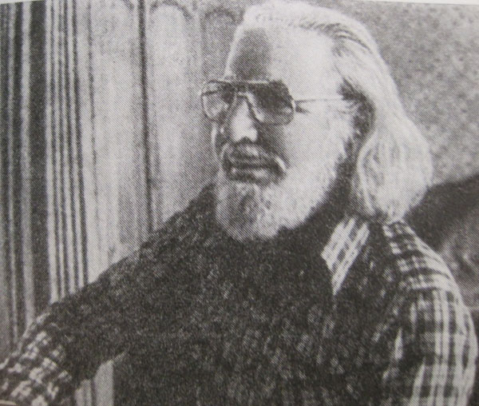

Да и поэзия «Новой песни» теперь не обязательно любительская. Иногда даже наоборот. К примеру, нередко за основу своих песен представители этого направления охотно брали слова известного никарагуанского поэта Эрнесто Карденаля (кроме всего прочего, он был одним из тех католических священников, сторонников теологии освобождения, которые восприняли дело революции как свое кровное дело) приспосабливая их к песенному ритму, иногда добавляя от себя целые строфы.

Как и сорок лет перед этим, в годы борьбы Сандино, эти песни открывают глаза людям. Количество неграмотных в стране вряд ли намного сократилось по сравнению с временами Сандино: когда сандинисты взяли власть, в стране было 60% не умеющих читать и писать. Но и те, кто имел образование, в условиях бешеной антикоммунистической истерии (а в Никарагуа даже песни группы Bonеy M считались «коммунистической пропагандой» и были запрещены) в политическом отношении часто были так же безграмотны, как и не умеющие читать и писать индейцы. Поэтому, как и песни 20-х годов, «Новая песня» простым и доступным языком несет народу правду о его истории, зовет к борьбе за новую жизнь, как, например, вот эта песня, созданная по мотивам поэмы Эрнесто Карденаля «Час ноль»:

Тебя называли бандитом

Папа-Сомоса с сыном.

Но в банках счета имели

Они, а не ты, Сандино.

На банкетах американских

Монкада тебя позорил,

А вы в лагерях партизанских

Мечтали о горстке соли...

Ты дом и надел свой продал,

Чтоб нам быть свободными вечно,

Сомоса же продал Родину,

Чтоб свою семью обеспечить.

Ты не был похож на солдата.

Ты был похож на поэта,

Что вынужден стать солдатом,

но остался собой при этом.

Быть может, ты не был ученым,

Ученее был Монкада,

Ты школу лесов окончил

И побеждал, как надо!

Сомоса полностью контролировал все средства массовой информации, и не могло даже речи идти о том, чтобы доброе слово о Сандино или сандинистах проникло в печать, в радио- или телеэфир. Достаточно сказать, что впервые правдивая информация о фронте национального освобождения имени Сандино появилась в прессе Никарагуа только в 1976 году, спустя 15 лет после его появления, исключительно в связи с процессом над одним из его основателей Томасом Борхе (его книгу о революции в Никарагуа читайте [здесь](http://scepsis.ru/library/id_2507.html)), который использовал трибуну суда для того, чтобы поведать народу о целях организации и ее борьбе. За возможность обратиться к народу он заплатил девятью месяцами пыток, которым его подвергали до суда. Слова из его речи даже вошли в текст гимна СФНО, написанного одним из основателей «Новой песни» Карлосом Мехийя Годоем. В условиях сомосовской диктатуры песня становилась едва ли не единственным «средством массовой информации» революционеров, но это средство оказалось очень и очень эффективным. Руководство сандинистского движения очень быстро обнаружило, что песня — это сильнейшее пропагандистское оружие и постаралось использовать это обстоятельство по-максимуму. Нередко музыканты-сандинисты выполняли не только функции пропагандистов и агитаторов, но и обеспечивали движение деньгами, необходимыми для покупки оружия, снаряжения и продовольствия для бойцов партизанских отрядов.

Татьяна и Сергей Владимирские, описывая гастроли никарагуанского ансамбля «Лос де Палакагуина» по странам Западной Европы, совершенно справедливо употребляют слова, которые больше подошли бы для описания партизанского рейда по тылам врага. Это и был своеобразный партизанский рейд. Сам ансамбль был создан по решению сандинистского руководства. Его название «Мы из Палакагуины» для никарагуанского уха звучало вызовом. Палакагуина — это название одной из самых известных партизанских деревень в Никаргуа, которая представляет собой символ партизанской войны против диктатуры. Успех ансамбля превзошел все ожидания организаторов этой операции. «Лос де Палакагуина» покорил не только Испанию, где он был признан лучшим зарубежным коллективом года, но и Австрию, Францию, Голландию, ФРГ, Италию. Один за другим начали появляться диски с их песнями, тиражи которых быстро распродавались, а деньги от продаж, как и львиная доля гонораров за концерты, аккуратно поступали в кассу СФНЛ.

Дальше — больше. Руководители ансамбля решили не ограничиваться выполнением непосредственной задачи — добывания денег для движения. На одной из пластинок, выпущенной одной из крупнейших звукозаписывающих корпораций Си-Би-Эс, по просьбе ансамбля художник изобразил черно-красное знамя СФНЛ. В этот диск, который был назван «Наши новые посевы», вошли песни, многие из которых служили своеобразными «паролями» для революционеров Центральной Америки, хотя их настоящий смысл был абсолютно непонятен европейскому обывателю. Это были песни по типу нашей «Катюши» или итальянской «Белла Чао».

Вот слова одной из них, носящей романтическое название «Цветок сосны»:

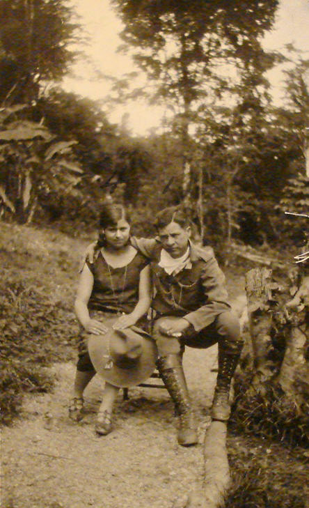

Моя любимая девочка

Дорогой мой далекий дружок!

Эта сосновая веточка —

Нашей любви цветок!

Она проста — ну и что же?

Здесь нету других цветов.

Зато завянуть не сможет.

Она, как и наша любовь!

Ее тебе издалека

Друг привезет сквозь дожди.

Не думай, что ты одинока,

Помни меня и жди!

Цветок наших сосен душистых

Вручат тебе, Исабель,

как прекрасной телеграфистке

Из поселка Сан-Рафаэль.

Ключ к расшифровке «пароля» крылся в последних строчках песни. «Прекрасная телеграфистка из поселка Сан-Рафаэль» — это Бланка Араус, возлюбленная и жена Аугусто Сандино. Ее любовь и преданность делу освобождения народа стали народной легендой.

Женщины вообще играли выдающуюся роль в никарагуанской революции. Слова героини партизанской борьбы Дорис Тихерино: «Нет женщин-участниц борьбы, есть участники борьбы, являющиеся женщинами»,— стали одним из лозунгов революции.

Карлос Мехийя Годой написал песню «Боец-сандинистка»:

Боец с улыбкой невинной,

Тебя воспеваю вновь.

В стволе твоего карабина -

пули, стихи, любовь.

Несешь ты солнце свободы

И славу твоей отчизне.

Я твой воспеваю подвиг,

Женщина — древо жизни!

А одна из таких партизанок-сандинисток — Арлен Сиу — стала еще и ярчайшей представительницей «Новой песни». Ее называли «гитарой и винтовкой никарагуанского народа». Девушка погибла в бою с войсками диктатора.

Вот строки из ее песни «Сельская Мария»:

Слезы и неудачи —

Путь твой тяжкий и длинный.

Любишь ты или плачешь —

В сердце тоска да глина.

Сельская дева Мария!

Мать и людей, и поля!

Ты по дорогам длинным

Скорбно проносишь горе.

Религиозные мотивы вообще нередки в «Новой песне». В 1975 году Карлос Мехийя Годой создает крупное музыкальное произведение, которое получило название «Никарагуанская крестьянская месса». Вот несколько строк из нее:

Ты — бог не богатых, а бедных,

Простого, скромного люда.

Как мы, под солнцем и ветром

трудишься ты повсюду.

Поэтому верю я,

И бедный народ мой верит,

Тебе открываем двери,

Брат всех трудящихся — Бог!

Плечом к плечу идешь ты с народом,

Борешься в поле и в городах,

В лагере нашем, где взвод за взводом,

Ты в карауле стоишь на часах.

Ты делишь с рабочим и стол и кров, —

Хосе и Панчо жить нелегко! —

И споришь с торговцем, который вновь

Водой разбавляет нам молоко...

Поэтому верю я,

И бедный народ мой верит.

Тебе открываем мы двери.

Брат всех трудящихся — Бог.

Большой популярностью пользовалась песня [«Христос из Палакагуины»](http://www.youtube.com/watch?v=IktY_Hwg6sc&feature=related), согласно сюжету которой Христос родился не две тысячи лет в Палестине, а совсем недавно в Никарагуа, в Палакагуине, в семье бедного плотника-поденщика Хосе и его жены Марии. Едва открыв глаза, приняв скромные подарки от односельчан и осознав, насколько ужасна жизнь его родителей и его народа, божественный младенец принимает решение завтра же уходить в партизаны. Такая вот рождественская колядка по-никарагуански!

Интересно, что эта песня пользуется популярностью в разных странах Латинской Америки и сегодня. Ее включают в свой репертуар известные исполнители, притом не только из Никарагуа.

Революционное христианство не было особенностью Никарагуа. Выше уже упоминалось о вожде крестьянско-индейского восстания в Мексике католическом священнике Мигеле Идальго, поднявшем народ на вооруженную борьбу под революционными лозунгами на заре XIXвека. Вместе с кубинскими повстанцами боролся падре Гильермо Сардиньяс, которому впоследствии было присвоено звание команданте. Под символическим именем команданте Хесус Рохас (Красный Христос) воевал в рядах сальвадорского фронта национального освобождения имени Фарабундо Марти Антонио Карденаль, родственник ставшего впоследствии министром сандинистского правительства Ернесто Карденаля и его брата и соратника по борьбе Фернандо Карденаля.

Легендой стало имя погибшего в 1966 году в бою с правительственными войсками колумбийского священника-партизана Камило Торреса, который говорил, что «задача каждого христианина состоит в том, чтобы стать настоящим революционером».

Вот как писал о нем уругвайский представитель «Новой песни» Даниель Вильетти:

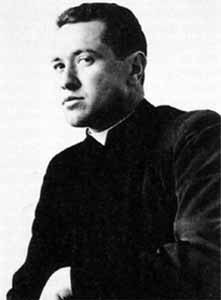

Там, где упал Камило,—

Родился крест.

Факелом осветил он

Весь мир окрест

Прощальный звон...

Умер Камило Торрес,

Но с нами он.

Вороны не слетались

В тот скорбный час,

Прочь улетала стая,

Завидев нас.

Тысячи новобранцев

Пришли в отряд —

Тот, где священник взялся

За автомат.

Эту песню на испанском языке можно скачать [здесь](http://www.sefon.ru/mp3/%D0%A1%D0%BE%D0%B2%D0%B5%D1%82%D1%81%D0%BA%D0%B8%D0%B5_%D0%9F%D0%B5%D1%81%D0%BD%D0%B8/Camillo_Torres_Spanish).

Архиепископ Сан-Сальвадора Оскар Арнульфо Ромеро открыто призывал к борьбе против диктатуры, за что был расстрелян прямо в храме.

Этот список можно продолжать, и он будет достаточно длинным.

При всем этом, в той же Никарагуа сегодня 15% населения относят себя к атеистам. Для сравнения, в РФ — только 10%. Можно предположить, что это своеобразный индикатор жизнеспособности общества. В обществе, которое готово бороться за свое будущее, священники становятся революционерами. В обществе, где коммунисты массово объявляют себя верующими, а бывшие замполиты переквалифицируются в священников, дела явно плохи и будущее его весьма неопределенно.

Впрочем, мы уделили так много места роли религии в никарагуанской революции вовсе не потому, что она была определяющей или хотя бы очень важной. Скорее, это было важно для религии — что хотя бы некоторые ее представители выступили не на стороне угнетателей и эксплуататоров, как это происходит практически всегда, а на стороне угнетенных и эксплуатируемых. Разумеется, что этим религиозным деятелям нужно воздать честь и хвалу, ибо даже человек, выступающий против сильных мира сего и говорящий правду о том, что этот мир устроен крайне несправедливо и совсем не в соответствии со священным писанием — большая редкость среди представителей этой профессии, а уж рисковать собственной головой для того, чтобы сделать жизнь униженных и оскорбленных достойной человека — настоящий подвиг не только для представителей церкви.

Нужно отметить, что руководство Сандинистского фронта национального освобождения в этой ситуации действовало очень грамотно, буквально следуя ленинскому совету, который писал, что «единство этой действительно революционной борьбы угнетенного класса за создание рая на земле важнее для нас, чем единство мнений пролетариев о рае на небе».

К идее борьбы за лучшую жизнь люди приходят по-разному, в том числе, и через религию, и через искусство. К примеру, если ансамбль «Лос де Палакагуина» и выполнял задания СФНО, то далеко не все его участники поначалу об этом догадывались. Карлос Мехийя Годой считал, что это не обязательно. Главное, чтобы они сочувствовали народному делу и вносили в него посильный вклад. Только позже участники ансамбля осознали свою роль в борьбе народа против диктатуры и стали активными участниками партизанского движения.

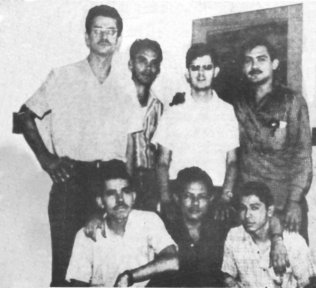

А вот группа «Панкасан» изначально создавалась как «боевая дружина «Новой песни» (так назвали раздел об этой группе Сергей и Татьяна Владимирские). И это вовсе не преувеличение. Она была создана в 1975 году в период подъема партизанской борьбы. В ее состав вошли действующие бойцы фронта, которые и после формирования ансамбля не переставали выполнять боевые задания по подготовке и расклейке листовок, организации и охране митингов, изготовлению взрывчатки, самодельного оружия. Но самой главной их задачей стала пропаганда идей СФНО среди широких масс. Участники группы так и говорили «Фактически мы выполняли в то время функции средств массовой информации, которых не имел Фронт». Соответственно, и стиль их песен был газетный, простой, народный.

Например, текст песни, который приводится в книге, напоминает репортаж или текст листовки:

Вчера я встретил дона Сосу,

Мне сказал он, что видел, как шли

Связанные, как скотина,

Женщины, дети, мужчины

К грузовику небольшому,

Что стоял от деревни вдали.

В Рио-Бланко и Аматильо

Индейцы клялись, что слышат

Жуткие вопли каждую ночь —

Такие, что слушать невмочь.

Вот такие дела в городишках,

Деревеньках, где гнем мы спину.

Вот такие дела-делишки...

Ну когда же мучители сгинут!

Хватит, довольно несчастий,

Скиньте ярмо друзья!

Народ, что стремится к власти,

Остановить нельзя!

А тут побывал я в Наранхо —

Говорят, мол, прибыл патруль,

За собой увели корову.

Спалили жилье, а в хромого

Просто так, уже на прощанье

Всадили несколько пуль...

Двух девчонок украли в Ласлале,

Там, где концлагерь, знаешь?

Пропали девчонки так глупо...

Под деревьями брошены трупы.

Вот такие дела...

Цветущим днем возвращался

Я по Камино-Реаль,

В это время ребят убивали

 (а вначале их сильно пытали) —

Сыновей Лусиано Паиса,

Им двадцать сравнялось едва ли.

Капюшон им на плечи набросив,

Их прикладами избивали.

Была так страшна расправа —

Даже горы рыдали, правда!

Хватит, довольно несчастий,

Скиньте ярмо, друзья!

Народ, что стремится к власти,

Остановить нельзя!

При этом, участники ансамбля не только призывали к борьбе, но и сами были в первых рядах бойцов. Двое из них погибли в бою.

И так работал не только «Панкасан». Одна из песен «Лос да Панакагуина» в его партизанский период была создана при следующих обстоятельствах. Артисты в составе отряда, посланного на помощь бойцу СФНО, закрепившемуся в крестьянском доме и отражавшему атаки солдат, ворвавшись в дом, обнаружили возле тела погибшего героя разорванные листки письма, которое он написал перед боем своей далекой подруге. Участники ансамбля превратили это письмо в песню.

Мир наступит, моя любовь,

Он наступит!

Ручеек засмеется вновь,

Это будет!

Перестанет скрипеть ярмо,

Так и будет!

Зацветет под окном лимон,—

Мир наступит!

Милая, скоро будет мир,

Запоют с нами реки.

Мы устроим веселый пир —

Мир навеки!

И крестьянин, рабочий пусть

Знают — будет свобода.

У любви нашей долгий путь —

Через годы.

И построим свой дом в горах

Мы с тобою.

Окружишь ты меня тогда

Детворою...

Повторяю я вновь и вновь:

Это будет!

Мир наступит, моя любовь!

Мир наступит!

За короткое время движение «Новой песни» в Никарагуа стало поистине всенародным. Было создано десятки ансамблей. Особенно широко движение развернулось после революции. Ансамбли «Новой песни» активно включились в кампанию ликвидации неграмотности. Они были своеобразной «полевой артиллерией» отрядов «альфабетистов», штурмующих вековую темноту и забитость горных деревень и городских трущоб. Они поднимали дух крестьян и городских добровольцев (среди которых было множество иностранцев), работающих на кофейных плантациях в условиях постоянной угрозы нападений «контрас».

Но все это лишь, так сказать, внешняя, политическая сторона истории «Новой песни». Для книги, о которой мы здесь пытаемся рассказать — она, бесспорно, очень важна, но далеко не исчерпывающая, ибо книга написана тончайшими знатоками (и не только знатоками, но и виртуозными исполнителями) латиноамериканской музыки. Сергей Владимирский являлся обладателем богатейшей коллекции латиноамериканских музыкальных инструментов, на любом из которых он прекрасно играл. Татьяна Владимирская — великолепная исполнительница — кроме этого, совершенно уникальный музыковед, понимающий, что необычайно важно для понимания латиноамериканской музыки, глубинную, но не мистическую, а реальную, то есть историческую (а реальная история народа — это, как правило, история совершенных им революций в самых разных областях) связь музыки с жизнью народа.

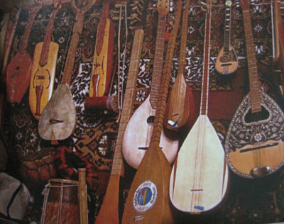

В книге «Никарагуа: революция и песня» вы найдете такой музыковедческий материал, которого вы не найдете более нигде. И этому есть две причины: с одной стороны, глубочайшее и тончайшее знание авторами книги своего предмета, а с другой — особенности самого предмета. Мексиканские баллады-корридо, кубинский и собственно никарагуанский «сон» (сон-ника), кумбия, уапанго, ритмы и мелодии которых слились в творчестве представителей «Новой песни» Никарагуа, авторы книги не просто знают, а живут ими. И это очень важно, поскольку в этом как раз и состоит особенность предмета, о котором они пишут: революции в Латинской Америке.

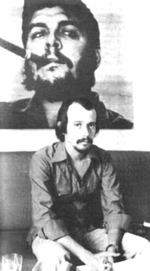

Европейцу даже сложно представить, какую роль в ней играет музыка и песня. Сможете представить, что, скажем, на трибуну XXVIII съезда КПСС выходит человек с гитарой и поет о том, что негоже торговать принципами, предавать своих предшественников, отдавших жизни за революцию и выслуживаться перед «заморскими буржуинами» в надежде на то, что они выдадут в награду «бочку варенья и ящик печенья». Но именно так и случилось на Четвертом съезде Компартии Кубы в 1991 году, с трибуны которого один из самых популярных исполнителей «Нуэва трова» («новые трубадуры», кубинский аналог «Новой песни») Сильвио Родригес спел свою знаменитую песню [«Ель несио»](http://www.youtube.com/watch?v=rl2C7ddpjpI) (упрямый), в которой заявил, что чем бы его не соблазняли и чем бы ему не угрожали, он не предаст своего народа, не предаст революцию и будет упрямо идти по избранному пути. И кубинский народ принял эту клятву певца в качестве своей собственной клятвы верности революции и вот уже два десятилетия «упрямо» идет своим путем, увлекая за собой другие народы Латинской Америки. Куба увлекает народы своим примером бесстрашия перед казалось бы всесильной империей, и страны Латинской Америки, правительства которых многие десятилетия фактически были всего лишь исполнительными органами при посольствах США, вспомнили о своем национальном достоинстве и одна за другой избирают независимую, антиимпериалистическую политику. Куба увлекает своими простыми и понятными каждому приоритетами в области внутренней политики — здоровье каждого человека и возможность получения качественного образования. Куба увлекает своим бескорыстием, своей способностью делиться с другими народами не просто лишним, но даже необходимым, тем, чего самим не хватает. На фоне господствующей сегодня в мире политики глобального крохоборства, проводимая Кубой политика бескорыстной интернациональной помощи нуждающимся выглядит каким-то необъяснимым сигналом из будущего.

Куба убедительно доказывает, что интернационализм есть идеология (и политика) сильных, исторически активных и перспективных наций, а национализм — это идеология и политика наций, уже прошедших пик своего исторического развития (или в силу тех или иных исторических обстоятельств так и не успевших сформироваться), наций стареющих (в историческом смысле этого слова), дряхлеющих, движущихся к своему концу, но не имеющих мужества не только достойно жить, но и достойно принять свой конец.

Кстати, размер страны, ее экономическая или военная мощь в данном случае или не играют роли или играют далеко не первую роль. Конечно, не занимай СССР шестой части суши, не обладай огромным человеческим потенциалом и необъятными природными ресурсами, советскому народу было бы очень трудно сыграть ту историческую роль, которую он сыграл. Но малюсенькая и бедная Куба своей революцией сыграла никак не меньшую роль, особенно в последних два десятилетия, когда она, не смотря ни на что, не только выстояла, но и своей интернационалистской политикой добилась того, что победила США в борьбе за влияние в Латинской Америке.

Думаю, что и кубинская музыка, кубинская песня сыграли немалую роль в том, что кубинская революция не только выстояла, но и распространила свои идеи на весь континент. И речь здесь идет не только о знаменитой [«Hasta Siempre Comandante»](http://www.youtube.com/watch?v=po09lcDxXIA&feature=related) Карлоса Пуэблы, покорившей весь мир, но и о песнях уже упоминаемой «Нуэва трова», концерты лучших представителей которой — Сильвио Родригеса, Пабло Меланеса — собирают стотысячные стадионы на всем континенте, и творчество которых оказало заметное влияние как на развитие «Новой песни» в разных странах Латинской Америки, так и на распространение в них идей кубинской революции.

***

Впрочем, хорошая музыка всегда была очень тесно связана с революцией. Всем известно, что Бетховен очень сочувствовал Французской революции и его музыка в основном была отражением этой революции, всех ее перипетий — успехов и поражений. Свою третью симфонию он посвятил Наполеону Бонапарту, которого он назвал генералом революции, но с возмущением снял посвящение, когда узнал, что тот стал императором, и переименовал симфонию в Героическую. Никколо Паганини был активным участником движения карбонариев. С польским революционным движением в молодости был тесно связан Шопен. «Женитьбу Фигаро» Моцарта называли «увертюрой революции», а Наполеон назвал ее «революцией в действии». Впрочем, о глубинной связи музыки Моцарта с революционными преобразованиями его и нашей эпохи лучше всего читать в известной книге наркома иностранных дел большевистского правительства Г.В. Чичерина [«Моцарт»](http://files.mail.ru/Y6A1ZX).

Русская «Могучая кучка» сознательно ставила перед собой задачи средствами музыки воплощать в жизнь революционные идеи, которые сформировались у ее основателей под влиянием Белинского, Герцена, Чернышевского. Вот как оценивал Н. А. Римский-Корсаков деятельность этого объединения и их влияние на последующее развитие русской музыки:

«Можно ли считать беляевский кружок продолжением балакиревского, была ли между тем и другим известная доля сходства, и в чём состояло различие, помимо изменения с течением времени его личного состава? Сходство, указывавшее на то, что кружок беляевский есть продолжение балакиревского, кроме соединительных звеньев в лице моём и Лядова, заключалось в общей и тому и другому передовитости, прогрессивности; но кружок Балакирева соответствовал периоду бури и натиска в развитии русской музыки, а кружок Беляева — периоду спокойного шествия вперёд; балакиревский был революционный, беляевский же — прогрессивный...»

(Н.А.Римский-Корсаков, «Летопись моей музыкальной жизни»)

Здесь упомянуты далеко не все даже «признанные» композиторы-революционеры. Можно назвать еще с десяток известных имен, сознательно связывавших свое творчество с революцией — таких как Рихард Вагнер, который не просто был идеологом революции, но и непосредственно дрался на баррикадах в 1849 году; Дж. Верди был автором гимна итальянских революционеров «Труба звучит» на слова Мадзини; постановка оперы Франсуа Обера «Немая из Портичи» привела к восстанию 1930 года в Бельгии; польский революционер Михаил Огинский — автор одного из самых популярных музыкальных произведений последних двух столетий; композитором, хоть, говорят, и плохим, был вдохновитель Великой французской революции Жан-Жак Руссо; Дмитрий Шостакович посвятил революции немало своих гениальных произведений, как и Дмитрий Кабалевский, Микис Теодоракис — член компартии Греции. В конце концов, те же «битлы», в особенности Джон Леннон, сочувствовали революции, а не реакции. Таких имен можно приводить не один десяток, но они все равно не исчерпают всей глубины связи между музыкой и революцией ибо связь эта не внешняя, а генетическая.

Наверное, не такой уж и фантастической будет гипотеза о том, что практически все, что было сделано значительного в музыке, так или иначе связано с революцией и революционными идеями.

Георг Гендель, Франц Йозеф Гайдн, Луиджи Керубини, Людвиг ван Бетховен, Камиль Сен-Санс, Ференц Лист, Шарль Гуно, Джакомо Пуччини, Ян Сибелиус были масонами. Даже И.С. Баха если и не причисляют к масонам, то указывают на его связи с предшественниками масонов — розенкрейцерами, хотя точные сведения есть только о принадлежности к масонской ложе его сына Иогана Христиана.

Конечно, было бы наивно полагать, что масонство в XVIII–XIX, в отличие от сегодняшнего реакционного масонства, было сплошь революционным, но то, что прогрессивная, революционная тенденция там была очень сильна — это факт. Вольтер, Руссо, Д'Аламбер, Дидро, Мирабо, Демулен, Лафайет, Сийес, Марат, Дантон, Робеспьер, Сен-Жюст — все они были членами французских масонских лож. Да и вообще, редко какая революция тогда обходилась без масонов. К примеру, масонами были многие декабристы, Джузеппе Гарибальди, Лайош Кошут, Тадеуш Костюшко, Бенджамин Франклин, Джордж Вашингтон, Симон Боливар, Сан-Мартин, О'Хиггинс и даже Хосе Марти. Через масонство прошел Пушкин. Масоном был основатель украинской литературы Иван Котляревский.

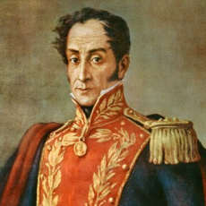

Другой вопрос, что вся масонская революционность, как правило, очень быстро исчерпывалась и приводила далеко не к тем последствиям, о которых мечтали эти революционеры. Но в этом была не их вина, а их беда. Несмотря на все свои высокие идеалы и готовность отдать за них свою жизнь, они были детьми своего времени, века Просвещения, который на поверку оказался всего лишь веком промышленной революции и порожденного ею полного и безраздельного господства буржуазии.

«Мы знаем теперь, что это царство разума было не чем иным, как идеализированным царством буржуазии, что вечная справедливость нашла свое осуществление в буржуазной юстиции, что равенство свелось к гражданскому равенству перед законом, а одним из самых существенных прав человека провозглашена была... буржуазная собственность. Государство разума,— общественный договор Руссо,— оказалось и могло оказаться на практике только буржуазной демократической республикой. Великие мыслители XVIII века, так же как и все их предшественники, не могли выйти из рамок, которые им ставила их собственная эпоха»,— писал Ф. Энгельс в «Развитии социализма от утопии к науке».

Приблизительно так же получилось и с классической музыкой. По своей сути она, как правило, есть то ли выражение духа революции, то ли ее предчувствие, но очень быстро ее превращают в изысканное средство развлечения богатых бездельников в большинстве своем тупых и необразованных, никаких чувств, кроме «чувства стоимости» и чувства «глубокого удовлетворения» никогда в жизни не испытывавших.

Но так не может продолжаться вечно, музыка не может не возвращаться к своим истокам. Каждая революция как бы возвращает музыке ее собственную молодость, то есть ее врожденную революционность. И выражается это двояко: с одной стороны, всякая революция порождает свою собственную музыку, опираясь, как правило, на народную традицию, с другой же — она возвращает народу музыкальную классику, давая ему доступ к образованию, в том числе и музыкальному, поднимая его общекультурный уровень. Такова была наша революция, такова кубинская революция, давшая как образцы новой песни, так и поднявшая на мировую высоту классическую традицию в своей стране (чего стоит хотя бы современный кубинский балет!). Можно не сомневаться, что по этому же пути пойдет и нынешняя революция в Латинской Америке. Кстати, первые образцы «Новой песни» Венесуэлы уже начинают завоевывать популярность в Латинской Америке. Яркий пример — песня «[Venezuela, mi patria querida](http://www.youtube.com/watch?v=spMwkqvjef4)».

***

А в конце еще несколько слов об авторах рекламируемой мною книги. Никто другой в СССР и в Европе просто не смог написать бы подобную книгу. И дело не только в том, что Сергей Владимирский прекрасно играл на любых латиноамериканских инструментах, а Татьяна Владимирская великолепно владеет испанским, что оба они объездили всю Латинскую Америку, лично общались со многими героями своей книги и пели песни, о которых писали. Дело еще и в том, что Татьяна Владимирская создала, а Сергей Владимирский чуть позже стал музыкальным руководителем уникального коллектива — ансамбля политической песни «Гренада».

Уже само это название звучало вызовом даже в советские времена. Это ведь неправда, что в советские времена царило полное единомыслие. На самом деле, действительных коммунистов тогда было никак не больше, чем сегодня. Да, откровенных сволочей было намного меньше, чем сейчас, и на самые верхние ступени власти они реально пробраться не могли, но идейных коммунистов было не так уж много, а теоретически грамотных — и того меньше. Очень многие искренне считали себя коммунистами, но на самом деле никогда не поднимались выше идеи советского патриотизма, для которого интернационализм служил ни к чему не обязывающим дополнением. Так и писалось «советский патриотизм и пролетарский интернационализм». Что же касается артистической среды, особенно столичной, то там идейных людей было вообще очень мало, зато самых обыкновенных рвачей — хоть отбавляй. Поэтому появление ансамбля именно политической песни, да еще с таким названием — «Гренада», само по себе воспринималось этой средой если и не как революция, то как бунт — точно. Да, петь романтическую светловскую «Гренаду» любили многие — в турпоходах, или за столом после энной рюмки, но чтобы сделать ее символом своего творчества — это был поступок.

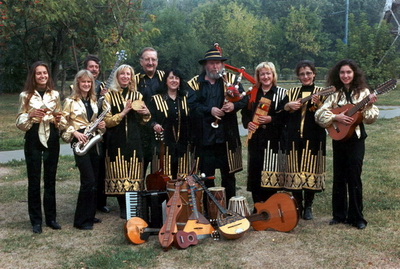

Точнее, это был только первый шаг. А поступком стала вся жизнь — как руководителей ансамбля, так и сотен людей, которые прошли через него за эти годы. Тысячи и тысячи бывших «советских патриотов», особенно «патентованных», из числа творческой интеллигенции и партийного руководства, превратились в лютых ненавистников и хулителей всего советского, а те, кто сумел, укатили на Запад. А «Гренада» ни на минуту не сбилась со своего пути и, в результате, нет сегодня более русского коллектива, чем этот, поющий на более чем тридцати языках мира песни, призывающие все народы объединиться в борьбе за лучшую жизнь.

Конечно, интернационализм в духе светловской «Гренады», который взяли на вооружение «гренадовцы» — не теоретический лозунг, вершащий собой тысячелетнее развитие науки, философии, культуры, политических движений, а, скорее, народный, «нутряной», возникший как искра в темной, забитой античеловеческими условиями, жаждущей человеческого развития душе под воздействием вычитанного из случайной книги слова. Конечно, тот интернационализм богаче определениями, но этот — надежней. За него идут на смерть, зная наперед, что в случае чего «отряд не заметит потери бойца», но зато он точно «допоет до конца» боевую песню, доведет дело до победы.

Московская «Гренада» давно усвоила эту истину революции. К примеру, так получилось, что прямо перед концертом в Киеве, посвященным двадцатилетию программы лечения украинских детей на Кубе, пришла ужасная весть о катастрофе кубинского самолета с многочисленными человеческими жертвами. Татьяна Львовна Владимирская была потрясена и очень расстроена этим известием, но отбросила саму мысль о том, чтобы отменить концерт по случаю траура. Ведь их концерт — это не веселье, это борьба. Даже когда умирают близкие, мы поем,— сказала она. Это как на войне. Товарищ пал, но рядом поднимается другой и продолжает делать свое дело.

И это не просто слова. Смерть Сергея Владимирского, который ушел из жизни в 2006 году, могла стать для ансамбля концом его деятельности — ведь, казалось, на нем все держалось. Но не стала. Именно в этом величие действительного мастера — что с его смертью его дело продолжается. Не потому, что мастер велик, а потому что настоящие великие мастера делают только великое дело.

Сегодняшние гренадовцы — такие же бойцы, как и герои книги, о которой рассказывается в этой статье. Только «воюют» они в гораздо более сложных условиях, ибо нет за ними организации, нет тех отрядов, для которых они бы работали. Но фактически их песня работает на то, чтобы сформировать такие отряды, такие организации, такое общество, для которого интернационализм был бы не подвигом, не роскошью, а нормой жизни, общество, в котором не было бы «иностранцев», «инородцев», а были бы люди, видящие цель своей жизни в том, чтобы сделать жизнь других людей лучше, красивее, люди, готовые в любой момент «хату покинуть, уйти воевать, чтоб землю в Гренаде крестьянам отдать».

И тогда не нужно будет «покидать хату» ради того, чтобы заработать кусок хлеба, которым тебя еще при этом постоянно будут попрекать, поскольку у тебя не тот цвет кожи или разрез глаз, не нужно будет воевать за интересы «своих» кровососов, убивая таких же бедолаг, как и ты. Да и кровососов никаких в этом обществе не будет.

Конечно, о таком обществе недостаточно петь, за него нужно драться, но в серьезной борьбе песня — это оружие, притом иногда более сильное, чем все другие виды оружия, ибо песня не просто поднимает, она формирует боевой дух — революционный дух. Совершенно неслучайно [«Гренада» дружит с Чавесом](http://www.youtube.com/watch?v=YmgNnUSa4SU&feature=player_embedded#%21). Они все бойцы одной армии — армии будущего.

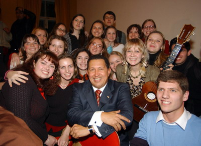

***

Но какой будет песня будущего?

Такой вопрос, помню, когда-то, лет 25 тому был задан на лекции о современной музыке, которую проводил в «интерклубе» нашего студенческого общежития один аспирант. Вопрос задал мой товарищ, который, как это часто бывает в таких случаях, уже имел на него свой вариант ответа. Он был уверен, что таковой будет модная в то время авторская песня.

Но докладчик уверенно, как будто ждал этого вопроса, ответил, что таковой станет революционная песня. Я был тогда настроен весьма революционно и перед этим в армии с огромным воодушевлением пел в строю «Варшавянку» (конечно, такие песни в Советской Армии, как правило, не пелись, но ее очень любил наш командир части полковник Андреев, и по его просьбе наша батарея ее разучила), но внутренне поверить в то, что революционная песня станет песней будущего, не мог при всей к ней симпатии. Видимо, докладчик опирался не просто на чувства, но и был умным человеком. А, возможно, сработало то, что он хорошо знал испанский и много читал о Латинской Америке.

Но сегодня я не сомневаюсь, что будущее именно за революционной песней и движение «Новой песни» и подобные ему доказывают это как дважды два. В книге Владимирских [«Никарагуа: революция и песня»](/library.php.html) можно найти великое множество аргументов в пользу этого утверждения.

Впрочем, что там книга! Для того, чтобы не сомневаться в том, что именно за революционной песней — будущее, достаточно побывать хотя бы на одном концерте «Гренады». Уже с двух-трех песен ансамбль полностью овладевает публикой. Притом неважно, на каком языке это песни, авторские они, народные (к примеру, украинские или перуанских индейцев), лирические или боевые: в исполнении «Гренады» все песни превращаются в революционные. Любой, даже самой популярной группе, осталось бы только завидовать такой власти над аудиторией.

Слушая эти песни, не просто понимаешь, что лучший мир возможен, но и чувствуешь свой долг сделать все для того, чтобы он стал действительным.