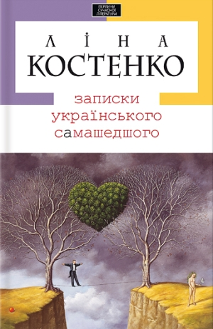
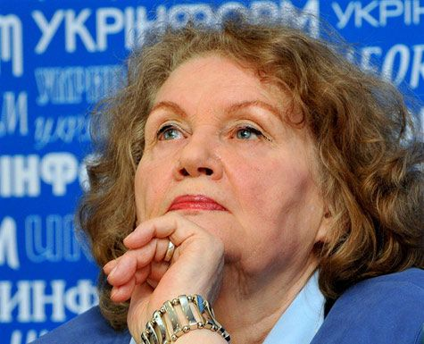

# Записки украинской непонимающей. О новой книге Лины Костенко

**2011-01-08** Андрей Самарский

В самом конце минувшего года в украинском литературном мире случилась сенсация - после двадцатилетнего молчания знаменитая украинская поэтесса Лина Костенко написала новую книгу с названием «Записки украинского самашедшего». Любая ее публикация, будь-то новый стих или статья, - само по себе событие, а тем более первый роман в прозе. А если учесть, что за последнее десятилетие в Украине ничего стоящего не написали, и ни один из литераторов даже близко не приблизился к уровню Лины Костенко, то вполне правомерно назвать эту книгу «главным ожиданием десятилетия».

Роман получился, если так можно выразиться, публицистическим. За литературный прототип поэтесса взяла «Записки сумасшедшего» Н.В. Гоголя. В основу легли личные дневники Лины Васильевны, которые она вела на протяжении последнего десятилетия, написанные в книге от имени мужчины, 35-летнего программиста. Нужно сказать, что главный герой совсем не типичный представитель своего поколения, ведь программиста с явно гуманитарным складом ума, думающего только о проблемах украинского общества и читающего новости не в интернете, а в газетах, - в реальности трудно найти. Но, как уже говорилось, роман не художественный, поэтому не будем обращать внимание на всякие мелочи.

Абзацы из дневников чередуются абзацами с довольно прозрачной сюжетной линией. Еще есть несколько схематичных образов, которые, как с плаката, срисованы из людей круга пани Костенко. Главный герой - настоящий украинский патриот, поэтому не может спокойно наблюдать за тем, что делается (а, точнее, что делают) с его родиной. Постоянно читая газеты, он пишет заметки о состоянии общества, пытаясь понять, что происходит вокруг, где место Украины в новом глобализованном мире. Он понимает, что на самом деле все не так и все не то. Не за такое будущее он голодал в 1990 на Майдане будучи студентом (где познакомился со своей будущей женой), не за такую Украину боролся его отец интеллигент-«шестидесятник», не за это умирали герои-патриоты. Понимает, но сидит, сложа руки. Точнее не просто сидит - постоянно рефлектирует над общественной деградацией, пропуская все через себя, и поэтому постепенно сходит с ума.

По замыслу автора это Украина сходит с ума, и никто ничего не делает. Пассивность и нерешительность главного героя - это пассивность и нерешительность украинской интеллигенции, патриотов. Как символ попранной свободы слова буквально через страницу упоминается отрезанная голова убитого в 2000 году журналиста Георгия Гонгадзе. Фигурируют образы из поколения главного героя - «потерянного поколения», у которого «украл молодость» Советский Союз. Но и детям, которые живут в уже независимой стране, - ничуть не легче. Украину, как только она «освободилась», сразу же «украли» недостойные и правят ею, обирая народ. Сказывается «тяжелое советское прошлое»: наше украинское общество «посттоталитарное», «постгеноцидное», отсюда и постмодернистская гниль, - устами своих героев говорит пани Костенко. Украинцы утрачивают свою независимость. Вокруг сплошной театр абсурда, поэтому образы в романе не предполагают иной функции и иного чувства, как только показать трагизм и разочарование истинного патриота.

Заканчивается роман оптимистически. Приходит «оранжевая революция». Все герои, до этого разобщенные, растерянные и озлобленные, обретают и себя, и Родину. Майдан становится «лекарем» как индивидуальной психики граждан, так и «психики» нации. «Оранжевая революция» спасает честь Украины перед Историей. Впрочем, это не конец. Лина Костенко не такая наивная, тем более сейчас, когда предательство «оранжевых» стало очевидно всем думающим патриотам. Материала ее личных дневников хватило и на второй роман. Ожидается, что он будет написан от имени женщины (видимо жены главного героя) и опишет наше общество в период 2005-2010 гг.

Как и следовало ожидать, «Записки украинского самашедшего» вызвали бурную реакцию в узких интеллигентских кругах. Как для современной украинской литературы, роман вышел просто гигантским тиражом - 10 тыс. экземпляров (больше разве что только у поп-звезды сучукрлита - Оксаны Забужко и ей подобных). Видимо, издательство «А-БА-БА-ГА-ЛА-МА-ГА» сделало ставку на имя поэтессы. Во всяком случае, имени оказалось достаточно, чтобы книга начала претендовать на литературный бестселлер. В нескольких крупных «оппозиционных» изданиях сразу же появились восторженные рецензии, по Национальному радио велась мощная раскрутка книги.

Первое, что бросается в глаза в этих отзывах - критики пытаются оправдать нехудожественность романа. Кто-то говорит о «начале новейшей парадигмы» в литературе, кто-то - про уникальный эксперимент с жанрами и стилями, кто-то вспоминает, что Достоевский писал своих «Бесов» тоже в полупублицистическом стиле, а вышел шедевр художественной литературы. Есть и такие, кто не делает подобных реверансов, сразу говоря, что главное - идейная мощь. Наиболее удачно роман охарактеризован как [«Манифест Лины Костенко»](http://www.radiosvoboda.org/content/article/2265255.html). Действительно, интересны не художественные особенности текста, а идеи, которые пытается донести до украинских патриотов пани Костенко - именно патриоты становятся главным объектом ее нападок. И главное, поэтесса имеет большой авторитет в их среде.

Лина Костенко давно стала легендой украинской литературы. Вышла из плеяды «шестидесятников», рожденных хрущевской оттепелью. Ее перу принадлежит несколько прекрасных сборников поэзии, два исторических романа в стихах. Она не только мастер слова и поэтических образов - еще с советских времен считается, что Лина Костенко является одним из стойких носителей украинской национальной идеи. Наши интеллигенты окрестили пани Лину «совестью нации», ставя ее в один ряд с классиками украинской литературы, особенно часто сравнивая с Лесей Украинкой. Поэтому к ее словам они будут прислушиваться, как к изречениям пророка.

Сквозная идея произведения - Украина потеряет независимость, если мы ничего не сделаем. Пани Костенко красочно описывает разложение общества на рубеже тысячелетий. Вероломство политиков, продажность чиновников, тупость богатых нуворишей, гниль «средних слоев» и беспомощность обычных граждан. Пассивность не только интеллигенции, но и всех, хотя интеллигенция незримо выступает у нее главной движущей силой. Откуда-то пришел новый хозяин жизни - Рынок, который, видите ли, ничем не лучше «совка». Нет цензуры, но она и не нужна: можешь говорить что хочешь, тебя все равно никто не будет слушать. Чтоб слушали - нужны телеканалы и многотиражки, а они все в руках у частных хозяев. В эфир попадет только то, что не противоречит их интересам или интересам власти.

Примечательно, что главный враг - не один Кучма и его окружение, а все «антиукраинские силы». В противовес им есть положительные политики: «наш нетипичный премьер-министр» (Ющенко) и вице-премьер «леди Ю». Они хорошие, потому что за Украину. Весь роман премьера постоянно угрожают снять эти самые «антиукраинские силы», а «леди Ю» тягают по судам и держат за решеткой. Естественно, за то, что они за Украину. Да простят мне сарказм почитатели Лины Костенко, но из текста именно так и выходит. Выше описательности и намеков пани Лина не поднимается. И, скорее всего, не потому, что не хочет, а потому что не может. Ведь вскрыть суть общественных процессов, да еще в такой сложную эпоху как наша, - для этого нужно владеть теоретическим мышлением, и не всяким, а диалектико-материалистическим.

То, что Лина Костенко не докапывается, боится раскрывать сущность «проукраинских» политиков, является посторонним наблюдателем за своим народом, отражается и на тексте. Майдан приходит для главного героя откуда-то со стороны. Он гость на этом празднике, но убеждает себя, что это его, выстраданная революция. У автора получилось передать эту отстраненность народа и привнесенность протеста со стороны. Как потом и оказалось - это была не народная революция, а грязная игра политиканов. Ведь даже «чистый образ» «Революции на граните» (протеста студентов против правительства УССР В. Масола в 1990 году) отнюдь не был таким романтическим и чистым - «голодали» там, в большинстве, совсем не бедные люди.

Сам автор говорит о себе так: «стихи я пишу сама, а проза пишет меня». Несомненно, проза Лины Костенко в некоторой степени есть зеркалом времени - она, хоть и концентрированно, но слепо отражает эпоху всеобщего разложения: «когда начинается смерть культуры, наступает культура смерти». «Записки украинского самашедшего» - это преломление всеобщего кризиса через призму нашей интеллигенции. Лучших ее представителей, но слепых, реакционных и абсолютно беспомощных. Пани Костенко видится предательство национальных интересов, начиная с Кучмы или даже с Кравчука. Она опасается, что глобализация сметет аутентичную украинскую культуру, жажда наживы уничтожит мораль, материальные интересы навеки станут выше духовных. Она призывает сознательных украинцев, сколько их там осталось, задуматься об этом.

Отдельной строкой в книге выступает критика современной украинской литературы - т.н. «сучукрлита». Пани Лина не понимает, как можно употреблять маты и использовать столь низменные образы, как в сучукрлите. При этом она сама местами использует излишний натурализм (конечно, для того, чтобы вызвать у читателя омерзение от происходящего) и пару раз употребляет матерные слова (конечно, вкладывая их в уста подонков). Но, согласитесь, серьезная литература умела вызвать самые тонкие чувства, не прибегая к подобным приемам.

Жизнь последних десятилетий научила поэтессу ненавидеть происходящее вокруг, но не научила, где искать ответы на поставленные вопросы. Несмотря на новую эпоху и необходимость новых мыслей, пани Костенко пользуется все той же гнилой идеологией, которая уже двадцать лет убивает украинский народ. Вот и получается: с одной стороны - непонимание: почему так случилось, ведь после крушения Союза все карты были в руках у «сознательных украинцев», с другой - стремление утвердить господство украинского национализма, хотя именно национализм сейчас стал господствующей политикой Украины, России и большинства бывших соцстран. То, что в 2010 году «оранжевого» президента сменил «бело-голубой», сути политики не меняет. Янукович даже еще более развивает украинский национализм, правда, не совсем привычный старому патриоту, поскольку основа всякого государственного национализма - крупная промышленная буржуазия, олигархия, которую опекает нынешний режим. Не случайно лидер националистической партии «Свобода» Тягныбок и его ближайшее окружение в последнее время не исчезают с экранов телевизоров, а среди главных их финансистов фигурирует донецкий олигарх Ринат Ахметов.

Пани Костенко призывает остановиться, ссылаясь на «страшные вещи, которые сейчас происходят в Москве». Но уже всем очевидно, что на Манежной площади бесновались именно националисты! Или она думает, что украинские националисты принципиально отличаются от русских? Наверное, пани Лина летает в высоких сферах интеллигентских иллюзий и не видит, что вчерашние уличные отморозки-скинхеды сейчас активно дружат со «Свободой». Кстати, поэтесса в последнее время сама дружит со «Свободой», видимо, чувствуя в ней «последнюю надежду Украины». Тушить пожар керосином - любимое занятие честных, но бестолковых украинских интеллигентов. Впрочем, кроме пани Костенко, искренних интеллигентов осталось единицы.

Я уже писал о Лине Костенко и об оторванности сегодняшней интеллигенции от украинского народа (см. [«Наши духовные ценности»](/2100.md)). К сожалению, этот новый роман только закрепляет иллюзии и заблуждения сегодняшних интеллигентов - они нашли для себя единственно верное лекарство - национализм, и пытаются лечить им всех и вся. Но и в лагере украинских националистов нет общего понимания. Книга написана «шестидесятником», воспитанным в другую эпоху с другой моралью и нравами. Претензии Лины Васильевны во многом будут непонятны сегодняшнему молодому украинскому националисту. Это раньше считалось необходимым усвоить все богатства человеческой культуры. Сейчас украинское общество воспитывает национально-ограниченных людей, с детства вдалбливая им хуторянскую психологию, ограничивая их и во всем остальном. Не потому, что это наша, национальная психология, а потому, что капитализм неизбежно превращает человека в винтик механизма, а националистическая идеология закрывает ему всякую дорогу к пониманию мира. Так что, выстрел, скорее всего, окажется холостым.

Можно высоко ценить, что в таком почтенном возрасте поэтесса не опускает рук и продолжает бороться. Только за что и против чего? Упрекая собственный народ в «ничегонеделании», она совершенно не замечает, как она далека от него. Поэты должны быть поводырями народа, но классики всегда умели отличить гнилое, реакционное направление от живого, революционного. Поэтому и становились классиками. Сейчас таким поэтом может быть только поэт, выступающий от имени угнетенного класса (в этом отношении примечательно творчество недавно ушедшего от нас украинского поэта [Григория Биленко](/2378.md)). Пани Костенко, может, сама не отдавая себе отчет, выступает от имени совершенно других классов.

Возвращаясь к творчеству Лины Васильевны, можно вспомнить ее поэзию. Большинство из стихов, которые мне приходилось читать, по лаконичности слова и красоте образа представляют собой лучшие образцы советской украинской поэзии. Стихи, мастерство писать поэзию поэтесса осваивала в 60-е. Тогда был социализм. Не просто плановая экономика, а другое определение социализма: творчество масс. Поэзия жила в народе - была понятна и доступна ему, как и сама жизнь. Стихи совсем не выдавали в Костенко антисоветчика-диссидента. Тогда она предпочитала писать о «вечных ценностях».

Но и сейчас в поэзии Лина Костенко избегает прямо выражать свой национализм - может быть, сказывается «советская школа», а может, «формат» стихотворения не позволяет ей делать это. Во всяком случае, я с интересом буду ждать выхода двух ее новых поэтических сборников, запланированных на этот год.