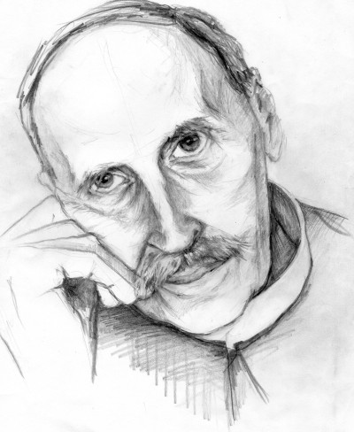

# Ромен Роллан о женщине, любви и творческом вдохновении

**2011-01-26** Станислав Ретинский

*К 145-летию со дня рождения французского писателя Ромена Роллана посвящается...*

Какое место отведено в мире массовой культуры такому состоянию, как творческое вдохновение? Не будет преувеличением ответить, что ровным счетом никакого. Величайшее творчество, которое немыслимо без вдохновения, никогда не шло об руку с культурой поставленной «на конвейер». Оно просто не может возникнуть без богатства чувств, которые развиваются в человеке лишь путем освоения всего культурного богатства. Но там, где главной целью искусства является извлечение прибыли, чувства все более и более упрощаются в формах. Например, любовь уже давно сведена к простому физиологическому акту, что делает из мужчины и женщины всего лишь партнеров. Конечно воспитанники так называемых «фабрик звезд» порой много говорят о чувствах и потребностях, но сами при этом не способны иметь никаких особенных чувств и потребностей, кроме потребности рисоваться. Не умея любить, они в состоянии лишь «заниматься» любовью.

Ограниченность массовой культуры делает еще более величественным классическое искусство и, в частности, литературу, куда свой весомый вклад внес французский писатель Ромен Роллан. Творения становятся замечательными тогда, когда способны отразить дух эпохи, великими - когда они еще совершенны по форме и глубоки по содержанию. Ромен Роллан - великий писатель, поэтому его творения перешли в потомство. Как всякий могучий талант он является представителем известного момента общественного развития, который еще пару десятилетий назад считался у нас преодоленным. Однако временное торжество отживших форм заставляет вновь почувствовать актуальность произведений Ромена Роллана особенно в вопросах современного «искусства».

*«Творят не по велению разума. Творят по велению сердца. К тому же мало разглядеть фальшь и наигрыш, присущие многим нашим чувствам, чтобы самому не впасть в этот грех, - для этого нужны продолжительные и упорные усилия. Что может быть труднее, чем оставаться до конца честным в нынешнем обществе, изнемогающем под грузом косных привычек, которые достались ему от прежних поколений? Особенно трудно дается это людям и народам, страдающим манией сердечных изменений! Их сердца говорят без умолку, а лучше, если б они молчали»* («Жан-Кристоф»).

Фальши и наигрыша в современном «искусстве» просто в изобилии. Но самое печальное не это. Подлинная трагедия, по мнению Ромена Роллана, состоит в следующем:

*«... искусство больше всего фальшиво не тогда, когда художник изображал чувства, которых не испытывал, а тогда, когда он стремился выразить чувства, действительно им пережитые, но сами по себе фальшивые»* (Там же).

Фальшивые чувства, которые являются следствием человеческой ограниченности, могут родить только фальшивое искусство. В свою очередь литературное наследие Ромена Роллана служит примером подлинного искусства, так как в нем разоблачена вся чувственная фальшь и раскрыта суть творческого вдохновения. Начнем с того, что человек, который ведет распутный образ жизни, не может иметь вдохновения. Точнее, вдохновения в нем тем меньше, чем больше он распутничает. Распутство - это пустая трата человеческой энергии, главным образом, ее творческой составляющей. Отдавая энергию на одно, человек уже не способен отдать столько же на другое. При этом весьма плохим источником вдохновения является также противоположная распутству крайность - равномерная и благополучная жизнь.

Принято считать, что классическим примером вдохновенного человека является влюбленный человек. И действительно, нередки случаи, когда влюбленный человек начинает писать стихи, при этом, даже не являясь поэтом. Правда это длится до тех пор, пока любовь носит возвышенные формы и заканчивается в тот самый момент, когда она превращается всего лишь в низменные потребности.

*«Горе обороняющимся сердцам! Когда в них вторгается страсть, самое целомудренное становится самым доступным»* («Очарованная душа»).

Но порой очень сложно отделить страсть от настоящей любви. Например, молодые люди, всецело поглощенные страстными желаниями, всегда поспешны в своих выводах. Они, как правило, влюбляются не в реального человека, а в искусственно созданный образ, что очень четко подмечает Ромен Роллан:

*«Кто знает, сколько смешных и трогательных иллюзий привносит любящая душа в свою любовь»* («Жан-Кристоф»).

Когда иллюзии исчезают, то исчезает и любовь (точнее сказать страсть) между людьми и на ее место приходит себялюбие. Себялюбие - это тоже любовь, которая может существовать исключительно в одностороннем порядке. В книге «Жан-Кристоф» об этой форме любви говорится достаточно много:

*«Эгоизм любви создавал вокруг них пустоту, неосмотрительно сжигая все свои запасы и ничего не оставляя на будущее»;*

*«Когда в жизни нет иной цели, кроме себялюбивого счастья, жизнь вскоре становится бесцельной»;*

*«Любовь! Самое чудесное, что есть в жизни человеческой, когда беззаветно приносишь себя в дар любимому. И самое никчемное, наверное, когда она лишь погоня за счастьем».*

А эти строки вообще превосходны:

*«Женщины себялюбивые и тщеславные ощущают особую, злобную радость, отнимая у мужа дружбу его друзей».*

Вообще, роман «Жан-Кристоф» представляет собой пример того, что величайшее творчество порой не имеет ничего общего с удачной любовью. Но это ни в коем случае не означает, что любовь и творчество вещи несовместимые. Дело в том, что трагической судьбой главного героя Жан-Кристофа, Ромен Роллан стремился показать, что путь к пониманию сущности подлинной любви лежит через горечь разочарования. Лишь разоблачив всю фальшь испытываемых чувств, человек может рассчитывать на обретение подлинного счастья, в том числе счастья творчества. В свою очередь чувства, пережитые Жан-Кристофом, можно выразить несколькими афоризмами:

*«...жена - половина мужа. Женатый мужчина - это уж полмужчины»;*

*«Хорошая женщина - рай на земле. Но только рай на земле... никто никогда не видел»;*

*«женщины создают мужчин... вернее, не создают, а предают их».*

Конечно, глупо считать, что горечь разочарования автоматически приводить к пониманию, а тем более обретению подлинной любви. Зачастую разочаровавшись в своей любви, перестаешь верить в любовь как таковую:

*«Кто любит - того не любят. Кто любим - тот не любит. А кто любит и кто любим - рано или поздно разлучается со своей любовью»;*

*«Счастливая любовь расслабляет волю. Несчастная - разбивает сердце. Где же ее блага?»;*

*«...счастье и любовь - минутный обман - стремятся обезоружить сердце и заставить сдаться».*

Для подлинно творческого человека в жизни есть только одно счастье: творить. Более того, всю свою жизнь, включая и любовь, он стремится превратить в творчество. Таким человеком был и Ромен Роллан. Помимо литературы, огромное место в его жизни занимала музыка. Музыка - это вторая натура Ромена Роллана, которая в полной мере отражена в образе главного героя книги «Жан-Кристоф». Как и положено творческому человеку, он не всегда находит понимания со стороны окружающих его людей. Если люди бездарны, то даже самые гениальные идеи, пройдя через их души, становятся посредственными. Подобную трагедию Ромен Роллан превосходно изобразил на примере отношений между мужчиной и женщиной. Когда мужчина не находит понимая со стороны женщины, тогда начинается трагедия:

*«Женщины все были одинаково опасны - глупые и умные, любящие и себялюбивые; а лучшие были хуже всех: они еще вернее душили талант в тисках своей неразумной любви, с самыми благими намерениями приручали его, приспосабливали к своим вкусам, подравнивали, приглаживали, опрыскивали духами, пока не доводили до уровня своей убогой чувствительности, меленького тщеславия, до посредственности своей и своего круга».*

При этом далеко не всегда удачны попытки мужчины противодействовать «благотворному» влиянию женщины:

*«Если мужчина лишает женщину иллюзии относительно ее благотворного или вредного влияния на любимого человека, это в ее глазах равносильно отсутствию любви, и поэтому она настойчиво и по всякому поводу старается подвергнуть любовь все новым испытанием».*

Но, не смотря на град критики, обрушенный на женщину в книге «Жан-Кристоф», Ромен Роллан ее полностью реабилитирует в «Очарованной душе». В главной героини романа воплощен образ женщины будущего, о которой писал Фридрих Энгельс в работе «Происхождение семьи, частной собственности и государства»: 

*«...поколение женщин, которым никогда не придется отдаваться мужчине из каких-либо других побуждений, кроме подлинной любви или отказываться от близости с любимым мужчиной из-за боязни экономических последствий».*

Аннета Ривьер, не желая быть лишь тенью мужчины, расторгает помолвку и одна воспитывает ребенка. Чтобы понять восхищение Ромена Роллана такой категорией женщин, достаточно сравнить строки из двух его романов. В книге «Жан-Кристоф» он пишет:

*«Но не затем даны женщине слова, чтобы говорить то, что она думает... Упаси господь! Что бы сталось тогда в нашем мире с нравственностью?».*

А вот строки из книги «Очарованная душа»:

*«Женщина часто молчит потому, что чувствует, как мало мужчина ее понимает».*

Главной героини романа приходится преодолевать огромные трудности на своем жизненном пути. Такая задумка Ромена Роллана не случайна. Он был убежден, что только в соприкосновении с суровой действительностью человек в состоянии понять, что такое жизнь. В свою очередь, женщина, сохранившая в богатстве здоровую душу, по его мнению, - такое же чудо, как гениальный миллионер. Чтобы еще больше понять все величие Аннеты Ривьер, Ромен Роллан для сравнения приводит описание женщины из класса крупной буржуазии:

*«В этой дородной даме воплотились самые устойчивые черты ее класса - крупной буржуазии: любовь к порядку, честность, отсутствие любознательности, черствость сердца и в особенности ума; все узаконенные добродетели - твердая вера - чисто формальная, очищенная от всяких сомнений и мыслей, словно ее выпотрошили на прилавке мясника, и культ собственности, всех видов собственности: своей семьи, своего имущества, своей страны, своей религии, своей морали, своих традиций, своих антипатий, - словом, своего пассивного и компактного «я», подобного глыбе, заслоняющей солнце».*

Если роман «Жан-Кристоф» полон разочарований в отношении женщины, то в «Очарованной душе» все как раз наоборот. Это объясняется тем, что Ромен Роллан создал совершенно иной образ женщины. Историческое значение этого романа лучше остальных смог выразить Максим Горький:

*«В «Очарованной душе» - он сердцем художник, предчувствует рождение другой, доброй правды, давно необходимой миру. Он предвидит рождение новой женщины на смену той, которая помогает разрушать этот мир, - женщины, которая, поняв свою роль возбудителя культуры, хочет войти в мир властно и полноправно, как законнейшая хозяйка его и мать мужчин, ею созданных и ответственных перед нею за свои дела»* («О Ромэне Роллане»).