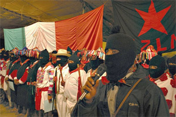

# Партизаны в Латинской Америке ещё не сошли со сцены

**2011-01-27** Нил Никандров

Майки с портретом Че Гевары привычно присутствуют на сувенирных рынках континента. Романтический образ Команданте Че можно встретить на стенах студенческих городков, бедняцких барриос и даже фешенебельных кварталов латиноамериканских столиц. В Интернете сотни порталов воспевают самопожертвование Героического партизана, боровшегося за идеалы справедливости, равенства и братства, социализма с человеческим лицом.

В 60-80-е годы прошлого столетия невозможно было представить, что Че Гевара станет - и не только в Латинской Америке - символом сопротивления неолиберальной диктатуре наших дней, всемирному олигархическому заговору, зловещим конспираторам из Бильдербергского клуба.

Есть ещё один партизанский вожак и идеолог - Субкоманданте Маркос, который, несмотря на попытки спецслужб Мексики и ЦРУ «избавиться» от него, продолжает возглавлять Сапатистскую армию национального освобождения (EZLN) в штате Чьяпас. Больше всего он известен как защитник коренных народов Мексики, но в программных заявлениях Маркос выступает как мыслитель и политик широкого плана, как принципиальный противник глобализации по сценарию Вашингтона. Для него неолиберализм - вид сектантской «новой религии», требующей от её адептов завоевывать территории, морально и физически уничтожать инакомыслящих (антирыночников).

Маркос уверен в том, что для конкистадоров неолиберализма главный противник - человечество. Оно уничтожается по мере того, как через процессы глобализации в интересах транснациональных компаний беспощадно разрушаются национальные государства. Право на выживание получит только «золотой миллиард». Всё человеческое, всё, что противоречит рыночной логике, подлежит ликвидации. «В этом смысле, - утверждает Маркос, - все мы являемся (для неолибералов) тем противником, который должен быть побеждён: индейцы, не индейцы, активисты организаций по защите прав человека, учителя, интеллектуалы, артисты» и т.д.

Пропагандистский аппарат США ведёт целенаправленную работу по компрометации немногих существующих партизанских движений в Латинской Америке как "террористических", "сотрудничающих с наркокартелями", "не соответствующих духу современности" и "политически бесперспективных".

Например, в Перу эпизодически заявляют о себе малочисленные партизанские группы «Sendero Luminoso». Они нападают на армейские и полицейские патрули в отдалённых регионах страны. Исторический лидер «Sendero Luminoso» Абимаэль Гусман и его ближайшие соратники находятся в тюрьмах. Пожизненные сроки, никаких надежд на амнистию. Их попытки применить тезис Мао о «винтовке, рождающей власть», провалились.

Кажется, что в Латинской Америке наступили иные времена и вопрос о власти можно решить через избирательные урны. Доказательством этих возможностей является венесуэльский лидер Уго Чавес, который неоднократно одерживал победы на президентских выборах и отзывном референдуме. На континенте есть и другие подобные примеры. За последнее время через «испытание» избирательной кампанией прошли три политика, бывшие партизанские командиры. Пепе Мухика стал президентом Уругвая, Дилма Русефф - Бразилии, а Фернандо Сото Рохас - председателем Национальной Ассамблеи Венесуэлы.

Как проявят себя бывшие партизаны на высших постах, покажет время. В Сальвадоре Маурисио Фунес бы избран президентом страны в 2009 году благодаря поддержке Фронта Национального Освобождения имени Фарабундо Марти (FMLN). Эта партизанская организация подписала мирные соглашения в 1992 году, демобилизовала свои вооружённые формирования и постепенно трансформировалась в легальную партию. Активисты FMLN очень надеялись на политическую лояльность Фунеса, но он быстро забыл о своих обещаниях, ориентируясь на интересы Вашингтона. Так, в декабре прошлого года Фунес дал согласие на строительство в стране центра электронного контроля над телефонными переговорами и Интернетом в Центральной Америке. Главным объектом для шпионажа будет, конечно, Никарагуа. Спецслужбы США плетут против сандинистского руководства страны заговоры, стараясь не допустить переизбрания Даниэля Ортеги в ноябре текущего года.

И всё же говорить о закате партизанского движения в Латинской Америке преждевременно. До сих пор по-настоящему крупные партизанские группировки действуют в Колумбии. Численность Армии национального освобождения (ELN) достигает 5 тысяч человек, в отрядах Революционных вооруженных сил (FARC) сражается, по оценкам колумбийского правительства, около 6-7 тысяч партизан. По утверждениям руководства FARC, на территории страны действует не менее 20-25 тысяч бойцов.

Группировка FARC была сформирована в середине 60-х годов как военное крыло Компартии Колумбии. Кубинский опыт пригодился в подготовке боевых кадров, в проведении операций, в организации поддержки населения. Решение Кубы отказаться от стратегии экспорта революции и поддержки партизанских очагов на континенте в 80-е годы не могло не сказаться на монолитности FARC. Именно в этот период Компартия Колумбии прервала отношения с партизанами. Впрочем, в 90-е годы была создана Подпольная коммунистическая партия Колумбии, которая до сих пор обеспечивает идеологическую поддержку FARC.

В своих коммюнике руководство FARC подчёркивает, что дезинформация, распространяемая североамериканскими СМИ о «небоеспособности» партизанских отрядов, - обычный пропагандистский приём. Дезинформация опровергается ежедневно, поскольку практически по всей территории страны FARC проводит успешные операции, замолчать которые невозможно. Чётко действуют структуры управления отрядами. Выбывшие из строя командиры заменяются хорошо подготовленными, идеологически надёжными кадрами. В случае необходимости отряды FARC будут сражаться при самых неблагоприятных внутренних и внешних условиях. Более 50 лет партизаны сопротивляются олигархической диктатуре, капитулировать сейчас было бы предательством.

Не все партизаны достойно переносили испытания трудностями и повседневным риском для жизни. Появлялись дезертиры, некоторые отряды переродились в преступные группировки. Действуя «под флагом FARC», они сотрудничали с наркокартелями, брали заложников для получения выкупа, что было использовано в пропагандистских кампаниях против повстанцев. Нередко агентура спецслужб создавала псевдоотряды FARC. Они терроризировали население, используя, в частности, взрывчатку для атак на гражданские объекты, что категорически отвергалось партизанскими уставами как метод борьбы.

В начале 90-х годов финансовые проблемы FARC обострились. Для получения средств на закупку оружия, обмундирования, продовольствия некоторые командиры стали использовать нападения на банки, практиковать "крышевание" богатых землевладельцев и промышленников. Обвинения в наркоторговле руководство FARC категорически отвергает, указывая на олигархические круги и спецслужбы Колумбии как главных операторов этого доходного «бизнеса», которому ассистируют ЦРУ и ДЕА. Принципиальную позицию по этому вопросу занимал Мануэль Маруланда (Тирофихо), который до 25 мая 2008 года был главнокомандующим Революционными вооружёнными силами Колумбии. После его смерти руководителем колумбийских повстанцев стал Альфонсо Кано, подтвердивший все жёсткие инструкции Маруланды в отношении наркотрафика.

Усилия администрации США по свержению боливарианского правительства Уго Чавеса после его прихода к власти в Венесуэле в 1999 году способствовали ещё большему вовлечению американцев в борьбу с колумбийскими партизанами, которые рассматривались естественными союзниками "нефтяного диктатора". В рамках "Плана Колумбия", который был заявлен как проект эффективного пресечения наркопоставок в Соединённые Штаты, доминирующее внимание уделялось задачам нейтрализации боевого потенциала "лево-марксистских партизан". Спецслужбы США и колумбийские военные стали применять те же самые методики и наработки, которые прежде использовались для "нейтрализации" повстанцев в Центральной Америке - Гватемале, Сальвадоре и Никарагуа. Предпочтение оказывалось физическим ликвидациям. Недавнее обнаружение в Колумбии массовых захоронений лиц, "подозревавшихся" в сотрудничестве с FARC и ELN, - это "результат" сотрудничества правительства Альваро Урибе и администрации Буша-младшего.

Руководство FARC несколько раз пыталось начать миротворческий процесс. В частности, в последние годы фарковцы освободили многих заложников и военнопленных, которых ранее планировали обменять на партизан, находящихся в государственных тюрьмах. Колумбийские военные всячески препятствовали этим мирным инициативам, подвергая опасности жизнь заложников. Отряды FARC, которые обеспечивали операцию по их передаче представителям Красного креста, подвергались атакам вопреки имевшимся договорённостям.

В истории FARC есть поучительный эпизод «мирного диалога» с правительством. В марте 1984 года организация приняла предложение президента Белисарио Бетанкура отказаться от вооруженной борьбы и включиться в политическую жизнь страны. На базе сторонников FARC была создана партия Патриотический союз (UP), которая на очередных выборах сумела провести в парламент много сенаторов и депутатов. Кандидаты от UP получили также значительное количество алькальдов. Что произошло потом? Успех UP напугал ультраправые круги. Они развязали репрессивную кампанию против членов партии. В течение нескольких месяцев было убито более 5000 партийцев - парламентариев, алькальдов, судей, профсоюзных деятелей, журналистов. Это был беспрецедентный политический геноцид. Чтобы выжить, фарковцам пришлось взяться за оружие.

Недавно с призывом вновь проявить инициативу и отказаться от вооружённой борьбы к командованию FARC обратился Уго Чавес. Он сделал это после встречи с новоизбранным президентом Колумбии Хуаном Мануэлем Сантосом. Призыв Чавеса «пойти на мирный диалог» командование FARC восприняло критически. Разве возможен диалог без встречного желания? А ведь стратегический курс правящей в Колумбии олигархии - полное уничтожение политических конкурентов - не изменился. Фарковцы дали понять, что стремление Чавеса к умиротворению ультраправых кругов в Колумбии не приведёт к заметному улучшению двухсторонних отношений. Богота будет действовать только в интересах Вашингтона. Попытки Чавеса убедить FARC сложить оружие - ошибочная инициатива. Ему необходимо придерживаться нейтралитета в отношении внутреннего конфликта в Колумбии. Единственные настоящие друзья Венесуэлы в Колумбии - партизаны FARC.

Руководство FARC убеждено, что само существование их боеспособной организации удерживает Соединённые Штаты от нападения на Венесуэлу. В случае войны в регионе колумбийская герилья сумеет продемонстрировать свои боевые возможности.

[http://www.tiwy.com](http://www.tiwy.com/leer.phtml?id=4872)