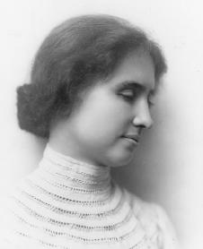
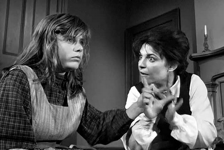

# «Сотворившая чудо», но не сумевшая понять его

**2011-01-31** М. Линде

«Сотворившая чудо»: так называется фильм об истории Хелен Келлер — первого слепоглухого человека, не только научившегося разговаривать, но и получившего высшее образование. Название фильма относится, конечно, не к ней, а к ее учительнице — Энн Салливан, которая, как считалось, «разбудила» в Хелен сознание.

Фильм был снят в США Артуром Пенном в 1962 году, еще при жизни Хелен (на тот момент ей было 82 года). Нужно сказать, что фильм получился действительно качественный, особенно с точки зрения игры Пэтти Дьюк (Хелен) и Энн Бэнкрофт (мисс Салливан), получивших каждая по «Оскару» за лучшую женскую роль. Сцена в столовой, где учительница «укрощает» избалованную и непокорную Хелен, заставляя ее есть ложкой из своей тарелки (а не как приучили ее родители — ходить вокруг стола и брать из тарелок сидящих за ним еду прямо руками) считается одной из самых сильных психологических сцен в мировом киноискусстве.

*«Сотворившая чудо»: сцена в столовой*

Однако, еще задолго до появления фильма история Хелен успела стать всемирно знаменитой. Марк Твен, познакомившись с Келлер, сказал, что XIX век знал двух по-настоящему великих людей: Наполеона и Хелен Келлер. Уже в возрасте 16 лет слепоглухая Хелен поражала окружающих своим умом, благодаря чему получила финансовую поддержку бизнесмена Генри Роджерса и смогла поступить в Редклиффский колледж. Семья Хелен была слишком бедной для того, чтобы обеспечить ей высшее образование.

Наверное, самым поразительным для обычных людей, встречавших Хелен после нескольких лет обучения, было то, что она могла разговаривать, в том числе обычной речью, а не только с помощью тактильного языка (метод обучения звуковой речи слепоглухих состоит в том, что им дают почувствовать вибрации гортани во время произношения того или иного звука и учат воссоздавать такие же вибрации). Собственно говоря, научить Хелен языку — эту задачу и ставила перед собой Энн Салливан, приехав в дом Келлеров. Обучение языку казалось учительнице единственным способом разбудить в девочке человека, приобщить ее к человеческому миру. Однако, как это сделать, она не знала. Она работала с Хелен в двух направлениях: с одной стороны, она постоянно показывала ей с помощью тактильного языка все новые и новые слова, с другой приучала Хелен к дисциплине и послушанию. По фильму складывается впечатление, что единственное, что мешало Хелен наконец овладеть языком — это именно ее избалованность. Поэтому залогом успеха Салливан, как казалось и ей самой, и всему научному миру, стал ее сильный характер, ее энергичность и целенаправленность. Превращение Хелен в человека происходит в тот момент, когда мисс Салливан удается присмирить Хелен и та понимает, что между знаками, которые ей показывает учительница и водой, текущей по ее рукам, есть связь.

Так, фактически, слово — неважно, в какой форме, звуковой или жестовой — оказывается ответом фильма «Сотворившая чудо» на вопрос об отличии человеческого поведения от поведения животного. Мы привыкли осознанно общаться с помощью речи, и другого такого же эффективного способа объяснить что-то, научить чему-то, как рассказать это словами, мы не знаем. Овладение языком поэтому оказывается важнейшим критерием развития человека, так что родители не на шутку волнуются, если их ребенок в 3 года еще не разговаривает — может быть, у ребенка есть и другие проблемы, но этот показатель кажется самым очевидным, самым правдивым. И фильм о Хелен Келлер как бы подтверждает это мнение, демонстрируя, что слово и мысль — это одно и то же, что где есть слово — там есть и мысль.

*Хелен Келлер*

Конечно, история Хелен действительно поразительна, особенно когда не просто читаешь о ней, а видишь в этой прекрасной экранизации ее жизни, как из чего-то совершенно дикого, лишь по форме тела напоминающего человека, рождается действительно человеческое сознание и поведение, как один человек творит своими же руками, своей же волей другого. Фильм «Сотворившая чудо» очень хорошо показывает две вещи — что человек не формируется автоматически, от природы, и что не в физиологических параметрах (в данном случае это зрение и слух) ребенка кроется его возможность стать человеком, а в чем-то другом.

Но методологически подход, показанный в фильме, на сегодня сильно устарел. Если в XIX веке феномен Келлер действительно мог считаться чудом и приписываться даже божественной силе (как и положено чуду), то сегодня, в XXI веке, наука обязана не просто восхищаться и описывать подобные факты, а теоретически объяснить их и научиться воссоздавать. Ведь если понять, каким образом научилась говорить Хелен — это не только раскроет новые возможности в воспитании слепоглухих, но и вообще будет объяснением механизма обучения языку. Ведь это, так сказать, «чистый случай»: отсутствие зрения и слуха дает возможность увидеть, что «автоматическое» возникновение сознания у ребенка — не более чем иллюзия. Принципы работы со слепоглухими можно использовать и для более эффективного развития обычных, зрячеслышащих детей, они могут подсказать родителям, как правильно организовывать раннее воспитание, чтобы отпала, в частности, такая актуальная сегодня проблема поздней речи.

Но вот с этой ли проблемой нужно бороться? Для правильного ответа на этот вопрос нужно более детально, чем это предложено в фильме, ознакомиться с историей Хелен и с современными достижениями в вопросах воспитания слепоглухих детей.

Даже судя по фильму, на момент «попадания в руки» к Энн Салливан девочка была не такой уж и глупой: она умела ходить, различала людей, просила пришить кукле глаза, при первой же встрече заперла учительницу в комнате на ключ, а ключ спрятала во рту, а потом выбросила... Отсутствие у нее способности говорить скорее состояло в том, что ее не особенно-то старались понимать, хотя она сама старалась как могла, придумав более полусотни знаков для общения с семьей. Но родители, записав ребенка в безнадежные, просто содержали его дома как домашнюю зверушку и, когда Хелен начала приносить слишком много неприятностей и неудобств, собирались отдать ее в богадельню. Очень характерное поведение: так отдают щенков и котят, которые уже выросли из «милого» возраста. Тем не менее, ругать родителей Хелен не за что: они ведь не были виноваты в том, что их познания о сущности человека находились на доисторическом уровне.

Так что если внимательно присмотреться, то становится понятно, что Хелен научилась мыслить еще до встречи с мисс Салливан. Но как? Ведь никто с ней не занимался, по крайней мере, в фильме это никак не отображено. Оказывается, что в жизни у девочки была учительница еще задолго до Салливан — ее маленькая чернокожая служанка, которая ухаживала за Хелен и по ходу этого учила ее обращаться с разнообразными вещами: одеждой, мебелью, предметами быта. Но на это никто не обратил внимания: это не считалось обучением.

Однако, как было научно доказано позже, именно обучение обращению с разнообразными предметами — основа формирования у ребенка мышления. Это не так уж трудно понять, если подумать о том, что в каждой вещи заложена логика определенного процесса, и учась пользоваться этим предметом, человек одновременно познает эту логику, учится мыслить так же, как мыслил тот, кто эту вещь изготовил, приобщается к опыту человечества, выработавшего форму этой вещи. Думать человека заставляет каждая вещь, с которой он имеет дело, и это обучение начинается задолго до того, как ребенок хоть в какой-то мере овладевает языком.

Что человек научается мыслить в труде, или, выражаясь по-научному, в предметно-практической деятельности, во времена Хелен Келлер было уже известно — первым эту мысль сформулировал и доказал Фридрих Энгельс в своем знаменитом произведении «Роль труда в превращении обезьяны в человека», которое он написал за 4 года до рождения Хелен.

*Фридрих Энгельс, «Роль труда в превращении обезьяны в человека»: обложка аудиокниги*

Однако, тогда еще не было психологов и педагогов, которые практически бы разрабатывали эту теорию. Психологии как науки вообще еще не существовало, а педагогика блуждала в абстрактном гуманизме и по сущности была еще схоластичной. Так, мисс Салливан в своей работе с Келлер опиралась на идеи доктора Самюэля Хова (Samuel Gridley Howe), который хоть и был революционером в деле воспитания слепых и глухих (по крайней мере, он считал, что они не должны жить в изоляции от общества), но теоретически оставался вполне в пределах вербальных теорий обучения, в основе которых лежит знак (слово), то есть форма. Такое обучение приносит результат, если у учеников уже сформирована способность мыслить: с помощью обучения все новых и новых знаков ученики расширяют свои возможности общения, но реально процесс обучения мышлению проходит в стороне от обучения знакам, так что эффективность знакового обучения оказывается очень низкой. Педагог, вместо того, чтобы сознательно использовать действие с предметом для формирования понятия, сам как слепой котенок в произвольном порядке предлагает ученику знаки-слова, которые для ученика еще ничего не значат, не связаны с предметом, сущность которого он может познать, только использовав его по его предназначению. Так что получалось, что успехи такой педагогики были «случайными», и хотя благодаря тому, что такие дети как Хелен уже умели обращаться со многими предметами, а значит, уже имели человеческое мышление, обучение словесной речи помогало им перейти на новый уровень общения, однако, сами педагоги, в том числе и такие мастера как мисс Салливан, не понимали, как же это все-таки происходит. Именно поэтому, наверное, и Энн Салливанн, и сама Келлер неоднократно объясняли успехи Хелен «божественным озарением».

Достаточно быстро появилась теория, отрицающая вербальный, идеалистический подход к обучению человека. Это была теория советского ученого мирового значения Павлова — фактически, первая материалистическая теория воспитания. Однако, в полной мере объяснить формирование специфически человеческого мышления с помощью рефлексов не удалось — для этого мало было одного материализма, нужен был материализм, не отрицающий идеальное, а понимающий его природу и способный его не только объяснять, но и творить. Здесь нашла свое практическое применение гениальная идея Энгельса о том, что мышление возникает в практической деятельности человека.

Впервые в педагогике теорию обучения в предметной деятельности применили на практике советские психологи Александр Мещеряков и Иван Соколянский, и их успехи были колоссальными: им удалось воспитать не одного, не двух слепоглухих, а почти что поставить их воспитание «на поток». Их воспитанники не только научались говорить, но и получали сложные рабочие профессии, некоторые из них шли в науку, сами становились психологами, педагогами. Хелен Келлер, как известно, тоже получила высшее образование и стала писательницей, но, повторяем, достижение подхода Соколянского и Мещерякова было в том, что такие случаи перестали быть исключениями из общего правила: стало ясно, что принципиально каждый слепоглухой может стать полноценным человеком, что для этого требуется не чудо, не уникальные их физиологические способности или талант, а правильно налаженная и теоретически грамотная работа специалистов.

Школа Соколянского-Мещерякова, конечно, — тема отдельного разговора, о ней можно написать очень много, но это, к счастью, уже сделано (их опыт, например, прекрасно описан в статьях Эвальда Ильенкова [«Становление личности: к итогам научного эксперимента»](http://www.caute.net.ru/ilyenkov/texts/genpers.html), [«Откуда берется ум?»](http://www.caute.net.ru/ilyenkov/texts/ums/ii.html), [«Психика человека под “лупой времени”»](http://www.caute.net.ru/ilyenkov/texts/lupa.html). Главный секрет их подхода — сознательное вырабатывание мышления через применее предметов, или, как это называлось у них самих «совместно-разделенная деятельность». Конечно, это требовало огромного терпения и многократных повторений одних тех же действий, но иного пути нет. Научаясь понимать логику окружающих их вещей, слепоглухие дети приобщались к человеческому мышлению, а обучение языку после этого проходило уже достаточно легко, это была уже не качественная, а количественная работа: понятийное мышление уже сформировано, осталось только запомнить знаки, обозначающие понятия.

А с помощью одного только знака, как это показано в фильме, когда Салливан учила Хелен словам «табуретка» или «дерево», просто ложа на них руку девочки, никак не возможно сформировать понятие ни о табуретке, ни о дереве. Это все равно, что пытаться объяснить маленькому ребенку, что такое слон, завязав ему глаза и дав потрогать слона, например, за хвост: ребенок скажет, что слон — это веревочка. Если бы Энн Салливан знала то, что позже узнали в своей работе Соколянский с Мещеряковым, она бы «показывала» Хелен табуретку не стуча по ней ладонью, а демонстрируя действие, которое ее бы характеризовало.

*Энн Салливан показывает Хелен знаки, обозначающие слова*

Казалось бы, это уникальное в целом мире достижение советской психологии и дефектологии должно было раз и навсегда покончить с сомнениями о возможностях слепоглухих, подарив им, наконец, право быть такими же людьми, как те, кому больше повезло с физиологическими данными. Однако — только представьте себе это! — их опыт оказался невостребованным в XXI веке! Теория Мещерякова и Соколянского, разработанная до деталей и многократно подтвержденная практикой, сейчас не используется, а слепоглухие дети во всем мире опять, как во времена Хелен, растут больше похожими на животных, чем на людей. Даже в Загорской школе, где был выработан этот мощный метод, уже давно дальше обучения пользоваться ложкой не доходит. Почему так произошло? Ответ на этот вопрос прост и банален: эти дети никому, кроме своих родителей, не нужны. Общество не заинтересовано в их развитии, в нем и так хватает конкуренции, так что нет никакого смысла тратить массу ресурсов и сил на воспитание из этих детей людей.

Слепоглухие имеют шансы стать людьми только в обществе, для которого главная ценность — сам человек. Только в таком обществе их развитие может стать не чудом, а обязанностью и большой радостью для человечества.