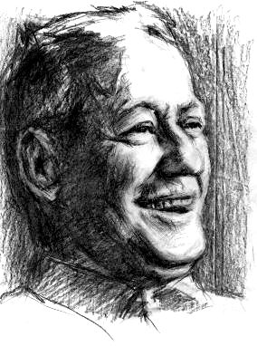

# Михаил Шолохов: портрет без украшений

**2011-02-21** Виктор Сидорченко

*К 27-летию со дня смерти советского писателя Михаила Шолохова.*

Михаил Шолохов принадлежит к когорте тех советских писателей, которые никогда идеи социальной справедливости не распространяли в лоб. Наверное, никто так мастерски не описывал действительность во всех ее противоречиях, как Шолохов.

Родился М. Шолохов 24 мая 1905г. на хуторе Кружилином, станицы Вешенской, бывшей Донской области. Отец его был разночинцем, выходцем из Рязанской губернии, до самой смерти (1925г) менявшим профессии. Мать - полуказачка-полукрестьянка. Грамоте выучилась, когда Шолохов учился в гимназии, и только для того, чтобы самостоятельно писать письма своему сыну. До 1912г., как указывал сам Шолохов, мать и он имели землю: она как вдова казака, а он как сын казачий. С 1912г. он стал числиться «сыном мещанина». Во время Гражданской войны был на Дону и был участником событий, о которых впоследствии смог написать всемирно известный «Тихий Дон». Писать Шолохов начал в 1923 г. «С 1920г., - пишет М. Шолохов в одной из своих автобиографий, - то есть с момента окончательного установления Советской власти на юге России, я, будучи пятнадцатилетним подростком, сначала поступил учителем по ликвидации неграмотности среди взрослого населения, а потом пошел на продовольственную работу и, вероятно, унаследовав от отца стремление к постоянной перемене профессий, успел за шесть лет изучить изрядное количество специальностей. Работал статистиком, учителем в низшей школе, грузчиком, продовольственным инспектором, каменщиком, счетоводом, канцелярским работником, журналистом. Несколько месяцев, будучи безработным, жил на скудные средства, добитые временным трудом чернорабочего. Все время усиленно занимался самообразованием... в 1926 году начал писать «Тихий Дон». Восемь лет я потратил на создание этого романа и теперь, пожалуй, окончательно «нашел себя» в профессии писателя, в этом тяжелом и радостном творческом труде». (См.: Шолохов М. Собр. Соч. в 8-ми т.т., т. 8, с. 37-38)

Шолохов как писатель заявил о себе своими «Донскими рассказами» (1925г.). Основная их тема - Гражданская война и послевоенное десятилетие. В дальнейшем эти две темы Шолохов раскрыл в своих романах «Тихий Дон» и «Поднятая целина».

Шолохов стал одним из первых, кто мастерски сумел применить метод исторического материализма и материалистической диалектики в художественной литературе. Я бы даже сказал, что Шолохов в своих романах показал себя великолепным социологом. «Пришла пора, - как сам он указывал, - говорить о литературе настоящим, мужественным языком и вещи называть их собственными именами». (Там же, с.43). В полной мере свое мастерство он смог раскрыть в романе «Тихий Дон». Здесь вся тогдашняя действительность описана во всех ее противоречиях. Некоторые «критики» даже обвиняли Шолохова за это в антисоветизме. В письме к А. Фадееву Шолохов пишет по этому поводу: «У меня этот год (1929г. - В.С.) весьма урожайный: не успел весной избавиться от обвинений в плагиате, еще не отшумели рулады той сплетни, а на носу уже другая» (Там же, с.14). В скором времени общественность встала в защиту писателя. Так 5 ноября 1929г. Газета «Большевистская смена» поместила сообщение секретариата СКППа «Против клеветы на пролетарского писателя», в котором Шолохова полностью оправдали. В знак своей солидарности с Советской властью в этом же году, сразу же после его оправдания, Шолохов подал заявление о вступлении в партию.

Будучи писателем, Шолохов так же активно выступал на общественно-политической арене. Если в период Гражданской войны Шолохов, как он сам указывает, «гонялся за бандами, властвовавшими на Дону до 1922 года» (там же, с. 32), то есть с момента вступления в партию он является активным проводником линии партии на селе. В таких статьях и очерках как «По правобережью Дона», «За перестройку», «Преступная бесхозяйственность», «Результат непродуманной работы» и др. он выступает за идею коллективизации и резко критикует ее отдельные перегибы на местах. «Нужно крепко драться, - пишет он в статье «За перестройку»(1931г.), - за перестройку колхозного хозяйства. Нужно так хозяйствовать, чтобы давать стране в достаточном количестве не только хлеб, но и мясо, и шерсть, и даже строевую донскую лошадь, и тем самым увеличивать благосостояние колхозов». (Там же,с.32).

Роман Шолохова «Тихий Дон» принес ему всемирную известность. Не будучи еще дописанным до конца, он в 1934г. отдельными частями издается в Англии. «Меня несколько смущает то обстоятельство, - пишет он в предисловии к английским читателям, - что роман воспринимается в Англии как «экзотическое» произведение. Я был бы счастлив, если бы за описанием чужой для европейцев жизни донских казаков читатель-англичанин рассмотрел и другое: те колоссальные сдвиги в быту, жизни и человеческой психологии, которые произошли в результате войны и революции... Книга моя не принадлежит к тому разряду книг, которые читают после обеда и единственная задача которых состоит в способствовании мирному пищеварению» (Там же, с. 44).

Шолохов всегда любил писать по горячим следам. Не закончив еще «Тихий Дон», он берется за описание коллективизации. Так началась создаваться «Поднятая целина». Сравнивая эти два романа, можно увидеть то общее, что присуще всем его произведениям - мастерская диалектика. Нигде мы не видим подхалимства Советской власти, ее чрезмерного восхваления и пр., сами факты говорят за себя. Жизнь показана во всех ее противоречиях. Это связано с тем, что Шолохов был тесно связан с народом, о котором он писал. Имея всемирную известность, он до конца своих дней оставался в станице Вешенской на родной ему донской земле. «Прозаики, исчерпав себя темой о Гражданской войне и первоначальных годах строительства, не знают, о чем писать, - пишет он сам по этому поводу, - потому что ничего не знают, Живут они в Москве, постоянно видят одних и тех же людей...Передо мной вопрос о теме не стоит. Я нахожусь в других условиях и считаю, что мог бы дать взаймы три-четыре темы прямо с материалами» (Там же, с. 51).

В 1939г. Шолохова избирают делегатом XVIII съезда ВКП (б). С трибуны съезда Шолохов говорит о «наболевшем» для него - качестве литературы и ее количестве. Процент бумаги, по его мнению, отпускаемый на художественную литературу, ничтожно мал. С этой же трибуны он выступает против навязываемой фашистами войны. «Советские писатели, - говорит он, - надо прямо сказать, не принадлежат к сентиментальной породе западноевропейских пацифистов... Если враг нападает на нашу страну, мы, советские писатели, по зову партии и правительства, отложим перо и возьмем в руки другое оружие.» (Там же, с. 71).

В годы Великой Отечественной Войны сам Шолохов «поменять оружие» не смог: партия дала задания ему иное - поднимать дух бойцов. Он стал военным корреспондентом. Будучи в самых горячих точках сражений он описывал подвиг советского народа. Так родились всемирно-известные «Судьба человека» и «Они сражались за Родину» и много других произведений. «Пройдут века, но человечество всегда будет хранить благодарную память о героической Красной Армии», - так вкратце охарактеризовал Шолохов свое отношение к Великой Победе и Красной Армии, её роли в истории человечества.

В послевоенное время Шолохов активно выступает за мирное сосуществование двух систем. Эту идею он активно распространяет на различных форумах всесоюзного и международного масштаба.

В 50-х годах Шолохов неустанно критикует начавшуюся бюрократизацию Союза советских писателей. Так на 2-м съезде Союза (1954г.) он высказывается против формализма в выступлениях, снижения требовательности к себе отдельных писателей и др. На этом же съезде, как и на других форумах, он говорит об опасной тенденции отдаления советских писателей от народа. Его предложения в связи с этим, на котором он отстаивал до конца своих дней - разъехаться писателям по регионам, жить с народом. С трибуны известного XX съезда КПСС он так говорил об этой проблеме: «Общеизвестно, что Лев Толстой знал душу русского мужика, как никто из нас, современных писателей, Горький исходил всю Россию пешком; Лесков исколесил ее на почтовых и вольнонаемных лошадях; Чехов, даже будучи тяжело больным, нашел в себе силы, и, движимый огромной любовью к людям и профессиональной писательской любознательностью, все же съездил на Сахалин. А многие из нынешних писателей, в частности многие из москвичей, живут в заколдованном треугольнике: Москва - дача - курорт и опять: курорт - Москва - дача. Да разве же не стыдно так по-пустому тратить жизнь и таланты?» (Там же, с. 228-229).

Шолохов одним из первых стал высказываться против коммерциализации литературы и искусства на Западе, когда это было еще в зародышевом состоянии и не имело массового характера. Сейчас это превратилось уже в систему, именуемую маскультурой, которая низводит смысл искусства к обычному предпринимательству.

В 1960г. Шолохову присуждают Ленинскую премию за роман «Поднятая целина», которую он передал в распоряжение Каргинского сельсовета Базковского района Ростовской области на строительство новой школы.

В 50-х60-х годах такие произведения Шолохова, как «Судьба человека», «Тихий Дон» и «Поднятая целина» были экранизированы. Самой лучшей экранизацией сам Шолохов считал фильм режиссера Бондарчука по рассказу «Судьба человека». В 1965г. Всемирное признание Шолохова было закреплено официально. За роман «Тихий Дон» ему присуждена Нобелевская премия. Сам этот факт для Шолохова означал торжество советской художественной литературы на мировом уровне.

Как и в предыдущее время, в 70-х-80-х годах - последних годах его жизни, - Шолохов оставался самим собою. Место жительства не менял, был всегда с народом и никогда не уставал критиковать любое проявление бюрократии и никчемного отношения к литературе. Есть здесь и новое. Шолохов часто говорит чуть ли не о кризисе в советской литературе. Очень мало по величию и значимости новых произведений, в сравнении с 20-ми-50-ми годами - вот основная идея его выступлений уже в последние годы жизни. С этими мыслями Шолохов, наверное, и ушел из жизни.