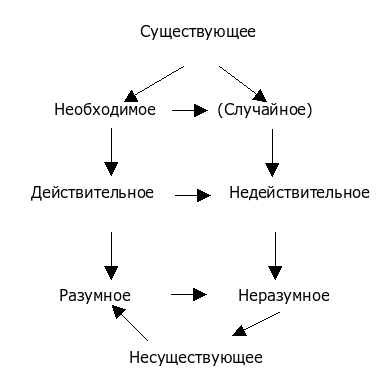
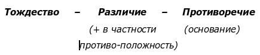

# Случайность как исторически изжившая себя необходимость

**2008-12-03** Анна Кошевая

*Любой цветок неотвратимо вянет* 

 *В свой срок и новым место уступает,*

 *Так и для каждой мудрости настанет*

 *Час, отменяющий её значенье,*

 *И снова жизнь душе повелевает*

 *Себя перебороть, переродиться*

 *Для неизвестного ещё служенья,*

 *Привычные святыни покидая*

*………………………………………….*

*Опасно через меру пристраститься*

 *К давно наезженному обиходу,*

 *Лишь тот, кто вечно в путь готов пуститься,*

 *Выигрывает бодрость и свободу.*

**Герман Гессе**

Диалектика категорий необходимости и случайности в основной массе работ получает своё развитие лишь в одном направлении, а именно, в направлении перехода от случайности к необходимости (гносеологический аспект), либо рассматривается вопрос о способе реализации необходимости (онтологический аспект), её воплощение в действительность через случайность.

Однако движение данных категорий в обратном направлении, т.е от необходимости к случайности, как в познании человеком объективной реальности, так и в самой объективной реальности, практически не раскрыто. Соответственно, возникает потребность понять, когда и при каких условиях возможен данный переход (от необходимости к случайности). Да и возможен ли (в этом пока тоже необходимо усомниться)?

Поэтому для установления правомерности утверждения о существовании перехода необходимости в случайность мы обратимся к знаменитой идее Гегеля: «Всё действительное разумно, всё разумное действительно», суть которой была раскрыта Энгельсом в работе «Людвиг Фейербах и конец классической немецкой философии». Ключом, раскрывающим сущность данного положения, является понимание Гегелем категории «действительность». Согласно Гегелю *действительным* есть то, что существует и в то же время является необходимым, т.е. не всё, что существует, является также и действительным, а лишь то, на чём лежит печать необходимости.

В целях установления соотношения категорий, актуализированных Энгельсом при выявлении сути гегелевского положения, представляется возможным употребить следующую схему:

Из схемы видно, что в категориальной системе, используемой при раскрытии гегелевской идеи, существует «пробел» - категория необходимости не соотнесена со своей противоположностью.

При движении мысли в «левой» части схемы, получаем следующее умозаключение: «Нечто существующее и в то же время необходимое является действительным, и следовательно, разумным» (Существующее + Необходимое = Действительное Разумное).

В отношении «правой» части схемы можно привести рассуждение Энгельса: «… По мере развития, всё, бывшее прежде действительным, становиться недействительным, **утрачивает свою необходимость**, своё право на существование, свою разумность». [274;6]

Таким образом, всё действительное в ходе истории превращается в *недействительное,* которое является существующим, но не имеющим на это права (исторически осуждённое на свою гибель), и не необходимым, т.е. случайным. И далее Энгельс пишет по поводу судьбы этого «без права существующего», случайного (поскольку оно не имеет основания на данном историческом этапе) следующее: «Место отмирающей действительности занимает новая, жизнеспособная действительность; занимает мирно, если старое достаточно рассудительно, чтобы умереть без сопротивления, - насильственно, если оно противится этой необходимости». [275;6]. Таким образом, определённому явлению, ставшему случайным, т.е. исторически изжившему свою необходимость, надлежит умереть. Однако статус случайности или необходимости любое явление (процесс и т.д) получает лишь в движении истории, лишь в реализации исторической действительности, лишь в *определённом конкретном отношении*, сами же по себе они являются *одновременно* и случайными, и необходимыми, т.е. удерживают напряжённость данного противоречивого единства в своей сущности. Энгельс выражает данную мысль следующим образом: «… всё действительное в области человеческой истории становится со временем неразумным, оно, следовательно, неразумно уже **по самой своей природе, заранее обременено неразумностью…**» [275;6].

Однако возникает вопрос, где, как и почему возникает то новое, которое необходимо должно сменить собой предшествующее ему состояние (форму, этап и т.п.)? Допустим мы имеем нечто, существование чего оправдано тем временем (определённым историческим этапом) и теми условиями, которые его породили. Т.е. мы имеем *относительную необходимость* данного нечто, опосредованную определённым кругом условий, причин и т.д. Через относительную необходимость раскрывается (осуществляется) реальная *возможность*, которая на схеме представлена как **несуществующее**, переходящее через разумное в действительное. Однако здесь мы сталкиваемся с диалектикой опосредованного и непосредственного: «Необходимость – есть … то, что опосредовано кругом обстоятельств; оно такое, потому что обстоятельства таковы, и в то же самое время оно таково непосредственно, - оно таково, потому что оно есть» (Гегель).

Следовательно, действительность необходима по отношению к *условиям* и *причинам*, которые её произвели и вместе с тем она необходима по отношению к себе благодаря собственному основанию, когда она созрела, когда *сформировалась сущность*.

Однако возникает вопрос, что понимается под созревшей сущностью? Ленин В.И. в «Философских тетрадях» приводит следующую схему становления определённого нечто[120;5]:

Сущность, развиваясь от простого тождества с собой (А=А, в котором не имеет основания), через отрицание себя в различии с собой (А=не=А), приходит к разрешению противоречия, «сведению позитивного и негативного к «только определениям», превращает *сущность* в *основание.*» И далее: «… Разрешённое противоречие есть, следовательно, основание, сущность, как единство положительного и отрицательного» [122;5].

Таким образом, созревающая сущность есть сущность, развившая свои внутренние противоречия, чем обусловившая **основание** своего существования, своей действительности, и *в то же время* своей гибели. «Гибель достойного гибели разумна и необходима на пути поступательного развития» [119;1].

Здесь мы подошли вплотную к ответу на вопрос о происхождении того нового, которое призвано сменить собой старое. «… Новая форма, которая должна быть порождена из старой формы и может быть подготовлена только самой старой формой для своей замены, как естественный результат развития и разрешения внутренних противоречий» [120;2].

Следовательно, определённое нечто (т.е. рассматриваемое в каком-либо конкретном отношении), развивая своё внутренне противоречие (которое и определяет его как именно данное нечто), приходит к необходимости через скачок изменить себя, перейти в иное, т.е. уже изначально удерживает в себе момент гибели, в чём проявляется созидающая роль уничтожения. «Старое как бы на своей гибели взращивает новое» [119;1].

Если же посмотреть на взаимодействие нового и старого сквозь категории необходимости и случайности, то само собой разумеется, что через возникновение нового и гибель старого прокладывает себе дорогу *необходимость*. Однако как новое, так и старое может быть и *случайным* (которое в конечном счёте, является одной из форм реализации необходимости (другая форма – свобода)), в зависимости от того, на каком *уровне общности* мы рассматриваем определённое явление: как находящееся в каком-либо конкретном отношении к чему-либо (тогда случайное) или как включённое в более широкий круг взаимозависимостей (тогда необходимое, ибо имеет своё основание в чём-то ином).

Примером *«нового как случайного»* может послужить взаимоотношение базиса и надстройки при капитализме. Сформированные социально-экономические условия, предпосылки для появления нового способа мышления вовсе не приводят к автоматическому его возникновению как тотального явления (присущего каждому отдельному индивиду как форме своей реализации). На начальном этапе необходимость нового способа мышления проявляет себя как случайность (возможно, что при коммунизме данная необходимость будет проявлять себя в форме свободы), воплощающаяся в отдельных индивидах, т.е. *объектом* реализации данной необходимости есть не *масса*, а *отдельный индивид*. Однако следует уточнить ещё один важный момент, о котором В.А.Босенко пишет: «… Если при наличии соответствующих социально-экономических условий, фактором, требующим возникновения диалектического способа мышления, последний **может появиться, а может и нет** (в зависимости от целого ряда других факторов – объективных и субъективных, идеологических и т.п.), то без таких условий, без возникновения этих факторов такого ранга и уровня диалектического способа мышления *не будет в любом случае*». [363;1].

В рамках же данной работы нас интересует именно «*старое как случайность*», в форме чего изживает себя необходимость определённого исторического этапа.

Однако здесь следует сразу указать на один момент методологического плана, который ранее уже упоминался в данной работе в неявной форме, но который требует более чёткой формулировки для верного понимания сути взаимопереходов необходимости и случайности. Определение чего-либо как случайного или необходимого носит условный характер, поскольку это нечто рассматривается, так сказать, « в чистом виде», то есть «в таком в котором оно в самой действительности изолирован но не существует, но оправдано как таковое в определённом конкретном отношении и лишь постольку, поскольку в процессе познания мы вырываем его из этой, всеобщей связи и рассматриваем с той или иной стороны. При этом объект познания в таком случае предстаёт перед нами в несколько оторванном и даже неизбежно одностороннем и значительно ограниченном, обеднённом, абсолютизированном и омертвевшем виде. Стоит, правда учитывать неизбежность такого вырывания, поскольку, исследуя любой конкретный процесс каждого конкретного взаимодействия, мы уже этим самым исследованием вырываем его из всеобщих связей, изолируем и рассматриваем в том или ином из его бесконечных объективных конкретных отношений. А в таком случае он будет выступать *либо* как внутреннее противоречие, *либо* как внешнее, *либо* как созидание, *либо* как разрушение и т.п.» [19;2].

Именно в таком разрезе мы и рассматриваем в данной работе (а по возможности и постоянно) определённое «нечто» *либо* как случайное, *либо* как необходимое, постоянно подразумевая единство и того, и другого в данном объекте нашего познания.

Теперь, после некоторого (однако довольно необходимого для верного понимания излагаемой проблемы) отступления, мы можем приступить к выяснению сути выделенного нами объекта – «старое как случайность». Для этого вернёмся к нашему мысленному эксперименту с определённым нечто. Итак, в процессе разрешения своего внутреннего противоречия оно пришло к несоответствию со своей формой, в которой оно выражалось до этого. Таким образом, устаревшая форма данного нечто становится чем-то внешним по отношению к новой созревшей сущности, чем порождает необходимость своего уничтожения. Т.е. данная форма больше не определяется этой сущностью, не является необходимой по отношению к ней, и выступает как случайность, имеющая своё основание (т.е. необходимость) на более общем уровне взаимосвязи явлений (т.е. при включении данного нечто в более широкий круг взаимозависимостей эта случайность снимается в необходимости более «глобального» процесса). Следовательно, взаимоотношения устаревшей формы и новой сущности теряют характер внутренне противоречивого единства, превращаясь во *внешнее противостояние* друг другу, т.е. приобретают характер *антагонизма*. В установившихся антагонистических отношениях старая форма выступает уже в роли *препятствия* на пути дальнейшего развития своих внутренних противоречий.

Таким образом, именно роль препятствия, которую приобретает устаревшее, обуславливает такой его атрибут как случайность. «Исполняя» данную роль, старое вступает в антагонистические отношения с новым, чем порождает необходимость своего уничтожения через взрыв (естественно в том случае если оно решилось играть эту роль до конца, (само собой понятно, что не до победного), чего бы это ему не стоило). Данную ситуацию очень метко в образной форме выразил Босенко В.А.: «Ужимки дряхлой, но отчаянно молодящейся старухи уже никем не принимаются всерьез» [120;1].

Довольно интересно сущность статуса случайности, лежащей печатью на устаревшем, выражает К.Маркс в своей работе «К критике гегелевской философии права. Введение», рассматривая современный ему немецкий режим как анахронизм: «Современный *ancien regime* (старый порядок) – скорее лишь **комедиант** такого миропорядка, действительные герои которого уже умерли. История действует основательно и проходит через множество фазисов, когда уносит в могилу устаревшую форму жизни. Последний фазис всемирно-исторической формы есть её **комедия**… Почему таков ход истории? Это нужно для того, чтобы человечество **весело** расставалось со своим прошлым». [120;1].

Именно в образе комедианта необычайно точно схвачена суть «устаревшего как случайного», поскольку образ арлекино и есть квинтесенция случайности как таковой (т.е. её абстрактное существование, пустое, нечто сродни «дурной индивидуальности»).

В качестве некоторого итога, можно «испытать» выявленный переход необходимости в случайность при анализе (через синтез, в единстве с синтезом) конкретного явления, и по возможности установить значимость выявленного для познания этих конкретных явлений, насколько оно помогает схватить суть изучаемого явления (или другими словами, провести своего рода пилотажное исследование).

Возьмём в качестве объекта нашего мысленного эксперимента человека капиталистического общества эпохи империализма. Для выявления наиболее характерного и определяющего его *сущность* обратимся к «Экономико-философским рукописям 1844 года» К.Маркса: «Производство производит человека не только в качестве товара, не только **человека-товара**, человека с определением товара, оно производит его, **сообразно этому определению**, как существо и духовно и физически обесчеловеченное … Продукт этого производства есть **товар,** обладающий сознанием и самостоятельной деятельностью … **человек-товар**…». Выявляя существование человека при капитализме в *форме* рабочего, Маркс делает следующее крайне важное замечание, характеризующее отношение человека к капиталу как *антагонистическое*: «Человек есть уже только рабочий, и в качестве рабочего он обладает *лишь теми* человеческими свойствами, которые **нужны чужому для него капиталу**…» (Интересно соотнести данное высказывание со словами Босенко В.А. по поводу сущности «взрыва»: «При столкновении может уничтожится не всё тело, вещь, явление, которое встретилось на пути, а только **те его свойства**, которые стали преградой и таким образом условием его антагонизма») []. «А так как капитал и рабочий друг другу чужды и потому находятся в **безразличных, внешних и случайных** взаимоотношениях, то эта отчуждённость должна выступать также и реально.» И далее: «Существование капитала есть его (рабочего. – А.К.) существование, его жизнь, подобно тому как оно **определяет содержание его жизни безразличным для него способом.** Поэтому политическая экономия не знает незанятого рабочего, не знает человека труда, поскольку он оказывается вне этой сферы трудовых отношений. Плут, мошенник, нищий, безработный, умирающий с голоду, нищенствующий и совершающий преступления человек труда, всё это – фигуры, существующие не для политической экономии, а только для других глаз, для глаз врача, судьи, могильщика, надзирателя за бедными и т.д.; это **призраки,** витающие вне сферы политической экономии».

Таким образом, человек, находясь в антагонизме с чуждым ему капиталом в форме рабочего, выступает в *роли препятствия*, вследствие чего приобретает статус случайного. Однако выйти из этих отношений он не может, поскольку мгновенно превратится из существующего ничто (рабочий) в несуществующее ничто («призрак»), т.е. кроме своей сущности (утраченной в капитале как мёртвом труде) он потеряет и своё существование.

Современная форма капитализма (империализма) является полностью исчерпавшей себя, устаревшей, не имеющей право на существование. Поскольку же именно капиталистические производственные отношения определяют форму существования человека как рабочего, то устаревание капитализма является также и устареванием рабочего. Следовательно форма человека-рабочего есть препятствием на пути разрешения человеком своих внутренних (сущностных) противоречий, которое требует своего уничтожения. (Т.е. мы имеем противоречие производственных отношений и производительных сил, которое приобрело характер антагонизма).

Таким образом, в ходе нашего мысленного эксперимента человек-рабочий приобретает вид «устаревшего как случайного», через которое изживает себя историческая необходимость в капиталистическом обществе.

Выявив бытийный статус современного человека небезинтерестным будет посмотреть как он (данный базис) отражается сознанием самого этого человека, как он переживается им.

Г.Лукач анализируя данную проблему в своей работе «Экзистенциализм», указывает на следующий существенный момент в современном общественном сознании: «Общая тенденция эпохи империализма состоит в пренебрежении общественными отношениями; они рассматриваются как второстепенные данности, либо **совсем не затрагивающие сущности человека,** либо в лучшем случае затрагивают её поверхностным образом»[6;4]. Следствием такой индивидуалистической установки (которая в максимально выраженном виде проявляется у рабочего умственного труда, и обусловлена особенностями условий и характера труда, его социальных связей и образа жизни, о чём говорил ещё Ленин: «интеллигенция, как особый слой современного капиталистического общества, характеризуется, в общем и целом, именно индивидуализмом»), является противопоставление общества индивидуальному сознанию в форме **«das Man»***.* Используя феноменологический метод, Хайдеггер придаёт *«das Man*» онтологическое бытие, «чтобы в нём воплотить то, что, по его мнению, является **функцией общества:** отвратить человека от его самого, сделать его несущественным, отдалить его от его собственной экзистенции» [18;4].

Таким образом, современный человек, пребывает в форме «устаревшего как случайного», противопоставляет себе свою истинную сущность (которая есть совокупность всех общественных отношений) как *внешнюю, подавляющую его силу.*

Довольно точно бытие человека в форме «устаревшего как случайного» отражено Ж.-П.Сартром (который является «выразителем» характерного для сознания всего капиталистического общества): «Бытие лишено смысла, причины, **необходимости**; по определению, бытие есть **«исконно случайное»**[18;4]**.**

Таким образом, именно в экзистенциализме концентрируется, осознаётся пребывание человека в изжившей себя, случайной, внешней по отношению к его сущности, форме рабочего. И абсолютно верно и главное точно Лукач называет экзистенциализм **феноменом эпохи** и следующим образом характеризует книгу Хайдеггера «Бытие и время»: «Лишь потому, что эта книга так соответствует миру чувств сегодняшней интеллигенции, произвол выводимой из неё мнимой аргументации не разоблачается» [19;4].

И в завершение, можно выдвинуть предположение, что именно пребывание современного человека в этой изжившей себя форме рабочего, которую изо всех сил старается удержать капитализм в образе «молодящейся старухи», именно загнивание, самоуничтожение человеческой сущности в жёстких, но уже трескающихся по швам, рамках данной формы (которая есть преграда, требующая своего уничтожения через взрыв) обуславливает отсутствие у современной истории своего *субъекта*. По этому поводу можно привести следующие слова Ильенкова Э.В.: «…Уходящие, реакционные социальные силы способны порождать достаточно яркие фигуры, личностей, вроде Рузвельта или Черчилля, лишь постольку, поскольку они ещё являются силами, т.е. сохраняют известное влияние в обществе. Но чем дальше, тем больше представляющие эти силы личности *мельчают,* так что и «личностями» - то их назвать становится всё труднее и труднее».[3].

Литература

1. Босенко В.А. Всеобщая теория развития. – Киев, 2001.

1. Босенко В.О. До питання про діалектику взаємовідношення «вибуху», «стрибка» в процесі руху. – видавництво Київського ун-ту, 1961.

1. Ильенков Э.В. Что же такое личность / Философия и культура. – Москва, 1991.

1. Ленин В.И. Полное собрание починений. Т. 29. Изд. 5-е. – Москва, 1963.

1. Лукач Г. Экзистенциализм.

1. Маркс К. Экономически-философские рукописи 1844 года / Сочинения, 2-е изд. Рукопись 2.

1. Маркс К., Энгельс Ф. Людвиг Фейербах и конец классической немецкой философии. Сочинения. Изд. 2-е. Т. 21. – Москва, 1961.