# На Летней школе с «Гренадой»

**2011-09-12** Андрей Самарский

Проведение ежегодной 10-ти дневной выездной философско-экономической школы в Крыму уже стало доброй традицией для редакции научно-популярного журнала «Пропаганда». Этим летом нашу «Летнюю школу» посетил особый гость — Народный ансамбль России «Гренада»! Это обстоятельство внесло много требований к мероприятию, главное — интересно и доступно ввести участников в мир интересных идей и глубокого мышления. Поэтому за основу учебной программы была взята популярная книга известнейшего советского философа-марксиста Эвальда Васильевича Ильенкова.

Перед организаторами школы стояла нелегкая задача — кроме организации теоретической и бытовой стороны, составить культурную программу. Москвичи специально привезли с собой часть музыкальных инструментов (в коллекции ансамбля более 800 музыкальных инструментов почти всех народов мира!), поэтому было бы непростительно не организовать хотя бы несколько концертов для местных жителей и тех, кто лечится на сакских курортах. В этом нам помогли руководители Сакского территориального отделения Союза ветеранов Афганистана. С другой стороны плотный учебный график требовал хорошего согласования всех мероприятий. В итоге все получилось неплохо.

Ансамбль прибыл в Крым исключительно молодежным составом. Для нашей летней учебы молодежный состав привычен — обычный средний возраст участников немногим больше 20-ти. Было, правда, небольшое опасение, что москвичам не понравится степная природа западного побережья Крыма и довольно скромные условия проживания (ведь музыканты исколесили полмира, где их часто принимали по высшему разряду). Но как только они прибыли, все сомнения сразу развеялись. Не зря говорят: не место красит человека, а человек место. Все «гренадовцы» — яркие личности, и не только на сцене — уютный дворик одной из черноморских турбаз с большой беседкой в центре сразу же стал источником музыки, танцев, интересных разговоров и простого человеческого счастья. Ведь ребят по жизни объединяет нечто большее, чем музыка. Музыкальный ансамбль — это лишь верхушка айсберга под названием Творческое объединение «Гренада», куда входят разные энтузиасты, которые играют, поют, танцуют, пишут и издают книги, фотографируют, снимают фильмы, обучают музыке, организовывают увлекательные экскурсии для друзей-иностранцев. И все это не имеет под собой никаких коммерческих оснований. Деятельность коллектива направлена на изменение нашего мира к лучшему, а стремление к деньгам часто ведет в обратном направлении.

В то время, когда большинство людей едет в Крым с одной целью — отдохнуть, а музыканты — заработать (в разгар курортного сезона любая живая музыка оплачивается по «двойному тарифу»), «Гренада» выступала абсолютно бесплатно. Ансамбль никогда не изменяет своему принципу: быть независимым от коммерции и спонсоров, как бы показывая всему музыкальному миру, на каких основаниях должно развиваться настоящее искусство. Даже на жизнь музыканты зарабатывают не музыкой — каждый участник «Гренады» имеет какую-то «гражданскую» профессию.

Первый концерт состоялся в санатории им. академика Н.Н. Бурденко, где лечатся инвалиды 1-й группы, не имеющие возможности самостоятельно передвигаться. Увидев массу людей в инвалидных колясках, мы, группа поддержки, заволновались: воспримет такая специфическая публика концертную программу «Гренады», основу которой составляли зажигательные латиноамериканские песни и танцы? Некоторое замешательство внесла сцена, точнее ...ее отсутствие. Вместо душного и неудобного для инвалидных колясок актового зала, музыкантам предложили выступить прямо на большом балконе второго этажа, огражденного парапетом, под которым во дворе санатория вечерами все собираются. Опытные артисты быстро и очень удачно спланировали мельчайшие детали концерта, сделали хороший звук (отстроить звук на открытом месте гораздо сложнее, чем в зале) и удачно разместили группу танцевального сопровождения.

Танцы — это отдельная страница в творчестве «Гренады». Несколько лет назад ансамбль начал ставить профессиональные танцы разных народов мира, мастерски объединяя балет и исполнение песен. Если большинство артистов гастролируют по миру, просто показывая себя, то «гренадовцы» взяли за принцип «увозить» с собой песню, танец, национальные наряды, а, если получится, то и уникальные музыкальные инструменты (например, из Венесуэлы, куда «Гренаду» пригласил лично президент Уго Чавес, был привезен куатро — маленькая четырехструнная гитара, с Кубы — бонго, гуиро, маракас, которые звучали во всех крымских концертах). В перерывах между песнями артисты знакомили зрителей с экзотическими андскими музыкальными инструментами: флейта кена, маленькая гитара чаранго и чайчас - шумовой инструмент связанный из копыт ламы, которые эти животные периодически сбрасывают, чтобы на их месте вырастали новые. Специально для танцев девушки везли с собой целый гардероб из нарядов разных национальностей, чтобы показать все это крымской публике, которая с удивлением и наслаждением смотрела разные танцы: греческий, колумбийский, американский, бразильский, и, конечно же, русскую кадриль.

Среди друзей ансамбля — представители многих народов мира. Наиболее тесно он общается со странами Латинской Америки, а вот с соседями-украинцами дружба, как ни странно, завязалась лишь недавно. Это досадное упущение помогла исправить Куба! На каждом из концертов ведущая Валентина Баева непременно рассказывала о том, как они здесь оказались. В ноябре прошлого года «Гренада» выступила на грандиозном концерте [«Gracias, Cuba!»](/2915.md), который проходил в рамках международной научно-практической конференции [«Благодарная Украина — Благородной Кубе»](/2921.md) в Киевском политехническом институте. Одними из организаторов этого мероприятия были члены редакции «Пропаганды». Мы и пригласили москвичей на свою регулярную «Летнюю школу». В свою очередь, ее завсегдатаи и новички, были очень рады таким гостям — автобус, возивший музыкантов на концерты, с трудом вмещал всех желающих послушать великолепную музыку и насладится зажигательными танцами в исполнении темпераментных москвичек.

Бесполезно передать на словах все то, что происходило на сцене. Это нужно видеть! Ансамбль «Гренада» вызывает самые высокие человеческие чувства. Настоящие человеческие чувства.

И все же, некоторые моменты необходимо дополнить словами. Есть одно чувство, которое неизменно возникает на концертах «Гренады» у любого слушателя, даже если раньше они о нем не догадывались. Это — чувство интернационализма. Коллектив исполняет песни на 30 языках, что в современном музыкальном мире — уникальное явление. Это лучшие песни разных народов, которые стали близки миллионам людей, сопровождая их в счастье и горе. Это песни протеста, борьбы против угнетения, песни революции. Удивительным образом, даже не понимая слов, слушатель на концерте «Гренады» чувствует, о чем она. Для выступлений в Крыму ребята подготовили песни на испанском, английском, греческом, португальском, финском, русском, украинском, итальянском языках. А еще прозвучала песня на языке индейцев гуарани — втором официальном языке Парагвая, страны на противоположной стороне Земли, где в это время гостила руководитель ансамбля Татьяна Львовна Владимирская. Благодаря давней дружбе «Гренады» с этой страной, ребята освоили этот сложный язык и смогли спеть на нем песню для зрителей, может быть, даже не подозревавших о существовании такого народа.

Особо сильно прозвучала антивоенная песня «Я требую мира!» Как бы не увещевали нас всевозможные СМИ, о том, что сейчас войн нет — есть только борьба с «мировым терроризмом» или «античеловеческими диктатурами», реальность, увы, противоположная. Жаль, что в мире очень мало музыкантов, которые твердо могут сказать «Нет!» современным «гуманитарным» войнам в Афганистане, в Ираке, в Ливии.

*Слышите стон? слышите крик? слышите плач?

Страшную смерть миру готовит новый палач!*

К сожалению, эта песня не утрачивает актуальности, ведь капитализм как раненный хищник, становится особо опасным. Необычайно красивая и трогательная финская песня «Наталия» напомнила о совместной борьбе многих народов против фашизма, подчеркивая, что только вместе можно противостоять мировому агрессору. Эти песни вместе с песнями Латинской Америки — которая является единственным на сегодня регионом, эффективно противостоящим мировому империализму — создают особую атмосферу, дающую очень глубокое чувство и, вместе с тем, правильное понимание. Ведь интернационализм — это не просто дружба между разными народами, интерес к другим культурам, стремление побывать во многих странах. Это — совместная борьба против угнетения, умение переживать судьбу народов, как свою, а стихи и музыка как раз эти чувства и формируют. Недаром ансамбль носит такое название! Проникшись духом светловской «Гренады», многие советские парни, повзрослев, без колебаний стали в строй республиканских интербригад в Испании в 1936 году, чтобы вместе с парнями из других стран бороться против франкистских фашистов.

На следующий день был концерт в Сакском центральном клиническом военном санатории им. Пирогова. Наверное, публика, которую составляли довольно состоятельные люди, не так быстро почувствовала и поняла, кто выступает перед ними, но «гренадовцы», как всегда, оказались на высоте. Вообще, нужно сказать, что чем больше бываешь на концертах этого коллектива, тем больше хочется быть еще. Такая музыка и такая благодатная атмосфера не может надоесть в принципе. Летняя площадка, служившая сценой, давала возможность более непосредственного общения с залом, особенно, в плане танцев. Когда звучали зажигательные греческие и бразильские песни, красивые девушки сходили со сцены и приглашали всех на совместный танец! Тогда пришедшие на концерт становились не только зрителями, но и в некотором роде его участниками.

Украинские друзья тоже старались не подкачать и поделиться с «Гренадой» своими достижениями. Основная цель «Летней школы» — пробудить у человека интерес к серьезным мировоззренческим вопросам и показать каким образом мыслить, чтобы эти вопросы не казались неразрешимыми; дать своего рода ключ к пониманию важнейших общественных вопросов современности. Поэтому основной упор делался на мировую историю и философию марксизма, точнее, на ее диалектический метод мышления.

Те, кто бывал на наших предыдущих школах, знают про заведенный распорядок: ранний подъем, зарядка на пляже и купание, игра в волейбол. Естественно, только для желающих — тем, кто любит поспать, никто не мешает, но они, таким образом, теряют море удовольствия. После завтрака — чтение очередной главы книги «Об идолах и идеалах» с текущим обсуждением непонятных моментов. После обеда и небольшого отдыха — обсуждение поднятых в книге проблем в большом кругу. Обсуждение часто перерастало в живую дискуссию, поэтому находило совсем неожиданные повороты. Были подняты сложные, но важные вопросы философии, педагогики, политики, истории; говорили о роли религии, о связи социальных революций и развития искусства, особенно — музыки. В дни концерта, когда музыкантам нужно было репетировать, обсуждение велось более узким кругом. Одна из участниц «Летней школы» специально для российских гостей приготовила лекцию об украинской культуре. Но ввиду специфики «Школы» этого года, было отдано предпочтение проблемным обсуждениям, где активное участие мог принять каждый желающий. Поэтому состоялись не все подготовленные лекции. После ужина, если у «Гренады» не было концерта, все шли на море купаться и играть в волейбол на пляже. В волейбол, хотя бы раз, сыграли почти все. Спортивные командные игры отлично сдруживают, и, даже если коллектив и без того дружный, они помогают узнать человека с какой-то новой стороны.

Конечно, было бы неправильно разграничивать собственно учебу, концерты, спортивные игры и досуг. Все это было увлекательной учебой. Учились и узнавали много нового зрители концертов, учили и учились сами участники школы. Кто-то учил друзей плавать, кто-то — играть в волейбол, кто-то играть на музыкальных инструментах, петь песни. Обучали все всех — это давний принцип наших «Летних школ».

Но было и коллективное обучение: «гренадовцы», каждый из которых прекрасно танцует зажигательные латиноамериканские танцы, учили танцевать украинских друзей. Уютный дворик, единственными ночными обитателями которого были «летние школьники», как нельзя лучше подходил для этих целей. «Сальса», «бачата», «меренге» — это прекрасный язык движений, еще одно отличное средство общения и постижения культуры народов Латинской Америки. Эти танцы, несмотря на свою современность и популярность, несут в себе что-то классическое. Если возникнет необходимость обосновать это теоретически, то можно начинать с того, что Куба и другие латиноамериканские народы в последние десятилетия творят настоящую революцию, а значит, пишут настоящую историю. Как раз это и есть основной критерий «классичности» всех новых форм, раскрывающихся в данном процессе. Аналогично происходило и с [латиноамериканской песней](/3187.md). Было очень приятно открыть для себя, что кроме танцев на дискотеках и в ночных клубах, существуют и другие современные танцы. Настоящие, с душой и с настоящими человеческими чувствами!

Танцы летними вечерами под полной луной чередовались с общим исполнением известных всем с детства песен. Например, украинцам было особенно приятно спеть для москвичей одну из своих любимых песен «Дорогая моя Москва», москвичи под гитару и аккордеон исполнили донбасскую - «Спят курганы темные», вместе пели украинскую «Розпрягайте, хлопці, коні», которая сходу была добавлена в программу, и многие-многие другие.

Другим местным «культурным центром» стал палаточный лагерь участников «Школы». Вечерами, когда абсолютно все собирались вокруг костра без профессиональных инструментов (да и играть у костра на маракасах, на которых играл Уго Чавес, было бы уж чересчур), молодые музыканты удивительным образом меняли предназначение походных металлических кружек, котелков, ложек, цепочек, превращая их в настоящие музыкальные инструменты. Вместе с обычными гитарами получался целый ансамбль.

Конечно, посиделки у костра с гитарой летней ночью — довольно распространенное явление. Но сидеть с Народным ансамблем России — совсем другое. Как приятно петь хорошо знакомые песни вместе с профессиональными музыкантами! И даже в такой непринужденной обстановке, с минимумом музыкальных инструментов, мастерство «гренадовцев» проявлялось еще больше. Особенно было приятно, что молодежь знает и исполняет много военных, просто советских песен, ведь их поют все реже и реже, даже в музыкальном мире, а если и делают «ремейки», то получается какая-то пародия.

Костер всегда настраивает на особый лирический лад, но песни звучали разные. Особенно непривычно было слышать песни на разных языках. Было много революционных песен, причем не столько традиционных для наших «летних школ» песен времен Великой Октябрьской революции и Гражданской войны, сколько революционных народных песен второй половины двадцатого века. Ну, возле какого костра можно услышать, например, известную чилийскую песню Рональдо Аларкона «La paloma de la paz» («Голубь мира»), повествующую о простом парне из народа, которого обманывает и обворовывает свое же олигархическое государство, который лишается работы, но он твердо убежден, что единственный выход — это объединяться и бороться против эксплуатации!? Или песня испанских крестьян-республиканцев «Adelante Campesinos!» («Вперед!») времен гражданской войны 1936-1939 гг.? Даже когда современные испанцы равнодушно стали относиться к своей истории, русские ребята старательно берегут огонь этих замечательных песен. Или поразительный случай, произошедший на международном Берлинском фестивале некоммерческой музыки и описанный «Гренадой» в песне о молодом ангольском певце-революционере Сантокаше: весь зал, зная и переживая за борющуюся за свободу Анголу, до глубины души проникся песней этого юноши и понял ее без перевода. Или прекрасные лирические песни. И хоть не все сидящие знали испанский и португальский, дух песен тоже был понятен без перевода.

Последний концерт «Гренада» провела для отдыхающих и персонала турбазы «Волна», на которой мы жили. И, хотя, музыкантам за проживание и питание не предоставлялось никаких скидок, они сами любезно предложили организовать культурный вечер по всем правилам. На базе не оказалось даже минимальной звукоусиливающей аппаратуры, но это не остановило «гренадовцев»! Несмотря на большую и шумную публику, среди которых треть — были дети, голоса певцов могли заглушить, разве что, бурные аплодисменты. Звук опять был отличным. «Гренада» и здесь проявила свой высочайший профессиональный уровень, ведь разные инструменты имеют разную громкость звука, и очень непросто обеспечить равномерное звучание без электроусиления. На этом концерте танцев было больше всего: множество детей, которые уже привыкли танцевать здесь на летней «детской дискотеке», в особом приглашении не нуждались. Заинтересовавшись американским танцем степ, они активно принялись участвовать в «Ручейке», а колумбийский танец «Pollera colora», который танцовщицы исполняют в ярко-красных платьях, привел всех девочек в неописуемый восторг. Бразильский карнавальный танец и русскую кадриль дети плясали вовсю. А когда требовалась передышка от танцев, малышей приходилось как-то отвлекать — их приглашали подыгрывать на шумовых музыкальных инструментах. Правда, желающих было так много, что на всех инструментов не хватило. Причем, девушки здорово справлялись с этой стихией, быстро успокаивая огорченных малышей. Вечер был поистине восхитительным. Последнюю песню на украинском языке зрители пели вместе с «Гренадой», а после окончания публика долго не желала расходиться.

Нам очень хотелось, чтобы этот концерт обязательно услышали работники турбазы, особенно персонал столовой. В данном случае, общественное питание, избавляющее от необходимости тратить время на приготовление пищи, оказалось как нельзя кстати. Здесь еда и вкусная, и полезная, и, что тоже немаловажно — коллективная. Работники столовой часто остаются для отдыхающих «бойцами невидимого фронта». Как правило, это местные крымчане — девушки и женщины, которые, пока курортный сезон, стараются заработать кое-какие деньги. Неизвестно, будет ли работа зимой. Обычные радости курортников — для них пустой звон. Но, узнав, что приехал знаменитый российский ансамбль, работницы очень захотели быть на концерте. И вот, перед самим выступлением оказалось, что они не смогут побывать на нем, так как вечернее мытье посуды затягивается на несколько часов.

Пока москвичи готовили инструменты, киевские участники школы решили исправить эту несправедливость и помочь женщинам вымыть посуду после нескольких сотен отдыхающих. Нужно сказать, что занятие не из приятных. По общепитовским ГОСТам тарелки, ложки и стаканы нужно мыть отдельно, по несколько раз, да еще в водяных растворах с разными концентрациями хлоридных дезинфекторов, которые сразу же начинают разъедать кожу. В перчатках мыть скользкую посуду невозможно, поэтому руки у работниц столовой очень быстро перестают быть похожими на женские. Работа изнуряющая и малооплачиваемая. Женщинам была очень приятна помощь, пусть и не особо эффективная (вряд ли кто-то может соревноваться с ними в скорости мытья посуды), и они, действительно, справились быстрее и попали на концерт. Правда, на утро их ждал строгий выговор от администрации за нарушение санитарных норм — они пустили на кухню посторонних...

В один из вечеров в нашей «Школе» появился молодой астроном – Назаров Сергей, младший научный сотрудник Крымской Астрофизической Обсерватории. Узнав от своего знакомого коллеги об особенностях работы нашего лагеря, он решил приехать к нам в гости на пару дней. Ехать с пересадками почти 100 километров из Бахчисарайского района, ему одному конечно же было скучно. Поэтому он захватил с собой небольшой, но серьезный телескоп. (Большой - с диаметром зеркала 2,5 метра у них в обсерватории тоже есть, но его неудобно брать с собой в дорогу: примерно до 1975 года он был самым большим в СССР!).

Сергей самостоятельно изготовил небольшой телескоп и параболическое зеркало диаметром 200 миллиметров для работы в полевых условиях и для путешествий. Не смотря на свои размеры, он давал увеличение от 100 до 500 раз, и позволял детально рассматривать звездное небо. Как раз в эту неделю около полуночи восходил Юпитер. Но как на зло, небо затянулось облаками: «объект ушел», – сказал астроном. Когда же тучи рассеялись, на ночном небе висела полная луна. В окуляр были отчетливо видны все детали лунной поверхности, точнее, ее куска — телескоп охватывал лишь часть земной спутницы. Все нетерпеливо ждали своей очереди, и, затаив дыхание, слушали возгласы наблюдающих. Девчата проявляли гораздо большее любопытство к далеким звездам, во всяком случае, выражали более бурную реакцию. Вот она — романтика: смотреть в телескоп на лунные кратеры и свет далеких звезд под звонкий девичий смех!

Когда тучи закрывали нужный объект наблюдения, наш астроном рассказывал интереснейшие вещи о звездах, планетах, дальних туманностях и... черных дырах (о них он говорил с особым азартом — это тема его диссертации). Приятно удивил его атеизм и четкий материалистический взгляд на парадоксы современной физики: ведь многие современные ученые говорят о конечности пространства и времени (модель «Большого взрыва» и «тепловая смерть» Вселенной), что противоречит основным принципам науки — законам сохранения вещества, движения, энергии, свидетельствующим в пользу бесконечности мира. А еще он водит туристические группы по горам Крыма ([http://astrotourist.info](http://astrotourist.info/)). Вот такой интересный простой парень - наш друг Сергей, который нас приятно порадовал.

В конце всех ожидали увлекательные экскурсии по Севастополю и Балаклаве, где каждый узнал много нового об удивительной истории Крыма, о его прошлых достижениях, его природе, географии и т.п.

***

Южное солнце, лунные ночи, свежий морской бриз — все это, казалось бы, совсем не содействующее серьезной учебе. Но на деле — эффект противоположный. Вернувшись, сразу же хочется «идти в бой», покорять новые вершины, изменять наш мир к лучшему.

На прощание «гренадовцы» подарили украинским товарищам свои музыкальные диски и много замечательных книг Сергея Николаевича Владимирского, например, «Гитара для всех», где изложена уникальная методика самостоятельного обучения игры, — с явным намеком на то, чтобы к следующему лету каждый умел играть на гитаре. В свою очередь, мы подарили москвичам комплект интересных книг замечательных мыслителей — Э.В. Ильенкова, В.А. Босенко, К. Дымова, которые были изданы в разное время при непосредственном участии членов редакции «Пропаганды». Хорошие книги всегда найдут своего читателя — книгу «Гитара для всех» тут же разобрали все, и кто умеет немного играть на гитаре, и те, кто еще не умеет.

Грустно было расставаться со школой, с «Гренадой», с Крымом, но впереди всех ждут серьезные дела. И если наша «Летняя школа-2011» внесла кому-то из ее участников какие-то хорошие идеи на этот счет, можно смело утверждать — она удалась.

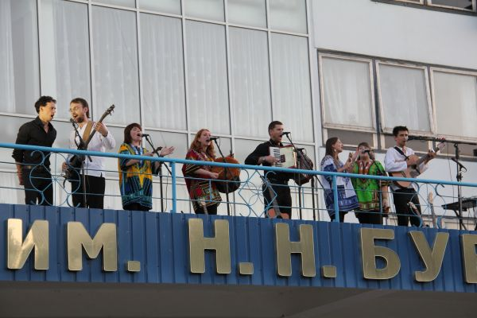

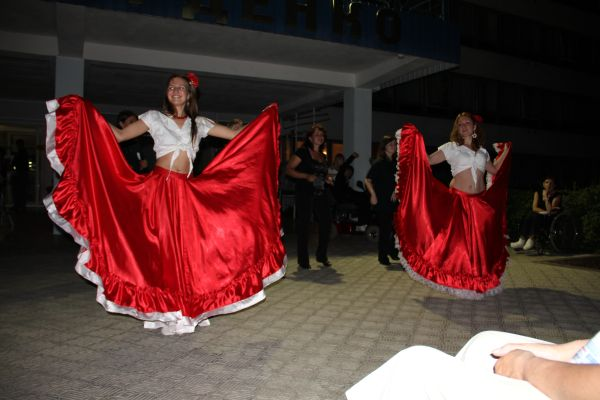

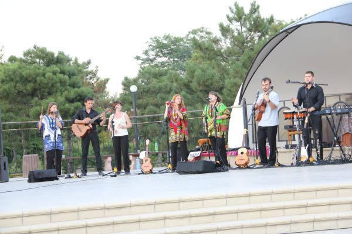

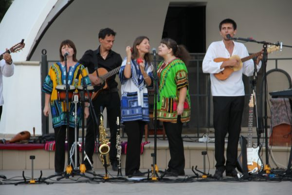

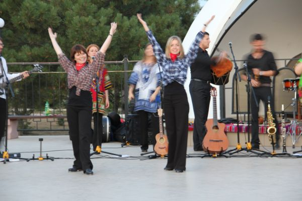

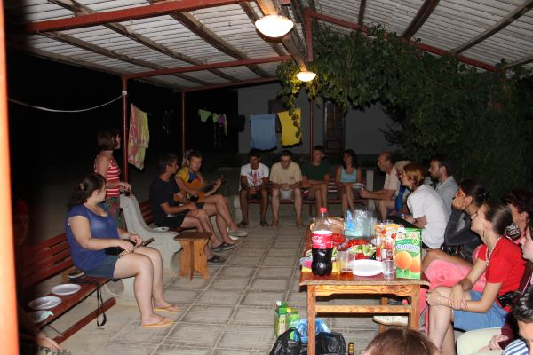

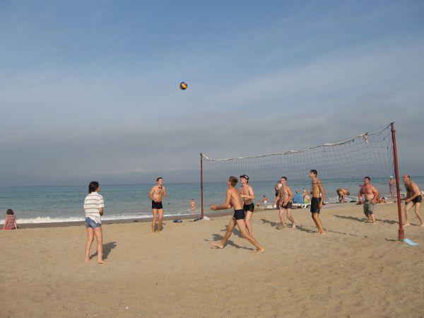

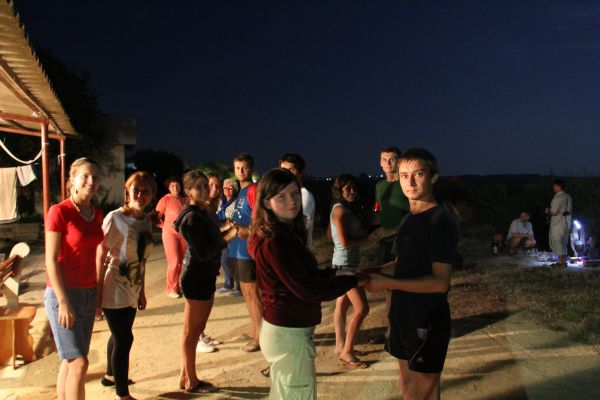

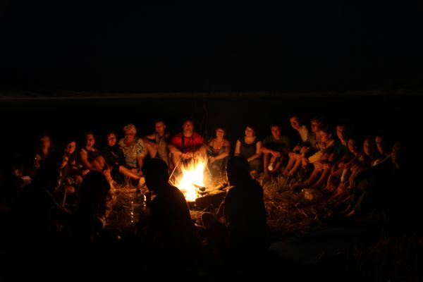

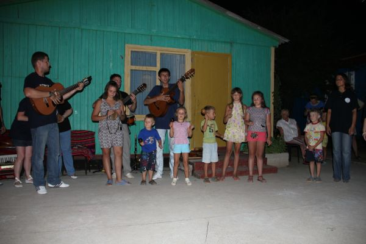

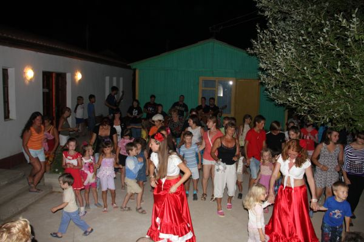

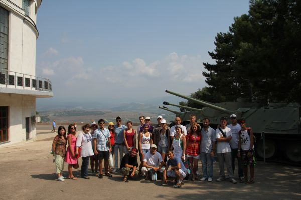

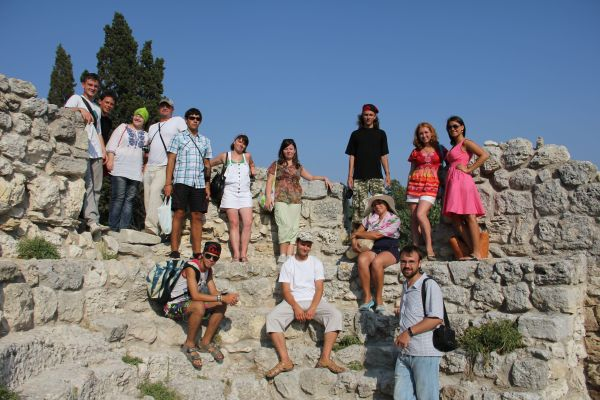