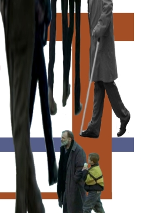

# Вечность и один день ( Mia aioniotita kai mia mera )

**2008-12-21** Сергей Басан

Гениальный греческий режиссер Тео Ангелопулос в этом году снял "Пыль времени", классическую любовную историю на фоне ГУЛАГА, ужасов Советского Союза и т. д. Ужасы, на фоне которых любовь становится все краше и приятнее. Где половые отношения наконец занимают свое центральное место.

Любовь каждому близка и фильм не останется непонятым. А когда Тео был маленьким (1998) он снял "не совсем понятный фильм" - "Вечность и один день". Главный герой фильма - старик-поэт. Старый и больной - ему осталось жить один день. Он доделывает неотложные дела, хочет пристроить куда-нибудь малыша-беженца случайно встретившегося ему. В течение двух часов он, никому не нужный, бродит с места на место. Оказался он ненужным постарев, или еще раньше? Реальность отторгает из себя всех и сразу. Только успел родиться, как мир уже ополчился против тебя. На мгновение дал слабину - ты уволен и выброшен на окраину. Действительность без жалости расправляется со стариками и остальными слабыми, кто не в силах крепко уцепиться зубами.

Старику не хочется умирать, он мечтает о детстве. Может, он стар снаружи, а внутри молод и свеж? Ведь что есть молодость? Это она может все изменить, она чувствует, что ей это под силу, а старость бессильна. Взрослые, настоящие взрослые, способны и должны преобразовывать действительность. Старик же плачет, подгибая колени слушает рассказ беженца о войне, которая бушевала далеко-далеко. Поплакав, он успокаивается и продолжает бродить, выискивая образы детства. Даже износив до конца тело, он так никогда и не стал взрослым. Теперь поздно. Старый болван, которому родители в детстве говорили: помой уши, не бегай так быстро, не вертись и слушай бабушку. Не высовывайся и не ходи по лужам. Посмотри, какой сильный ветер, - спрячься, отойди. Двигайся по пути наименьшего сопротивления - это тебе выгодно. Человек получает паспорт и продолжает слушаться слов за которыми нет ничего настоящего. Начинает работать, чтобы есть, и копить деньги, потому что так надо. И особо не напрягается, а если и напрягается, то ради ерунды - новой модели мобильного телефона или автомобиля красного цвета. Старость наступает сразу же после детства. Если старика еще можно оправдать, - последний день, старческая слабость, то 20-30-летние изменяют действительность с такой же эффективностью. Их формы противопоставления миру однообразно слабы. Это или отгораживание, закрытие глаз на неудобства и неправильность, - такое себе погружение в мир идеалов и грез. Этой паутины с достатком производит искусство, так называемое "элитарное искусство, искусство не для всех". Для той "элиты", которую общество с грехом пополам научило думать, и от которой логично было ожидать действия по улучшению действительности. Но нет, оказалось не их это дело, - такое грязное и скучное. Так на поверку элита оказывается совсем "неэлитой". Или другая форма противопоставления, когда "молодые" предпочитают действовать герметично, в закрытых коллективах, - убирают мусор в общественных местах, кормят голодных собак и тому подобное. Эта ликвидация следствий без внимания на причины в лучшем случае наивна.

А может ребенок это совесть старика? Почему бы не предположить такое. Режиссеру будет приятна "еще одна интерпретация творения". Ребенок не настоящий. Это старик в детстве. Не такие дети воспитываются улицей. Настоящие быстро вклиниваются в круговорот денег, занимают свое место в порядке вещей. А это неповзрослевшая совесть, она, как маленький ребенок, вынуждена убегать и прятаться от реальности. Иначе ей прийдется плохо от больших дядек.

Вдвоем они бродят, пытаясь найти тихий уголок. Только спрятаться и переждать нельзя, дождаться лучших времен не успеть. Нужно было создавать хорошее самому, а не ожидать счастливого случая. Последний день жизни заканчивается.

Последний день певца буржуазных ценностей, поэта, искусством которого восхищаются богачи. Искусство очень важно для сегодняшней действительности, это оно вносит человеческое в жизнь богача. И не только богача, Оно жизненно необходимо, искусство скрывает бесплодность существования. Оно производит огромный ассортимент чувств для нашего существования. Выдает на гора любовь, ненависть, злобу, тоску, счастье. И разное другое - по мелочи. Из частичной занятости каждого в общественной жизни, из увеличивающейся специализации, получилось то, что производство чувств было передано специалистам. Но отрезанность художников от народа, их возрастающая специализация приводит к частому производству брака и барахла. "Искусства", которое никого не трогает, не имеет ценности, но может иметь цену.

*В мире купли-продажи и всеобщего товара было холодно и одиноко, в нем не было места человеческой жизни. И тогда был создан другой мир. Художники выкрасили серое приятными красками, написали нежную музыку, она стала звучать из всех углов, в автобусах и на пляжах. Выполнили щедро оплаченный заказ. Был создан мир "красивых" слов, ускользающих образов и недомолвок, где можно снять гостиничный номер и жить пока хватит средств. Крестьянки в выглаженных платьях, спящие революционеры с бородами, красивые дамы населяют его. Здесь можно наслаждаться обедом на белоснежных скатертях, не думая о бедных и голодных. Путешествовать и танцевать. И никакой нищий не появится ни в кадре, ни за кадром, никогда и нигде.*

Умирающий поэт наблюдает, как смерть с легкостью разрушает эту иллюзию. Она исчезает с такой быстротой, что кажется ее никогда и не было вовсе. Выдуманная "красота" рождалась и умирала в отдельных головах. Настоящий мир оказался силен и беспощаден.

Каждого, кто согласится учавствовать в этом спектакле ждет тот же конец. Наступит такой день, когда фальшивость и дешевизна окружающего проявится с болезненной горечью. Но в последний день это не исправить.