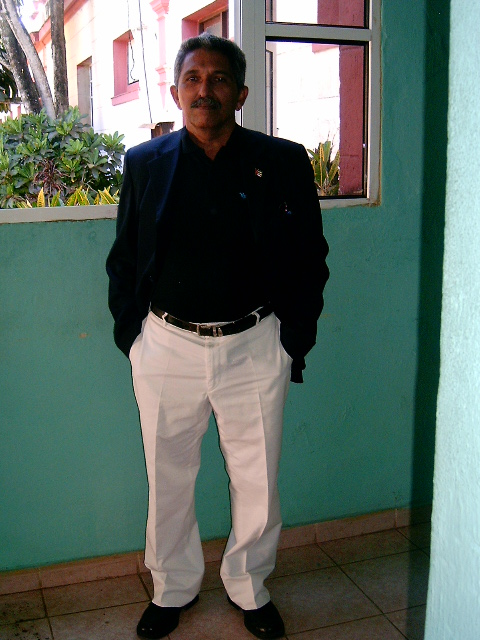
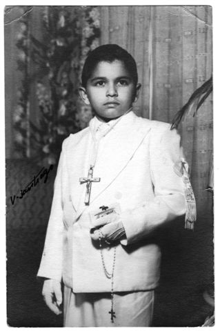

# Первый шаг на пути к культуре

**2011-12-22** Интервью с Ирамом Санчесом Баредом (Ирамо Санчес Баред)

– **Здравствуйте, Ирам! Скажите, пожалуйста, сколько Вам было лет, когда Вы вступили в бригаду, и что побудило Вас к этому?**

– Я вступил в Кампанию в возрасте 11 лет и 6 месяцев. Шли первые годы Революции, революционный энтузиазм каждого из нас был чрезвычайно высок, наш главный лидер, вечный инициатор наших побед, товарищ Фидель, призвал молодежь тех времен к выполнению первой нашей задачи. Мы отозвались на его просьбу с огромным желанием сделать свой скромный вклад в Революцию.

Кроме того, я был свидетелем того, как мои родные помогали революционной армии, одержавшей победу на Сьерра Маэстра, давали повстанцам медикаменты, продукты, другие необходимые вещи. А еще мы тайком слушали подпольную радиостанцию повстанцев Radio Rebelde, регулярно сообщавшую нам о военных действиях, происходивших в горах.

Все это очень повлияло на мое развитие и взгляды. В 61 году Министерство образования приостановило весь учебный процесс ради осуществления этой важной Кампании.

– **В самом начале Кампании контрреволюционными силами были убиты несколько добровольных учителей, среди которых — 19-летний парень Конрадо Бенитец, чьим именем названа молодежная бригада. Вам не страшно было после этого записываться в Кампанию?**

– Убийство Конрадо принесло нам всем много боли и печали, но оно еще раз укрепило нашу уверенность в необходимости выполнить поставленную задачу. Конечно, были предприняты меры для обеспечения безопасности добровольцев, но страха среди нас никогда не было, несмотря на наш небольшой возраст. Кроме того, я и мои близкие товарищи обучали очень далеко от зоны, где были совершены диверсии и где промышляли бандиты.

– **В какой провинции Вы работали? Это было далеко от Вашего дома? Кто был Вашими учениками?**

– Я обучал в баррио La Esperanza в пригороде Анмасио, сейчас это провинция Лас Тунас, а тогда была провинция Камагуэй. Большинство моих товарищей по бригаде уехали учить за сотни километров от своих домов, в горные и заброшенные районы, но мои родные попросили координаторов о том, чтобы я был как можно ближе. И все же я был на расстоянии 100 километров от дома.

Я учил крестьянскую семью из пяти человек: мать, отец, двое детей (10 и 12 лет) и сестра матери. Это была простая и честная семья, больше всего в их жизни выделялась бедность. Дом был построен из пальмовых досок, крыша — из листьев пальмы на подпорках, полом была земля, скудная мебель, что была в доме, сделана из необработанного дерева.

Еще одним моим учеником был молодой парень, рабочий лет 20 по фамилии Кастаньон. Его занятием была сборка велосипедов.

– **Как восприняли Вас, 11-летнего мальчика, в качестве учителя?**

– По правде говоря, крестьяне не были готовы к тому, что учить их придет 11-летний ребенок. Они ожидали опытного учителя. Однако, они от меня не отказались, а по мере того, как я показал им, что действительно могу научить их читать и писать, начали воспринимать меня не только как учителя, но и как своего третьего сына. Думаю, что повлияло здесь и то, что для своего возраста я был довольно благоразумным и ответственным мальчиком. Ведь я учился в религиозной школе, и в семье воспитывался в дисциплине.

– **Как проходил процесс обучения?**

– Уроки длились с 19.30 до 22 часов — это было единственное их свободное время. Но, конечно, было очень тяжело из-за того, что приходилось бороться со сном и усталостью, ведь крестьяне привыкли вставать в 5 часов утра и весь день работать. Было трудно привыкнуть к новому режиму. Перед началом Кампании нас ориентировали на то, чтобы объяснить учащимся, что все трудности можно преодолеть, главное — стойкость, личные старания и ежедневные маленькие успехи. Важным был момент, когда человек впервые в жизни мог написать свое имя, то есть, фактически, подписаться. Это всегда было стимулом продолжать учебу.

Нашими учебными материалами были учебник под названием «ALFABETICEMOS» («Научимся»), отражающий программу учебы, и тетрадь «VENCEREMOS» («Победим») для ежедневной работы учащегося. Программа обучения была разработана специальной Технической комиссией. Методика была простой — выбиралось предложение, значимое для учащегося и знакомое ему по звучанию, разделялось на слова, а слова — на слоги. Потом с этим слогом подбирались новые, хорошо известные каждому слова. Например, первый урок начинался с предложения «La Reforma Agraria Va» («Идет аграрная реформа»). Эту фразу каждый много раз встречал на плакатах и стендах по всей стране, в газетах, и поэтому было несложно помочь им ее идентифицировать. Потом мы брали слово «реформа» и делили ее на слоги: ре-фор-ма, со слогом «ма» образовывали слово «мама», потом отделяли букву «м» и образовывали с ней другие слоги — «ме», «ми», «мо», «му», и составляли простые слова с этими слогами. И так продолжали с другими фразами, пока не освоили все буквы алфавита.

– **Как отнеслись Ваши ученики к процессу учебы? Ведь для них это была дополнительная нагрузка после тяжелого рабочего дня.**

– Да, первые дни было тяжело. Но можно смело сказать, что в то время 98% кубинцев прямо-таки излучали революционный пыл, и мои ученики отнеслись к задаче с большой преданностью, уважением и самоотдачей.

– **У кого лучше получалось учиться — у взрослых или у детей?**

– Я помню, что дети быстрее улавливали материал и легче понимали объяснения. Взрослым это было тяжелее, они не привыкли учиться, да и ведь они были усталые после работы и привыкли рано ложиться спать.

Для 20-летнего Кастаньона начало учебы тоже было нелегким. Он с детства занимался ремеслом и не имел возможности учиться. Ему было очень обидно, и он не хотел включаться в Кампанию. Тогда я придумал такой выход: с 14 до 16 я учил его грамоте, а с 16 до 17 он учил меня собирать велосипеды. Так мне удалось его переубедить, и к концу обучения он превратился в другого человека.

– **Удивительная изобретательность в таком маленьком возрасте!**

– Да, позже я сам удивлялся, вспоминая, как мне удалось достичь с ним компромисса и втянуть его в Кампанию.

– **Вы жили в доме этой семьи, которую обучали?**

– Нет, меня поселили в баррио «La Carretera» на расстоянии около километра от их дома. И каждый вечер я возвращался туда по темной и грязной дороге, и у меня был только фонарик на батарейках для освещения.

– **Как была структурирована бригада?**

– Каждую группу добровольных учителей возглавлял координатор Кампании, который время от времени посещал нас, чтобы узнать о том, как идут дела, какие есть проблемы и трудности, дать нам определенные указания.

– **Сколько длилась Кампания? Сколько времени нужно было, чтобы научить человека читать и писать?**

– Кампания длилась примерно 9 месяцев. 22 декабря 1961 года на Площади революции Фидель провозгласил Кубу территорией, свободной от неграмотности. Что касается времени для обучения каждого отдельного человека, оно было разным в зависимости от способностей и мотивации.

– **Как изменилась жизнь тех, кто научился читать и писать, после окончания Кампании? Понятное дело, дети пошли в школу. А взрослые?**

– Прежде всего, для людей открылся мир, которого они раньше не видели. Обучение грамоте было частью программы улучшения жизни, которое Революция принесла крестьянам. Они начали приобщаться к цивилизации.

После Кампании была создана Национальная типография, которая готовила для тех, кто обучился грамоте, специальные издания для чтения, например, журнал «Arma Nueva», содержащий материалы из истории, науки, культуры, написанные на простом языке. Также в журнале печатались краткие описания сражений повстанческой армии в ходе Революции, рецензии на недавно опубликованные книги, стихи любимых в народе поэтов. Издавались и продавались по низким ценам произведения мировой литературы.

Сразу же после окончания Кампании были созданы условия для того, чтобы каждый смог продолжить образование. Многие взрослые потом смогли поступить в университет и получить высшее образование. Ликвидация неграмотности стала первым шагом на пути просвещения и культуры. Повсеместно было проведено электричество, благодаря которому всем стали доступны телевидение и радио, были созданы передвижные кинотеатры, чтобы народ мог знакомиться с киноискусством. Не зря Хуан Маринийо, один из самых выдающихся революционных интеллигентов, сказал о Кампании ликвидации неграмотности, что это был «эпохальное культурное событие, толчок изменений невероятного размаха».

– **Как повлияло Ваше участие в Кампании на Вашу дальнейшую жизнь?**

– С материальной точки зрения — никак, потому что все мы вступили в Кампанию не ради каких-то привилегий, а только по сознательному убеждению.

С точки зрения личного развития, участие в Кампании дало много положительного. Кампания принесла большое моральное удовольствие и сознание того, что ты сделал шаг навстречу Революции. Возвратившись домой, я чувствовал огромное желание продолжать учебу, потому что за это время я много испытал и понял большую ценность знаний.

В средней школе я был инициатором «Движения инструкторов», когда лучший по определенному предмету ученик помогал товарищам. Я давал занятия по математике, по которой я участвовал в олимпиадах на уровне провинции. Кроме того, всю свою жизнь я готовил выступления, доклады, проводил семинары по разным общественно важным темам, например, о человеческих ценностях, чувстве собственности, этике и т.п. Вероятно, это «наследство» мне оставило мое участие в ликвидации неграмотности.

В этом году Куба отмечает 50-летие Кампании и благодаря прессе, телевидению, радио становятся известными новые случаи и факты. Например, недавно я услышал, что в Кампании участвовал мальчик восьми лет.

– **Большое спасибо!**

*Ирам Санчес Баред удостоен «Медали за ликвидацию неграмотности» и «Медали 40-летия революционных военных сил». На данный момент Ирам — сотрудник Кубинской компании аэропортов и авиационных услуг (**ECASA).*

***Интервью взяла Леся Ивашкевич***