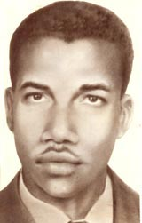
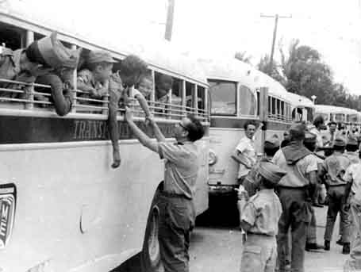
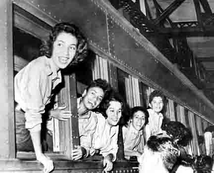
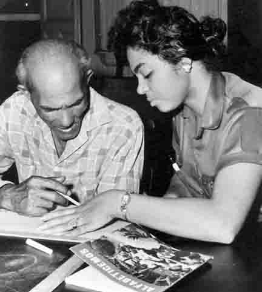
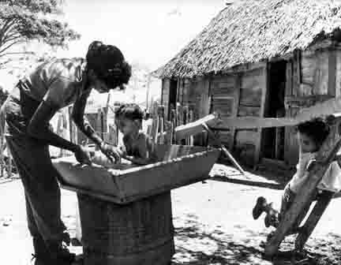
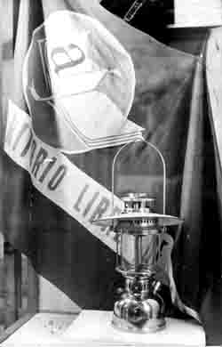
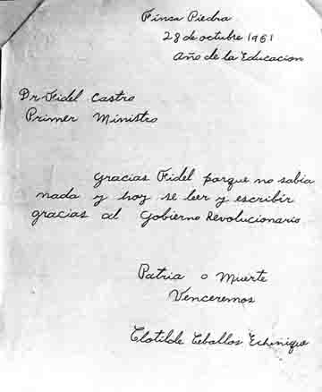
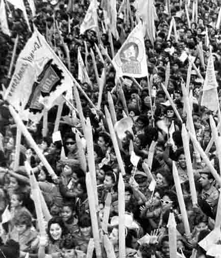
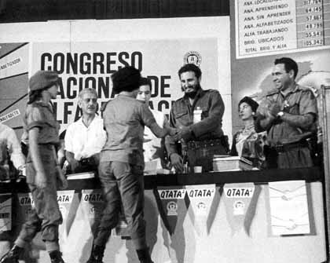

# Куба отмечает 50 лет свободы от неграмотности

**2011-12-22** Леся Ивашкевич

50 лет назад народ маленькой латиноамериканской страны Кубы совершил один из самых больших в истории человечества подвигов. Об этом подвиге [Фидель сказал](http://www.granma.cubaweb.cu/alfabe40/dg6.html), что он «лишил любых аргументов империализм, врагов нашей Родины, врагов Революции». Речь идет о беспрецедентной Кампании ликвидации неграмотности на Кубе.

Сразу же после победы Революции в 1959-м году революционное правительство столкнулось с тем, что дальнейшее экономическое и культурное развитие страны невозможно без полноценного участия всего народа. Первой преградой на этом пути была массовая неграмотность. На тот момент население Кубы составляло немногим более 6 миллионов человек, из которых около миллиона не умели читать и писать. Школ было в два раза меньше, чем нужно. Естественно, каждый год количество неграмотных взрослых росло. Больше всего проблем было в селах, где [неграмотных насчитывалось](http://es.wikipedia.org/wiki/Campa%C3%B1a_Nacional_de_Alfabetizaci%C3%B3n_en_Cuba#Antecedentes) около 47%. Но именно в сельскую местность не особенно охотно уезжали на работу учителя. Да и самих учителей было слишком мало.

**Если Фидель говорит, что возможно...**

С 1959-го до начала 1961 года революционному правительству с помощью открытия новых школ, вечернего обучения для работающих и отдельных учебных центров удалось [сократить число неграмотных на 100 тысяч](http://www.granma.cubaweb.cu/alfabe40/epopeya5.html). Однако, это было очень мало, и тогда Фидель понял, что решить проблему можно только силами всего народа. Он обратился ко всем образованным кубинцам и особенно к молодежи, призвав создать «Армию борьбы с неграмотностью». Этот призыв был воспринят с небывалым энтузиазмом. В добровольные учителя записывались рабочие, студенты, школьники, домохозяйки. Всем несовершеннолетним нужно было получить разрешение родителей, а случалось, что родители шли вслед за своими детьми. Всего насчитывалось около 178 000 участников, из которых 105 тысяч составили молодые люди и дети в возрасте от 10 до 19 лет. Средний возраст юных учителей — 14–16 лет. «Молодая» бригада была названа в честь Конрадо Бенитец — молодого добровольца, павшего жертвой контрреволюционной диверсии. Его смерть стала народной трагедией, но побудила тысячи юношей и девушек продолжить его дело.

*Конрадо Бенитец — 19-летний учитель, погибший от рук конттреволюции*

Фидель не побоялся в сентябре 1960-го года заявить на Генральной Асемблее ООН, что неграмотность на Кубе будет ликвидирована в течение одного года. Координаторов кампании он [направил к Че Геваре](http://granma.co.cu/alfabe40/epopeya7.html), чтобы тот поделился опытом обучения грамоте в армии повстанцев. Че сказал: «Задача очень сложная, но если Фидель говорит, что возможно — значит, возможно». И началась большая работа. В кампанию были включены около двух миллионов человек — учащихся, учителей и тех, кто обеспечивал организацию и безопасность кампании. Два миллиона — это, фактически, была треть всего народа Кубы.

Сначала для молодежи был устроен лагерь в курортном городке Варадеро, на лучшем пляже страны, где учителя знакомились, набирались сил перед длительной и сложной задачей, проходили медосмотр и инструктаж по программе обучения грамоте. Кроме образовательной миссии добровольные учителя должны были приобщать крестьян к основным правилам личной гигиены: показывать на своем примере, что нужно мыть руки перед едой, кипятить воду для питья, ежедневно мыться, не допускать животных к жилым помещениям и т.п и требовать этого от крестьян.

И вот юные «альфабетизадоры» (так называли на Кубе участников кампании) разъехались по селам, по горам, по самым заброшенным уголкам страны, где люди никогда не брали в руки карандаш и бумагу, не видели врача.

 

*Молодые и веселые, они едут исполнять первое задание Революции*

**Alfabeticemos и** **Venceremos: как все было**

Жили по-разному: некоторые в специально организованных лагерях, но чаще всего в домах крестьян, которых и учили. Обучение проходило по разработанным и изданным полуторамилионным тиражом учебнику и тетради. Учебник назывался «Alfabeticemos» («Обучимся»), а тетрадь — «Venceremos» («Победим»). Также были изданы: книга по арифметике «Producir, Ahorrar, Organizar» («Производить, экономить, организовать»), «Temas sobre Revlucion para Alfabetizadores» («Темы о Революции для учителей»), другие пособия. Вопрос подготовки программы обучения был в числе самых серьезных вопросов кампании, ведь она должна была быть простой и в то же время высокоэффективной. Для этой подготовки были собраны самые опытные и талантливые педагоги страны. Позже министр образования [Армандо Арт подчеркивал](http://granma.co.cu/alfabe40/epopeya12.html), что как кампания была бы неосуществима без всенародной помощи и участия, точно так же она не смогла бы достичь цели без четкой организации и активной поддержки специалистов из множества областей. Наверное, секрет успеха и был в том, чтобы каждый оказался в кампании на своем месте.

Детальнее о методике обучения грамоте можно прочитать в [интервью](/4655.md) с 11-летним участником кампании Ирамом Баредом. Главное, что можно сказать о программе учебы — это то, что в своем содержании она опиралась на революционные изменения в стране, давая обучающимся понять, что образование и революция неразделимы. Центральные темы, вокруг которых строилось обучение — темы земли, аграрной реформы, народной милиции, международной солидарности, жилья, медицины и т.д. Большинство воспринимало кампанию с энтузиазмом и уважением, однако, находились, конечно, и такие, кого нужно было убеждать. Но «альфабетизадоры» не сдавались, даже если речь шла о стариках — так [один мальчик](http://granma.co.cu/alfabe40/epopeya2.html) месяц ходил к строптивому старику, пока тот не сдался и не стал учиться. Потом он этого мальчика не хотел отпускать домой. В общем, учителям часто приходилось решать неожиданные задачи, проявлять изобретательность и психологическое мастерство.

*Учиться никогда не поздно!*

**«Побочные эффекты» кампании**

Но учителя не только учили, они также и учились. Учились благородству простых бедных людей, помогали по хозяйству, ухаживали за детьми, самым тесным образом знакомились с жизнью беднейшего народа. Это было что-то вроде «хождения в народ» в общенациональном масштабе. Кампания ликвидации неграмотности послужила сплочению и взаимному понимаю жителей села и города. Именно с нее берут начало дни общей работы на полях — сборки кофе, например.

Почти 55 000 девочек и девушек, принимавших участие в кампании, приобрели опыт активного участия в общественной жизни и стали армией борьбы с предрассудками о роли женщины в обществе.

*Альфабетизадоры тоже смогли многому научиться, разделяя с крестьянами их быт*

В отзывах о кампании я часто встречала слово «любовь». Это был не только долг перед революцией, не только сознательное убеждение, это была и просто любовь к человеку, поднявшаяся на высочайший уровень и ставшая огромной материальной силой. И эта любовь давала новое, лучшее понимание революции, социализма. Без сомнения, сама кампания была воплощением социализма, творчеством масс.

В своем выступлении 22 декабря, в день празднования успешного завершения кампании, участница [Лида Бати сказала](http://www.granma.cubaweb.cu/alfabe40/dg5.html): «каждый из нас возвратился домой лучшим революционером, больше женщиной, больше мужчиной». И главное — участники требовали новых задач! Они так и говорили: «Фидель, скажи нам, что еще нужно сделать!». И Фидель нашел для них задачи, для молодежи это, прежде всего, была задача учиться, и Фидель назвал конкретные цифры — сколько тысяч юношей и девушек должны в скором будущем стать учителями, инженерами, технологами, переводчиками, артистами и художниками и т.д. Учеба была не только бесплатной, но для всех них предусматривались — впервые в истории страны — стипендии. Между прочим, 2 300 выпускников восьми классов средней школы направлялись, дополнительно к продолжению учебы, на курсы изучения русского языка.

Кампания принесла личное развитие и большое удовольствие ее участникам, для страны она стала началом нового витка революционных преобразований.

*Учиться часто приходилось после работы, по вечерам. Лампа, освещающая эти уроки, стала символом начала новой жизни*

**Большой день**

Фактически, кампания длилась даже меньше года, потому что до апреля 1961-го года еще решались организационные вопросы, а уже в октябре Фидель стал получать тысячи писем с простыми, но такими ценными словами благодарности — для многих это было первое за всю жизнь письмо.

*«Спасибо, Фидель. Теперь я умею читать и писать благодаря Революционному правительству. Родина или смерть. Мы победим».*

Уже в августе появились первые обучившиеся, которые присоединились к кампании: они объединялись в комитеты, чтобы искать еще не обнаруженных неграмотных, убеждали сопротивляющихся, помогали распространить среди нуждающихся 177 тысяч подготовленных координаторами очков и т.п.

22 декабря 1961 года, 50 лет назад, на Площади Революции в Гаване Фидель провозгласил победу Кубы над неграмотностью. Это был большой день, всенародный праздник — в столице армию «альфабетизадоров» встречали с радостью и восхищением. Благодаря всенародному участию была достигнута большая и прекрасная цель. Впереди были новые цели, а сердца были полны Революцией.

 

*22 декабря 1961 года — исторический день для Кубы*

Конечно же, нет никакого сомнения в том, что ликвидация неграмотности на Кубе стала возможной только благодаря Революции. И именно от продолжения Революции и от включения в нее зависело будущее тех, кто обучился грамоте. Чтобы понять это, достаточно посмотреть на примеры других стран.

**Политика и грамотность**

Хоть это и кажется дикостью, но неграмотность — одна из нерешенных проблем 21 века. И не только для Африки, не только для Азии. По данным ЮНЕСКО, сейчас в мире [793 миллиона](http://www.ng.ru/education/2011-09-13/8_gramotnost.html) неграмотных людей. 32 миллиона из них [живут в США](http://news.finance.ua/ru/%7E/1/0/all/2009/02/01/150158) и составляют около 10% всего населения страны (в 2005 году это были 11 миллионов). Читать и писать не умеют около 12% [жителей Франции](http://demoscope.ru/weekly/2005/0217/gazeta019.php) и [Италии](http://forum.md/Themes/350748/438078), около 9% населения [Германии](http://www.rosbalt.ru/main/2011/03/01/823979.html), миллион жителей Лондона [читают с трудом](http://madan.org.il/node/5006). 25% школьников в странах Евросоюза [испытывают трудности](http://www.rbcdaily.ru/2009/01/29/world/399543) с письмом и чтением. Этот перечень можно продолжать, но главное — ужасающая тенденция падения грамотности наблюдается во всем мире.

Что касается стран бывшего Советского Cоюза, уровень грамотности и здесь стремительно снижается. Октябрьская революция, подобно революции на Кубе, провела массовую и повсеместную ликвидацию неграмотности и обеспечила последующее включение всех советских людей в систему бесплатного и высококачественного образования. Для неграмотных в стране просто не было места. Но с возвратом капитализма это место появилось, а природа ведь пустоты не терпит. Так, например, в России на сегодня уже зафиксировано не менее 2 000 000 неграмотных подростков, общий уровень грамотности в стране падает приблизительно [на 8-10% в год](http://www.tula-oblast.ru/news229).

Подобная ситуация была и в Никарагуа, где сандинистскому правительству удалось с 1979 по 1990 год снизить уровень неграмотности с 65% до 12%, но руководимое Соединенными Штатами отстранение сандинистов привело к довольно быстрому возобновлению ситуации, так что в 2005 году [неграмотных было уже](http://de.wikipedia.org/wiki/Alphabetisierung_%28Lesef%C3%A4higkeit%29#Beispiele_f.C3.BCr_Alphabetisierungskampagnen) 23,3%. Но вернувшись к власти в 2006 году, сандинисты возобновили работу в этой сфере, и с помощью Кубы и Венесуэлы до конца 2009 года неграмотность в стране была [фактически ликвидирована](/article.php@id=1768.html) (обучены грамоте были 600 000 никарагуанцев, неграмотных осталось 3,3%).

Обучение грамоте — это, конечно, только первый шаг на пути приобщения масс к культуре. И именно от следующих шагов зависит то, станет ли этот шаг великим и величественным или останется в истории лишь благим, но безуспешным намерением. Народу Кубы удалось огромными усилиями прорубить избранную им тропу в 21 век. Больше того, ценой немалых ограничений ему удалось поделиться своим «добром» с другими народами, в том числе и в области борьбы с неграмотностью: кубинский метод ликвидации неграмотности «Yo, sí puedo» («Да, я могу») с успехом применяется примерно в двух десятках стран по всему миру, с его помощью была полностью ликвидирована неграмотность в Венесуэле, Боливии и Никарагуа. Метод был высоко оценен на международном уровне и получил в 2006 году за свою высокую эффективность премию ЮНЕСКО.

Более того, образовательная работа Кубы уже давно вышла за рамки борьбы с неграмотностью как внутри страны, так и за ее пределами. Все уровни образования являются на Кубе бесплатными. Правительство страны намеревалось ввести всеобщее высшее образование, и только трудности «особого периода» помешали этим планам. Для тех стран, где недавно была ликвидирована неграмотность с помощью метода «Yo, sí puedo», кубинские педагоги разработали методику получения полного начального образования «Yo, sí puedo seguir» («Да, я могу продолжать»), на базе этих методов в Венесуэле начала работать образовательная миссия «Робинзон», нашедшая свое продолжение в миссиях «Рибас» и «Сукре», позволяющих венесуэльцам получить бесплатное среднее и высшее образование соответственно. Кроме того, Куба оказывает большую помощь многим странам в подготовке квалифицированных и (сегодня это особенно актуально) мыслящих гуманистическими, а не коммерческими категориями врачей: работающая с 1999 года [Латиноамериканская медицинская школа](http://www.og.com.ua/cuba_studenty.php) для иностранных граждан подготовила уже более 10 000 врачей из 24 стран мира. Образование бесплатное, единственное условия для выпускников — они должны вернуться на родину и лечить самых нуждающихся.

На сегодня нет сомнений в том, что образовательные инициативы Кубы стали началом радикальных культурных изменений в Латинской Америке и повлияли на качество жизни людей во многих других странах.

Похоже, сейчас вновь настал момент, когда для продолжения взятого курса Кубе очень понадобится большая любовь народа к своей революции. Не лишней окажется и деятельная благодарность тех народов, которым Куба много лет помогала и продолжает помогать вопреки всем законам «здравого смысла».

Мы хотим верить в тебя, Куба!

*Использованы фотографии с [сайта Granma](http://granma.co.cu/alfabe40/). Также там можно почитать о кампании детальнее на испанском языке.*