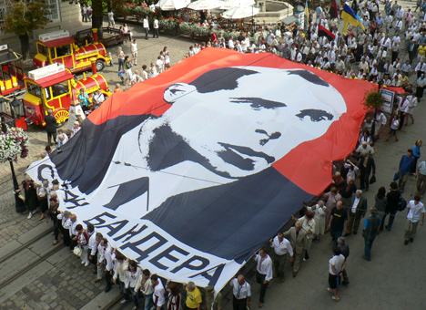
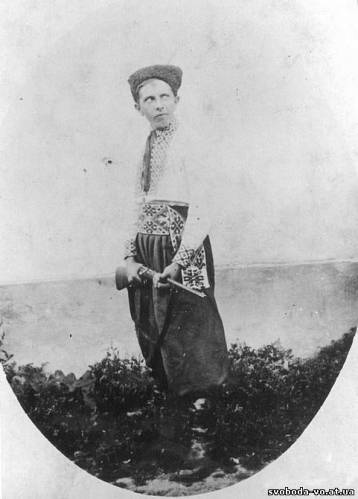
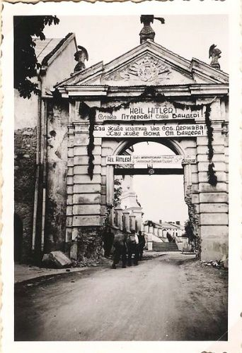
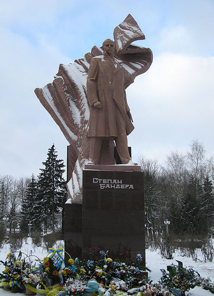
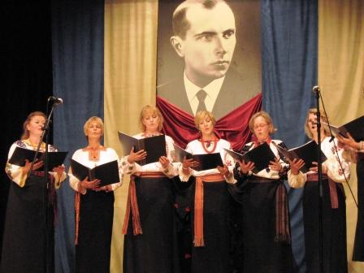
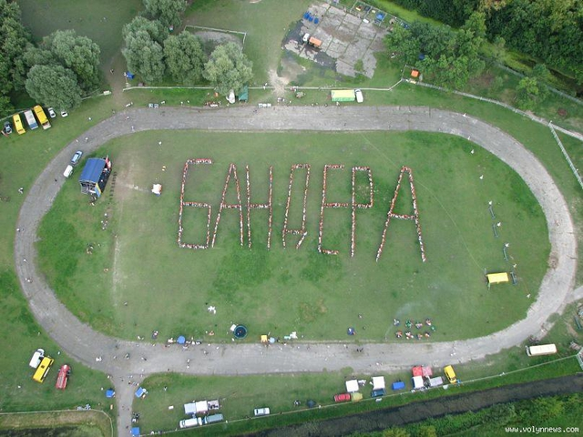

# Немецкий ученый смог прочитать лекцию о Бандере только в стенах посольства Германии

**2012-03-02** Зиновия Березка

Вчера, 1 марта, в посольстве Германии состоялась, несмотря на все [преграды](/5020.md), лекция немецкого историка Гжегожа Россолинского-Либе на тему «Степан Бандера: жизнь украинского ультранационалиста и память о нем (1909–2009)». Все время, сколько длилась лекция, посольство пикетировали около сотни членов ВО «Свобода» с флагами и транспарантами «Геть українофобів», «Россолінський-Лібе — адвокат нацистів», «Бандера боровся з нацистами — ліберали воюють з Бандерою», «Меркель, визнай голодомор» и т.п.

Напомним, что из целого ряда планируемых лекций историк смог прочесть только одну, причиной отмены остальных лекций стали звонки из «Свободы» в те институции, где должны были проходить встречи. Организаторы проекта «Курс лекций по украинской истории», в рамках которого Россолинский-Либе и приехал в Украину,— фонд им. Белля, DAAD, немецкое посольство. Что интересно — хотя в данном случае ясно имел место международный скандал, украинские власти «ничего не заметили», позволив «оппозиционной» националистической партии «Свобода» решать вопросы украино-немецких отношений. Очевидно, позиция «оппозиции» в этом вопросе не очень-то расходится с позицией властей.

Гжегож Россолинский-Либе — 33-летний докторант Гамбургского университета. Над диссертацией о Бандере он работает с 2007 года, ее объем составляет уже 600 страниц, с начала работы над темой он подготовил несколько монографий, исследовал соответствующие теме документы примерно в десяти разных городах Германии, Польши, Украины, представлял тему в Канаде и в Германии. Научных руководителей у Россолинского-Либе два: оба граждане Германии, один украинского, другой польского происхождения.

 

Россолинский-Либе производит впечатление спокойного, уравновешенного, старательного ученого. Несмотря на скандал международного масштаба, поднявшийся вокруг его выступления еще задолго до его начала, он во время лекции держал себя невозмутимо и скромно. Исследователь рассказал, фактически, биографию Бандеры и исторический контекст его деятельности, не смакуя при этом кровавые места и не выражая личных эмоций. Он рассказал о том, в каких условиях формировались взгляды Бандеры, как он с юных лет участвовал в националистических организациях, какие люди влияли на его мировоззрение (а это Донцов, Михновский, Оршан, Мартинец и др.), рассказал, как продвигался Бандера по «карьерной лестнице» ОУН и в чем состояла деятельность организации. Рассказал о погромах против евреев, русских, поляков в 24 населенных пунктах, во время которых были убиты от 13 000 до 30 000 людей, о сотрудничестве с Гитлером в 40–41-м и в 44-м годах. Упомянул Россолинский-Либе о символике ОУН, во многом скопированной с символики Третьего рейха: красно-черном флаге, воплощавшем кровь и землю, приветственном жесте (аналогичный нацистскому) и приветственной фразе «Слава Украине!» (ср. «Heil Hitler!») с ответом «Героям слава!». Рассказал о том, как после капитуляции Германии ОУН(б) проводила «демократизацию», уничтожая и подделывая документы, как Франко приглашал Бандеру в Испанию, но тот, поразмыслив, отказался, поскольку организационный центр уже был построен в Мюнхене.

Единственное эмоционально окрашенное место лекции было, наверное, ее завершение, где Россолинский-Либе просто показал несколько фотографий, запечатлевших героизацию Бандеры: дети в украинских костюмах, поющие или рассказывающие стихи на фоне портрета Бандеры, памятники Бандере в Тернополе, Львове (всего их на сегодня более 30) и т.д. и упомянул историю с присвоением Бандере звания героя Украины. Но эмоциональным оно было не за счет каких-либо комментариев докладчика, а просто потому, что поражал контраст между реальными делами Бандеры и его славой.

 

В общем, хочется сказать о выступлении молодого исследователя, что он непредвзято и добросовестно изучил свою тему. Если бы все украинцы знали о Бандере так много, как узнал Россолинский-Либе — было бы очень хорошо. Было бы очень хорошо, если бы так много о Бандере знали те, кто сегодня называет его героем и отождествляет с Украиной, например, те же парни и девушки, которые пикетировали посольство Германии в тот вечер. Но «Свобода» постаралась, чтобы до их ушей не дошел этот рассказ, чтобы этот рассказ не услышали и сотни других людей. Потому что с историей не поспоришь. Конечно, всегда есть какие-то сомнительные места, что-то остается до сих пор неизвестным, но главные, бесспорные, очевидные факты — фашистские взгляды и террористическая деятельность Бандеры и его организации, связь с фашистской Германией — остаются налицо и ничего с этим поделать невозможно. Поэтому для тех, кто «раскручивает» сегодня националистические идеи с помощью героизации образа Бандеры, не остается другого выхода как заботиться о том, чтобы люди не интересовались историей, не сомневались, не думали, а просто верили в Бандеру. Ведь нужны же националистическому движению герои, а то, что единственные имеющиеся в наличии кандидаты запятнаны кровью и позором — что поделаешь, приходится мириться, лучше такие, чем никаких.

Вопросы, последовавшие после лекции, были в основном критического характера. Исследователя обвиняли в слабости методологии, в том, что он не привел документов, с которыми работал, в том, что он слишком вольно обращается с понятием «фашизм», что национализм и фашизм — не одно и то же, в том, что формулировка темы предполагает уже готовые ответы (хотя работа над темой длится уже около 5 лет, а тема диссертации, по крайней мере, на Украине, корректируется все время ее написания). Один выступающий выразил свою «озабоченность его профессиональным уровнем как историка», оговорившись, однако, что сам он не историк, но предложив немцу «приехать поучиться в Киеве». Кстати, на сайте [uainfo](http://uainfo.censor.net.ua/news/11718-skandalnyy-nemeckiy-istorik-rossolinskiy-libe-okazalsya-aspirantom-kulturologom.html) так вообще считают, что Россолинский-Либе не мог браться за эту тему, потому что по образованию он культуролог. Интересно, сколько историков или хотя бы культурологов было среди тех, кто пикетировал лекцию, сколько из них могут назвать хотя бы основные события из жизни Бандеры?

Был смешной вопрос о том, что исследователю не понравилось, а что понравилось в личности Бандеры, на что Россолинский-Либе ответил, что он изучал этого человека как воплощение общественного явления того и настоящего времени, а не как объект личного отношения.

Несколько человек возмутились тем, что приветственный жест и фразу бандеровцев «Слава Україні! — Героям слава!» Россолинский оценил как фашистские, ведь это, мол, бросает тень на тех, кто сегодня пользуется этим «приветствием». В ответ на это ученый сказал, что эти символы имеют свое историческое происхождение и политическую коннотацию. Тут хотелось бы добавить, что люди, пользующиеся бандеровским приветствием, должны были бы заинтересоваться его историей, его действительным содержанием, и, может быть, они захотели бы, узнав эту историю, более сознательно и осторожно выбирать себе приветственные формулы. Вместо этого они предлагают считать эту фразу безобидной только потому, что безобидными считают сами себя.

Кстати, самые «продвинутые» поклонники Бандеры сегодня уже даже и не отрицают сотрудничества своего кумира с Гитлером. Мало ли с кем можно сотрудничать ради такой великой исторической миссии как свержение большевиков? Так, один из присутствующих выразил мнение, что и советская власть тоже, мол, сотрудничала с Гитлером. Его не смущало то, что итогом этого «сотрудничества» стал разгром фашисткой Германии.

Покидающих помещение посольства по окончанию лекции встретили громкое улюлюкание и крики «свободовцев» «Ганьба нацистським підстилкам!». Кажется, даже чем-то бросали, наверное, снежками.

Попытка поговорить о Бандере и украинских националистах в украинской столице на уровне международной исторической науки должна быть признана неудачной. Аргументировано спорить с исследователем было невозможно (против фактов не попрешь), несогласным оставалось только бросать камни и делать политические выпады. К сожалению, приходится признать, что украинцы пока не готовы знакомиться со своей историей. Украина воспринимается у нас как результат антисоветской деятельности националистических организаций, и это недалеко от правды: сегодняшняя Украина — капиталистическое государство, а именно за капитализм, а не за что-либо другое боролись Бандера и его сообщники. И именно поэтому фашизм оказался их союзником — потому что фашизм — это империалистический капитализм в своей самой высшей стадии. Пока Украина будет оставаться капиталистическим государством в окружении таких же капиталистических государств, национализм и его логическое продолжение при соответствующих условиях — фашизм — будут нормой в массовом сознании украинцев. Даже если они этого не осознают или не согласны с этим.

Какие бы не были международные обстоятельства лекции Россолинского-Либе, она ясно показала, что фашизм в Украине — тема не только архивная, но и крайне актуальная.