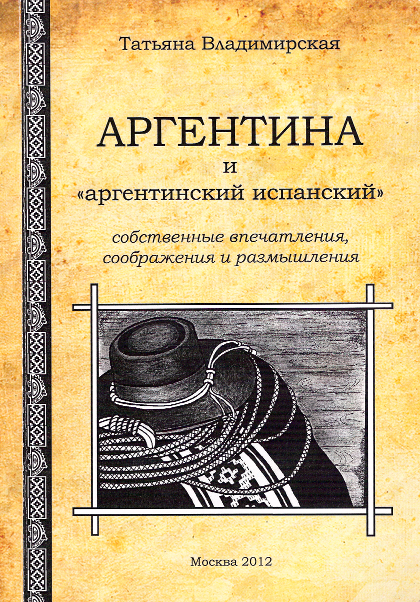

# Замечательная книжка об Аргентине и аргентинском испанском

**2012-04-06** Василий Пихорович

Автор книги — кандидат исторических наук, ст. научный сотрудник института Латинской Америки РАН, доцент кафедры лингвистического обеспечения туристической деятельности Московского Института туризма и гостеприимства Татьяна Львовна Владимирская.

Вообще-то, эта книжка предназначена для очень узких специалистов — тех переводчиков с испанского, кому придется иметь дело с аргентинским вариантом этого языка. Но автор будто-бы задалась целью посмеяться над сегодняшней модой к узкой специализации — любой, кто прочитает хотя бы несколько страничек этой книги, уже не сможет оторваться до самого конца. Обычно любая специальная книга вызывает у простого смертного глубокое чувство собственной неполноценности и полную уверенность в том, что единственная цель, которую ставил перед собой автор — это утвердить в душе читателя уверенность в том, что ему никогда не понять того, что написано. Иногда это вызвано тем, что авторы сами не очень понимают, о чем они пишут, иногда тем, что писать они не умеют, а чаще всего тем, что предмет, о котором они пишут, им глубоко безразличен.

Совершенно иначе у Татьяны Львовны Владимирской. Она не только прекрасно знает свой предмет, но и не скрывает, что очень любит его — и Аргентину с ее интереснейшей историей и культурой, и аргентинский испанский язык, который она рассматривает не иначе как живое порождение и воплощение истории и культуры страны, и аргентинцев, среди которых у нее очень много друзей и хороших знакомых.

Но Татьяна Львовна не просто знает и любит Аргентину и аргентинцев. Она сделала все возможное, чтобы читатели книги тоже полюбили эту страну и этот народ. Так, первая глава книги — это просто объяснение в любви к Аргентине, ее столице Буенос-Айресу, к простым «портеньос», как называют себя жители этого города-порта.

Видимо, автор книги уверена, что не только писатель должен любить свой предмет, но и читатель тоже — и делает все возможное, чтобы внушить ему эту любовь.

И если я и преувеличиваю, то совсем немножечко. Вот что пишет Татьяна Львовна по этому поводу:

«Чтобы владеть языком другого народа, надо понять этих, не всегда похожих на нас, людей. Наверное, это необходимо».

Красиво сказано, согласитесь. Можно оформлять в виде плаката, тиражировать тысячами экземпляров и вешать во всех аудиториях, в которых изучаются иностранные языки. Да и в тех, в которых изучаются родные языки, — тоже не помешает.

Хорошо, скажете Вы, но как же их понять — людей, не всегда похожих на нас, с какого конца начинать?

У самой Татьяны Львовны это получилось очень просто. Дело в том, что, кроме всего прочего (а, точнее, в первую очередь, а все остальное отсюда проистекает) она — руководитель ансамбля «Гренада» — ансамбля, который исполняет песни более чем на тридцати языках мира, как правило, аккомпанируя себе на национальных инструментах соответствующих народов. Я вовсе не хочу этим сказать, что любому, кто желает изучать иностранный язык, нужно для начала стать руководителем ансамбля полиглотов-полиинструменталистов. Да и вообще дело не в том, что гренадовцы поют на множестве языков мира. Разумеется, далеко не все эти языки они знают. В основном, знают испанский.

Дело в другом — гораздо более важном. В том, что проникновенно выражено в стихах М. Светлова, название которых стало названием ансамбля:

Я хату покинул, ушел воевать, 

Чтоб землю в Гренаде крестьянам отдать.

Почему покинул? Зачем ушел? Он что, сдурел? Не в курсе дела, что даже «мечтатель-хохол» должен сидеть себе тихо в своей «хате с краю», кушать вареники в сметане и мечтать о том, чтобы присовокупить к хате «і садок, і млинок, і вишневенький садок».

А, может, он просто авантюрист?

Вполне возможно. Но если он даже и авантюрист, то «самой высокой и лучшей марки».

Той самой марки авантюристов, к которым причислял себя самый известный в мире аргентинец, как-то написавший о себе:

«Многие назовут меня авантюристом, да я и есть авантюрист – но только из таких, кто сам рискует своей шкурой, чтобы доказать свою правоту».

Кстати, он тоже был мечтатель. Он писал о себе: «Мои мечты не знают границ, пока пуля не прервет их полет».

Вот уже и сошлись в одной пульсирующей тоЧечке основательница народного ансамбля России «Гренада» Татьяна Львовна Владимирская, Аргентина и даже Украина немножко. И уже на первых страницах книги вы найдете рассказ о том, как «Гренада», в первый раз попав в Агентину в 1989 году, после первого же концерта в городе Росарио, на родине Че Гевары, полным составом пошла к дому, где родился этот великий мечтатель, и буквально завалила букетами цветов, которыми засыпала их публика на концерте.

Но не нужно думать, что автор книги строит свою любовь к предмету исключительно на революционной романтике, или, тем более, призывает к этому читателей. Ничего подобного! Нельзя путать романтическое увлечение и настоящую любовь. Настоящая любовь Татьяны Львовны к Аргентине началась с совершенно противоположного конца, и об этом Вы тоже найдете рассказ в книге — о том, как в «лихие девяностые» автору отнюдь не из любви, а из-за полной невозможности выжить на зарплату научного сотрудника академического института, повезло устроиться переводчиком в московском представительстве аргентинской фирмы.

Позвольте, скажете вы, но когда в этой книге начнется рассказ об особенностях аргентинского варианта испанского языка — все об авторе, да о «Гренаде»?

Вся хитрость в том, что рассказ об этих особенностях уже давно начался, притом о самых тонких, которые не всегда зафиксированы в словарях. Например, даже с помощью академического русско-испанского/испанско-русского словаря вам будет сложно понять, что mina, это иногда женщина, а не шахта, а mango, это не обязательно плод или дерево, и даже не песо (монета), как объясняется в словаре, а просто деньги, как и guita. А мой друг-кубинец даже с нескольких попыток не смог угадать, что может означать слово capichar, которое просто отсутствует в испанско-русском словаре, но очень часто встречается в словаре «портеньос». Узнаете вы из этой книги о VOSEO, о YEISMO, и само собой разумеется, о фирменном аргентинском LUNFARDO — невероятно колоритной смеси испанского с итальянским и еще с полудюжиной европейских языков. И еще много-много сугубо специального. Но это нисколько не помешает читать книгу даже человеку, ни слова не понимающему по-испански. Он, скорее всего, просто забудет о том, что эта книга для узких специалистов, а не для простых смертных.

Преподаватели и студенты знают, что существует такой странный литературный жанр как методические пособия. Обычно — это самая обыкновенная макулатура, не дающая ничего «ни уму, ни сердцу». Преподаватели пишут эти самые «методички» исключительно потому, что им «положено по должности» это делать — если не напишут, то их не утвердят на очередной срок на должности доцентов или профессоров. Студенты читают их разве что в качестве шпаргалки на экзамене и здесь же забывают, что там было написано.

Но если бы кто-то захотел написать методическое пособие не так, как этого требует министерство и как его писать «принято», а так, чтобы оно и в самом деле могло служить руководством в овладении предметом изучения, то[ книга Т.Л. Владимирской «Аргентина «аргентинский испанский». Собственные впечатления, соображения и размышления»](/library.php.html) вполне могла бы служить образцом.

При этом она поможет не только знающим испанский овладеть особенностями аргентинского его варианта, но и тем, кто только начал изучать испанский или собирается начать это делать, и тем, кто просто хочет очень быстро понять, что такое Аргентина. Книга может служить прекрасным путеводителем для туристов, едущих в Аргентину или любящих «путешествовать» по карте. Разумеется, там будут далеко не все достопримечательности, которые обязан посетить турист, руководствуясь известным принципом «уплочено — надо отсидеть». Но еще неизвестно, насколько глубоким является знакомство со страной по обычным путеводителям, да и ставят ли перед собой такую задачу составители путеводителей. Боюсь, что их больше интересует то, что находится в глубине карманов потенциальных туристов и как их содержимое половчее оттуда извлечь.

«Аргентина и «аргентинский испанский»» — это путеводитель, но путеводитель совершенно иного рода — путеводитель по культуре Аргентины, по ее истории, путеводитель по дорожкам души аргентинцев, которых автор мастерски представила как типичных латиноамериканцев и, в то же время, как людей, чуждых любой религиозной, национальной, расовой или континентальной ограниченности. Стоит ли удивляться, что все это делает их уникальным и неповторимыми. И если на кого-то похожими, то разве что на кубинцев. Да может быть еще - и автор это подчеркивает в книге несколько раз - на нас с вами - какими мы были еще совсем недавно.

И в завершение статьи один эпизод — вполне в духе этой книги.

Не скрою, что я очень люблю и уважаю «Гренаду» и горжусь тем, что имею право числиться в нескончаемом списке ее друзей (а гордиться на самом деле есть чем, ведь возглавляет сегодня этот список Уго Чавес, по личному приглашению которого ансамбль недавно посещал Венесуэлу).

По этой причине в прошлом году я специально постарался построить свою командировку в Москву таким образом, чтобы обязательно попасть на концерт «Гренады», который она традиционно дает в парке Горького в День Победы 9 Мая. Для этого мне пришлось договариваться с коллегами о замене на работе, переносить встречи с теми, с кем я должен был встречаться в Москве. В общем, я прибавил себе массу хлопот только для того, чтобы попасть на этот скромный концерт на открытом воздухе, где сценой служила простая беседка, а зрители стояли весь концерт на своих двоих под палящим солнцем.

Каково же было мое удивление, когда меня представили аргентинцу, который специально прилетел на этот концерт из Буэнос-Айреса, когда знаменитая югославская летчица и всемирно известная авиационная журналистка и писательница Радмила Тонкович с присущим ей строгим юмором заявила с трибуны, что она приехала в Москву по приглашению российского правительства и для нее зарезервировано место на трибуне для почетных иностранных гостей на Красной площади, но она считает, что ее место здесь. И здесь же исполнила вместе с «Гренадой» песню югославских партизан на сербо-хорватском языке. Песню греческих партизан «Герои» «Гренада» спела со специально пришедшей на концерт Наталией Николау — дочерью руководителя организации греческих партизан, эмигрировавших в СССР после поражения в неравной борьбе против поддерживаемых сначала английскими, а позже американскими интервентами греческих фашистов. Курсант ныне фактически уже разрушенной военно-воздушной академии имени Жуковского никарагуанец Карлос великолепно запевал вместе с солистами «Гренады» боевой гимн сандинистов. А еще на этом концерте были военные песни на португальском, финском, на каких-то неизвестных мне африканских языках. И такой же интернациональной была аудитория.

Казалось невероятным, что вот эти люди из разных стран и континентов, разных национальностей и рас, разных возрастов, видимо, разного уровня достатка, говорящие на разных языках, собрались вместе для того, чтобы вместе с «Гренадой» отпраздновать День Победы Советского Союза в Великой Отечественной войне.

И, пожалуй, самое невероятное в этом было то, что все это было очень естественно. Как будто не может быть иначе.

Вот так вот невероятно естественно выглядит все, за что берется Татьяна Львовна Владимирская.

И эта книжка тоже.