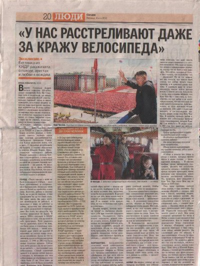
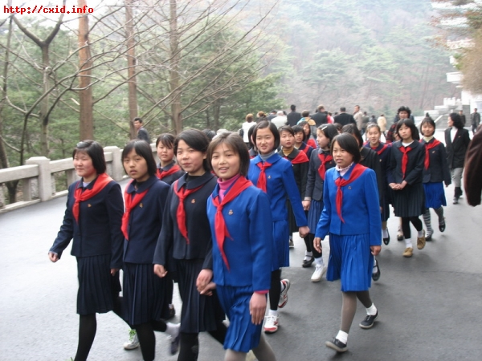
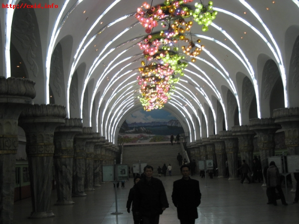
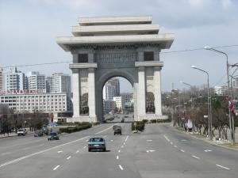

# КНДР глазами газеты «Сегодня»: явная «заказуха»?

**2012-06-02** Дмитрий Старокадомский

Очередное «сенсационное разоблачение» по ходу командировки корреспондента газеты «Сегодня» с сомнительными проводниками, увидело свет в последний месяц.

Не исключается что подобные (и нередко проскальзывающие) материалы о неугодных западному блоку режимах и явлениях в разных странах спонсируются «понятно кем». В данном случае, в таком материале очень заинтересованы южнокорейцы, часто «гостящие» на страницах газеты, вплоть до интервью южнокорейского посла. Как и в случае с Сирией, корреспондента газеты могли искусно использовать, подставив ему нужной ориентации проводника, и снабдив обоих необходимыми ресурсами.

Но газета «Сегодня» ведь — не заштатный листок какой-то мелкой партии. Это всеукраинская и ведущая газета c тиражом до миллиона экземпляров. Ей многие верят на слово. Она не имеет права опускаться до отведения целых полос для «не называвших своего имени» и «боящихся преследований» анонимов, к тому же говорящих то, что расходится с данными известных, в том числе западных, журналистов.

Действительно, Интернет и пресса в целом имеет полудюжину чисто журналистских материалов из северной Кореи от французских, бельгийских, немецких обозревателей. Некоторых из них очень сложно заподозрить в симпатиях к наследникам Ким Ир Сена и к КНДР. Но они дают объективную картину, из которой следует, что жизнь в КНДР по некоторым параметрам если и хуже мирового уровня, то по другим — однозначно лучше. По многим ключевым параметрам (медицина, учёба, безопасность, смертность, возможность создания нормальной семьи) страна приближается скорее к СССР — который даже газета «Сегодня» часто вынуждена ставить как недостижимый ныне эталон. Это же демонстрируют и фотоматериалы, в которых (несмотря на закрытость, а может благодаря ей) недостатка нет.

Из фотообзоров западных журналистов (в том числе не дружественных) следует, что в КНДР нет такого голода, который проповедуют западные официальные СМИ (а теперь и газета «Сегодня»). Нет изможденных детей, каких можно видеть в действительно голодающих Эфиопии, Центральной Африке или Индии (или в депрессивных регионах Украины). Нет ничего похожего на фотографии американских, европейских или украинских беспризорников — действительно одичавших и оголодавших, обреченных на скорую смерть малышей. Вместо них — сверкающие улыбками откормленные пионеры и их вполне прилично выглядящие мамы. Кадры скорее напоминают обложки советских журналов с фотографиями из Киргизской или Узбекской ССР. А это лучшее свидетельство, чем дежурные стоны неназвавшихся диссидентов.

Фото 1. Очередной пасквиль газеты «Сегодня» на страны, не нравящиеся США и НАТО. Уж очень похоже на «факты» газет поздней перестройки в СССР.

Фото 2. Корейские пионеры. И где здесь голодающие?

Фото 3. Корейское метро.

Фото 4. Отсутствие машин газета «Сегодня» преподносит как отрицательную черту. Киевлянина или одессита после наших дорог этими страшилками можно рассмешить.

Да даже если посмотреть на фото из КНДР в самом репортаже из «Сегодня»: где там найти изголодавшихся пассажиров в ухоженном и чистом вагоне поезда? На фото вполне сытые нормальные люди (голодные лица нам, пережившим голодные 30-е, 40-е и наконец, 90-е, узнать легко на любой фотографии). Девушка приличного вида наносит на ногти лак. Другая, во вполне нормальной одежде, смотрит с интересом в фотообъектив. Явно не измождённый мужчина улыбается в окно... На полках — багаж: современная электроника, далеко не бедные сумки и чемоданы...

Спору нет, правящая элита КНДР создала строй, который скорее смахивает на династическую социально-ориентированную монархию, или — на военную комендатуру осаждённой крепости. Но в тех условиях, возможно, иного пути и нет — ведь любая «дырка» в стене этой крепости может быстро обернуться вторжением «демократии» с американскими ракетами и прелестями «ливийского сценария»...

Но надо же соблюдать определённый журналистский этикет! Следуя правилам жанра, журналистам стоило бы поговорить с южнокорейскими сторонниками КНДР, если уж не с самими северокорейцами. Тем более, что по многим сообщениям, в Южной Корее (такой цивилизованной и демократической) постоянно убивают на границе пытающихся сбежать в КНДР, и сажают в тюрьмы только за найденные портреты вождей и флаги КНДР. О том, как там заставляют голодать рабочих путем увольнений и репрессий против активистов, рассказывает даже правая пресса. А уж какие там бои между профсоюзами и полицией по поводу постоянно ухудшающихся условий проживания — об этом в солидных масс-изданиях почти не пишут, но это — будни Южной Кореи.

А жаль. Потому что разница именно в техническом и социальном развитии Северной и Южной Кореи заметна даже по формальным признакам. Южная Корея — изначальный сателлит НАТО, безнадёжный банкрот и должник США. Страна с наибольшим в мире размером только подтвержденного долга. Страна, где президента выбирают, по сути, в посольствах западных стран. Несмотря на громкие брэнды, здесь ничего более инновационного, чем красивые стандарт-автомобили, компьютеры или максимум — вагоны поездов, выпускать не могут: не позволяет разделение труда стран Западного блока. Репутация большинства товаров из РК — на среднем уровне. Так, компьютерные диски и детали Samsung пользуются не лучшей репутацией у компьютерщиков. Товары фирмы GoldStar настолько потеряли в спросе, что пришлось переименовываться в LG. Авто Daewoo (кстати в кризис компания обанкротилась, и ее купили американские ТНК) — копирайты японских марок, ценятся чуть повыше российской ЛАДЫ.

Северная же Корея запускает спутники и строит атомные станции, при этом опираясь на свои, очень ограниченные, силы. Кстати, тут есть и свой автопром, по мнению корреспондента «Сегодня», авто марки «Мир» (!) не хуже китайских.

Если газета действительно хотела бы сравнить уровень жизни КНДР с нашим или южнокорейским, стоило бы привести цифры по ключевым параметрам. Например, по среднему возрасту, смертности детей, грамотности, демографии, потребкорзине...

Правда, вскоре после названной статьи, очевидно, из опасений реакции возмущенных читателей, последовала целая серия действительно профессиональных репортажей непосредственно из КНДР. В них, тщательно обходя подробное изложение всех позитивов (но перечисляя их), делается акцент на кажущихся среднему украинцу пикантными, забавными или вопиющими подробностях. Смакуется отсутствие круглосуточной подачи воды, света, нерабочие лифты. Несколько раз (чтобы дошло до ума возмущенного этим читателя) подается факт запрета на личные автомобили. Намёки на отсутствие стульев и столов в домах — «в КНДР все делается на полу». Нет телевизоров, только у премированных работников. Ну и так далее.

Скажите, многие из нас хотели бы и далее мучатся в автопробках вместо того, чтоб проехаться на велосипеде? Конечно, на фоне бума потребительства, без машины многие себя не мыслят, но прибавляет ли им это радости и здоровья?

Почему-то в статьях не говорится об обычае корейцев все делать на полу, без стульев — в итоге получается, что отсутствие стульев в домах — провал режима Ким Ир Сена, а не национальный обычай. Отсутствие горячей воды знакомо даже киевлянам, не говоря о периферии: этим нас не испугаешь. Впрочем, как и неработающими лифтами.

А вот на том, что при зарплате в 4-7 тыс.вон (а по ценам это как 2-4 тыс.грн), 90% необходимых вещей корейцы получают бесплатно (на предприятиях), да ещё и бесплатные медицина и образование, плюс отсутствие преступности в нашем понимании... На этот «пакет» не один сегодняшний украинец с радостью поменял бы и машину (которая постоянно находится под риском угона или штрафа) и виртуальную свободу перемещений по миру (а кто-то в последний год куда-то вообще смог поехать?) и даже, быть может, интернет с телевизором. Потому что соцпакет в КНДР, как говорил незабвенный Жеглов, «перетянет все другие доказательства».

Открою небольшой секрет — даже у нас сейчас можно прекрасно жить без горячей воды, лифта, телевизора, и даже без холодильника и автомашины. Я, живя в Киеве и получая сравнительно неплохую зарплату (порядка 2,5 тыс. после коммунальных вычетов), постепенно отказался от всех этих привилегий цивилизации (кстати, после этого в доме стали меньше болеть). Последним в доме замолчал холодильник — ненужная оказалась вещь в микрорайоне с пятью супермаркетами по соседству. Всегда когда надо — пошёл и купил свежее. Остальные блага домбыта (ТВ, радио и др.) заменил обычный неновый ноутбук. От автомобиля пришлось отказаться после удорожания бензина свыше 1 доллара/литр, очередной «дыхательной гимнастики» в вечных киевских пробках, а также после очередного аварийного случая. Общественный транспорт и велосипед (тот самый, что и у корейцев) прекрасно заменили личное авто. Не мешало бы сюда своего Ким Чен Ира для запрета личных авто, отравляющих воздух под балконом...

С такими ограничениями можно жить, и еще здоровее, чем без них. Что и сделали корейцы. А вот с ограничениями по медпомощи, отравленным продуктам и воде, безопасности от наркоманов и взяток, жить нормально нельзя. Нельзя! Поэтому корейцы счастливы со своим Ким Чен Ыном и военным режимом, и не хотят его «сдавать» за американско-японские бусы и штаны.

Заметим — КНДР живет без доступа к нефти и газу, в блокаде, фактически, она в осаде. Дай ей те же доходы, что и у Украины (хотя бы), не говорю о Китае с его сверх-профицитом, и... они бы, наверное, в космос давно детскими садиками летали, на зависть всем. А пока — экономия на всём. Только у них экономия плюс медицина и безопасность, ради величия своего народа. На зависть южнокорейцам, погрязшим в безвозмездной помощи и долгах от США, научившимся только штамповать авто и примитивные компьютеры.

Газета «Сегодня» пытает удивить читателя, что там к иностранцам относятся как потенциальным шпионам. Пожалуйста — выйдите во двор и спросите любого соседа — как он, например, относится к приезжающему на «хаммере» под подъезд соседу-американцу, или там, японцу? Ответ пусть запишет корреспондент «Сегодня». Как еще может относиться к европейцам страна, потерявшая миллион граждан в войне с США и НАТО, и находящаяся с ними до сих пор в состоянии войны?

Тем не менее, хотелось бы сказать и «спасибо» газете «Сегодня» за эти, даже такие не слишком дружественные, репортажи. Фото и информация из этих статей дают неплохую базу для понимания сложностей и силы духа северокорейцев.