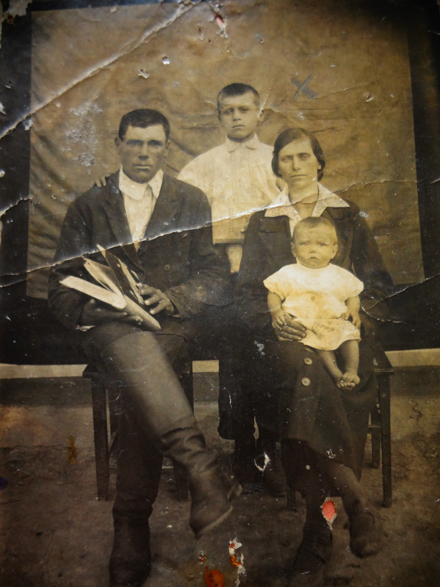
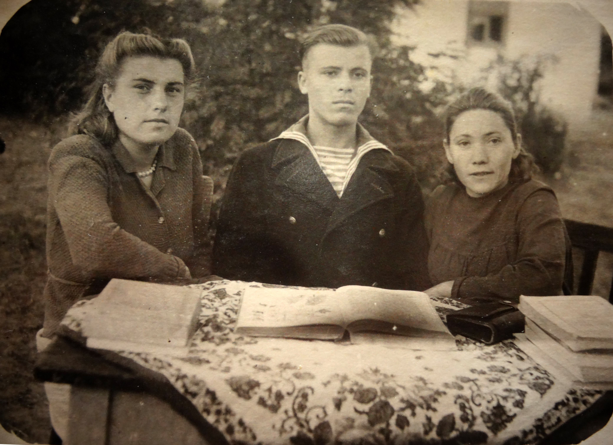
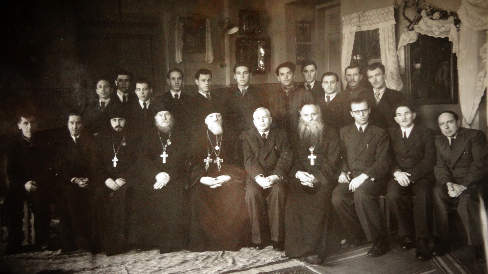
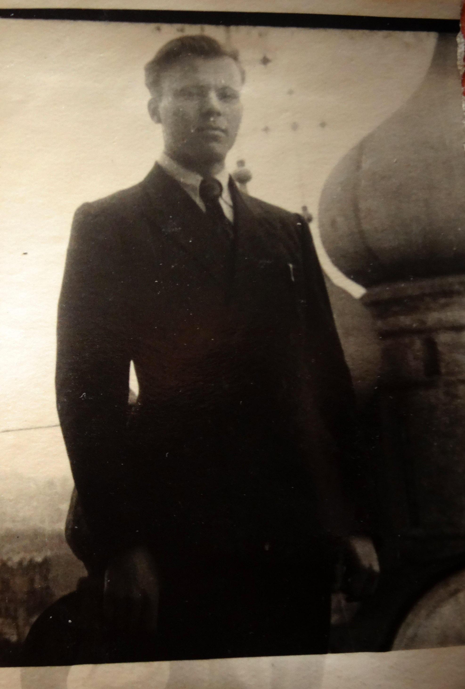
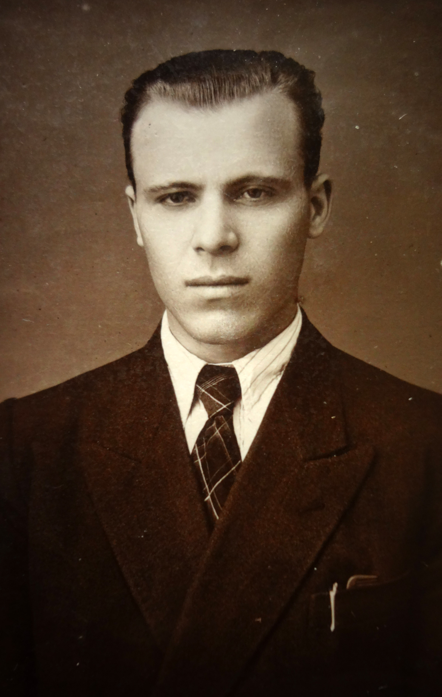
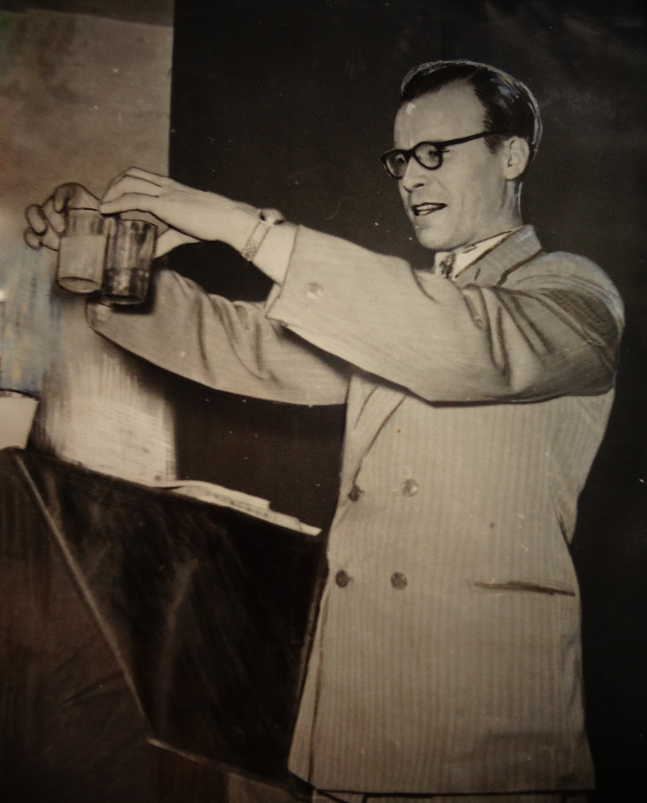
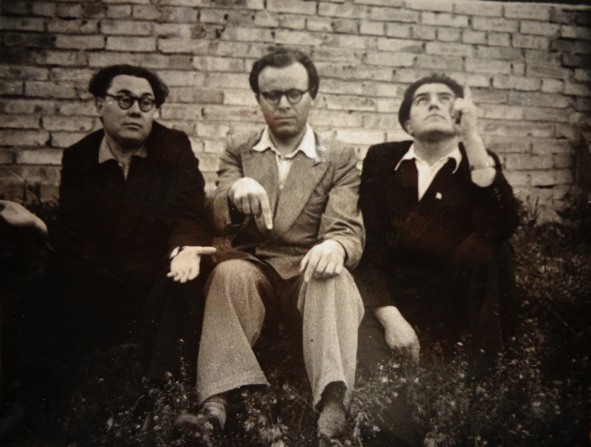
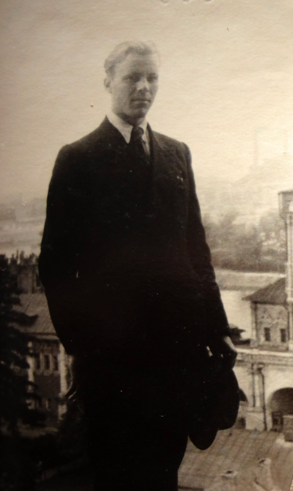

# Великий богоборец

**2013-06-27** Василий Пихорович

История знает немалое количество признанных атеистов, но и среди них Евграф Каленикович Дулуман занимает особое место, поскольку он был анафемствован Священным Синодом РПЦ.

Нужно сказать, что Евграф Каленикович очень гордился такой оценкой своего богоборческого труда. Шутил, что этим самым его поставили в один ряд с такими людьми как Лев Толстой, который был отлучен в 1901 году.

Вообще, Евграф Каленикович любил пошутить. Так, например, войдя в первый раз в студенческую аудиторию, он заявлял: фамилия моя Дулуман, а зовут меня еще хуже - Евграф Каленикович.

И в самом деле, фамилия-имя-отчество у него подобрались загадочные: какая-то замысловатая смесь чего-то иностранного, церковного и сказочно-украинского. Никогда не догадаешься, что происхождение у них самое обыкновенное. Родом наш герой из украинского села в Одесской области, и настоящая его фамилия Доломан (доломан - так у казаков называли бурку). Но какой-то шибко грамотный секретарь сельсовета, не взирая на протесты, решил почему-то перекрестить хлопца в Дулумана. Кстати, он был не первый, поскольку к этому времени в фамилии уже была одна ошибка и она писалась Долуман. Евграфом нарекли по святцам. Что же касается отчества, то на самом деле отца звали даже не Каленик, а Калень. Впрочем, оба этих имени сугубо украинские.

Атеистом Евграф Каленикович тоже был необычным, совершенно непохожим ни на обычных советских атеистов по профессии, ни на большинство европейских классических вольнодумцев, атеизм которых вырастал на почве хорошего классического образования. Евграф Каленикович был, если так можно выразиться, атеистом от бога. Образования поначалу он имел всего семь классов, после которых судьба занесла его в Одесскую семинарию. Какая судьба занесла в духовную семинарию обычного советского мальчика - здесь особая история. Сам Евграф Каленикович рассказывает, что явилась эта «судьба» в лице сельского священника отца Алексея, который с семьей снимал в их хате комнату. Священник попался грамотный, и в результате недолгих дискуссий радикальный, но весьма поверхностный атеизм семнадцатилетнего школьника (после освобождения от немцев Евграф Дулуман начал посещать восьмой класс в соседнем селе), как ветром сдуло. Особо убедительными ему показались аргументы, согласно которым множество великих ученых были религиозными людьми. Впрочем, был еще один фактор, который существенно усилил поповскую пропаганду - страшная бедность разоренного войной села. У матери (отец не вернулся с войны) просто не было средств для того, чтобы сын мог продолжать учебу в школе. А в семинарии, нашептывал добрый пастырь, бесплатно кормят и одевают. В общем, вышло почти как у В. Сосюры, который писал о себе:

*І пішов я тоді до Петлюри,* 

*бо у мене штанів не було.*

Но, штаны штанами, а в бога веровать неофит стал настолько истово, что уже просто не мыслил себя вне религии. Учился в семинарии Дулуман не просто хорошо, а очень хорошо (закончил за два года вместо положенных четырех). Настолько хорошо, что священником после окончания семинарии он не стал, а был благословлен на продолжение учебы в Московской духовной академии, где тоже добился выдающихся успехов, за что был оставлен при академии, успешно защитил кандидатскую диссертацию и был направлен на работу в качестве доцента и заместителя инспектора в Саратовскую духовную семинарию. Притом, всего за год работы успел заслужить благодарность патриарха. Но уже в это время вера у молодого богослова не просто поколебалась, а фактически сошла на нет. Притом, весьма естественным путем. По долгу службы он начал штудировать атеистическую литературу, чтобы знать как ее опровергать. И если большинство популярных брошюрок опровергнуть было не очень сложно, то о труды таких атеистов как Фейербах, Энгельс, Луначарский критик атеизма споткнулся очень крепко. Сколько не рылся он в церковной литературе, найти аргументов против этих критиков религии не получалось.

Решение было хоть и нелегким, но радикальным - начать жизнь сначала. На практике это означало - начать ее с нуля. Если вы думаете, что советская власть очень обрадовалась такому чудесному случаю - что молодой, но весьма перспективный представитель религиозного мира вдруг порвал с церковью и стал атеистом, и всячески приветствовала это решение - то вы сильно ошибаетесь. Это было, но несколько позже. А поначалу все выглядело совсем иначе. Поначалу Евграф Дулуман из блестящего богослова (притом жившего на всем бесплатном и получавшего 3900 руб. зарплаты) превратился в простого колхозника. Настоящего светского образования у него, напомним, было всего семь классов. Вот и идет двадцатичетырехлетний бывший доцент и заместитель инспектора Саратовской духовной семинарии в вечернюю школу, дабы наверстать упущенное. После окончания вечерней школы он подает документы на философский факультет Киевского государственного университета им. Т. Г. Шевченко, но осторожное руководство отнюдь не спешит раскрыть двери этого известного вуза для бывшего духовного академика - мало ли что ему еще взбредет в голову! Поэтому оказывается Евраф Дулуман поначалу студентом Одесского торгово-экономического института, но мечты своей стать философом не покидает. В 1956 году по ходатайству ЦК ЛКСМУ (членом комсомола Дулуман стал еще в 1953 году) его переводят сразу на третий курс философского факультета им. Т. Г. Шевченко, который он закончил в 1959 году.

Всеукраинскую и всесоюзную известность Е.К. Дулуману принесла сначала статья в «Комсомольской правде» (1956 год), а потом книжка «Как я перестал верить в бога», вышедшая в 1957 году сначала на украинском языке в Киеве, а потом и в московском издательстве «Молодая гвардия». Читали эту книжечку не только атеисты. Она послужила толчком для очень многих молодых и не очень молодых людей к тому, чтобы покинуть церковь и возвратиться к человеческой жизни. Вот как описывает ее действие сам Евграф Каленикович: «Моими непосредственными заботами весной 1958 года порвал с религией священник Дарманский, ряд моих бывших учеников-семинаристов. Осенью 1958 года порвал с религией ректор и профессор Ленинградской духовной семинарии и академии протоиерей Александр Осипов. В целом же по моему началу вышли из церкви несколько сот священников и проповедников религии. В 1959 году Московская патриархия отлучила меня от церкви, а последовавшим за мной священникам - запретила в церковном служении, но отлучению не предала. Я до сих пор не угомонился и веду активную атеистическую пропаганду".

Так вот, Евграф Каленикович «не угомонился» до самой своей смерти. Уже будучи доктором философских наук, профессором, занимая солидные должности, он не пропускал случая рассказать людям о том, какое зло несет в себе религия.

Помню, впервые я увидел Евграфа Калениковича, будучи студентом второго курса философского факультета Киевского государственного университета. Его пригласил на встречу со студентами заведующий кафедрой коммунистического воспитания В. А. Кудин. Аудитория оказалась переполненной. Признаюсь честно, я не запомнил абсолютно ничего, что именно говорилось на той встрече, но она только укрепила меня в убеждении, что Дулуман - человек необыкновенный. Поэтому я был очень рад, когда узнал, что он будет работать на нашей кафедре философии в Киевском политехническом институте. При первом же более близком знакомстве мы с ним поругались смертельно на почве отношения к диалектике и современному естествознанию, что и послужило началом нашей крепчайшей дружбы и сотрудничества. Ругались мы с Евграфом Калениковичем отнюдь неслучайно. Расхождения наши имели принципиальный характер. Он был научный атеист в самом чистом понимании этого слова. Я, разумеется, тоже атеист. Но несколько другого рода - марксистского. Атеизмы эти не то, чтобы несовместимые, но очень разные. Вот на этой разнице и покоилась (впрочем, какой там покоилась, кипела спорами и дискуссиями, а потому и развивалась) наша дружба. Причем спорили между собой мы недолго и все реже и реже, а вот что касается споров и диспутов с представителями церквей - то это стало даже некоторой традицией. Инициатором и фундатором этой традиции был, разумеется, Евграф Каленикович Дулуман. И я считаю большой честью, что именно меня он выбрал в качестве постоянного ведущего этих диспутов. Притом, это было не просто продолжение традиции, а ее закладка. Уже на первом диспуте Евграф Каленикович заметил, что уже более двадцати лет на постсоветском пространстве не было ничего подобного. На этом диспуте с весьма определенной темой [«Есть ли Бог?»](http://www.krasnoetv.ru/node/9442) сторону религии представлял известный в религиозных кругах богослов, лауреат Фонда Темплтона, приглашенный исследователь богословского факультета Кембриджского университета, приглашенный преподаватель Института религиозных наук св. Фомы Аквинского в Киеве, приглашенный преподаватель Библейско-богословского института св. апостола Андрея Александр Филоненко.

По всей видимости, представители религии были уверены, что справиться с атеистом не составит большого труда, поэтому второй заявленный богослов, шеф-редактор сайта «Богословський портал» Ю.П. Чорноморец на диспут не явился. Некоторые религиозные информационные ресурсы так и писали, что богослов был более убедительным. Но, надо полагать, сами себе они не очень верили, потому, что господин Чорноморец таки решил самолично сразиться с Дулуманом, для чего был устроен еще один [диспут](http://www.krasnoetv.ru/node/9988), который тоже не закончился победой богослова. Некоторые эпизоды его выглядели даже комично. Когда в ответ на обвинения Евграфа Калениковича в том, что среди служителей церкви не может быть честных и порядочных людей, богослов заявил, что он перезнакомился с сотнями священников, пока искал себе достойного духовника, и поэтому даже по Киеву может назвать более десятка вполне порядочных пастырей, это вызвало улыбки не только у той части аудитории, которая пришла поддерживать атеистов.

Идея диспута настолько понравилась публике, что студенты факультета социологии и права КПИ предложили [поспорить](http://www.krasnoetv.ru/node/9960) на тему бытия или небытия бога своим сверстникам из духовной семинарии.

К православной церкви Дулуман относился с пристрастием, но он не обходил вниманием и остальные конфессии. В этом отношении он старался быть полностью справедливым. Даже очень старался. Зная свой диагноз (рак четвертой степени), он очень боялся, что кто-то из представителей основных религиозных течений, представленных на Украине, останется, так сказать, «неохваченным». Так и вышло: представителей иудаизма не удалось вывести на публичный диспут. Поэтому Евграф Каленикович ограничился [публичной лекцией](http://krasnoe.tv/node/14375) на тему: «Иудаизм вчера, сегодня, завтра».

С особым вниманием публика ожидала [диспута с мусульманами](http://krasnoe.tv/node/16031). Нужно сказать, что последние подошли к делу со всей ответственностью. Ислам представляли сам муфтий Украины шейх Ахмед Тамим и его заместитель, шейх Рустам Гафур.

Атеисты тоже были представлены весьма достойно. Евграфа Калениковича Дулумана приехали поддержать два его соратника и друга: известный исламовед, доктор философских наук, профессор, академик РАЕН, генерал Юрий Петраш, кандидат юридических наук, профессор Академии военных наук, подполковник юстиции запаса Сергей Иванеев. Дискуссия была жаркой, не взирая на то, что обе стороны сходились в главном вопросе - в осуждении так называемого политического ислама.

В одном из [диспутов](http://krasnoe.tv/node/13156) оппонентом Евграфа Калениковича выступал лидер украинского баптизма профессор М.Н. Черенков.

Все эти диспуты нельзя пересказывать, их нужно смотреть. И первое, что бросается в глаза - это поистине молодой задор, которым Евграф Каленикович выделялся на фоне своих религиозных оппонентов. Задор и оптимизм - создается впечатление, что это не Дулуман находится на краю могилы, а его вдвое младшие оппоненты.

Отсутствие страха перед смертью - это была его отличительная черта. Говорят, что перед смертью все начинают верить в бога. Дулуман же, напротив, именно перед лицом смерти все более активно отвергал Бога и исповедовал свою веру в человека, в его разум, совесть. С ним можно было не соглашаться, но им нельзя не восхищаться. Нельзя не верить человеку, который отвергает бога перед лицом смерти.

И как жалко на этом фоне выглядели богословы, апеллирующие обычно к так называемому «пари Паскаля», согласно которому вера более выигрышна, чем безверие, поскольку в случае если бог есть, вы приобретаете вечное блаженство, если же его нет, вы ничего не теряете. Выгодно - не выгодно - вот весь смысл религиозности, если соскрести с нее мистические покровы. Желание задешево приобрести вечное блаженство. А фактически выходит, что религия - это страх перед жизнью.

О, как ненавидел Дулуман это вечное стариковство! Не на словах, а на деле ненавидел. О нем даже мало будет сказать, что он умер молодым. С годами Дулуман становился все активнее и активнее, моложе и моложе. Просто поражает активность Евграфа Калениковича в Интернете. Было время, когда персональный сайт Дулумана имел более трех тысяч посещений в день. Он вел активную переписку как с атеистами, так и с верующими. Среди его корреспондентов были лауреат нобелевской премии Виталий Гинзбург и всемирно известный ученый-атеист Ричард Докинз. На Ютубе можно найти сотни видео c лекциями и выступлениями Дулумана.

В завершение нужно сказать, что свой последний диспут с церковниками Дулуман выиграл вчистую. Когда я ехал на похороны Евграфа Калениковича, я был почти уверен, что, по крайней мере, те из них, с кем он вел публичную полемику и которые уверяли собравшихся в своем уважении к Дулуману, придут попрощаться с этим выдающимся ученым. Чисто по-человечески. Если не могут по-человечески, то хотя бы из принципа, засвидетельствовать свою «любовь к врагу», посодействовать спасению его «грешной души».

Не пришли. Мало того, ни слова сочувствия родным и близким не вылетело с их уст. Просто сообщили, как портал [«Кредо.ру»](http://www.portal-credo.ru/site/?act=news&id=101638&cf=), что умер, и поместили биографию. Мало того, когда, например, в комментариях к этому сообщению на сайте [«Религия в Украине»](http://www.religion.in.ua/news/ukrainian_news/22386-umer-legendarnyj-ateist-ukrainy-professor-evgraf-duluman.html) архимандрит Аввакуум, лично знавший Евграфа Калениковича, сказал о нем несколько добрых слов, другие комментаторы здесь же напали на него, не без удовлетворения выразив уверенность, что Дулуман сейчас уже испытывает вечные муки. «Богословский портал» просто не упомянул о смерти своего оппонента.

Не выдержали церковники напряжения принципа. Оказались настолько лицемерными, что даже лицемерно не смогли показать свое хваленое христианское смирение и сочувствие.

Но, как говорится, Бог с ними.

А Евграф Каленикович Дулуман остается с нами. Остается как пример поистине добросовестного ученого и бесконечно мужественного человека, презревшего веру в бога во имя веры в человека.

А эта вера, ох еще как пригодится нам в будущем!

